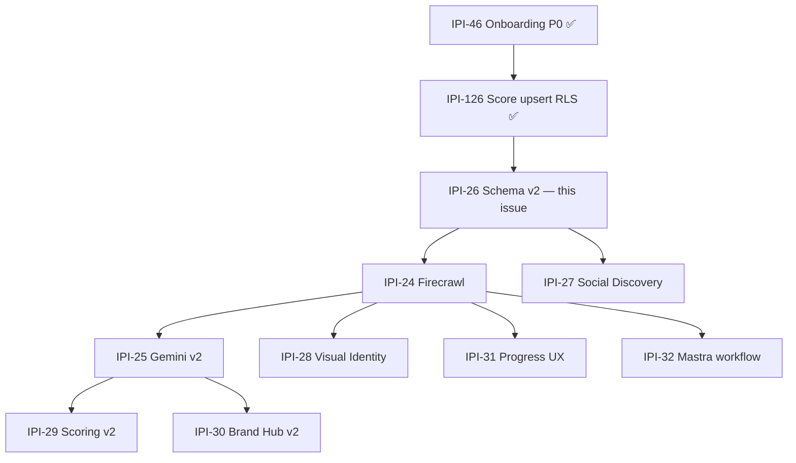
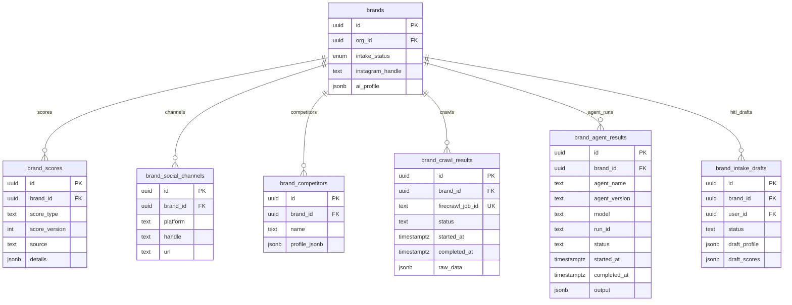
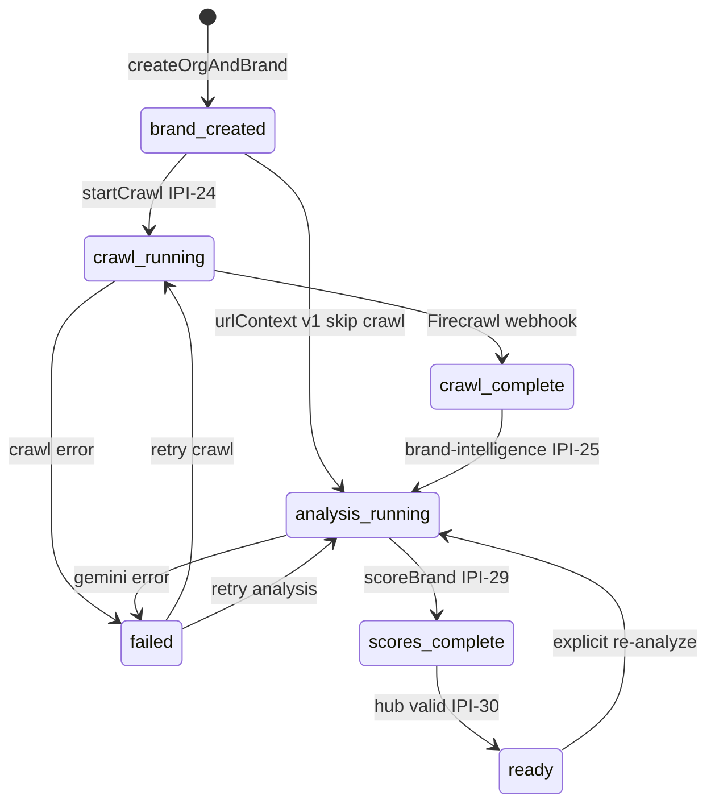
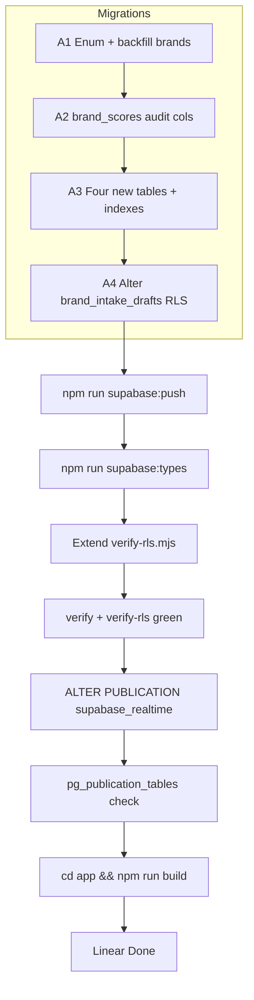
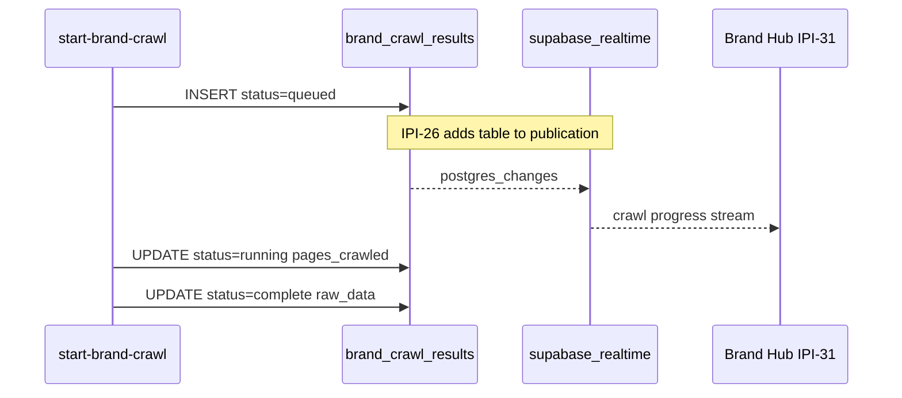
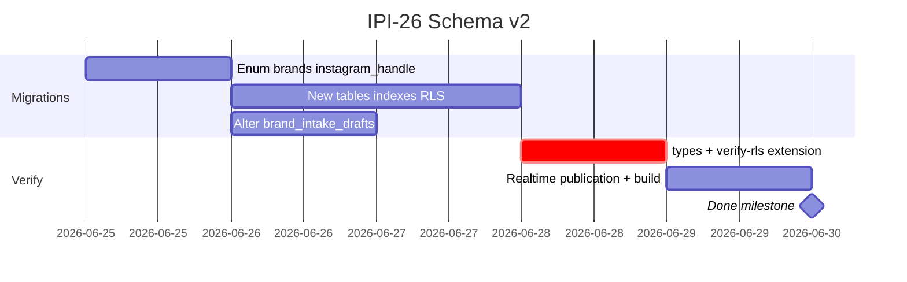

## IPI-26 · IPI-BI-003 — Brand Intelligence: Supabase Schema v2

**In plain terms:** **Engineer** adds Epic 1 tables/columns so Firecrawl, social discovery, scoring v2, progress UX, and Mastra workflow can persist data — after IPI-46 + IPI-126 are on remote.

**Dependencies:** [IPI-46](https://linear.app/amo100/issue/IPI-46) **Done** · [IPI-126](https://linear.app/amo100/issue/IPI-126) **Done**

**Unblocks:** IPI-24 → IPI-25 → IPI-29; also IPI-27, IPI-28, IPI-31, IPI-32, IPI-33

**MVP priority:** **P0** · **Estimate:** 5 · **Branch:** `ipi/ipi-26-schema-v2`

**Skills:** `ipix-supabase` · `task-verifier` · `create-migration` · `create-rls-policies`

**Team:** iPix1 · BRAND · Milestone **BI-M1: Schema + Firecrawl**

**SQL SSOT:** [`docs/plan/17-brand-intelligence-plan.md`](../../plan/17-brand-intelligence-plan.md) §7 (adapt column names below)  
**Lifecycle SSOT:** [`docs/plan/19-brand-lifecycle.md`](../../plan/19-brand-lifecycle.md) — `brands.intake_status` uses **7-state enum** (this issue); HITL approval uses `brand_intake_drafts.status`, not `brands.intake_status`

**IPI-24 follow-on (no scope change here):** [IPI-24](IPI-24-IPI-BI-001.md) adds `brand_crawls` (job/history) and evolves `brand_crawl_results` to **per-page** rows via `crawl_id` FK. Realtime publication moves to `brand_crawls` for crawl progress; this issue’s job-blob shape on `brand_crawl_results` remains valid until IPI-24 migration + backfill.

---

## Diagrams

### Epic 1 dependency chain



### Schema v2 ERD (IPI-26 scope)



_HITL `draft_pending_approval` lives on `brand_intake_drafts.status`, not `brands.intake_status`._

### `brand_intake_status` state machine (on `brands`)



### Implementation + verification flow



### Realtime path (IPI-31 consumes this)



### Build timeline



---

### Remote baseline (2026-06-25)

| Object | Status |
|--------|--------|
| `brands.intake_status` | CHECK `none \| draft \| approved` — **replace with enum** |
| `brands.instagram_handle` | missing |
| `brand_scores` | has `details`; missing `score_version`, `source` |
| `brand_intake_drafts` | **exists** (14 cols) — **alter** RLS/org only |
| `brand_social_channels` | missing |
| `brand_competitors` | missing |
| `brand_crawl_results` | missing |
| `brand_agent_results` | missing |

**Skip (IPI-126):** `UNIQUE(brand_id, score_type)` + `brand_scores` UPDATE RLS.

---

### 1. `brands.intake_status` — lifecycle enum (blocker)

Replace text CHECK with Postgres enum `brand_intake_status`:

```sql
CREATE TYPE public.brand_intake_status AS ENUM (
  'brand_created',
  'crawl_running',
  'crawl_complete',
  'analysis_running',
  'scores_complete',
  'ready',
  'failed'
);
```

**Do not use** legacy `none`, `draft`, `approved`, or ambiguous `pending` / `complete` / `draft_pending_approval` on `brands`.

**Backfill:**

| Old | New |
|-----|-----|
| `none` | `brand_created` |
| `draft` | `brand_created` |
| `approved` | `ready` |
| NULL / empty | `brand_created` |

**HITL:** `draft_pending_approval` → `brand_intake_drafts.status` (IPI-132 / IPI-111), not `brands.intake_status`.

**Also add:** `brands.instagram_handle text` + partial index (plan §7.1).

---

### 2. `brand_scores` — audit columns

`details` **already exists** — do not re-add.

```sql
ALTER TABLE public.brand_scores
  ADD COLUMN IF NOT EXISTS score_version int NOT NULL DEFAULT 1,
  ADD COLUMN IF NOT EXISTS source text NOT NULL DEFAULT 'edge_fn'
    CHECK (source IN ('edge_fn', 'mastra_agent', 'manual', 'benchmarked', 'firecrawl'));
```

---

### 3. New tables + indexes

| Table | Required indexes / constraints |
|-------|-------------------------------|
| `brand_social_channels` | `UNIQUE (brand_id, platform)` · `idx` on `brand_id` |
| `brand_competitors` | `idx_brand_competitors_brand` on `(brand_id)` |
| `brand_crawl_results` | `idx_brand_crawl_results_brand` on `(brand_id)` · `UNIQUE (firecrawl_job_id)` · columns: `status` (not `crawl_status`), `started_at`, `completed_at`, `pages_crawled`, `raw_data` |
| `brand_agent_results` | `idx` on `(brand_id)` · `idx` on `(agent_name)` · columns: `agent_name`, `agent_version`, `model`, `run_id`, `status`, `started_at`, `completed_at`, `output`, `tokens_in`, `tokens_out`, `duration_ms` |

**Deferred:** `brand_personas`, `brands.embedding`.

**RLS:** `is_org_member(b.org_id)` for SELECT; service-role for INSERT/UPDATE on agent/crawl writes.

---

### 4. `brand_intake_drafts` — alter only

Table exists on remote. **Do not CREATE.**

- [ ] RLS aligned to org ownership (`is_org_member` via `brands.org_id`)
- [ ] HITL validation constraints on `status` if missing
- [ ] Extend `verify-rls.mjs` cross-user deny on SELECT

No new table migration unless a column gap is found during implementation.

---

### 5. Realtime (explicit — table alone is insufficient)

After `brand_crawl_results` exists:

```sql
ALTER PUBLICATION supabase_realtime ADD TABLE public.brand_crawl_results;
```

**Verify:**

```sql
SELECT schemaname, tablename FROM pg_publication_tables
WHERE pubname = 'supabase_realtime' AND tablename = 'brand_crawl_results';
```

---

### 6. `verify-rls.mjs` — must cover new surface

Extending the script is **required** — `verify-rls` green without new probes is not acceptance.

| Table | Probe |
|-------|-------|
| `brand_social_channels` | org-member SELECT · cross-user deny |
| `brand_competitors` | org-member SELECT · cross-user deny |
| `brand_crawl_results` | org-member SELECT · cross-user deny |
| `brand_agent_results` | org-member SELECT · cross-user deny |
| `brand_intake_drafts` | owner/org SELECT · cross-user deny |

---

### Completion steps

#### A. Migrations
- [ ] **A1** Enum migration + backfill + `instagram_handle`
- [ ] **A2** `brand_scores` `score_version` / `source`
- [ ] **A3** Four new tables + indexes (plan §7.2–7.6, columns above)
- [ ] **A4** `brand_intake_drafts` RLS alter only
- [ ] **A5** `npm run supabase:push` · migrations listed on remote

#### B. Types + verify
- [ ] **B1** `npm run supabase:types` committed
- [ ] **B2** `verify-rls.mjs` extended (§6)
- [ ] **B3** `npm run supabase:verify` + `supabase:verify-rls` green

#### C. Realtime
- [ ] **C1** Publication added + SQL verification (§5)

#### D. Ship
- [ ] **D1** `cd app && npm run build`
- [ ] **D2** PR cites lifecycle steps enabled · schema-only (no Firecrawl code)
- [ ] **D3** Linear **Done**

---

### Verifier probes

| Probe | Pass |
|-------|------|
| Enum `brand_intake_status` | 7 values; no `none/draft/approved` |
| Backfill | all `brands` rows valid enum |
| `instagram_handle` column | exists |
| `score_version` + `source` | on `brand_scores`; `details` unchanged |
| 4 new tables | on remote with indexes |
| `brand_intake_drafts` | alter only; RLS probes pass |
| `verify-rls.mjs` | all 5 tables in §6 probed |
| Realtime | `pg_publication_tables` row |
| Score upsert baseline | 4 rows per brand (IPI-126) |

---

**Related:** [`IPI-46-IPI-BI-P0.md`](./IPI-46-IPI-BI-P0.md) · [`IPI-49-IPI-BI-OPS-002.md`](./IPI-49-IPI-BI-OPS-002.md) · [`IPI-24-IPI-BI-001.md`](./IPI-24-IPI-BI-001.md)
