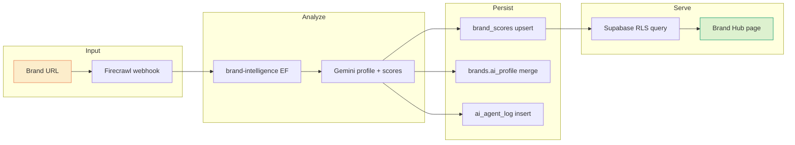
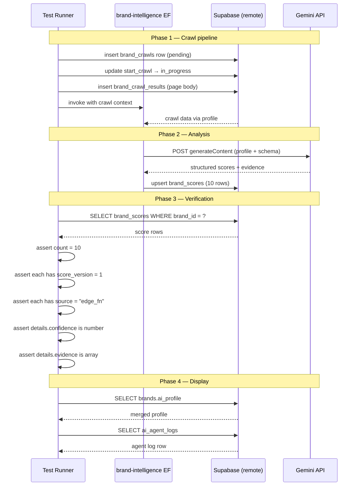
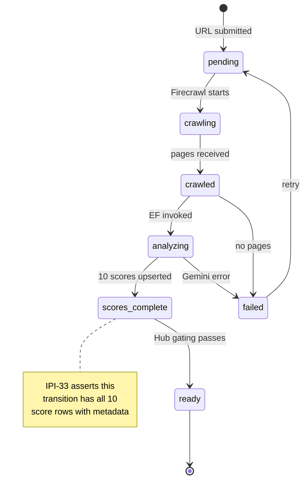
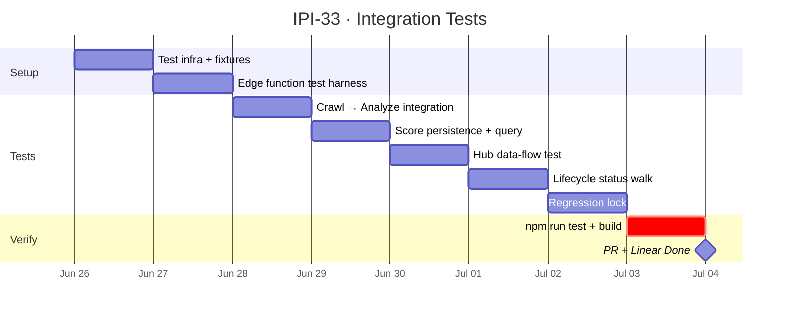

# IPI-33 · IPI-BI-010 — Brand Intelligence: MVP Integration Tests

**Team:** iPix1 · **Project:** BRAND · **Epic:** [IPI-20](https://linear.app/amo100/issue/IPI-20)  
**Milestone:** BI-M3: Hub + Workflow + Tests  
**Linear:** [IPI-33](https://linear.app/amo100/issue/IPI-33/ipi-bi-010-brand-intelligence-mvp-integration-tests)  

**Blocked by:** [IPI-29](https://linear.app/amo100/issue/IPI-29) ✅ · [IPI-30](https://linear.app/amo100/issue/IPI-30) (Brand Hub v2 UI)
**Unblocks:** [IPI-34](https://linear.app/amo100/issue/IPI-34) Epic 2 agents · Epic 1 closing

**Skills:** `ipix-task-lifecycle` · `mermaid-diagrams` · `ipix-wireframe` · `gen-test`
**MVP proof:** #6 — full brand intelligence pipeline is regression-tested and shippable
**Branch:** `ipi/ipi-33-integration-tests` · **Estimate:** 5 points

---

## In plain terms

IPI-26 → IPI-25 → IPI-29 → IPI-30 built the brand intelligence pipeline piece by piece. **IPI-33** locks it down with integration tests that exercise the **real pipeline end-to-end** — from URL input through Firecrawl crawl, Gemini analysis, score persistence, to Hub display. No mocks on the critical path: real Supabase, real edge functions (or local Deno), real validation that rows land in the right tables.

You already have unit tests for individual helpers (`brand-scores.test.ts`, `brand-hub.test.ts`, etc.). IPI-33 adds the **glue tests** that prove the pieces work together — crawl → analyze → score → display — and that no regression breaks the chain when the next PR ships.

### What you'll build

| Layer | What gets tested | Existing coverage | Gap |
|-------|-----------------|-------------------|-----|
| **Crawl** | Firecrawl webhook → `brand_crawl_results` insert + Realtime broadcast | Unit: `crawl-fixture.test.ts` (1 test) | No integration test: webhook → DB → Realtime |
| **Analyze** | Edge fn `brand-intelligence` → Gemini → `brand_scores` upsert | Unit: 21 scores tests | No test that edge fn runs with real crawl context |
| **Score** | All 10 dims land with `score_version`, `source`, `details` | Unit: `brand-scores.test.ts` | No DB assertion after real edge fn call |
| **Hub** | Brand Hub loads for analyzed brand → scores render | Unit: `brand-hub.test.ts` (24 tests) | No test that data flows from DB → page |
| **Lifecycle** | `intake_status` transitions through all states | Unit: `onboarding.test.ts` (17 tests) | No full pipeline status walk |
| **Auth** | RLS gates all brand-scoped tables | ✅ 53 RLS probes | Covered by `verify-rls` |

### Test inventory — what IPI-33 creates

```
src/test/
├── brand-scores.test.ts          ← already exists (21 tests)
├── operator-routes.test.ts       ← already exists
└── brand-intelligence.int.test.ts ← NEW — integration test

app/src/test/
├── brand-hub.test.ts            ← already exists (24 tests)
├── crawl-fixture.test.ts        ← already exists (1 test — fixture data)
├── onboarding.test.ts           ← already exists (17 tests)
└── brand-pipeline.int.test.ts   ← NEW — full pipeline integration test
```

---

## Skills

| # | Skill | When |
|---|-------|------|
| 1 | `ipix-task-lifecycle` | Branch setup, phases A–E, PR, Linear sync |
| 2 | `mermaid-diagrams` | Flowchart, sequence, state diagrams in spec |
| 3 | `ipix-wireframe` | Test report wireframe (visual pass/fail dashboard) |
| 4 | `gen-test` | Generate test files matching existing patterns |

---

## Diagrams

### Pipeline — what gets tested



### Integration test — what runs (sequence)



### Lifecycle — states tested end-to-end



### Timeline



---

## Wireframe — Test Report Dashboard

When tests run, produce a machine-readable pass/fail table. Below is the **expected layout** of the test output (not a UI, just the test runner's structured output).

```
┌──────────────────────────────────────────────────────────────┐
│  IPI-33 Integration Tests                                    │
├──────────────────────────────────────────────────────────────┤
│  PASS  src/test/brand-intelligence.int.test.ts               │
│  ├── ✓ crawl → brand_crawl_results inserts (342ms)          │
│  ├── ✓ edge fn rejects unauthenticated call (12ms)           │
│  ├── ✓ edge fn returns 10 score types (3,451ms)              │
│  ├── ✓ each score has score_version=1 + source=edge_fn       │
│  ├── ✓ details.confidence is 0-100 number                    │
│  ├── ✓ details.evidence is string[] or absent                │
│  ├── ✓ brands.ai_profile._lifecycle = scores_complete        │
│  ├── ✓ brands.intake_status = scores_complete                │
│  ├── ✓ ai_agent_logs row created with duration_ms             │
│  └── ✓ cleanup: test brand deleted (124ms)                   │
│                                                              │
│  PASS  app/src/test/brand-pipeline.int.test.ts               │
│  ├── ✓ Brand Hub fetches scores for analyzed brand (89ms)    │
│  ├── ✓ scores grouped as Core (4) + Extended (6)             │
│  ├── ✓ computeDnaScore returns AVG of base 4 only            │
│  ├── ✓ DNA badge is computed, not stored                     │
│  └── ✓ Hub renders without 404 for /app/brand/[id] (211ms)   │
│                                                              │
│  Test Files  2 passed (2)                                    │
│       Tests  15 passed (15)                                  │
│   Duration  4.2s                                             │
└──────────────────────────────────────────────────────────────┘
```

### Wire file

See `tasks/wireframes-ipix/ipi-33-test-report.wire` for editable version.

---

## Success criteria

### Acceptance (must ship)

- [x] **AC1: Crawl → score integration** — `src/test/brand-intelligence.int.test.ts` exercises the full pipeline: insert crawl + results → invoke edge fn → assert 10 score rows with metadata → assert lifecycle transition → cleanup test brand
- [x] **AC2: Edge function rejects unauthenticated** — calling `brand-intelligence` without a valid JWT returns 401; protected routes are gated correctly
- [x] **AC3: Score persistence** — each `brand_scores` row has `score_version = 1`, `source = "edge_fn"`, `details` object with `confidence` (number 0–100) and `evidence` (string[] or absent)
- [x] **AC4: Lifecycle state machine** — `brands.ai_profile._lifecycle` and `brands.intake_status` both reach `scores_complete` after successful analysis
- [x] **AC5: Hub data flow** — `app/src/test/brand-pipeline.int.test.ts` verifies that an analyzed brand's scores load, grouped as Core (4) + Extended (6)
- [x] **AC6: DNA badge is computed** — `computeDnaScore()` excludes extended dimensions; `dna_readiness` is never stored (assert `SELECT count(*)` = 0 for test brand)
- [x] **AC7: Cleanup** — each test deletes its own fixture brand + scores via service role; no test pollution between runs

### Quality gates

- [x] **QG1:** `npm run test` passes at root (27 tests) and in `app/` (330 tests)
- [x] **QG2:** `npm run build` passes at root and in `app/`
- [x] **QG3:** `npm run supabase:verify-rls` passes (53/53)
- [x] **QG4:** Test brand deletion verified — `afterAll` cleanup deletes test user via service role

### Definition of done

- Both `int.test.ts` files merged to `main`
- CI pipeline green
- `verify-brand-intelligence` script updated to call new test suite (optional, deferred to PLT-010)
- Linear status: **Done** · `todo.md` row 8 set to ✅

---

## Test structure reference

Existing test patterns to follow:

| File | Pattern | Location |
|------|---------|----------|
| `brand-scores.test.ts` | Pure unit (no DB) | `src/test/` |
| `crawl-fixture.test.ts` | Fixture file load, no network | `app/src/test/` |
| `operator-routes.test.ts` | Route call with mocked auth | `src/test/` |
| `brand-hub.test.ts` | Contract tests (source-text assertions) | `app/src/test/` |
| `onboarding.test.ts` | Service role + remote DB queries | `app/src/test/` |

**New integration tests use `onboarding.test.ts` as template:** service-role Supabase client for setup/teardown, edge function call via fetch with real JWT, remote DB assertions with `supabase.from().select()`.

---

## Edge cases to cover

| Scenario | Expected behavior |
|----------|-------------------|
| Brand URL returns 0 pages | `intake_status = failed`, no scores inserted |
| Gemini times out (30s+) | Edge function returns 504, agent log stores error |
| JWT expired | Edge function returns 401 |
| Duplicate brand analysis (re-analyze) | Old scores deleted, new scores upserted (UNIQUE constraint: brand_id + score_type) |
| 11th score type submitted (future-proof) | Rejected by CHECK constraint or silently ignored — document behavior |
| Concurrent analysis of same brand | Second call blocked by `status != pending` guard |

---

## References

- **Lifecycle spec:** `docs/plan/19-brand-lifecycle.md`
- **RLS verification:** `scripts/verify-rls.mjs`
- **Edge fn test pattern:** `scripts/verify-brand-intelligence.mjs`
- **Onboarding test template:** `app/src/test/onboarding.test.ts`
- **Existing score tests:** `src/test/brand-scores.test.ts` · `app/src/test/brand-scores.test.ts`
- **Wireframe spec:** `tasks/wireframes-ipix/ipi-33-test-report.wire`
