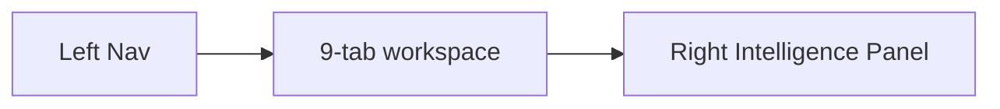

# IPI-337 · DESIGN-054b — Shoot Detail Remaining Tab Parity

**Linear:** https://linear.app/amo100/issue/IPI-337  
**Parent:** [IPI-209](https://linear.app/amo100/issue/IPI-209) · shell ✅ PR #150  
**Status:** Todo · Synced from Linear 2026-07-02

> IPI-209 Done = **3/9 tabs only**. This issue completes full DC parity.

---

## Purpose

Wire 6 remaining placeholder tabs: **Assets · Team · Schedule · Budget · Approvals · Activity**

## Tabs in scope

| Tab | Status (2026-07-02) |
|-----|---------------------|
| Overview | ✅ Live (IPI-209) |
| Shot List | ✅ Live |
| Deliverables | ✅ Live |
| Assets | 🔴 Placeholder |
| Team | 🔴 Placeholder |
| Schedule | 🔴 Placeholder |
| Budget | 🔴 Placeholder |
| Approvals | 🔴 Placeholder |
| Activity | 🔴 Placeholder |

## Design source

`Universal design prompt/Shoot Detail.v2.image-first.dc.html`

## Route

`/app/shoots/[shootId]`

## User story

> As a **producer**, I use every shoot tab with real data — not placeholders.

## Data layer (existing)

- `GET /api/shoots/[shootId]` · `get-shoot-detail.ts` RPC
- **Gap:** per-tab data source contracts not yet documented — define before Step B

## Wireframe



## Implementation steps

| Step | Work | Proof |
|------|------|-------|
| A | Document RPC/endpoint per tab | table in PR |
| B | Build tab components (6) | each tab renders |
| C | Wire fetch + loading/empty/error per tab | state screenshots |
| D | Assets tab → view in assets library deep link | link works |
| E | Playwright per tab | CI green |

## Skills to run

`ipix-task-lifecycle` · `design-md` · **`design-to-production`** · `fashion-production` · `feature-dev` · `frontend-design` · `copilotkit` (v2) · `mermaid-diagrams` · **`task-verifier`**

## Testing

```bash
cd app && npm run lint && npm test && npx tsc --noEmit && CI=true npm run build && npx playwright test
```

## Acceptance criteria

- [ ] All 6 placeholder tabs wired to live data
- [ ] handoff/11 Shoot Detail checklist complete
- [ ] View-in-Assets deep link from Assets tab
- [ ] Empty/loading/error per tab
- [ ] Browser evidence + task-verifier
