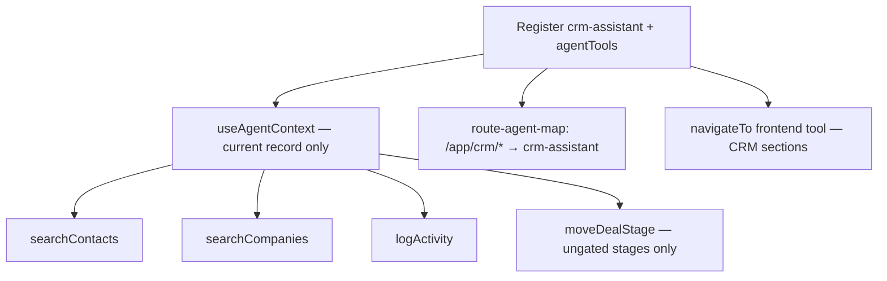
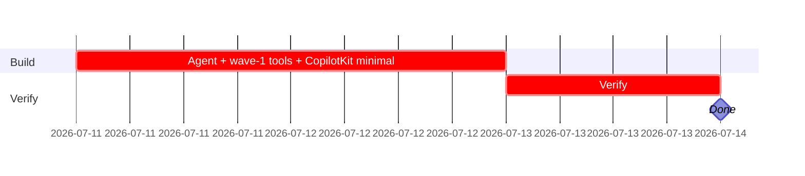

## CRM-AI-002 — crm-assistant agent — wave 1 (search/log/move tools)

**In plain terms:** Register the `crm-assistant` Mastra agent with just enough tools to be minimally useful — search, log activity, move deals through the ungated stages — plus minimal CopilotKit wiring so chat works on every `/app/crm/*` screen before wave 2 IntelligencePanel work.

**Blocked by:** IPI-362, IPI-363, IPI-364 (hard) — IPI-365/IPI-366 loosened to soft per audit · **Unblocks:** IPI-369 · **Related:** IPI-367

**Ordering note (audit `02-linear-audit.md` G7):** deliberately NOT blocked by IPI-367 (won/lost gate) — wave-1's `moveDealStage` never touches terminal stages, and IPI-362's DB trigger independently blocks any attempt at the DB layer regardless of build order. Safe to ship before IPI-367.

**Skills:** `mastra` · `copilotkit` · `linear`

**Labels:** CRM · MASTRA · COPILOTKIT · AI

**Milestone:** CRM-M3 · crm-assistant Agent
**Spec:** `tasks/crm/plans/mastra-plan.md` · `tasks/crm/plans/copilotkit-plan.md` · `tasks/crm/03-crm-existing-state-audit.md` §AI Agents

---

### Flow

---

### Completion steps

#### A. Scope and setup
- [ ] **A1** Confirm `REQUIRED_AGENT_IDS` in `mastra/index.ts` — proof: `crm-assistant` doesn't collide
- [ ] **A2** CRM tools registered via `app/src/mastra/tools/index.ts` (`agentTools` or `tools/crm/*` barrel) — proof: same pattern as `booking-agent.ts` / `model-match-agent.ts`

#### B. Implement (Mastra)
- [ ] **B1** Agent registered on `brand-intelligence-agent.ts` shape — imports tools from `agentTools`, not inline ad-hoc arrays — proof: diff to `agents/crm-assistant-agent.ts` + `agents/index.ts`
- [ ] **B2** 4 wave-1 tools under `tools/crm/`; `moveDealStage` cannot set `won`/`lost` under any call — proof: unit test
- [ ] **B3** All **Mastra** tools return `{ ok: false, error }` on handler failure, never re-throw — proof: unit tests + code review

#### C. Implement (CopilotKit — wave 1 minimal)
- [ ] **C1** `route-agent-map.ts` entry for `/app/crm/*` → `crm-assistant` — proof: diff + `route-agent-map.test.ts`
- [ ] **C2** `useAgentContext` providers on CRM list/detail routes (mirror `brand-context.tsx`) — current company/contact/deal id only — proof: code review
- [ ] **C3** `navigateTo` frontend tool: extend `operator-panel.tsx` CRM sections **or** CRM-scoped frontend tool with audited handler — proof: code review
- [ ] **C4** **CopilotKit frontend** tool handlers catch errors and return `{ ok: false, error }` — never re-throw (uncaught throw aborts the CopilotKit run). **Separate from B3** — Mastra vs frontend tool boundaries — proof: code review against `tasks/crm/plans/copilotkit-plan.md`

#### D. Integrate
- [ ] **D1** Context injection is precise (current record only) — not a full-pipeline dump — proof: code review against `tasks/crm/plans/mastra-plan.md`
- [ ] **D2** `getMastra()` not called at module top-level in any new route — proof: code review

#### E. Verify
- [ ] **E1** `cd app && npm run lint` — proof: green
- [ ] **E2** `cd app && npm test src/mastra` — proof: green
- [ ] **E3** `cd app && npm test src/lib/route-agent-map.test.ts` — proof: green
- [ ] **E4** `cd app && npx vitest run src/app/api/copilotkit/[[...slug]]/route.test.ts` — proof: green (minimal runtime smoke; agent registry resolves `crm-assistant`)

#### F. Ship
- [ ] **F1** Update `tasks/crm/todo.md` row #7 — proof: diff

---

### Gantt — IPI-368

