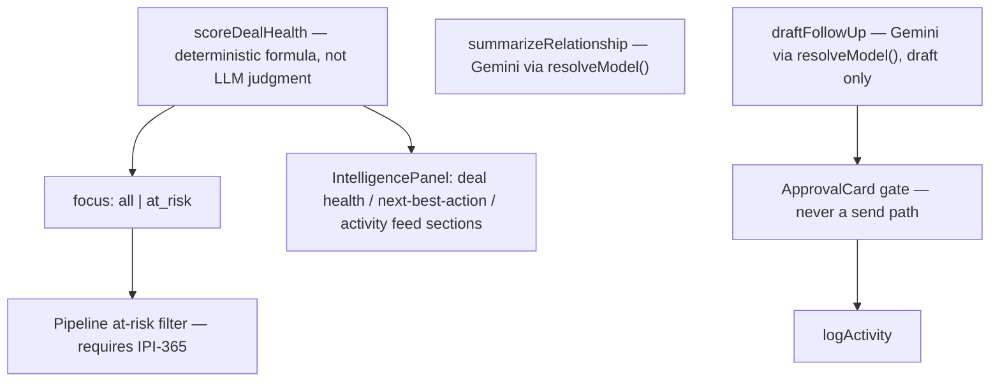
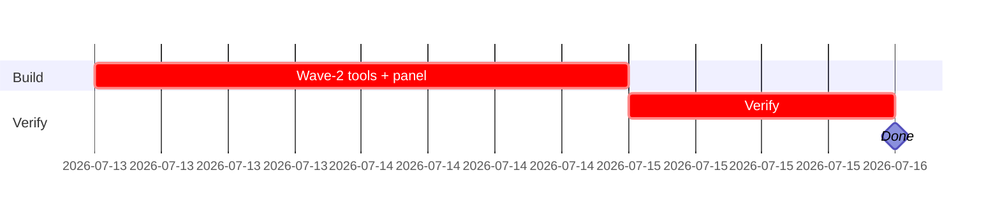

## CRM-AI-003 — crm-assistant agent — wave 2 (health scoring, summarization, drafting) + IntelligencePanel sections

**In plain terms:** Add the "intelligence" tools — deal health scoring, relationship summaries, follow-up drafts — and surface them in the IntelligencePanel.

**Blocked by:** IPI-368 (hard) · **IPI-365** (hard — Pipeline at-risk filter AC requires board) · **Unblocks:** IPI-370

**Skills:** `mastra` · `gemini` · `copilotkit` · `linear`

**Milestone:** CRM-M3 · crm-assistant Agent
**Spec:** `tasks/crm/04-reference-implementations-analysis.md` (deterministic scoring rationale) · `tasks/crm/plans/mastra-plan.md` · `tasks/crm/plans/copilotkit-plan.md`

---

### Flow

---

### Completion steps

#### A. Scope and setup

- [ ] **A1** Confirm IPI-368 merged — proof: `crm-assistant` responds in dev on `/app/crm/*`
- [ ] **A2** Confirm IPI-365 merged before Pipeline at-risk wiring (C1) — proof: board route exists

#### B. Implement

- [ ] **B1** `scoreDealHealth` as a pure, unit-testable formula — proof: unit test with no LLM call in the scoring path
- [ ] **B2** `summarizeRelationship`, `draftFollowUp` via `resolveModel()` — proof: code review, no raw Gemini client
- [ ] **B3** `draftFollowUp` output routed through existing `intel-approval-card`/`applyDraft` — proof: manual test
- [ ] **B4** IntelligencePanel sections in `panel-contract.ts`'s existing order (`context → approvals → tabs → evidence → activity`) — proof: screenshot

#### C. Integrate

- [ ] **C1** Pipeline board's "at risk" filter (IPI-365) wired to `scoreDealHealth(focus: at_risk)` — proof: manual test
- [ ] **C2** No tool loops per-deal to build a list — batched via `focus` param — proof: code review

#### D. Verify

- [ ] **D1** `cd app && npm test src/mastra` — proof: green
- [ ] **D2** `cd app && npx vitest run src/app/api/copilotkit` — proof: green

#### E. Ship

- [ ] **E1** Update `tasks/crm/todo.md` row #8 — proof: diff

---

### Gantt — IPI-369

