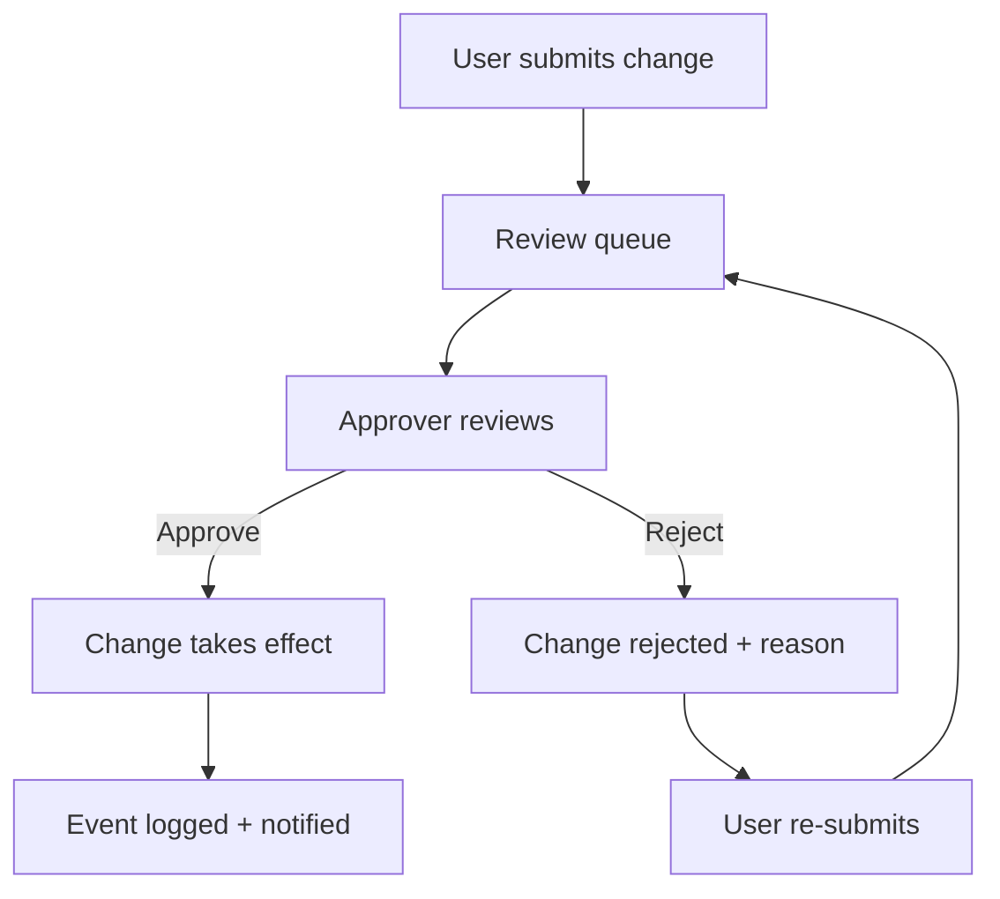
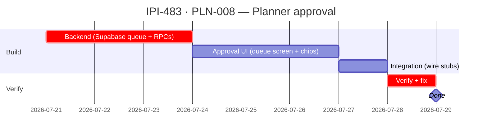

## IPI-483 — PLN-008 — Planner approval/sign-off system

**In plain terms:** The `needsApproval` flag that determines whether planner changes require sign-off before taking effect. Currently returns `{ available: false }` — this task implements the full approval workflow (submission, review queue, approve/reject, re-submit).

**Blocked by:** IPI-478 (decisions engine), IPI-479 (voting/consensus) · **Unblocks:** IPI-575 `needsApproval` stub removal, all planner mutation gating · **Related:** IPI-483 sub-tasks (approval branching), IPI-575 (security harden)

**Skills:** `ipix-supabase` · `mastra` · `copilotkit` · `frontend-design`

**Labels:** PLANNER · APPROVAL · MASTRA · COPILOTKIT

**Milestone:** PLN-M3 · Planner Approval

**Spec:** `Universal-design-prompt-4/planner/tasks/01-efficiency.md` §IPI-483
**Design:** `Universal-design-prompt-4/components/ApprovalCard.dc.html` (approval card component) · `Universal-design-prompt-4/Pages/SCR-32-Planner-Workspace.dc.html` (workspace shell with approval badge) · `Universal-design-prompt-4/components/COMPONENTS.md` (component library docs)

---

### Flow

---

### Completion steps

#### A. Scope audit

- [ ] **A1** Audit all mutation RPCs for `needsApproval` touch points (`planner_invite_member`, `planner_update_role`, `planner_remove_assignment`) — proof: grep showing each RPC's current behavior

#### B. Backend (Supabase)

- [ ] **B1** Approval queue table (`planner.approval_queue`) with columns: `id`, `instance_id`, `actor_user_id`, `change_type`, `payload (jsonb)`, `status (pending/approved/rejected)`, `reviewed_by`, `reviewed_at`, `reason` — proof: migration + `supabase:types`
- [ ] **B2** RPC `planner_submit_for_approval(instance_id, change_type, payload)` — inserts into queue, returns queue entry id — proof: direct SQL test
- [ ] **B3** RPC `planner_approve(queue_entry_id)` — applies the queued change, sets status to approved — proof: direct SQL test
- [ ] **B4** RPC `planner_reject(queue_entry_id, reason)` — sets status to rejected with reason — proof: direct SQL test
- [ ] **B5** RLS on `planner.approval_queue`: insert = any member; select = members + reviewer; update = reviewer only; delete = owner only — proof: `verify-rls`

#### C. Approval UI (Frontend)

- [ ] **C1** "Pending approval" badge on changed items showing review status — see `SCR-32-Planner-Workspace.dc.html` header approval badge pattern — proof: browser smoke
- [ ] **C2** Review queue screen at `/app/planner/approvals` — list pending items with approve/reject buttons, use `ApprovalCard.dc.html` for each item — proof: browser smoke
- [ ] **C3** Inline approval chip on mutation dialogs ("This change needs approval from [name]") — see `ApprovalCard.dc.html` compact variant — proof: browser smoke

#### D. Integrate

- [ ] **D1** Wire `needsApproval` check in all mutation RPCs — calls `planner_submit_for_approval` when required instead of returning `{ available: false }` — proof: test
- [ ] **D2** Approval events logged in `planner.events` — proof: code review

#### E. Verify

- [ ] **E1** `npm run supabase:verify-rls` — proof: green
- [ ] **E2** `cd app && npm run lint && npm test` — proof: green
- [ ] **E3** Approval flow end-to-end: submit → review → approve → change visible — proof: browser smoke

#### F. Ship

- [ ] **F1** `docs/linear/issues/IPI-483-PLN-008-planner-approval.md` updated with post-ship corrections
- [ ] **F2** IPI-575 `needsApproval` stub can be removed (verify no regressions)

---

### Corrections Applied

- Corrected from audit misclassification: `needsApproval` returning `{ available: false }` is a **planned limitation**, not a defect. This task implements it
- Dependency chain: blocked by IPI-478/IPI-479 (decisions/voting), not stand-alone
- Status: To Do (not In Progress)

---

### Gantt — IPI-483

