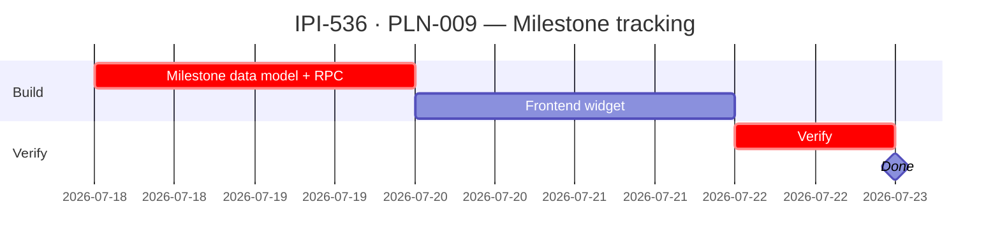

## IPI-536 — PLN-009 — Planner milestone tracking

**In plain terms:** Track milestone completion across planner tasks — surface which milestones are on track, at risk, or blocked for the operator dashboard.

**Blocked by:** IPI-476 (planner engine), IPI-477 (planner data model) · **Unblocks:** IPI-536 sub-tasks

**Skills:** `ipix-supabase` · `frontend-design`

**Labels:** PLANNER · TRACKING · DASHBOARD

**Milestone:** PLN-M1 · Planner Foundations

**Spec:** `Universal-design-prompt-4/planner/tasks/01-efficiency.md` §IPI-536
**Design:** `Universal-design-prompt-4/Pages/SCR-33-Planner-Dashboard.dc.html` (dashboard layout for milestone widget) · `Universal-design-prompt-4/Pages/SCR-35-Planner-Hub.dc.html` (planner hub with plan cards) · `Universal-design-prompt-4/components/StatusChip.dc.html` (status badges) · `Universal-design-prompt-4/components/EmptyState.dc.html` · `Universal-design-prompt-4/components/SkeletonLoader.dc.html` · `Universal-design-prompt-4/components/COMPONENTS.md`

---

### Completion steps

#### A. Data model

- [ ] **A1** Milestones table or view in planner schema: `instance_id`, `milestone_name`, `target_date`, `status (on_track/at_risk/blocked/completed)`, `completion_pct` — proof: migration

#### B. Backend

- [ ] **B1** RPC `planner_get_milestones(instance_id)` — returns milestone rows — proof: SQL test
- [ ] **B2** Event-based milestone status updates (auto-advance when dependent tasks close) — proof: integration test

#### C. Frontend

- [ ] **C1** Milestone tracker widget — use `StatusChip.dc.html` for milestone status badges, place on dashboard per `SCR-33-Planner-Dashboard.dc.html` layout — proof: browser smoke
- [ ] **C2** "At risk" warnings when milestones approach target_date without completion — proof: browser smoke

#### D. Verify

- [ ] **D1** `cd app && npm run lint && npm test` — proof: green
- [ ] **D2** Browser smoke: milestone appears, status updates on dependent task completion — proof: browser

---

### Corrections Applied

- **Status corrected:** In Progress (was mis-labeled as "Closed" in earlier audit)
- Dependency chain confirmed: blocked by IPI-476/477 (foundation engine), not downstream scheduling tasks

---

### Gantt — IPI-536

