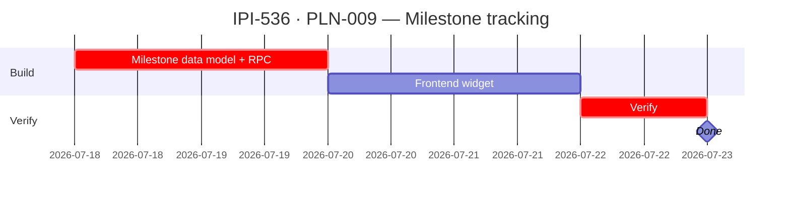

<<<<<<< HEAD
## IPI-536 — PLN-009 — Planner milestone tracking

**In plain terms:** Track milestone completion across planner tasks — surface which milestones are on track, at risk, or blocked for the operator dashboard.

**Blocked by:** IPI-476 (planner engine), IPI-477 (planner data model) · **Unblocks:** IPI-536 sub-tasks

**Skills:** `ipix-supabase` · `frontend-design`

**Labels:** PLANNER · TRACKING · DASHBOARD

**Milestone:** PLN-M1 · Planner Foundations

**Spec:** `Universal-design-prompt-4/planner/tasks/01-efficiency.md` §IPI-536
**Design:** `Universal-design-prompt-4/Pages/SCR-33-Planner-Dashboard.dc.html` (dashboard layout for milestone widget) · `Universal-design-prompt-4/Pages/SCR-35-Planner-Hub.dc.html` (planner hub with plan cards) · `Universal-design-prompt-4/components/StatusChip.dc.html` (status badges) · `Universal-design-prompt-4/components/EmptyState.dc.html` · `Universal-design-prompt-4/components/SkeletonLoader.dc.html` · `Universal-design-prompt-4/components/COMPONENTS.md`

---

### Completion steps

#### A. Data model

- [ ] **A1** Milestones table or view in planner schema: `instance_id`, `milestone_name`, `target_date`, `status (on_track/at_risk/blocked/completed)`, `completion_pct` — proof: migration

#### B. Backend

- [ ] **B1** RPC `planner_get_milestones(instance_id)` — returns milestone rows — proof: SQL test
- [ ] **B2** Event-based milestone status updates (auto-advance when dependent tasks close) — proof: integration test

#### C. Frontend

- [ ] **C1** Milestone tracker widget — use `StatusChip.dc.html` for milestone status badges, place on dashboard per `SCR-33-Planner-Dashboard.dc.html` layout — proof: browser smoke
- [ ] **C2** "At risk" warnings when milestones approach target_date without completion — proof: browser smoke

#### D. Verify

- [ ] **D1** `cd app && npm run lint && npm test` — proof: green
- [ ] **D2** Browser smoke: milestone appears, status updates on dependent task completion — proof: browser

---

### Corrections Applied

- **Status corrected:** In Progress (was mis-labeled as "Closed" in earlier audit)
- Dependency chain confirmed: blocked by IPI-476/477 (foundation engine), not downstream scheduling tasks

---

### Gantt — IPI-536


```mermaid
gantt
  dateFormat YYYY-MM-DD
  title IPI-536 · PLN-009 — Milestone tracking
  section Build
  Milestone data model + RPC :crit, b1, 2026-07-18, 2d
  Frontend widget :b2, after b1, 2d
  section Verify
  Verify :crit, v1, after b2, 1d
  Done :milestone, m1, after v1, 0d
```
=======
# IPI-536 · PLN-009 — See which planner milestones are on track or at risk

**Role:** iPix engineer. One concern per PR. Research before custom code.

**Plain English:** On the Planner dashboard, an Operator sees milestones as on track / at risk / blocked / completed with clear status chips.

| Field | Value |
|-------|--------|
| **MVP stage** | Post-MVP (Core once planner engine + data model exist) |
| **Parallel** | Must wait on IPI-476 · IPI-477 |
| **Blocked by** | IPI-476 (planner engine) · IPI-477 (planner data model) |
| **Unblocks** | Planner release confidence · IPI-542 gate inputs |
| **Track** | Platform · UI |
| **Skills** | `ipix-task-lifecycle` · `ipix-supabase` · `frontend-design` · `nextjs-developer` · `worktrees` · `pr-workflow` |
| **Agents / hooks / commands** | `/task` · `rls-policy-auditor` if new policies · `/verify-task` |
| **Stack** | Supabase planner schema · Next.js `app/` planner UI |

**Quality scores (1–5):** P3 · C4 · R3 · UV4 · LV3  
**Linear:** https://linear.app/amo100/issue/IPI-536

---

## 1. Purpose

Surface planner milestone health so Operators know what is slipping before release.

## 2. Real-world iPix example

- **Persona:** Operator  
- **Surface:** Planner dashboard / hub (`/app/planner` …)  
- **Today:** No milestone tracker widget / RPC  
- **After:** Status chips + at-risk warnings near target dates  

## 3. User journey impact

| Before | During | After |
|--------|--------|-------|
| Guesses plan health | Opens planner dashboard | Acts on at-risk milestones |

## 4. Business value

Prevents silent planner slips; feeds the production release gate with real status.

## 5. Quality checks

- [x] Needed after planner foundations  
- [ ] Not Launch Blocker until 476/477 land  
- [x] Not duplicate of release-gate doc task  
- [x] Reuse StatusChip / dashboard layout from design  
- [ ] Parallel: **no** until blocked-by clears  

**Verdict:** Ready to implement only after IPI-476/477; otherwise park.

---

## 6. Research checklist

- [ ] Planner schema + existing RPCs  
- [ ] Supabase Dashboard for table design vs migration  
- [ ] Design: SCR-33 / StatusChip DC  
- [ ] GitHub/SQL recipes for milestone rollups  
- [ ] Simplest: view/RPC before auto-advance events  

## 7. Platform-first plan

| Step | Choice |
|------|--------|
| Dashboard | Inspect remote schema after foundations |
| CLI | `supabase migration new` only if needed |
| Existing | Planner instance model from IPI-477 |
| Custom | Milestone table/view + RPC + widget |
| Defer | Event auto-advance if manual status enough for MVP |

**Do NOT:** New agent · custom status system outside design chips  
**Out of scope:** Full Gantt product · release sign-off (IPI-542)

---

## 8. Multi-step implementation prompt

```xml
<role>Implement IPI-536 · PLN-009 after IPI-476/477. Platform-first. One concern.</role>
<task>
1. Confirm blockers Done; else stop.
2. Prefer SQL view/RPC + existing chips over new framework.
3. A→E with migration + RLS + browser proofs.
4. Real-world: localhost planner dashboard as QA user.
</task>
```

### Completion steps (A→E)

#### A. Research / setup
- [ ] **A1** Confirm 476/477 shipped — proof: Linear Done / code paths  
- [ ] **A2** Schema plan (table vs view) — proof: short ADR in PR  

#### B. Core
- [ ] **B1** Migration + `planner_get_milestones` — proof: SQL test  
- [ ] **B2** Dashboard widget + StatusChip — proof: screenshot  

#### C. Edges
- [ ] **C1** At-risk near target_date — proof: browser  
- [ ] **C2** Empty / loading / error — proof: browser  

#### D. Tests
- [ ] **D1** Unit/SQL tests — proof: pass  
- [ ] **D2** `npm run typecheck` · lint · `supabase:verify-rls` if RLS — proof: green  

#### E. Real-world + ship
- [ ] **E1** MCP Chrome / Playwright on planner — proof: pass  
- [ ] **E2** localhost:3002 QA — proof: notes  
- [ ] **E3** PR evidence · CI — proof: PR #  

---

## 9. Acceptance criteria

- **A:** Operator sees milestone list with status chip  
- **B:** At-risk visible when approaching target without completion  
- **C:** empty · loading · error handled  
- **E:** Existing planner screens unchanged  

## 10–12. Tests / risks / PR evidence

Local + RLS verify if policies added · Rollback = drop migration via reverse migration · One concern (schema+UI ok if single feature; else split migration PR vs UI PR per repo rule — **prefer migration-only then UI-only**).
>>>>>>> origin/main
