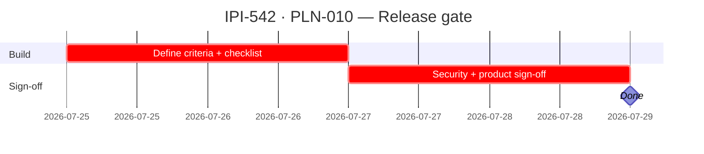

## IPI-542 — PLN-010 — Production release gate

**In plain terms:** Formal release readiness criteria for the planner module — defines what "production-ready" means before any planner screen ships to users. All auditing and scoring should reference this gate, not ad-hoc criteria.

**Blocked by:** IPI-483 (approval), IPI-536 (milestone tracking) · **Unblocks:** All planner screens hitting production

**Skills:** `ipix-task-lifecycle` · `ipix-supabase`

**Labels:** PLANNER · RELEASE · GATE

**Milestone:** PLN-M3 · Planner Release

**Spec:** `Universal-design-prompt-4/planner/tasks/01-efficiency.md` §IPI-542
**Design:** (process task — no UI design files apply)

---

### Completion steps

#### A. Define criteria

- [ ] **A1** Security: all RPCs audited, RLS policies verified, edge cases documented — proof: verify-rls output
- [ ] **A2** Data integrity: all migrations finalized, no OOB SQL, ledger matches remote — proof: `supabase migration list`
- [ ] **A3** Approval flow: `needsApproval` gates working for all mutation paths — proof: end-to-end test
- [ ] **A4** UI: all three screens (List, Timeline, Calendar) render correct data — proof: browser smoke
- [ ] **A5** Error handling: all RPCs return consistent error codes, UI shows user-friendly messages — proof: test coverage

#### B. Gate checklist

- [ ] **B1** Release criteria documented in `PLANNER_RELEASE_GATE.md` — proof: file exists
- [ ] **B2** Blocker sweep: no P0/P1 issues open against planner — proof: Linear query
- [ ] **B3** Migration ledger matches remote: `supabase migration list` shows no drift — proof: green
- [ ] **B4** `npm run build` passes clean — proof: green
- [ ] **B5** All planner tests pass — proof: CI green

#### C. Sign-off

- [ ] **C1** Security review sign-off — proof: signed PR
- [ ] **C2** Product owner sign-off — proof: signed PR

---

### Corrections Applied

- This task was missing from the audit scoring criteria. All production-readiness scores should reference IPI-542's formal criteria, not ad-hoc thresholds
- Added as formal gate to prevent future audit criteria drift

---

### Gantt — IPI-542

