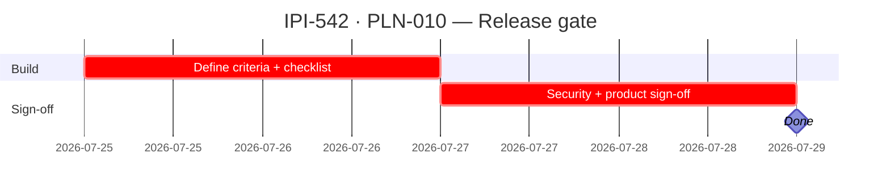

<<<<<<< HEAD
## IPI-542 — PLN-010 — Production release gate

**In plain terms:** Formal release readiness criteria for the planner module — defines what "production-ready" means before any planner screen ships to users. All auditing and scoring should reference this gate, not ad-hoc criteria.

**Blocked by:** IPI-483 (approval), IPI-536 (milestone tracking) · **Unblocks:** All planner screens hitting production

**Skills:** `ipix-task-lifecycle` · `ipix-supabase`

**Labels:** PLANNER · RELEASE · GATE

**Milestone:** PLN-M3 · Planner Release

**Spec:** `Universal-design-prompt-4/planner/tasks/01-efficiency.md` §IPI-542
**Design:** (process task — no UI design files apply)

---

### Completion steps

#### A. Define criteria

- [ ] **A1** Security: all RPCs audited, RLS policies verified, edge cases documented — proof: verify-rls output
- [ ] **A2** Data integrity: all migrations finalized, no OOB SQL, ledger matches remote — proof: `supabase migration list`
- [ ] **A3** Approval flow: `needsApproval` gates working for all mutation paths — proof: end-to-end test
- [ ] **A4** UI: all three screens (List, Timeline, Calendar) render correct data — proof: browser smoke
- [ ] **A5** Error handling: all RPCs return consistent error codes, UI shows user-friendly messages — proof: test coverage

#### B. Gate checklist

- [ ] **B1** Release criteria documented in `PLANNER_RELEASE_GATE.md` — proof: file exists
- [ ] **B2** Blocker sweep: no P0/P1 issues open against planner — proof: Linear query
- [ ] **B3** Migration ledger matches remote: `supabase migration list` shows no drift — proof: green
- [ ] **B4** `npm run build` passes clean — proof: green
- [ ] **B5** All planner tests pass — proof: CI green

#### C. Sign-off

- [ ] **C1** Security review sign-off — proof: signed PR
- [ ] **C2** Product owner sign-off — proof: signed PR

---

### Corrections Applied

- This task was missing from the audit scoring criteria. All production-readiness scores should reference IPI-542's formal criteria, not ad-hoc thresholds
- Added as formal gate to prevent future audit criteria drift

---

### Gantt — IPI-542


```mermaid
gantt
  dateFormat YYYY-MM-DD
  title IPI-542 · PLN-010 — Release gate
  section Build
  Define criteria + checklist :crit, b1, 2026-07-25, 2d
  section Sign-off
  Security + product sign-off :crit, b2, after b1, 2d
  Done :milestone, m1, after b2, 0d
```
=======
# IPI-542 · PLN-010 — Know when Planner is safe to ship to production

**Role:** iPix engineer. One concern per PR. Research before custom code.

**Plain English:** Engineers and reviewers use one written release gate so Planner does not ship on ad-hoc “looks fine” criteria.

| Field | Value |
|-------|--------|
| **MVP stage** | Launch Blocker (for Planner module) · Post-MVP for whole product if Planner not in first cut |
| **Parallel** | Docs/checklist can draft early; sign-off waits on IPI-483 · IPI-536 · IPI-575 |
| **Blocked by** | IPI-483 (approval) · IPI-536 (milestones) · security cleanup IPI-575 |
| **Unblocks** | Production Planner screens |
| **Track** | Platform |
| **Skills** | `ipix-task-lifecycle` · `ipix-supabase` · `pr-workflow` · `task-verifier` |
| **Agents / hooks / commands** | `/verify-task` · `rls-policy-auditor` |
| **Stack** | Docs + verify commands (Supabase, app tests) — no new runtime feature |

**Quality scores (1–5):** P4 · C2 · R2 · UV3 · LV4  
**Linear:** https://linear.app/amo100/issue/IPI-542

---

## 1. Purpose

Define and enforce Planner production-ready criteria (security, data, approval, UI, errors).

## 2. Real-world iPix example

- **Persona:** Engineer / reviewer  
- **Surface:** Planner List · Timeline · Calendar before prod  
- **Today:** Audits invent thresholds  
- **After:** Single `PLANNER_RELEASE_GATE.md` + green proofs  

## 3. User journey impact

| Before | During | After |
|--------|--------|-------|
| Ambiguous “ready?” | Run gate checklist | Ship or block with evidence |

## 4. Business value

Stops insecure or half-built Planner from reaching operators on ipix.co.

## 5. Quality checks

- [x] Required before Planner prod  
- [x] Not duplicate of IPI-575 (security is input to gate)  
- [x] Prefer docs + existing verify scripts — no custom platform  
- [x] Parallel: draft docs OK  

**Verdict:** Ship as **docs/process + verify commands** PR (no app feature code in same PR).

---

## 6. Research checklist

- [ ] Existing `supabase:verify-rls` / planner tests  
- [ ] IPI-575 / IPI-483 status  
- [ ] How other modules document release gates in-repo  
- [ ] Keep checklist short and command-backed  

## 7. Platform-first plan

| Step | Choice |
|------|--------|
| Dashboard | Supabase advisors optional |
| CLI | `supabase migration list`, verify-rls, `npm test` |
| Existing | CI jobs + task-verifier |
| Custom | One markdown gate file only |

**Do NOT:** Invent new scoring systems · mix app feature work  
**Out of scope:** Implementing milestones/approvals themselves  

---

## 8. Multi-step implementation prompt

```xml
<role>Complete IPI-542 · PLN-010 as docs + verify evidence. One concern.</role>
<task>
1. Draft PLANNER_RELEASE_GATE.md with command-backed checks.
2. Run each check; record pass/fail.
3. Block sign-off until deps Done.
4. PR: docs-only (or CI-config-only if adding a job — separate PR).
</task>
```

### Completion steps (A→E)

#### A. Define criteria
- [ ] **A1** Security / RLS / RPC list — proof: verify-rls excerpt  
- [ ] **A2** Migration ledger clean — proof: `supabase migration list`  
- [ ] **A3** Approval paths — proof: test or blocked-by status  
- [ ] **A4** Three screens smoke — proof: browser notes  
- [ ] **A5** Error UX — proof: test names  

#### B. Gate checklist file
- [ ] **B1** `PLANNER_RELEASE_GATE.md` exists — proof: path  
- [ ] **B2** No open P0/P1 planner blockers — proof: Linear query  

#### C–D. Verify
- [ ] **D1** `cd app && npm run build` — proof: green  
- [ ] **D2** Planner tests — proof: CI/local  

#### E. Sign-off + ship
- [ ] **E1** Security + product sign-off comments — proof: PR  
- [ ] **E2** Linear Done — proof: status  

---

## 9. Acceptance criteria

- **A:** Gate doc lists command-backed checks only  
- **B:** Failed check blocks “production-ready” claim  
- **E:** No silent override without written exception  

## 10–12. Tests / risks / PR evidence

Commands in gate = the tests · Risk: checklist rot → link from IPI-542 only · PR: docs-only evidence paste.
>>>>>>> origin/main
