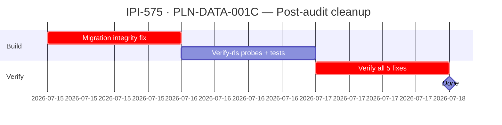

## IPI-575 — PLN-DATA-001C — Planner member mutations security fix

**In plain terms:** Hardens three planner RPCs against privilege escalation (manager inviting as manager, manager promoting to manager via role-update bypass) and closes an email-enumeration side channel. Also fixes RLS bypass path on direct `assignments` insert.

**Blocked by:** None (self-contained) · **Unblocks:** IPI-483 `needsApproval` (once `needsApproval` stub is removed) · **Related:** IPI-483, IPI-542 (release gate)

**Skills:** `ipix-supabase` · `gemini`

**Labels:** PLANNER · SECURITY · MIGRATION

**Milestone:** PLN-M2 · Planner Security

**Spec:** `Universal-design-prompt-4/planner/tasks/01-efficiency.md` §IPI-575
**Design:** (backend security task — no UI design files apply)

---

### Fixes implemented (PR #387)

| # | Finding | Fix | Migration |
|---|---------|-----|-----------|
| SEC-003 | Manager could invite as manager (peer escalation) | Owner gate on `p_role='manager'` in `planner_invite_member` | `20260714211800` |
| SEC-003b | Manager could invite as contributor then promote to manager | `p_new_role='manager'` gate in `planner_update_role` | `20260714211800` (added in-place) |
| SEC-003 RLS | Manager could bypass RPC by inserting directly into `planner.assignments` with `role='manager'` | RLS `assignments_insert_manager` policy requires owner for `role='manager'` | `20260714220000` |
| SEC-004 | Distinct error codes for unknown email vs out-of-org leaked registration status | Unified to `user_not_available` | `20260714211800` |
| Ordering | Manager-role gate ran before instance-existence check, producing wrong error codes | Gate moved after instance + permission checks | `20260714211800` (added in-place) |

---

### Completion steps

#### A. Migration integrity (unresolved)

- [ ] **A1** Fix `20260714211800` drift: the migration was edited in-place between `db push` operations — the SQL on remote DB may differ from git HEAD. Run `supabase db diff --linked` to detect drift, then apply correction migration — proof: `supabase migration list` shows matching hashes
- [ ] **A2** Push `20260714220000` to remote: `supabase db push` (or direct SQL) to apply the RLS policy fix — proof: `supabase migration list` shows it on remote

#### B. Verification (unresolved)

- [ ] **B1** Add `verify-rls.mjs` probes that confirm the fixed functions are deployed correctly — proof: `npm run supabase:verify-rls` green
- [ ] **B2** Test each fix end-to-end:
  - Manager invites manager → rejected (SEC-003) — proof: SQL test
  - Manager promotes contributor to manager → rejected (SEC-003b) — proof: SQL test
  - Direct insert into `assignments` with `role='manager'` → rejected at RLS (SEC-003 RLS) — proof: SQL test
  - Probe unknown email vs out-of-org email returns same error (SEC-004) — proof: SQL test
  - Invite on non-existent instance returns `instance_not_found`, not `insufficient_role_for_target` (ordering) — proof: SQL test

#### C. Ship

- [ ] **C1** PR #387 merged and closed — proof: GitHub
- [ ] **C2** Migration ledger clean — proof: `supabase migration list`
- [ ] **C3** Audit updated: remove "missing verify-rls probes" note — proof: AGENTS.md updated

---

### Corrections Applied

- **Migration integrity:** `20260714211800` was edited in-place after first `db push` (commit `1870a415` → `acbdada1` changed "Two fixes" to "Three fixes"). Remote DB has the old version if pushed before the edit. New migration needed.
- **RLS migration not applied:** `20260714220000` exists locally but never pushed to remote.
- **verify-rls probes:** Originally listed as "#3 Finding Fixed" but no probes were written. Full RLS verification still missing.
- **Scoring:** Security = 30/100 (was mis-colored 🟡 in audit; correct is ⚫ per legend 0-39)

---

### Gantt — IPI-575 Post-Fix

