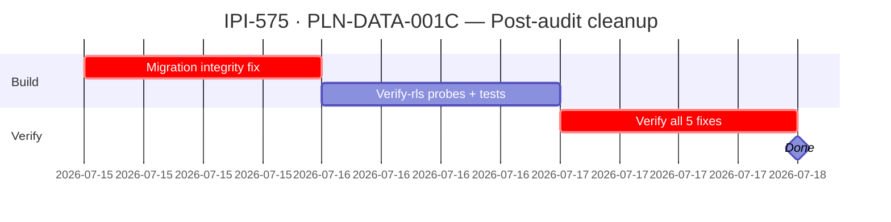

<<<<<<< HEAD
## IPI-575 — PLN-DATA-001C — Planner member mutations security fix

**In plain terms:** Hardens three planner RPCs against privilege escalation (manager inviting as manager, manager promoting to manager via role-update bypass) and closes an email-enumeration side channel. Also fixes RLS bypass path on direct `assignments` insert.

**Blocked by:** None (self-contained) · **Unblocks:** IPI-483 `needsApproval` (once `needsApproval` stub is removed) · **Related:** IPI-483, IPI-542 (release gate)

**Skills:** `ipix-supabase` · `gemini`

**Labels:** PLANNER · SECURITY · MIGRATION

**Milestone:** PLN-M2 · Planner Security

**Spec:** `Universal-design-prompt-4/planner/tasks/01-efficiency.md` §IPI-575
**Design:** (backend security task — no UI design files apply)

---

### Fixes implemented (PR #387)

| # | Finding | Fix | Migration |
|---|---------|-----|-----------|
| SEC-003 | Manager could invite as manager (peer escalation) | Owner gate on `p_role='manager'` in `planner_invite_member` | `20260714211800` |
| SEC-003b | Manager could invite as contributor then promote to manager | `p_new_role='manager'` gate in `planner_update_role` | `20260714211800` (added in-place) |
| SEC-003 RLS | Manager could bypass RPC by inserting directly into `planner.assignments` with `role='manager'` | RLS `assignments_insert_manager` policy requires owner for `role='manager'` | `20260714220000` |
| SEC-004 | Distinct error codes for unknown email vs out-of-org leaked registration status | Unified to `user_not_available` | `20260714211800` |
| Ordering | Manager-role gate ran before instance-existence check, producing wrong error codes | Gate moved after instance + permission checks | `20260714211800` (added in-place) |

---

### Completion steps

#### A. Migration integrity (unresolved)

- [ ] **A1** Fix `20260714211800` drift: the migration was edited in-place between `db push` operations — the SQL on remote DB may differ from git HEAD. Run `supabase db diff --linked` to detect drift, then apply correction migration — proof: `supabase migration list` shows matching hashes
- [ ] **A2** Push `20260714220000` to remote: `supabase db push` (or direct SQL) to apply the RLS policy fix — proof: `supabase migration list` shows it on remote

#### B. Verification (unresolved)

- [ ] **B1** Add `verify-rls.mjs` probes that confirm the fixed functions are deployed correctly — proof: `npm run supabase:verify-rls` green
- [ ] **B2** Test each fix end-to-end:
  - Manager invites manager → rejected (SEC-003) — proof: SQL test
  - Manager promotes contributor to manager → rejected (SEC-003b) — proof: SQL test
  - Direct insert into `assignments` with `role='manager'` → rejected at RLS (SEC-003 RLS) — proof: SQL test
  - Probe unknown email vs out-of-org email returns same error (SEC-004) — proof: SQL test
  - Invite on non-existent instance returns `instance_not_found`, not `insufficient_role_for_target` (ordering) — proof: SQL test

#### C. Ship

- [ ] **C1** PR #387 merged and closed — proof: GitHub
- [ ] **C2** Migration ledger clean — proof: `supabase migration list`
- [ ] **C3** Audit updated: remove "missing verify-rls probes" note — proof: AGENTS.md updated

---

### Corrections Applied

- **Migration integrity:** `20260714211800` was edited in-place after first `db push` (commit `1870a415` → `acbdada1` changed "Two fixes" to "Three fixes"). Remote DB has the old version if pushed before the edit. New migration needed.
- **RLS migration not applied:** `20260714220000` exists locally but never pushed to remote.
- **verify-rls probes:** Originally listed as "#3 Finding Fixed" but no probes were written. Full RLS verification still missing.
- **Scoring:** Security = 30/100 (was mis-colored 🟡 in audit; correct is ⚫ per legend 0-39)

---

### Gantt — IPI-575 Post-Fix


```mermaid
gantt
  dateFormat YYYY-MM-DD
  title IPI-575 · PLN-DATA-001C — Post-audit cleanup
  section Build
  Migration integrity fix :crit, b1, 2026-07-15, 1d
  Verify-rls probes + tests :b2, after b1, 1d
  section Verify
  Verify all 5 fixes :crit, v1, after b2, 1d
  Done :milestone, m1, after v1, 0d
```
=======
# IPI-575 · PLN-DATA-001C — Stop planner managers from escalating to owner-only roles

**Role:** iPix engineer. One concern per PR. Research before custom code.

**Plain English:** A Planner manager cannot invite/promote peers to manager or bypass RPC via direct assignment insert; invite errors do not leak whether an email is registered.

| Field | Value |
|-------|--------|
| **MVP stage** | Launch Blocker (Planner security) |
| **Parallel** | Must not mix with UI features; serialize migrations |
| **Blocked by** | — (cleanup after PR #387) |
| **Unblocks** | IPI-483 needsApproval hardening · IPI-542 release gate |
| **Track** | Platform |
| **Skills** | `ipix-task-lifecycle` · `ipix-supabase` · `worktrees` · `pr-workflow` · `task-verifier` |
| **Agents / hooks / commands** | `rls-policy-auditor` · `/verify-task` · block-local-supabase hook |
| **Stack** | Supabase remote-only · migrations · `verify-rls.mjs` |

**Quality scores (1–5):** P5 · C3 · R5 · UV4 · LV5  
**Linear:** https://linear.app/amo100/issue/IPI-575

---

## 1. Purpose

Finish migration integrity + verify-rls probes so SEC-003/004 fixes are actually on remote and tested.

## 2. Real-world iPix example

- **Persona:** Engineer (security) · Operator (manager in Planner)  
- **Surface:** Planner member invite / role update  
- **Today:** PR #387 fixed code; possible remote drift; probes missing  
- **After:** Remote matches git; probes fail closed on escalation  

## 3. User journey impact

| Before | During | After |
|--------|--------|-------|
| Manager might escalate | Invite/promote attempted | Rejected consistently; no email oracle |

## 4. Business value

Privilege escalation and email enumeration are launch blockers for multi-user Planner.

## 5. Quality checks

- [x] Required / Launch Blocker  
- [x] Not duplicate of IPI-542  
- [x] Prefer Supabase CLI + verify-rls over new app code  
- [x] Parallel: **no** with other planner migrations  

**Verdict:** Ship migration-only + verify probes (one concern: security).

---

## 6. Research checklist

- [ ] `supabase migration list` / diff linked  
- [ ] Official Supabase RLS docs  
- [ ] Existing `scripts/verify-rls.mjs` patterns  
- [ ] Confirm PR #387 merge state on GitHub  

## 7. Platform-first plan

| Step | Choice |
|------|--------|
| Dashboard | Inspect policies if needed |
| CLI | `supabase db push` / corrective migration |
| Existing | verify-rls harness |
| Custom | New probes + corrective SQL only |

**Do NOT:** Edit old migration in-place again · UI changes  
**Out of scope:** needsApproval product (IPI-483)

---

## 8. Multi-step implementation prompt

```xml
<role>Finish IPI-575 · PLN-DATA-001C. Migration + verify-rls only. One concern.</role>
<task>
1. Detect drift; add corrective migration if remote ≠ git.
2. Ensure RLS migration applied remotely.
3. Add verify-rls probes for SEC-003/003b/RLS/004/ordering.
4. Run proofs; PR migration+scripts only (no docs mix unless docs-only follow-up).
</task>
```

### Completion steps (A→E)

#### A. Migration integrity
- [ ] **A1** Detect drift / corrective migration — proof: migration list hashes  
- [ ] **A2** Remote has RLS fix — proof: migration list / policy query  

#### B. Probes
- [ ] **B1** verify-rls cases for five fixes — proof: script section  

#### C. Edges
- [ ] **C1** Wrong error ordering regression — proof: SQL/probe  

#### D. Tests
- [ ] **D1** `infisical run --env=dev -- npm run supabase:verify-rls` — proof: green  

#### E. Ship
- [ ] **E1** PR merged · ledger clean — proof: GitHub + migration list  
- [ ] **E2** Linear Done — proof: status  

---

## 9. Acceptance criteria

- **A:** Manager cannot invite as manager  
- **B:** Manager cannot promote to manager  
- **C:** Direct `assignments` insert as manager denied by RLS  
- **D:** Unknown vs out-of-org email → same error  
- **E:** Non-existent instance → `instance_not_found` (not role error)  

## 10–12. Tests / risks / PR evidence

verify-rls = primary · Risk: in-place edit history → always new forward migration · Rollback: reverse migration · PR: migration/scripts only.
>>>>>>> origin/main
