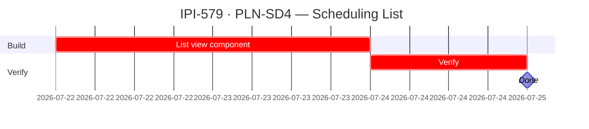

## IPI-579 — PLN-SD4 — Scheduling List view

**In plain terms:** List view of scheduled shoots/shoot days for a planner instance. Rows = shoots/shoot days with columns for date, crew, status, and quick actions.

**Blocked by:** IPI-574 (hard) — scheduling data model must exist first · **Unblocks:** IPI-588 (calendar) · **Related:** IPI-578 (scheduling domain), IPI-580 (Timeline view — sibling, not dependency)

**Skills:** `nextjs-developer` · `frontend-design` · `shadcn`

**Labels:** PLANNER · SCHEDULING · FRONTEND · LIST

**Milestone:** PLN-M2 · Scheduling

**Spec:** `Universal-design-prompt-4/planner/tasks/01-efficiency.md` §IPI-579
**Design:** `Universal-design-prompt-4/Pages/SCR-32-Planner-Workspace.dc.html` (workspace shell with List view tab) · `Universal-design-prompt-4/Pages/Shoots List.v2.image-first.dc.html` (list view pattern) · `Universal-design-prompt-4/components/FilterBar.dc.html` · `Universal-design-prompt-4/components/SearchBar.dc.html` · `Universal-design-prompt-4/components/StatusChip.dc.html` · `Universal-design-prompt-4/components/EmptyState.dc.html` · `Universal-design-prompt-4/components/SkeletonLoader.dc.html` · `Universal-design-prompt-4/components/PageHeader.dc.html` · `Universal-design-prompt-4/components/COMPONENTS.md`

---

### Completion steps

#### A. Data

- [ ] **A1** Consumes scheduling data from IPI-574 model — proof: data loads correctly
- [ ] **A2** Sortable by date, crew lead, status — proof: browser smoke

#### B. Frontend

- [ ] **B1** Table/list component with columns: shoot date, crew lead, status, quick actions (view, edit, delete) — see `Shoots List.v2.image-first.dc.html` for table-row pattern, use `StatusChip.dc.html` for status column, `FilterBar.dc.html` and `SearchBar.dc.html` for list controls, `PageHeader.dc.html` for title block — proof: browser smoke
- [ ] **B2** Pagination or infinite scroll for large datasets — proof: browser smoke
- [ ] **B3** Empty state when no shoots scheduled — use `EmptyState.dc.html` — proof: browser smoke
- [ ] **B4** Loading skeleton — use `SkeletonLoader.dc.html` — proof: browser smoke

#### C. Architecture note

- [ ] **C1** This is a standalone component. Do NOT share a `<WeekGrid>` rendering abstraction with Timeline/Kanban/Calendar/List — they have fundamentally different layouts (table rows vs absolute-positioned bars vs flex columns vs CSS grid cells) — proof: code review

#### D. Verify + ship

- [ ] **D1** `cd app && npm run lint && npm test` — proof: green
- [ ] **D2** Browser smoke: List view renders data correctly — proof: browser

---

### Corrections Applied

- **Dependency corrected:** Blocked by IPI-574 (scheduling data model), NOT "Ready to start" as previously classified
- **Architecture note added:** Do NOT build a shared WeekGrid — List is tabular rows, not a grid layout
- **Status:** To Do (blocked by IPI-574)

---

### Gantt — IPI-579

