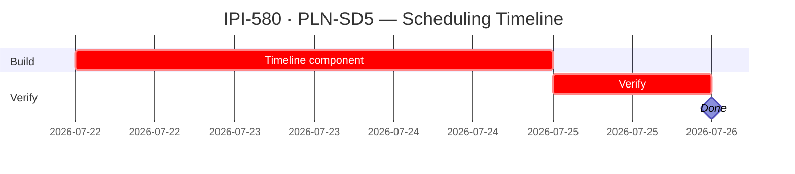

## IPI-580 — PLN-SD5 — Scheduling Timeline view

**In plain terms:** Horizontal timeline/Gantt view of scheduled shoots/shoot days for a planner instance. Shoots rendered as positioned bars on a week-based horizontal axis.

**Blocked by:** IPI-574 (hard) — scheduling data model must exist first · **Unblocks:** None directly · **Related:** IPI-578 (scheduling domain), IPI-579 (List view — sibling, not dependency)

**Skills:** `nextjs-developer` · `frontend-design` · `shadcn`

**Labels:** PLANNER · SCHEDULING · FRONTEND · TIMELINE

**Milestone:** PLN-M2 · Scheduling

**Spec:** `Universal-design-prompt-4/planner/tasks/01-efficiency.md` §IPI-580
**Design:** `Universal-design-prompt-4/Pages/SCR-32-Planner-Workspace.dc.html` (workspace shell with full Timeline section: phase rows, week columns, positioned bars) · `Universal-design-prompt-4/components/EmptyState.dc.html` · `Universal-design-prompt-4/components/SkeletonLoader.dc.html` · `Universal-design-prompt-4/components/COMPONENTS.md`

---

### Completion steps

#### A. Data

- [ ] **A1** Consumes scheduling data from IPI-574 model — proof: data loads correctly
- [ ] **A2** Time-axis data: shoots mapped to horizontal positions by date/time — proof: correct bar placement

#### B. Frontend

- [ ] **B1** Horizontal timeline: days as columns, shoots as positioned bars by duration — see `SCR-32-Planner-Workspace.dc.html` Timeline section (phase rows + week columns + absolute-positioned bars) — proof: browser smoke
- [ ] **B2** Scrollable horizontally (multi-week) — proof: browser smoke
- [ ] **B3** Click bar → opens shoot detail — proof: browser smoke
- [ ] **B4** Drag-to-resize bar duration? (stretch goal — defer if complex) — proof: code review
- [ ] **B5** Empty state when no shoots scheduled — use `EmptyState.dc.html` — proof: browser smoke
- [ ] **B6** Loading skeleton — use `SkeletonLoader.dc.html` — proof: browser smoke

#### C. Architecture note

- [ ] **C1** Timeline uses `position: absolute` bars on a week-axis. Do NOT share a `<WeekGrid>` rendering abstraction with List/Kanban/Calendar — they have different layout models — proof: code review

#### D. Verify + ship

- [ ] **D1** `cd app && npm run lint && npm test` — proof: green
- [ ] **D2** Browser smoke: Timeline renders correctly, bars positioned by date — proof: browser

---

### Corrections Applied

- **Dependency corrected:** Blocked by IPI-574 (scheduling data model), NOT "Ready to start" as previously classified
- **Architecture note added:** Do NOT share WeekGrid — Timeline is `position: absolute`, not grid cells
- **Status:** To Do (blocked by IPI-574)

---

### Gantt — IPI-580

