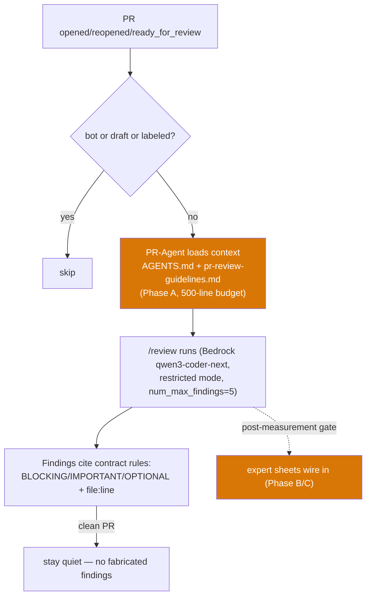

# IPI-661 · PRAGENT-003 — Add iPix PR-Agent Review Contract and Expert Guidance

**Role:** iPix engineer. One concern per PR — this is a **docs-only PR** (AGENTS.md rule #1: never mix docs with workflow/config).

**Plain English:** Write the rulebook PR-Agent reads on every review — one central contract + six short expert sheets — so the AI reviewer flags iPix-specific dangers (missing RLS grants, CopilotKit v1 imports, unproven Worker filesystem assumptions) instead of generic noise.

| Field | Value |
|-------|--------|
| **MVP stage** | Core (staged rollout docs) |
| **Blocked by** | PRAGENT-001 (#806, merged) · PRAGENT-002 (#807, merged) |
| **Unblocks** | IPI-659 · PRAGENT-004 — Restricted PR-Agent Config + GitHub Workflow (hard blocker: Phase A `repo_context_files` needs `docs/pr-review-guidelines.md` on main) |
| **Track** | AI · PR-Agent rollout (official task: PRAGENT-003) |
| **Skills** | `ipix-task-lifecycle` · `pr-workflow` · `mermaid-diagrams` · `task-verifier` · `worktrees` |
| **PR** | [#814 — docs-only](https://github.com/amo-tech-ai/lumina-studio/pull/814) |
| **SSOT** | `tasks/pr-agent/` (plan + expert doc + reference-registry §7) |

---

## The problem this solves

- PR-Agent already auto-reviews every opened PR but gives **generic advice**: it can't know that a Supabase table without an RLS policy+grant pair is a merge-blocker here, that CopilotKit v1 imports fail our build, or that a blanket "`fs` breaks Workers" claim is *wrong* on our `nodejs_compat` build.
- Today there is **no file on main** the reviewer can load as the iPix rulebook (`docs/pr-review-guidelines.md` does not exist) — Phase A of the config rollout (IPI-659) is blocked until this lands.
- Without anti-noise rules the reviewer burns context budget on lint repeats and version scares, drowning real findings.

**Fix:** Ship the contract + six domain sheets as **docs on the default branch** (the repo-trusted location PR-Agent reads from), with explicit "how to flag" severity guidance per domain.

## User story

> As an **Engineer** merging a PR,
> I see PR-Agent flag iPix-specific risks with `file:line` evidence and severity (BLOCKING/IMPORTANT/OPTIONAL) — and stay quiet on clean PRs,
> so I can trust its findings instead of dismissing the bot as noise.

---

## Flow diagram

**This PR ships the orange boxes' files only — the wiring (blue/white path) is IPI-659.**

---

## Acceptance criteria

- **A — Files exist on main:** `docs/pr-review-guidelines.md` + six sheets in `docs/engineering/pr-agent/` land merged; verify: `git ls-tree -r --name-only origin/main | grep -E "pr-review-guidelines|engine"`.
- **B — Contract quality:** contract ≤120 lines and covers stack facts, the 8 review priorities, security baseline, anti-noise list, `BLOCKING/IMPORTANT/OPTIONAL` output format, task-ref format, and the humans-decide rule; verify: `wc -l` + markdownlint on the file.
- **C — Sheet quality:** each sheet ≤90 lines, names its phase (B or C), contains at least one "accent table" of acceptable patterns (what NOT to flag); verify: markdownlint + `wc -l`.
- **D — No scope violations:** zero workflow/TOML/migration/code changes in the PR; verify: `git diff --stat` shows docs-only.
- **E — Regression guard:** the canonical config values and the official task map remain owned by `tasks/pr-agent/` — these files contain contract-level rules only, no duplicate config; verify: `rg "num_max_findings|ignore_pr_labels" docs/` returns 0 hits (values live in `tasks/pr-agent/`, IPI-659 ships the keys).

---

## Technical notes

**Files to touch (7, all new):**

- `docs/pr-review-guidelines.md` — central contract (≤120 lines, loaded at Phase A)
- `docs/engineering/pr-agent/supabase.md` — RLS+grants (IPI-896), remote-only, types regen, edge `_shared`
- `docs/engineering/pr-agent/mastra.md` — registry key = agent id = `useAgent` id; data-path layering; HITL ownership
- `docs/engineering/pr-agent/copilotkit.md` — `app/package.json` = import truth (v2 ladder); runtime/frontend alignment
- `docs/engineering/pr-agent/cloudflare.md` — proof-required fs/path scoping (`nodejs_compat` reality)
- `docs/engineering/pr-agent/commerce.md` — Mercur owns commerce; Supabase = links/metadata only
- `docs/engineering/pr-agent/github-actions.md` — SHA pins, least-privilege, command gate, restricted-mode pins
- `docs/linear/issues/IPI-661-PRAGENT-003.md` — this spec (Linear mirror)

**Do NOT:** wire any sheet into `.pr_agent.toml` (that is IPI-659); add a 7th/8th sheet; copy AGENTS.md wholesale (sheets must not exceed their caps); treat the sheets as landing-zone docs — they exist on disk now but load **only after the Phase A measurement gate**.

**Seeded / known data:** official map per `tasks/pr-agent/reference-registry.md` §7 (`PRAGENT-003 = IPI-661`); upstream keys verified against pinned `pr_agent/settings/configuration.toml @ 01569655d8b4825bbe599fd5b2a8de59d5c58390`.

---

## Out of scope

- ⚠️ `.pr_agent.toml` / workflow changes → **IPI-659 · PRAGENT-004** (config-only PR, next)
- ⚠️ manual slash-command gate → IPI-659 Stage 2 (issue_comment branch does not exist yet)
- ⚠️ seeded-defect validation PRs → **IPI-930 · PRAGENT-005**
- Wiring the 4 high-traffic sheets into `repo_context_files` → post-measurement (Phase B/C)

---

### Completion steps (check in order)

#### A. Pre-flight
- [ ] **A1** Base on `origin/main` at `522d79d4` or later (post-#807) — proof: `git log -1 --oneline` shows `docs(pr-agent): add PRAGENT-002 reference registry (#807)` or newer
- [ ] **A2** Confirm contract path still absent — proof: `gh api repos/amo-tech-ai/lumina-studio/contents/docs/pr-review-guidelines.md` → 404
- [ ] **A3** Fresh worktree `ipi/661-pragent-003-docs` — proof: `git worktree list`

#### B. Write the pack
- [ ] **B1** Contract created with all 8 required sections — proof: `grep -c "^## " docs/pr-review-guidelines.md` ≥ 7 and `wc -l` ≤ 120
- [ ] **B2** Six sheets created, each naming its phase — proof: `grep -l "phase:" docs/engineering/pr-agent/*.md` returns 6 files
- [ ] **B3** Every sheet has an "Acceptable patterns (do NOT flag)" section — proof: `grep -c "Acceptable patterns" docs/engineering/pr-agent/*.md | grep -c ":1"` = 6

#### C. Constraints
- [ ] **C1** Sheets ≤90 lines — proof: `wc -l docs/engineering/pr-agent/*.md` all ≤ 90
- [ ] **C2** No config duplication — proof: `rg "num_max_findings|ignore_pr_labels|restricted_mode = " docs/` → 0 hits
- [ ] **C3** markdownlint clean — proof: `npx markdownlint-cli docs/pr-review-guidelines.md docs/engineering/pr-agent/` → no MD031/MD040/MD022/MD047 findings

#### D. Verify
- [ ] **D1** `git diff --check` clean — proof: no whitespace errors
- [ ] **D2** Pre-push gate passes from worktree — proof: `git push` runs typecheck + tests green at `app/`

#### E. Ship + evidence
- [ ] **E1** PR open as docs-only — proof: PR URL + `gh pr view --json changedFiles` shows 7-8 files, all `docs/`
- [ ] **E2** Review threads resolved — proof: `gh api graphql …reviewThreads…` → unresolved = 0
- [ ] **E3** Merge (squash) — proof: merge commit sha on origin/main
- [ ] **E4** Contract present on main — proof: `gh api repos/amo-tech-ai/lumina-studio/contents/docs/pr-review-guidelines.md` → 200
- [ ] **E5** Linear → Done; unblock recorded on IPI-659 — proof: IPI-659 description/comment notes the blocking dependency is cleared, and its two-stage implementation (Stage 1 TOML · Stage 2 issue_comment gate) can start
