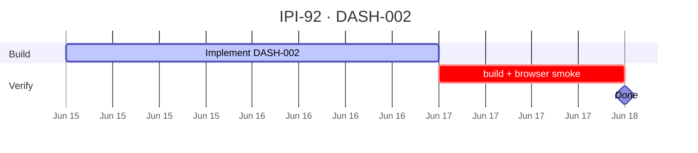

## IPI-92 · DASH-002 — D0 Command Center KPIs (Static)

**In plain terms:** **Operator** lands on `/app` and sees proof status, DNA average, active shoots, and commerce links in under 30 seconds.

**Dashboard:** D0 Command Center

**Blocked by:** [UI-001](https://linear.app/ipix/issue/IPI-22)

**Unblocks:** DASH-009 readable KPIs, D0 supervisor queue

**MVP priority:** **P0 Must Have**

**Estimate:** 3 points

**Source:** [docs/intelligence/02-ai-native-dashboards-plan.md](../../intelligence/02-ai-native-dashboards-plan.md) · [docs/intelligence/README.md](../../intelligence/README.md)

### Skills (load in order)

| # | Skill | Path |
|---|--------|------|
| 1 | ipix-task-lifecycle | `.claude/skills/ipix-task-lifecycle/SKILL.md` |
| 2 | dashboards | `.claude/skills/dashboards/SKILL.md` |

---

### Flow — DASH-002

```mermaid
flowchart TD
  D0[/app] --> KPI[4 KPI cards]
  KPI --> CP[Critical path list]
  CP --> AW[Active work cards]
```

---

### Completion steps

#### A. Implement
- [ ] **A1** 4 KPI cards wired to Supabase queries (proofs #6–8 status)
- [ ] **A2** Critical path list: overdue, blocked DNA, missing links
- [ ] **A3** Active work cards: last 3 brands/shoots
- [ ] **A4** Empty state when no brands
- [ ] **A5** Navigate to D1/D3/D4 from list items

#### B. Verify + ship
- [ ] **B1** `npm run build` passes
- [ ] **B2** Browser smoke on target route documented
- [ ] **B3** Right panel + center panel behave per wireframe
- [ ] **B4** Linear **Done** · `todo.md` updated

**Spec score:** 84/100 — lifecycle-ready

---

### Corrections Applied

- Corrected AI-native dashboard source path to `docs/intelligence/02-ai-native-dashboards-plan.md`.
- Preserved D0 as `/app`, matching the canonical Command Center route.

---

### Gantt — IPI-92



_Source: `docs/linear/issues/IPI-92-DASH-002.md` · push via `node scripts/linear-update-issue.mjs IPI-92`_
