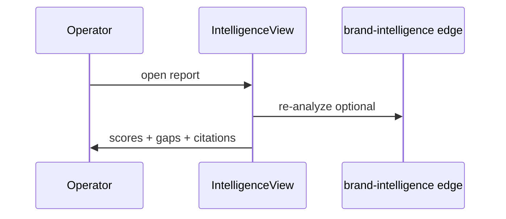
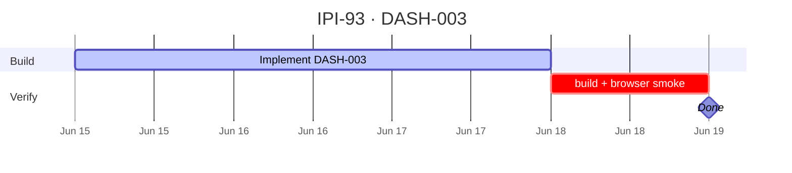

## IPI-93 · DASH-003 — D1 Brand Intelligence Report View

**In plain terms:** **Operator** opens `/app/brand` and sees score bars, brand intelligence data, gaps, and re-analyze — with right panel ready for narrative.

**Dashboard:** D1 Brand

**Blocked by:** [UI-002](https://linear.app/ipix/issue/IPI-23) · [AI-001](https://linear.app/ipix/issue/IPI-18)

**Unblocks:** DASH-006 approval timeline, proof #6 narrative UX

**MVP priority:** **P0 Must Have**

**Estimate:** 5 points

**Source:** [docs/intelligence/02-ai-native-dashboards-plan.md](../../intelligence/02-ai-native-dashboards-plan.md) · [docs/intelligence/README.md](../../intelligence/README.md)

### Skills (load in order)

| # | Skill | Path |
|---|--------|------|
| 1 | ipix-task-lifecycle | `.claude/skills/ipix-task-lifecycle/SKILL.md` |
| 2 | dashboards | `.claude/skills/dashboards/SKILL.md` |
| 3 | gemini | `.claude/skills/gemini/SKILL.md` |

---

### Flow — DASH-003

---

### Completion steps

#### A. Implement
- [ ] **A1** Route `/app/brand`; treat `/app/intelligence/:id` as a legacy alias only
- [ ] **A2** 5 score bars + 18 data points from `brand_scores`
- [ ] **A3** Gap list with impact labels
- [ ] **A4** Re-analyze button → edge refresh
- [ ] **A5** Start Brief CTA → canvas route stub

#### B. Verify + ship
- [ ] **B1** `npm run build` passes
- [ ] **B2** Browser smoke on target route documented
- [ ] **B3** Right panel + center panel behave per wireframe
- [ ] **B4** Linear **Done** · `todo.md` updated

**Spec score:** 84/100 — lifecycle-ready

---

### Corrections Applied

- Corrected AI-native dashboard source path to `docs/intelligence/02-ai-native-dashboards-plan.md`.
- Replaced the obsolete active intelligence detail route with canonical `/app/brand`.
- Documented `/app/intelligence/:id` as a legacy alias only; this issue must not create a new active route.

---

### Gantt — IPI-93

_Source: `docs/linear/issues/IPI-93-DASH-003.md` · push via `node scripts/linear-update-issue.mjs IPI-93`_
