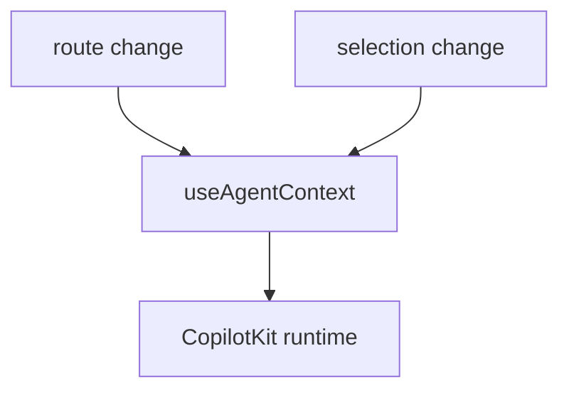
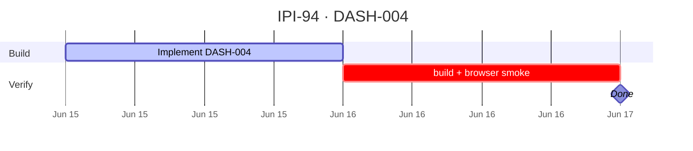

## IPI-94 · DASH-004 — useAgentContext Global Injection

**In plain terms:** **Operator** chats with an agent that already knows route, brandId, filters, and permissions — no re-typing context.

**Dashboard:** All `/app/*`

**Blocked by:** [AIOR-002](https://linear.app/ipix/issue/IPI-82) · [DASH-001](https://linear.app/ipix/issue/IPI-91)

**Unblocks:** DASH-005 agent routing, all L1 context layer

**MVP priority:** **P0 Must Have**

**Estimate:** 2 points

**Source:** [docs/intelligence/02-ai-native-dashboards-plan.md](../../intelligence/02-ai-native-dashboards-plan.md) · [docs/intelligence/README.md](../../intelligence/README.md)

### Skills (load in order)

| # | Skill | Path |
|---|--------|------|
| 1 | ipix-task-lifecycle | `.claude/skills/ipix-task-lifecycle/SKILL.md` |
| 2 | copilotkit-develop | `.claude/skills/copilotkit/copilotkit-develop/SKILL.md` |
| 3 | copilotkit-agui | `.claude/skills/copilotkit/copilotkit-agui/SKILL.md` |

---

### Flow — DASH-004

---

### Completion steps

#### A. Implement
- [ ] **A1** `useAgentContext` in `OperatorLayout` with route, brandId, shootId, filters
- [ ] **A2** Updates on navigation + `BrandSwitcher` change
- [ ] **A3** Include `permissions` / role from auth
- [ ] **A4** Verify agent system prompt receives context in dev
- [ ] **A5** No PII beyond org scope in context payload

#### B. Verify + ship
- [ ] **B1** `npm run build` passes
- [ ] **B2** Browser smoke on target route documented
- [ ] **B3** Right panel + center panel behave per wireframe
- [ ] **B4** Linear **Done** · `todo.md` updated

**Spec score:** 84/100 — lifecycle-ready

---

### Corrections Applied

- Corrected AI-native dashboard source path to `docs/intelligence/02-ai-native-dashboards-plan.md`.
- Preserved L1 context injection scope for all canonical `/app/*` routes.

---

### Gantt — IPI-94

_Source: `docs/linear/issues/IPI-94-DASH-004.md` · push via `node scripts/linear-update-issue.mjs IPI-94`_
