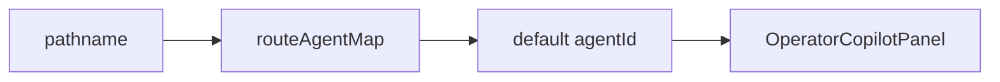
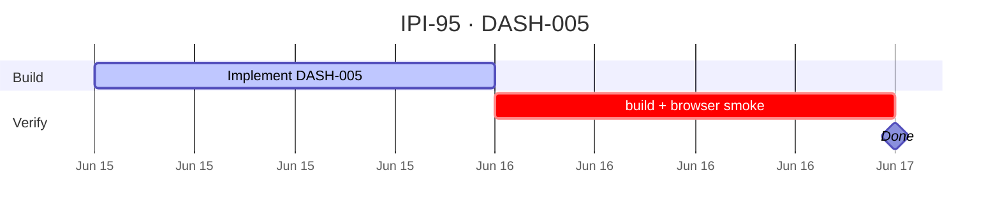

## IPI-95 · DASH-005 — Route agentId Map

**In plain terms:** **Operator** gets the right specialist agent per dashboard (brand-intelligence on intake, asset-dna on assets, etc.).

**Dashboard:** All `/app/*`

**Blocked by:** [DASH-004](https://linear.app/ipix/issue/IPI-94) · [AIOR-002](https://linear.app/ipix/issue/IPI-82)

**Unblocks:** Per-dashboard Copilot behavior, supervisor override header

**MVP priority:** **P0 Must Have**

**Estimate:** 1 point

**Source:** [docs/intelligence/02-ai-native-dashboards-plan.md](../../intelligence/02-ai-native-dashboards-plan.md) · [docs/intelligence/README.md](../../intelligence/README.md)

### Skills (load in order)

| # | Skill | Path |
|---|--------|------|
| 1 | ipix-task-lifecycle | `.claude/skills/ipix-task-lifecycle/SKILL.md` |
| 2 | copilotkit-develop | `.claude/skills/copilotkit/copilotkit-develop/SKILL.md` |
| 3 | mastra | `.claude/skills/mastra/SKILL.md` |

---

### Flow — DASH-005

---

### Completion steps

#### A. Implement
- [ ] **A1** `routeAgentMap` constant: D0→brand-intelligence, D1→brand-intelligence, D3→asset-dna, D4→product-linking
- [ ] **A2** Panel header shows active agent + optional override (Advanced)
- [ ] **A3** Fallback agent when route unmapped
- [ ] **A4** Document map in `copilotkit-operator-ui.md`

#### B. Verify + ship
- [ ] **B1** `npm run build` passes
- [ ] **B2** Browser smoke on target route documented
- [ ] **B3** Right panel + center panel behave per wireframe
- [ ] **B4** Linear **Done** · `todo.md` updated

**Spec score:** 84/100 — lifecycle-ready

---

### Corrections Applied

- Corrected AI-native dashboard source path to `docs/intelligence/02-ai-native-dashboards-plan.md`.
- Preserved route-default agent mapping for canonical app routes.

---

### Gantt — IPI-95

_Source: `docs/linear/issues/IPI-95-DASH-005.md` · push via `node scripts/linear-update-issue.mjs IPI-95`_
