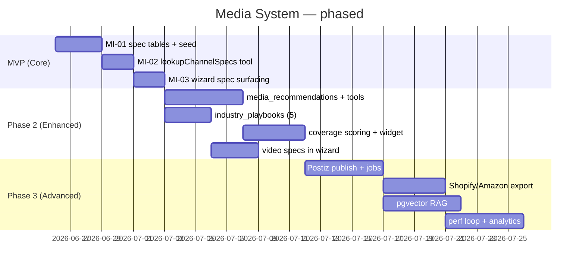

# Media System Roadmap — Core / MVP / Advanced

**Version:** 1.0
**Date:** 2026-06-25
**Pairs with:** [prd-media.md](prd-media.md) (requirements) · [40-media-intelligence-plan.md](40-media-intelligence-plan.md) (schema + MI IDs).
**Rule:** ship the smallest thing that delivers grounded recommendations. Most of the booking/production model already exists (see [prd-media.md](prd-media.md) §2) — this roadmap is mostly *wiring AI on top*, not building from scratch.

---

## Sequencing at a glance

---

## MVP (Core) — grounded specs, no new agent, no publishing

**Goal:** operator gets platform-correct image specs inside the existing Shoot Wizard, fully grounded, zero hallucination.

| MI ID | Work item | What | Builds on |
|---|---|---|---|
| MI-01 | Spec tables + seed | `platforms`+`image_type_defs`+`image_specs`+`recommendation_rules` in `public`, seeded verbatim from image KB — **global reference data**: no `brand_id`, authenticated read-only `SELECT` | new |
| MI-02 | `lookupChannelSpecs` tool | `channels[] -> spec rows`; mirrors existing `lookupShotReferences` | `production-planner` |
| MI-03 | Wizard step-1 surfacing | show required specs next to existing shot-type suggestions | `shoot-wizard` |

**Exit criterion:** "what image specs for Instagram feed?" -> `1080×1350, 4:5, JPEG/PNG ≤8MB` from DB. Unknown channel -> empty, not a guess.

**Checklist:**
- [ ] MI-01 migration reviewed by `migration-reviewer`; RLS = authenticated read-only (global reference, no `brand_id`); FK + lookup-column indexes
- [ ] Seed = image KB §13.2 verbatim
- [ ] MI-02 registered on `production-planner`, returns only DB rows
- [ ] MI-03 renders with loading/error/empty/success states
- [ ] One test: IG-feed lookup returns KB values; unknown channel -> empty

**Explicitly NOT in MVP:** recommendations persistence, coverage, video, publishing, ecommerce sync, analytics, pgvector, new agents, 13 of 14 integrations.

---

## Phase 2 (Enhanced) — recommend, persist, coverage, video

**Goal:** agent ranks the asset mix and persists it (HITL-approved); coverage gaps flagged before booking; video deliverables in the same wizard.

| Item | What | Builds on |
|---|---|---|
| `media_recommendations` (MI-04) | persisted output: image/video/ad/ecommerce mix, priority + confidence + reasoning | new table |
| `recommendImageTypes` / `recommendCreativeMix` / `recommendChannelAssets` | ranking tools on `production-planner` | MVP specs |
| `industry_playbooks` (MI-07) | seed 5 verticals (fashion, jewelry, beauty, luxury, accessories) | new table |
| `scoreAssetCoverage` + `asset_coverage_scores` (MI-11) | gap score per brand vs. its channels | brand_scores + Cloudinary |
| Coverage widget | dashboard gap -> "book a shoot" CTA | shoots dashboard |
| Video specs (MI-13) | seed `video_type_specs` from video KB; `recommendVideoTypes` | video KB |

**HITL:** recommendation persists only after operator approves the card. Writes via edge fn.
**Agent decision:** still the 6 agents. Promote `media-advisor` (MI-08) **only if** the planner prompt overflows — not by default.

**Exit criterion:** brand with no Amazon hero shots -> coverage widget shows the gap -> wizard pre-fills a recommended shoot mix -> operator approves -> `media_recommendations` row persists.

---

## Phase 3 (Advanced) — publish, RAG, performance loop

**Goal:** approved assets publish to channels; AI cites brand history; performance data raises future priority.

| Item | What | Builds on |
|---|---|---|
| Postiz publish + `publish_jobs` | approved assets -> Postiz queue (IG/TikTok/FB/Pinterest/YouTube), HITL gate 5 | shoot_assets |
| Shopify/Amazon export | export files (CSV/asset bundles) first; native API on demand | commerce links |
| pgvector RAG | embeddings over brand assets + past briefs so recommendations cite real history | new |
| Perf loop + analytics | import channel performance -> bump asset-type priority; high-DNA -> `shot_type_references` promotion (MI-16…18) | shoot_assets |
| Analytics dashboard | asset/campaign performance views | perf data |

**Exit criterion:** operator publishes an approved set through Postiz with one approval; a logged perf win raises that asset type's next-shoot priority; RAG answer cites a real prior asset.

---

## What we deliberately don't build

| Temptation | Verdict |
|---|---|
| 18 specialized agents | 6 reused; consultants = `industry_playbooks` rows. 1 conditional promotion |
| 28 vertical subsystems | 5 seeded; rest = a migration insert when a customer appears |
| 14 direct integrations | Cloudinary + Postiz + Stripe; Shopify/Amazon via export first |
| pgvector in MVP | Phase 3 — structured specs ground the MVP without embeddings |
| New booking/production schema | Reuse existing `shoot` schema; add 4 spec tables |
| Booking/Sales/CS/Finance agents | Out of media scope (commerce track) |

---

## Dependencies & gates

- Migrations before UI; edge fn deployed + verified before client calls it (per `ipix-task-lifecycle`).
- Every phase re-challenged before it starts: *needed now? simpler? reuse existing? measurable value?* If no -> defer.
- Phase N+1 stays on the shelf until Phase N exit criterion passes.

**Next action:** build MI-01 -> MI-02 -> MI-03. File real IPI issues from the Linear [ai-intelligence](https://linear.app/amo100/view/ai-intelligence-da5702146a74) / [brand](https://linear.app/amo100/view/brand-cf010b8aecb8) views at planning time — never invent issue numbers.
