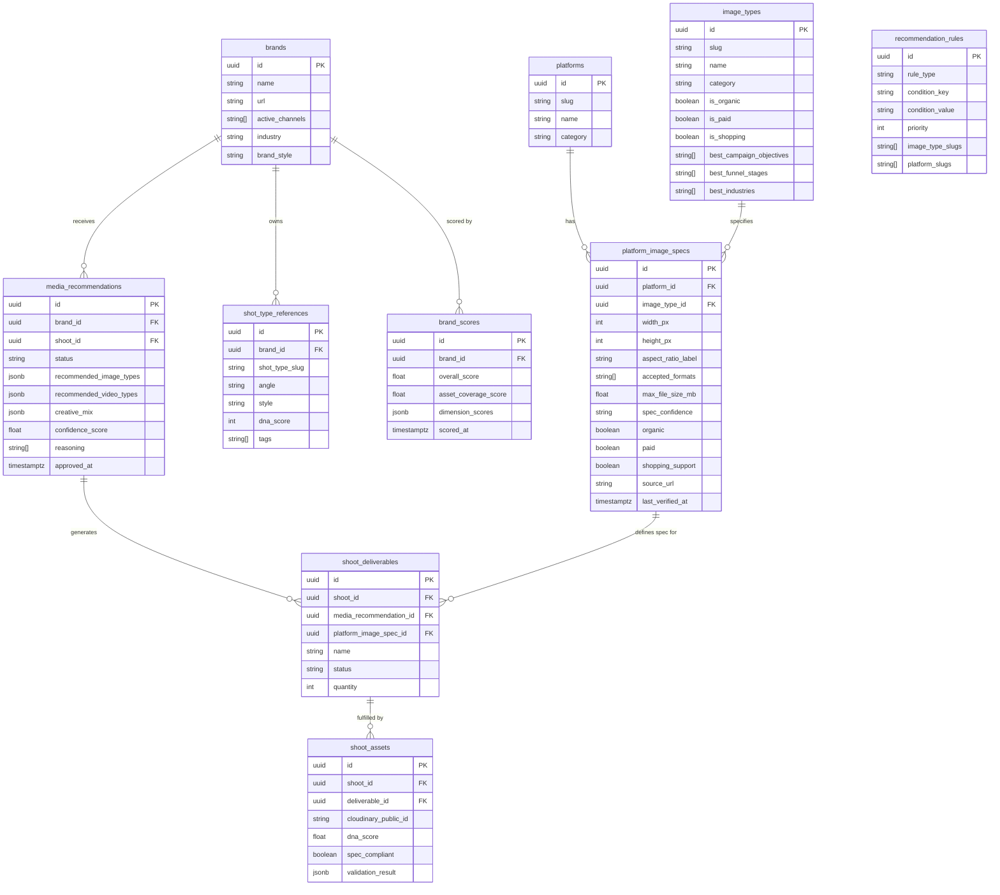

# Media Intelligence Strategy, Roadmap & PRD

> ⚠️ **SUPERSEDED for schema, tenancy, and issue numbers by [`40-media-intelligence-plan.md`](40-media-intelligence-plan.md).** This doc's `platform_image_specs`/`image_types` table names, `media_recommendations` columns, and `IPI-184…204` numbers are wrong/colliding — do not implement from them. Strategy narrative (§1–4) and open questions (§9) remain useful.

**Version:** 1.0
**Date:** 2026-06-27
**Status:** Active — Phase 1 in progress (IPI-135)
**Audience:** Engineers + Product
**Owner:** iPix / FashionOS platform team

---

## Table of Contents

1. [Executive Summary](#1-executive-summary)
2. [The Problem](#2-the-problem)
3. [The Solution: Media Intelligence Layer](#3-the-solution-media-intelligence-layer)
4. [Product Vision](#4-product-vision)
5. [Phased Roadmap](#5-phased-roadmap)
6. [Data Architecture](#6-data-architecture)
7. [Success Metrics](#7-success-metrics)
8. [Linear Issue Map](#8-linear-issue-map)
9. [Open Questions](#9-open-questions)

---

## 1. Executive Summary

### What it is

The Media Intelligence layer is the strategic planning engine inside iPix/FashionOS that tells brands what creative assets to produce before a shoot starts — then validates those assets after the shoot ends.

It combines a structured knowledge base (platform specs, image types, video formats, industry best practices) with a Mastra AI agent that reasons over a brand's DNA, channels, and campaign goals to produce actionable shoot deliverables.

### Why it's a moat

Every competitor stops at execution. Squareshot books and shoots. Canva lets you design. Traditional agencies advise, but slowly and expensively. None of them close the loop: created → published → performance → better next brief.

iPix owns the full cycle: **know what to make → make it → validate it → learn from it**. The knowledge base that powers this reasoning accretes with every shoot. That data advantage compounds.

### Core thesis

> Brands don't know what to create. iPix tells them — grounded in platform specs, brand DNA, campaign goals, and industry playbooks — then helps them create it.

The output isn't a spec sheet. It's a prioritized shoot brief with platform-specific deliverables, creative style direction, and format validation rules baked in from the start.

### Competitive position

| Competitor | What they do | What they miss |
|---|---|---|
| **Squareshot** | Book photographer → shoot → deliver | No strategic layer; no specs; no feedback loop |
| **Canva** | DIY design tool | No shoot planning; no AI strategy; no DNA alignment |
| **Traditional agencies** | Strategy + creative direction | Expensive, slow, no platform intelligence, no loop |
| **iPix** | Brand DNA → spec-grounded brief → validated assets → performance loop | Full stack |

---

## 2. The Problem

### 2.1 Brands waste shoot budgets on wrong asset types

A fashion brand books a $5,000 shoot and walks out with 40 hero shots and nothing usable for TikTok Shop, Pinterest, or their Amazon listings. The wrong content mix is locked in before the photographer arrives because nobody mapped campaign goals to required asset types in advance.

### 2.2 No system maps goals → assets → shoot requirements

Today's workflow:

```text
Brand manager Googles "Instagram image size 2026"
→ copies last season's shot list
→ emails freelancer
→ briefs photographer on the day
→ discovers post-production that 3 critical formats are missing
```

No tooling ingests a campaign goal and outputs: "you need these 8 image types, these 3 video formats, at these exact specs, for these 4 channels."

### 2.3 Platform specs change constantly

Instagram deprecated the 1:1 grid in favor of 3:4 portrait. TikTok Shop added new product image requirements. Amazon A+ content module dimensions differ from main images. Teams that don't track this produce assets that get cropped wrong, rejected, or underperform.

No single team can maintain a living spec database manually at the speed platforms change.

### 2.4 No feedback loop

The asset lifecycle today ends at delivery. There is no path from:

- Published asset → engagement data → what worked
- What worked → updated recommendations for next shoot
- Asset score → shoot brief improvement

Every brief starts from zero.

---

## 3. The Solution: Media Intelligence Layer

Three tightly coupled components.

### 3.1 Knowledge Base (built)

A structured, versioned database of image specs, video specs, platform requirements, creative best practices, and industry playbooks. Source of truth for every agent recommendation.

**Completed in `02-image-types.md`:**
- 12 platforms: Instagram, Facebook, TikTok, Pinterest, LinkedIn, X, YouTube, Threads, Shopify, Amazon, Etsy, Facebook Marketplace
- 80+ image type × platform combinations with full technical specs
- AI recommendation rules
- PostgreSQL/Supabase schema with TypeScript types and Zod schemas
- Source bibliography with confidence scoring (`official` / `community` / `estimated`)

**Defined for video in `10-video-prompt.md`:**
- Same 22 platforms extended to video formats
- Organic + advertising video types (Reels, TikTok product video, YouTube Shorts, in-stream ads, etc.)
- Technical specs: resolution, aspect ratio, codec, bitrate, max length, thumbnail size
- Creative best practices, ecommerce video matrix

**Defined for campaign strategy in `ai-media-agent.md`:**
- 21 AI expert personas (Creative Director, Performance Marketer, Amazon Expert, etc.)
- Campaign workflow playbooks (brand launch, product launch, Black Friday, UGC campaign, etc.)
- Industry-specific recommendations for 25 verticals
- Decision engine: "What should this brand create first?"

### 3.2 AI Media Agent (planned — Phase 2)

A Mastra agent (`media-advisor`) that:

- Accepts brand DNA profile + active channels + campaign goal as input
- Queries the knowledge base via structured tools (`recommendImageTypes`, `recommendVideoTypes`, `recommendCreativeMix`)
- Returns a prioritized list: image types + video types + specs + creative style direction + quantity
- Feeds its output directly into the shoot wizard as draft deliverables

### 3.3 Shoot Integration (planned — Phase 2/3)

Agent-recommended deliverables become shoot wizard step 1. Operator reviews and approves. Approved deliverables flow into the shot list. Post-shoot, assets are validated against the same specs that generated the brief.

---

## 4. Product Vision

### Full system flow (target state)

```text
Brand URL
  ↓
Brand DNA analysis (IPI-29, IPI-46)
  ↓
Operator inputs: active channels + campaign goal + season
  ↓
media-advisor agent queries knowledge base
  ↓
Recommendation: 12 image types + 4 video types + exact specs + creative mix ratios
  ↓
Operator reviews → approves → edits
  ↓
Approved deliverables → shoot wizard step 1
  ↓
Shot list generator → shoot brief → production package
  ↓
Shoot happens
  ↓
Assets uploaded → DNA scoring validates spec compliance
  ↓
Compliant assets → stored with metadata → reused intelligently
  ↓
Performance data imported (engagement, CTR, ROAS)
  ↓
Recommendation engine improves → next brief is smarter
```

### Operator experience (Phase 2 target)

1. Operator opens shoot wizard for a brand with Instagram + TikTok Shop + Amazon channels
2. Step 1 shows AI-generated deliverable suggestions: "Based on your channels and campaign goal (product launch), we recommend these 14 asset types"
3. Each suggestion shows: image type name, spec, why it's needed, priority (required / recommended / optional)
4. Operator approves the set → 14 deliverables populate the shot list
5. No Googling. No copy-paste. No missed formats.

### Brand dashboard (Phase 3 target)

- Coverage score: "Your brand has 73% of required assets for your active channels"
- Gap report: "Missing: Amazon A+ lifestyle image (1464×600), TikTok Shop cover (1:1, 800×800)"
- One-click: "Add to next shoot brief"

---

## 5. Phased Roadmap

### Phase 1 — Foundation (current sprint, IPI-135)

**Goal:** Agent tools are DB-grounded. Agent never invents shot type names — every recommendation traces to a DB row.

| Task | Status | Issue |
|---|---|---|
| `shot_type_references` table + `lookupShotReferences` tool | ✅ Done | IPI-183, IPI-148 |
| `02-image-types.md` knowledge base (80+ specs, 12 platforms) | ✅ Done | — |
| DB migration: `platform_image_specs` + seed data | Planned | IPI-184 (new) |
| `lookupChannelSpecs` agent tool | Planned | IPI-184 |
| TypeScript types + Zod schemas wired from KB | Planned | IPI-184 |

**Exit criterion:** Agent answers "what are the required image specs for Instagram feed posts?" with DB-grounded data. Zero hallucinated spec values.

---

### Phase 2 — Media Agent MVP

**Goal:** Operator saves >30 min per shoot brief from AI-generated deliverable suggestions.

| Task | Issue | Notes |
|---|---|---|
| `media-advisor` Mastra agent | IPI-185 | Registered in `app/src/mastra/agents/`; system prompt combines Creative Director + Campaign Strategist + Amazon Expert personas |
| `recommendImageTypes` tool | IPI-186 | Brand DNA + channels + goal → ranked image type list with priorities |
| `recommendVideoTypes` tool | IPI-187 | Campaign goal + channels + budget → ranked video type list |
| `recommendCreativeMix` tool | IPI-188 | Industry + funnel stage → content ratio (40% lifestyle, 25% product, 20% UGC…) |
| Shoot wizard step 1 integration | IPI-189 | Channel selection → media-advisor call → deliverable list with approve/edit UI |
| Industry playbook rules seeded | IPI-190 | `recommendation_rules` rows for fashion, beauty, jewelry, luxury, accessories |

**Exit criterion:** Operator opens wizard → selects channels → AI deliverable list appears → approves → shot list populated. Time-to-complete step 1 <5 min.

---

### Phase 3 — Coverage Scoring

**Goal:** Brand dashboard shows asset coverage score. Operators see exactly what's missing before booking a shoot.

| Task | Issue | Notes |
|---|---|---|
| `scoreAssetCoverage` tool | IPI-191 | Brand assets × required channel specs → coverage % per channel |
| Missing asset detection | IPI-192 | Returns severity-ranked gap list: critical / warning / suggestion |
| Brand dashboard coverage widget | IPI-193 | Coverage score + gap list per active channel |
| DNA scoring: spec compliance dimension | IPI-194 | Post-shoot spec validation feeds into `brand_scores` |
| Gap report → add to shoot brief | IPI-195 | One-click: missing asset row → shoot deliverable |

**Exit criterion:** Every brand dashboard shows coverage score. Gap items are clickable into shoot briefs.

---

### Phase 4 — Intelligence Loop

**Goal:** Each shoot cycle improves the next recommendation. Performance data drives smarter briefs.

| Task | Issue | Notes |
|---|---|---|
| Post-shoot spec validation pipeline | IPI-196 | Asset upload → validated against linked `platform_image_spec_id` → pass/fail on `shoot_assets` |
| Performance data import | IPI-197 | Webhook / CSV: engagement, CTR, ROAS per asset |
| Recommendation confidence scoring | IPI-198 | High-performing asset types get elevated `priority` in future recommendations |
| `shot_type_references` auto-promotion | IPI-199 | High-DNA assets → promoted to canonical reference shots |
| Per-brand recommendation history | IPI-200 | Store approved recommendation sets; surface approval rate trends |

**Exit criterion:** After 3 shoot cycles for a brand, recommendation approval rate is measurably higher than cycle 1.

---

### Phase 5 — Video Intelligence

**Goal:** Video shoots planned from the same wizard as stills. Full parity with image layer.

| Task | Issue | Notes |
|---|---|---|
| `platform_video_specs` DB table + seed data | IPI-201 | Video equivalent of `platform_image_specs`; seeded from `10-video-prompt.md` KB |
| `lookupVideoSpecs` agent tool | IPI-202 | Query video specs by channel + video type |
| `recommendVideoTypes` full implementation | IPI-187 | Extend Phase 2 stub to full video KB |
| Shoot wizard: video deliverables in step 1 | IPI-203 | Stills + video in same wizard UI |
| Video creative best practices rules | IPI-204 | Hook strategy, length rules, thumbnail specs in `recommendation_rules` |

**Exit criterion:** A TikTok-first brand gets Reels (9:16), TikTok product video, and YouTube Shorts deliverables in the same wizard step as their image deliverables.

---

## 6. Data Architecture

### Entity relationship diagram



### Data flow: recommendation → brief → validation

```text
brands.active_channels
  ↓
lookupChannelSpecs(channel_slugs)
  → queries platform_image_specs JOIN image_types
  → returns full spec set for those channels

brand DNA (industry, style, funnel stage)
  ↓
recommendation_rules matched by condition_key + condition_value

media-advisor agent
  → recommendImageTypes()  → ranked list with required/recommended/optional priority
  → recommendVideoTypes()  → ranked video list
  → recommendCreativeMix() → ratio { lifestyle: 40, product: 25, ugc: 20, campaign: 10, bts: 5 }
  → stores in media_recommendations (status: 'draft')

Operator approval
  → media_recommendations.status = 'approved'
  → shoot_deliverables created (one per approved asset type)
  → each linked to platform_image_spec_id

Shoot wizard
  → reads shoot_deliverables → shot list generator → production package

Post-shoot
  → shoot_assets created per captured asset
  → spec_compliant validated against linked platform_image_spec_id
  → dna_score computed
  → brand_scores.asset_coverage_score updated
  → performance data attached (Phase 4)
```

### Key tables (Phase 1 migration, IPI-184)

```sql
-- Seed platforms (12 from 02-image-types.md)
CREATE TABLE platforms (
  id uuid PRIMARY KEY DEFAULT gen_random_uuid(),
  slug text UNIQUE NOT NULL,
  name text NOT NULL,
  category text NOT NULL CHECK (category IN ('social','ecommerce','marketplace','advertising')),
  is_active boolean DEFAULT true,
  created_at timestamptz DEFAULT now()
);

-- Canonical image types (~25 types)
CREATE TABLE image_types (
  id uuid PRIMARY KEY DEFAULT gen_random_uuid(),
  slug text UNIQUE NOT NULL,
  name text NOT NULL,
  category text NOT NULL CHECK (category IN ('profile','feed','story','ad','product','cover','thumbnail','banner')),
  is_organic boolean DEFAULT true,
  is_paid boolean DEFAULT false,
  is_shopping boolean DEFAULT false,
  best_campaign_objectives text[] DEFAULT '{}',
  best_funnel_stages text[] DEFAULT '{}',
  best_industries text[] DEFAULT '{}',
  created_at timestamptz DEFAULT now()
);

-- Core knowledge base table (~80+ rows from KB)
CREATE TABLE platform_image_specs (
  id uuid PRIMARY KEY DEFAULT gen_random_uuid(),
  platform_id uuid REFERENCES platforms(id) ON DELETE CASCADE,
  image_type_id uuid REFERENCES image_types(id) ON DELETE CASCADE,
  width_px integer NOT NULL,
  height_px integer NOT NULL,
  min_width_px integer,
  max_width_px integer,
  aspect_ratio_w numeric,
  aspect_ratio_h numeric,
  aspect_ratio_label text,
  accepted_formats text[] DEFAULT '{jpg,png}',
  max_file_size_mb numeric,
  safe_zone_top_px integer,
  safe_zone_bottom_px integer,
  background_required text,
  product_fill_min_pct integer,
  spec_confidence text DEFAULT 'official' CHECK (spec_confidence IN ('official','community','estimated')),
  organic boolean DEFAULT true,
  paid boolean DEFAULT false,
  shopping_support boolean DEFAULT false,
  mobile_notes text,
  desktop_notes text,
  crop_notes text,
  best_use_cases text[] DEFAULT '{}',
  source_url text,
  last_verified_at timestamptz,
  created_at timestamptz DEFAULT now(),
  UNIQUE(platform_id, image_type_id)
);

-- AI decision rules
CREATE TABLE recommendation_rules (
  id uuid PRIMARY KEY DEFAULT gen_random_uuid(),
  rule_type text NOT NULL CHECK (rule_type IN ('channel_required','objective_best','category_best','missing_asset')),
  condition_key text NOT NULL,   -- 'channel' | 'industry' | 'campaign_objective' | 'funnel_stage'
  condition_value text NOT NULL, -- 'instagram' | 'fashion' | 'product_launch' | 'awareness'
  priority integer DEFAULT 50,
  image_type_slugs text[] NOT NULL,
  platform_slugs text[],
  notes text,
  created_at timestamptz DEFAULT now()
);

-- Agent output store
CREATE TABLE media_recommendations (
  id uuid PRIMARY KEY DEFAULT gen_random_uuid(),
  brand_id uuid REFERENCES brands(id) ON DELETE CASCADE,
  shoot_id uuid,
  status text DEFAULT 'draft' CHECK (status IN ('draft','approved','rejected')),
  recommended_image_types jsonb DEFAULT '[]',
  recommended_video_types jsonb DEFAULT '[]',
  creative_mix jsonb DEFAULT '{}',
  confidence_score numeric,
  reasoning text[],
  approved_by uuid,
  created_at timestamptz DEFAULT now(),
  approved_at timestamptz
);
```

### Agent tool signatures

```typescript
// Phase 1 — Foundation
lookupChannelSpecs(channels: string[]): Promise<PlatformImageSpec[]>
lookupShotReferences(brandId: string, filters?: ShotFilters): Promise<ShotTypeReference[]>

// Phase 2 — Media Agent
recommendImageTypes(input: {
  brandId: string;
  channels: string[];
  campaignGoal: CampaignObjective;
  industry: string;
  funnelStage: FunnelStage;
  season?: string;
}): Promise<ImageRecommendation[]>

recommendVideoTypes(input: {
  brandId: string;
  channels: string[];
  campaignGoal: CampaignObjective;
  budget: 'low' | 'medium' | 'high';
}): Promise<VideoRecommendation[]>

recommendCreativeMix(input: {
  industry: string;
  campaignGoal: CampaignObjective;
  brandStyle: string;
}): Promise<CreativeMix>
// Returns: { lifestyle: 40, product: 25, ugc: 20, campaign: 10, bts: 5 }

// Phase 3 — Coverage
scoreAssetCoverage(input: {
  brandId: string;
  channels: string[];
}): Promise<CoverageReport>
// Returns: { score: 0.73, missing: MissingAssetReport[] }
```

---

## 7. Success Metrics

| Phase | Metric | Target | How to measure |
|---|---|---|---|
| **Phase 1** | Agent uses only DB-grounded shot types | 100% | Zero hallucinated shot names; all trace to `shot_type_references` or `platform_image_specs` |
| **Phase 1** | `lookupChannelSpecs` latency | <200ms p95 | Supabase query timing |
| **Phase 2** | Time saved per shoot brief | >30 min | Operator survey + time-to-complete wizard step 1 |
| **Phase 2** | Deliverable approval rate (no edit) | >70% | % of AI-recommended deliverables approved without modification |
| **Phase 3** | Coverage score on all brand dashboards | 100% of active brands | DB row existence check |
| **Phase 3** | Gap-to-shoot conversion | >50% | % of gap report items added to next shoot brief |
| **Phase 4** | Spec compliance rate post-shoot | >90% | % of delivered assets passing `spec_compliant` check |
| **Phase 4** | Recommendation approval rate improvement | Measurable increase vs cycle 1 | Approval rate trend after 3 shoot cycles per brand |
| **Phase 5** | Video deliverables in wizard | Full parity with image | Wizard step 1 surfaces video + image deliverables in same UI |

---

## 8. Linear Issue Map

### Existing issues (in scope)

| Issue | Title | Phase | Status |
|---|---|---|---|
| IPI-135 | AIOR-019 Agent Memory Foundation | Phase 1 | In Progress (current branch) |
| IPI-183 | Durable agent + shoot tools + e2e suite | Phase 1 | Done (PR #95) |
| IPI-148 | Shoot tools (`lookupShotReferences` etc.) | Phase 1 | Done |
| IPI-29 | Brand Intelligence edge function (10 dims) | Dependency | Deployed |
| IPI-46 | Brand DNA scoring | Dependency | Done |
| IPI-149 | Shoot wizard workflow | Dependency | Done (PR #96) |

### New issues to create

| Issue | Title | Phase | Description |
|---|---|---|---|
| **IPI-184** | DB migration: `platform_image_specs` + seed | Phase 1 | Create tables; seed 12 platforms + 80+ specs from `02-image-types.md`; wire TypeScript types |
| **IPI-185** | Mastra agent: `media-advisor` | Phase 2 | New agent in `app/src/mastra/agents/`; system prompt combining Creative Director + Campaign Strategist + Amazon Expert personas from `ai-media-agent.md` |
| **IPI-186** | Agent tool: `recommendImageTypes` | Phase 2 | Queries `platform_image_specs` + `recommendation_rules`; returns ranked list with priority |
| **IPI-187** | Agent tool: `recommendVideoTypes` | Phase 2/5 | Phase 2 stub from playbook rules; Phase 5 full implementation against `platform_video_specs` |
| **IPI-188** | Agent tool: `recommendCreativeMix` | Phase 2 | Returns content ratio by industry + campaign goal |
| **IPI-189** | Shoot wizard step 1: AI deliverable suggestions | Phase 2 | UI: channel selection → media-advisor call → deliverable list with approve/edit |
| **IPI-190** | Seed industry playbook rules | Phase 2 | Populate `recommendation_rules` for fashion, beauty, jewelry, luxury, accessories |
| **IPI-191** | Agent tool: `scoreAssetCoverage` | Phase 3 | Brand assets × required channel specs → coverage % |
| **IPI-192** | Missing asset detection | Phase 3 | Severity-ranked gap list per brand × channel |
| **IPI-193** | Brand dashboard: coverage widget | Phase 3 | Score + gap list UI on brand dashboard |
| **IPI-194** | DNA scoring: spec compliance dimension | Phase 3 | Post-shoot spec validation feeds into `brand_scores` |
| **IPI-195** | Gap report → add to shoot brief | Phase 3 | One-click: missing asset → shoot deliverable |
| **IPI-196** | Post-shoot spec validation pipeline | Phase 4 | Asset upload → spec check → `spec_compliant` on `shoot_assets` |
| **IPI-197** | Performance data import | Phase 4 | Webhook / CSV ingest: engagement, CTR, ROAS per asset |
| **IPI-198** | Recommendation confidence scoring | Phase 4 | High-performing asset types get elevated priority in future recommendations |
| **IPI-199** | `shot_type_references` auto-promotion | Phase 4 | High-DNA assets promoted to canonical reference shots |
| **IPI-200** | Per-brand recommendation history | Phase 4 | Store approved recommendation sets; surface trends |
| **IPI-201** | DB: `platform_video_specs` + seed | Phase 5 | Video equivalent of `platform_image_specs`; seeded from `10-video-prompt.md` |
| **IPI-202** | Agent tool: `lookupVideoSpecs` | Phase 5 | Query video specs by channel + video type |
| **IPI-203** | Shoot wizard: video deliverables in step 1 | Phase 5 | Stills + video in same wizard UI |
| **IPI-204** | Video creative best practices rules | Phase 5 | Hook strategy, length rules, thumbnail specs in `recommendation_rules` |

---

## 9. Open Questions

### Spec maintenance

**Who maintains the knowledge base as platform specs change?**

Platform specs change 3–6 times per year per major platform. Three options:

| Option | Effort | Reliability |
|---|---|---|
| Manual quarterly review | Low effort | Requires owner; risks drift |
| Firecrawl agent monitors platform help pages → flags drift → human approves | Medium build | High; automated detection |
| Community confidence scoring — mark stale rows as `estimated` | Lowest | Transparent but not proactive |

Recommended: manual quarterly review + Firecrawl drift detection alert (Firecrawl → webhook → Slack). The `last_verified_at` column surfaces specs older than 90 days in the UI so operators see a staleness warning before a shoot.

**How do we handle spec drift at runtime?**

Agent tools should check `last_verified_at` and include a staleness warning in tool output when a spec is >90 days old. Operator sees: "Spec last verified 4 months ago — verify before shoot."

### Search and retrieval

**Vector search on `shot_type_references` for semantic lookup?**

Currently `lookupShotReferences` uses structured filters (angle, style, tags). Adding pgvector embeddings on description text would enable semantic queries: "find shots similar to this campaign brief." Worth implementing in Phase 3 when the reference set is large enough to benefit from similarity matching.

**Cloudinary integration for format-specific exports?**

Assets in Cloudinary can be dynamically transformed via URL params. When a brand needs a spec (1080×1920 Story), the system could generate a Cloudinary transformation URL directly from `platform_image_specs` rows rather than requiring manual re-export. This requires:

- `cloudinary_public_id` on `shoot_assets` (already in schema above)
- A `buildCloudinaryTransformUrl(assetId, specId)` utility
- Integration point: gap report → "Transform existing asset to this spec" vs "Shoot new asset"

This Phase 3/4 unlock lets brands close coverage gaps using existing assets before booking a new shoot. Estimated to reduce shoot frequency 20–30% for brands with large asset libraries.

### Agent design

**How does `media-advisor` interact with the existing shoot wizard agent?**

The existing shoot wizard (IPI-149) has its own agent. Media intelligence is a tool-set available to both, not a parallel agent that duplicates wizard logic. `media-advisor` is invoked at wizard step 1 (deliverable planning) and its output is passed downstream as structured data. It does not replace the shoot wizard agent.

**Multi-industry recommendation accuracy?**

Phase 2 playbook seeding (IPI-190) covers fashion, beauty, jewelry, luxury, and accessories. B2B, hospitality, food, and real estate require separate playbooks. Prioritize industries based on the first 20 operator accounts' actual verticals — do not seed what won't be used.

---

*Source documents: `docs/media/01-prompt-media.md` · `docs/media/10-video-prompt.md` · `docs/media/ai-media-agent.md` · `docs/media/prompt-image-types.md` · `docs/media/02-image-types.md`. Platform context: `prd.md` v4.2 · `docs/plan/todo.md` v2.0.*
