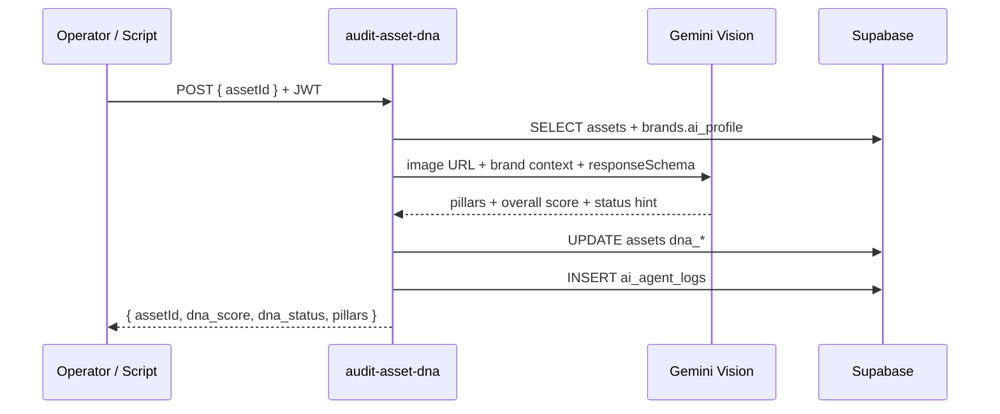

# IPI-19 · DNA-001 — Asset DNA Scoring Engine

## Purpose

Score uploaded fashion/product images against the operator’s brand DNA so assets get an objective **approved / review / blocked** gate before commerce sync. Completes MVP **Proof #7**.

## Goals

- Edge function `audit-asset-dna` accepts `assetId` (+ optional `brandId`) and returns structured DNA pillars + overall score.
- Persist `assets.dna_score`, `assets.dna_status`, `assets.dna_pillars` (columns exist in PLT-001).
- Log every run to `ai_agent_logs` with `agent_name = audit-asset-dna`.
- Enforce RLS: user can only score assets they own via shoot/brand linkage.
- **Do not** build upload UI here (DNA-002 / UI-003) — DNA-001 is engine + verify script only.

## User story

As an operator, I want each product image scored against my brand profile so I know which assets are safe to publish to Mercur without manual QA.

## User journey

1. Operator has brand profile from UI-002 (Proof #6).
2. Asset row exists with a **public image URL** (Cloudinary `secure_url` after CLD-003, or interim external URL).
3. Operator or automation triggers DNA audit (verify script / future UI button).
4. Edge loads brand `ai_profile` + asset URL → Gemini Vision structured output.
5. Scores written to `assets`; status drives UI badge (UI-003) and COM-030 eligibility.

## Database impact

### Existing tables (audit)

| Table | Role for DNA-001 |
|-------|------------------|
| `assets` | Target: `dna_score`, `dna_status`, `dna_pillars`, `brand_id`, image URL field |
| `brand_scores` | Read-only context (URL-level scores); optional weighting in prompt |
| `ai_agent_logs` | Insert per audit; `brand_id`, `input.assetId`, `output` |
| `commerce_product_links` | **No writes** in DNA-001; downstream COM-030 reads `dna_status` |

### Schema gaps to confirm before coding

| Gap | Recommendation |
|-----|----------------|
| Image URL on `assets` | CLD-003 adds `secure_url` / `cloudinary_public_id`; until then use existing `url` or `file_path` if populated |
| `cloudinary_assets` table | Optional extension in CLD-003; DNA-001 reads delivery URL only |
| Re-audit policy | UPDATE same asset row; append log; do not duplicate asset rows |
| Score history | MVP: latest score on asset only; P1: `asset_dna_history` table |

### RLS

- SELECT/UPDATE `assets` via existing shoot ownership policies (verify with `supabase:verify-rls`).
- Edge uses user JWT client — no service-role bypass for operator-triggered audits.

## Edge function design

**Name:** `audit-asset-dna`  
**Method:** POST `{ assetId: uuid, brandId?: uuid }`  
**Auth:** Required JWT (`resolveAuth` pattern from PLT-003)

### Steps

1. Validate `assetId`; resolve `brand_id` from asset or payload.
2. Load `brands.ai_profile` + latest `brand_scores` (optional prompt context).
3. Resolve image URL (Cloudinary delivery URL preferred — see CLD-006).
4. Gemini `gemini-2.5-flash` multimodal + `responseSchema`:
   - `overallScore` 0–100
   - `status`: `approved` | `review` | `blocked` (map thresholds: ≥80 approved, 50–79 review, &lt;50 blocked — tune in verify)
   - `pillars`: e.g. `lighting`, `composition`, `color_alignment`, `brand_mood`, `commerce_readiness`
   - `summary`: one sentence for operator
5. UPDATE `assets` set `dna_score`, `dna_status`, `dna_pillars`.
6. INSERT `ai_agent_logs`.

### Dependencies (Cloudinary roadmap)

| Linear | Spec | Required for DNA-001? |
|--------|------|------------------------|
| IPI-59 | CLD-001 — Foundation | Yes (secrets in edge) |
| IPI-60 | CLD-002 — Upload Service | Soft — can test with external URL first |
| IPI-61 | CLD-003 — Asset Metadata Sync | **Yes for production path** — stable `secure_url` on `assets` |
| IPI-64 | CLD-006 — DNA URL pipeline | Recommended — documents transform params for Vision |

**MVP shortcut:** Run DNA-001 against a fixture HTTPS image URL stored on `assets.url` before CLD-003 ships; gate full Proof #7 on CLD-003 + one real upload.

## Acceptance criteria

- [ ] `supabase/functions/audit-asset-dna/index.ts` deployed with shared PLT-003 helpers
- [ ] `scripts/verify-asset-dna.mjs` passes against fixture asset (Infisical env)
- [ ] One asset row updated with non-null `dna_score`, valid `dna_status`, non-empty `dna_pillars`
- [ ] `ai_agent_logs` row with `agent_name = audit-asset-dna`
- [ ] Anonymous POST returns 401; cross-user asset returns 404/403
- [ ] **Proof #7 green** in MVP checklist (script + manual evidence screenshot optional)

## Out of scope (DNA-001)

- Upload UI (DNA-002 / UI-003)
- Mercur product sync (COM-030)
- Batch/cron re-scoring all assets
- Cloudinary Analyze API / MediaFlows

## Rollback

Drop edge function; revert migration only if new columns added (columns already exist — rollback = stop calling function).

## Next after merge

**IPI-24 · UI-003** — Assets list + DNA badge (consumes `dna_status`).
