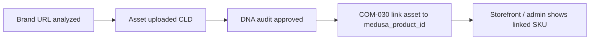

# IPI-42 · COM-030 — Commerce Product Link Sync

## Purpose

Link iPix operator assets (with DNA scores) to Mercur/Medusa products via `commerce_product_links`, enabling one end-to-end path: **Brand → Asset → DNA Score → Mercur Product**. Completes MVP **Proof #8**.

## Goals

- Populate and maintain `commerce_product_links` rows keyed by `(brand_id, medusa_product_id)`.
- Attach `asset_id` when an approved DNA asset is selected for a SKU.
- Idempotent sync from Mercur catalog (no duplicate links).
- Operator-visible link status on `/dashboard/links` (UI-004 — separate issue; COM-030 is API/sync layer).

## User story

As an operator, I want my Mercur products linked to scored brand assets so storefront imagery and metadata stay aligned with brand DNA.

## User journey



1. Proof #6: brand exists in `brands` + `brand_scores`.
2. Proof #7: asset has `dna_status = approved` (or review with override flag — MVP: approved only).
3. COM-030: edge or script lists Mercur products → upsert `commerce_product_links`.
4. Operator assigns or auto-matches asset to product → `asset_id` set on link row.
5. UI-004 displays link table (read `commerce_product_links`).

## Database audit — `commerce_product_links`

Existing schema (PLT-001):

```sql
commerce_product_links (
  id uuid PK,
  brand_id uuid NOT NULL → brands,
  medusa_product_id text NOT NULL,
  asset_id uuid NULL → assets,
  shoot_id uuid NULL → shoots,
  created_at, updated_at,
  UNIQUE (brand_id, medusa_product_id)
)
```

| Field | MVP usage |
|-------|-----------|
| `brand_id` | Scope all links to operator brand |
| `medusa_product_id` | Mercur product.id (string) |
| `asset_id` | Hero image asset after DNA approved |
| `shoot_id` | Optional provenance |
| RLS | Select/insert/update/delete via brand ownership ✅ |

### Gaps

| Gap | Plan |
|-----|------|
| No `dna_status` on link row | Join `assets.dna_status` at read time; block link if not approved |
| No Mercur credentials in edge | Add `MERCUR_*` secrets (COM-008); server-side only |
| No sync cursor | MVP: full list per run; P1: `last_synced_at` on brands or sync table |
| Product title/thumbnail cache | P1 JSONB `metadata` on link row; MVP use live Mercur fetch |

## Edge function design

**Name:** `sync-commerce-links` (or split: `list-mercur-products` + client upsert)  
**Auth:** JWT required; `brand_id` in body.

### Option A — Edge-owned sync (recommended)

1. POST `{ brandId, mode: "list" | "link", medusaProductId?, assetId? }`
2. **list:** Call Mercur Admin API → return products; upsert link rows without `asset_id`
3. **link:** Validate asset belongs to brand + `dna_status = approved`; UPDATE link set `asset_id`
4. Return envelope `{ links: [...] }`

### Option B — Script-first (fastest Proof #8)

1. `scripts/sync-mercur-links.mjs` uses service role + Mercur API
2. Upsert links for seed catalog (COM-008)
3. Manual `asset_id` assignment via SQL or follow-up UI

**Recommendation:** Ship **Option B** for Proof #8 demo, then **Option A** for operator self-serve.

## Dependencies

| Issue | Why |
|-------|-----|
| IPI-14 PLT-001 | Table + RLS ✅ |
| IPI-8 COM-008 | Mercur seed + API credentials |
| IPI-19 DNA-001 | Approved asset to attach |
| IPI-61 CLD-003 | Asset with delivery URL |
| IPI-25 UI-004 | Operator links screen (read layer) |

## Acceptance criteria (Proof #8)

- [ ] At least one row in `commerce_product_links` with non-null `asset_id`
- [ ] Linked asset has `dna_score` and `dna_status = approved`
- [ ] `medusa_product_id` matches a real Mercur product from COM-008 seed
- [ ] Verify script: `npm run supabase:verify-commerce-links` (to be added)
- [ ] Idempotent re-run does not duplicate rows (unique constraint)

## Verification commands (planned)

```bash
infisical run -- npm run supabase:verify
infisical run -- npm run supabase:verify-rls
infisical run -- node scripts/sync-mercur-links.mjs --brand-id <uuid> --dry-run
infisical run -- node scripts/verify-commerce-links.mjs
npm run build
```

## Rollback

Delete link rows for test brand; no schema rollback needed. Revoke Mercur API key if compromised.

## Evidence path (when implemented)

- Script stdout showing upsert count
- SQL: `select * from commerce_product_links where asset_id is not null limit 1`
- Screenshot: UI-004 link row (optional until UI-004 ships)
