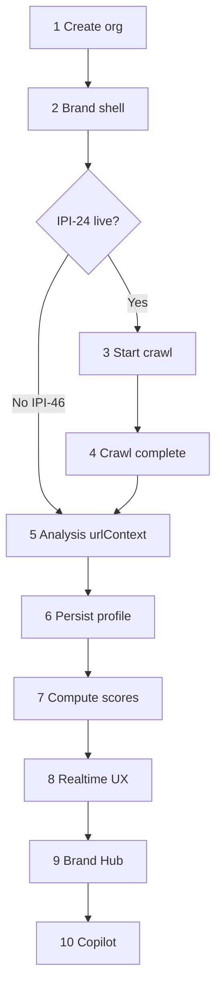
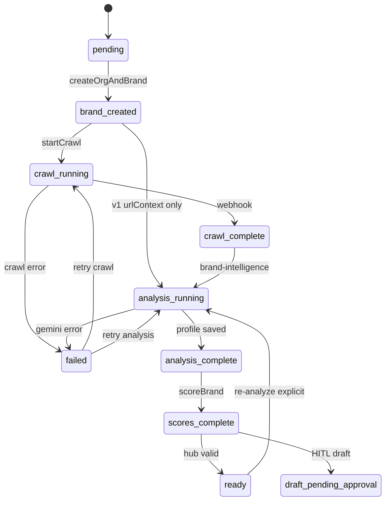

# Brand Lifecycle — Canonical Epic 1 Reference

**Audience:** Engineers implementing IPI-46 through IPI-33  
**Related:** [17-brand-intelligence-plan.md](./17-brand-intelligence-plan.md) · [audit/01-linear-audit.md](./audit/01-linear-audit.md) · [Platform tracker](../copilotkit/todo.md)

**Platform gate:** Epic 1 lifecycle steps 3–10 assume CopilotKit v2 + Mastra platform rows **IPI-129 → IPI-134 → IPI-113 → IPI-132** are green before production **IPI-32** orchestration. See [brand-intelligence/todo.md](./todo.md) § Platform prerequisites.

---

## 1. End-to-end lifecycle (10 steps)

Every brand passes through these stages. **No step may be skipped** except crawl (pre–IPI-24 uses urlContext-only analysis).

```text
 1. Create organization          → IPI-46 (createOrgAndBrand)
 2. Create brand shell            → IPI-46 (org_id, form metadata, intake_status=brand_created)
 3. Start crawl                   → IPI-24 (start-brand-crawl edge fn)
 4. Firecrawl completes           → IPI-24 (firecrawl-webhook → brand_crawls + brand_crawl_results pages)
 5. Gemini analysis               → IPI-25 (brand-intelligence v2, reads raw_data)
 6. Persist profile               → IPI-25 (UPDATE brands.ai_profile, merge form fields)
 7. Compute scores                → IPI-29 (+ base 4 in IPI-46/IPI-25)
 8. Realtime progress update      → IPI-31 (postgres_changes on brand_crawls job rows)
 9. Brand Hub refresh             → IPI-30 (tabs; partial DNA/grid in IPI-46)
10. Copilot available             → IPI-45+ (agents read approved profile); platform: [IPI-130](https://linear.app/amo100/issue/IPI-130) + [IPI-111](https://linear.app/amo100/issue/IPI-111) HITL
```

**Pre–IPI-24 shortcut (IPI-46 only):** Steps 3–4 skipped; step 5 uses urlContext on 4 URLs (existing edge fn v1).



---

## 2. Brand status state machine

### 2.1 Canonical states (`brands.intake_status`)

**IPI-26 implementation (2026-06):** Postgres enum `brand_intake_status` on `brands` — **7 operational states only:**

`brand_created` · `crawl_running` · `crawl_complete` · `analysis_running` · `scores_complete` · `ready` · `failed`

- **Not on `brands`:** `pending` (no brand row yet), `draft_pending_approval` (use `brand_intake_drafts.status`), legacy `none`/`draft`/`approved`.
- **`analysis_complete`:** logical step between Gemini finish and score upsert; may be tracked in `ai_profile` / agent logs until a dedicated column is needed.

Full lifecycle reference (includes pre-brand + HITL rows):

| State | Meaning | Set by | Hub / UX |
|-------|---------|--------|----------|
| `pending` | User/org exists; no brand row yet | — | Redirect to onboarding |
| `brand_created` | Shell row; no analysis started | IPI-46 `createOrgAndBrand` | “Analyze” or auto-start step 3 |
| `crawl_running` | Firecrawl job in flight | IPI-24 start-brand-crawl | Progress UX (IPI-31) |
| `crawl_complete` | raw_data stored; analysis not started | IPI-24 webhook | Trigger analysis (workflow or edge) |
| `analysis_running` | Gemini in progress | IPI-25 / edge fn | Spinner / Realtime |
| `analysis_complete` | ai_profile written; scores pending | IPI-25 | Partial Hub |
| `scores_complete` | All score rows upserted | IPI-29 (+ base 4 earlier) | Scores tab |
| `ready` | Profile + scores; operator can use Hub + agents | IPI-30 / workflow end | Full Hub |
| `failed` | Terminal error; retry allowed | Any step | Error + retry CTA |
| `draft_pending_approval` | HITL draft awaiting operator | IPI-132 step 7 / brand_intake_drafts | Approval UI ([IPI-111](https://linear.app/amo100/issue/IPI-111)) |

**IPI-46 interim (before IPI-26 enum extension):** Use existing column values if present, or store phase in `ai_profile._lifecycle` until migration:

```text
brand_created → analysis_running → scores_complete → ready
                      ↓
                   failed
```

### 2.2 State transitions (allowed edges)



**Rules:**

- No transition to `ready` without `scores_complete` (at minimum 4 base scores).
- Re-analyze from `ready` requires explicit user action (Hub “Re-analyze” button).
- `failed` must persist `failure_reason` + `failed_at` (IPI-26: optional columns or `ai_profile._error` until schema lands).

---

## 3. Idempotency & correlation IDs

Every async operation carries stable IDs so retries do not duplicate work.

| ID | Scope | Storage | Owner |
|----|-------|---------|-------|
| `brand_id` | Whole lifecycle | `brands.id` | IPI-46 |
| `crawl_id` | One crawl **job** (history) | `brand_crawls.id` | IPI-24 |
| `firecrawl_job_id` | Firecrawl API job | `brand_crawls.firecrawl_job_id` UNIQUE | IPI-24 |
| `crawl_result_id` | Legacy name for job id passed to Gemini | `brand_crawls.id` (denormalized `raw_data` for IPI-25) | IPI-24 / IPI-25 |
| `request_id` / `workflow_id` | Correlation / Mastra | `brand_crawls.request_id`, `brand_crawls.workflow_id` | IPI-24 / IPI-32 |
| `analysis_request_id` | One Gemini run | `ai_agent_logs` input + `brand_agent_results.run_id` | IPI-25 |
| `webhook_delivery_id` | Firecrawl retry | Idempotent upsert on `(crawl_id, firecrawl_scrape_id)` page rows | IPI-24 |
| `workflow_run_id` | Mastra suspend/resume | Durable store ([IPI-129](https://linear.app/amo100/issue/IPI-129) + [IPI-134](https://linear.app/amo100/issue/IPI-134)) | **IPI-132** AIOR-003 (canonical) · IPI-32 orchestrates brand steps |

### Idempotency rules

| Operation | Key | Behavior on retry |
|-----------|-----|-------------------|
| Start crawl | `(brand_id, idempotency_key)` on `brand_crawls` | Return existing job if `job_status` ∉ `{failed, cancelled}` |
| Webhook update | `firecrawl_job_id` + page `(crawl_id, page_url)` | UPSERT job metrics + page rows; rebuild `brand_crawls.raw_data` |
| Profile analysis | `(brand_id, crawl_id, score_version)` | UPSERT ai_profile; bump score_version on full re-run |
| Score upsert | `(brand_id, score_type)` UNIQUE | UPSERT only — never INSERT duplicate |
| Onboarding | `(user_id)` first brand | One org + one brand per first-time flow (IPI-46) |

---

## 4. Retry strategy

```text
Firecrawl timeout / 5xx
  → retry with same firecrawl_job_id if unknown
  → new job_id only after explicit failed terminal state

Webhook duplicate delivery
  → idempotent upsert on firecrawl_job_id (IPI-24)

Gemini timeout / invalid JSON
  → max 3 attempts, exponential backoff (IPI-25)
  → set intake_status=failed; do not redirect Hub

Partial failure after brand shell (IPI-46)
  → intake_status stays brand_created or failed
  → user sees error; no onboarding_complete flag

Workflow suspend (IPI-132 / IPI-32)
  → resume token = crawl job id
  → state in [IPI-129](https://linear.app/amo100/issue/IPI-129) PostgresStore + [IPI-134](https://linear.app/amo100/issue/IPI-134) snapshots — NOT `:memory:`
```

---

## 5. Component ownership (single responsibility)

| Linear | Owns | Must NOT own |
|--------|------|--------------|
| **IPI-46** | Org + brand shell; brandId-first edge call; profile merge; minimal score upsert migration; Hub DNA partial | Crawl, 25-field schema, workflow, full Hub tabs |
| **IPI-26** | Schema v2 tables, intake_status enum, RLS, Realtime publication | Business logic |
| **IPI-24** | Firecrawl start + webhook; `brand_crawls` jobs + per-page `brand_crawl_results`; `_shared/firecrawl.ts` | Gemini, UI |
| **IPI-25** | Gemini v2; 20 profile fields + evidence; require brandId | Crawl, scoring dimensions |
| **IPI-29** | 10 score dimensions; DNA = AVG(base 4); score_version | Profile extraction |
| **IPI-30** | Hub v2 UI (tabs, re-analyze button) | Pipeline orchestration |
| **IPI-31** | Progress UX (Realtime subscribe only) | Edge invokes / workflow logic |
| **IPI-32** | Epic 1 orchestration (crawl → analysis → scores); **consumes** [IPI-132](https://linear.app/amo100/issue/IPI-132) `brand-intake` workflow | workflow state + intake_status |
| **IPI-132** | Platform `brand-intake` HITL workflow (`suspend`/`resume`) — **canonical implementation** | AI INTELLIGENCE / AIOR-003 |
| **IPI-33** | Integration + regression tests | Feature code |

---

## 6. Linear issue → lifecycle steps

| Issue | Lifecycle steps | Status field |
|-------|-----------------|--------------|
| IPI-46 | 1, 2, 5–7 (v1), 9 (partial) | → `brand_created` … `scores_complete` |
| IPI-24 | 3, 4 | `crawl_running` → `crawl_complete` |
| IPI-25 | 5, 6 | `analysis_running` → `analysis_complete` |
| IPI-29 | 7 | → `scores_complete` |
| IPI-31 | 8 | reads `brand_crawls.job_status` + `pages_crawled` |
| IPI-30 | 9 | → `ready` when gating passes |
| IPI-32 | 3–7 orchestration (brand-specific steps) | workflow state + intake_status |
| IPI-132 | HITL `brand-intake` workflow (platform) | suspend/resume + draft gates |
| IPI-33 | Validates 1–9 | test fixtures per stage |

**Every Epic 1 PR description must cite:** `docs/brand-intelligence/19-brand-lifecycle.md`

---

## 7. Production cleanup (orphan brands)

**Risk:** Pre–IPI-46 onboarding created orphan `brands` rows (no `org_id`, duplicate per user).

**After IPI-46 merges:**

1. Identify orphans: `SELECT id, user_id, created_at FROM brands WHERE org_id IS NULL ORDER BY created_at;`
2. For each user with orphan + org-linked brand: delete orphan scores then orphan brand (or merge if safe).
3. Document SQL in IPI-46 PR; run manually on remote (no auto-delete in migration without review).

---

## 8. IPI-132 / IPI-32 acceptance (workflow durability)

From audit + [prd-intelligence.md](../prd/prd-intelligence.md) — **mandatory before production workflow:**

- [ ] Workflow state in [IPI-129](https://linear.app/amo100/issue/IPI-129) `@mastra/pg` — not `:memory:`
- [ ] [IPI-134](https://linear.app/amo100/issue/IPI-134) snapshot persistence — no restart-from-step-1 on resume
- [ ] Webhook resume proven on Vercel preview (cold start does not lose suspend token)
- [ ] `workflow_run_id` logged to `ai_agent_logs`
- [ ] Step 1 consumes existing `brand_id` from IPI-46 — never creates org/brand
- [ ] HITL UI uses CopilotKit v2 `useInterrupt` ([IPI-111](https://linear.app/amo100/issue/IPI-111)) — not v1 `useCoAgent`

---

## 9. Verification checklist (lifecycle)

```bash
# Single brand per onboarding (after IPI-46)
cd app && npx vitest run onboarding-orchestration

# Score upsert idempotency (after IPI-46 migration)
npm run supabase:verify-rls

# Crawl idempotency (after IPI-24)
rg firecrawl_job_id supabase/functions/crawl-webhook

# State transitions (after IPI-26)
rg intake_status supabase/migrations
```

---

**Maintainers:** Update this doc when intake_status enum or idempotency keys change. Bump `version` + `lastUpdated` in frontmatter.
