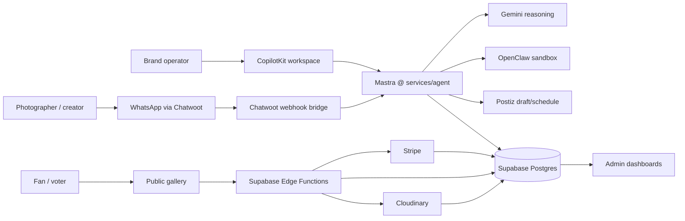
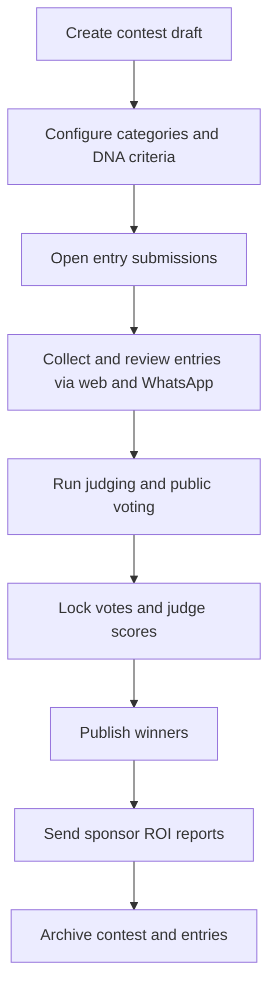
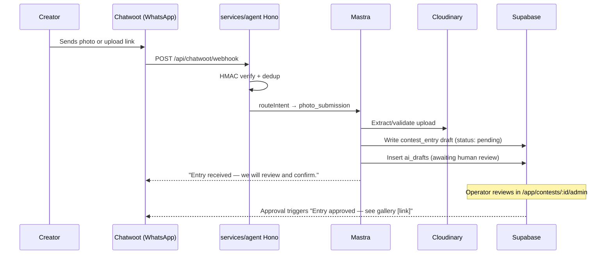
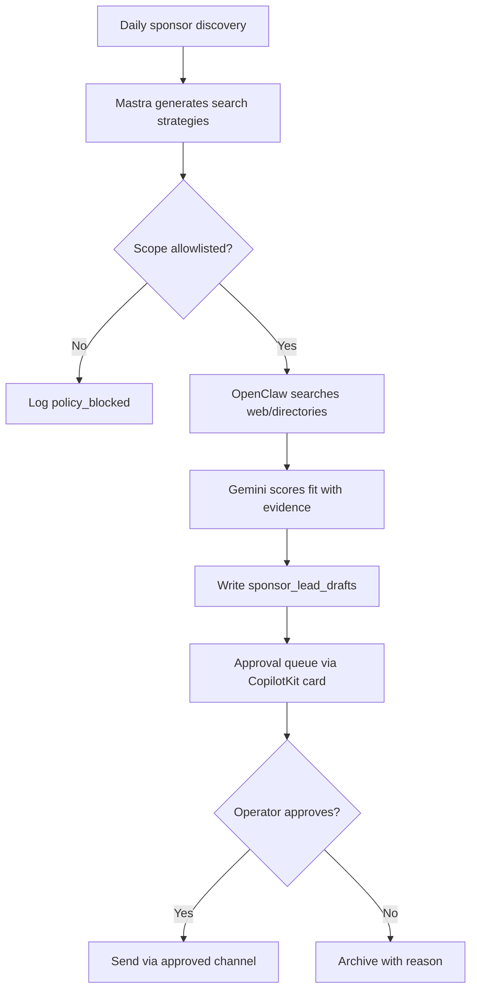

# AI Contest, Campaign Challenge, and Creator Competition OS — iPix FashionOS

## Product Thesis

> iPix becomes the AI operating system for fashion photography contests, DTC brand challenges, creator competitions, and style campaigns.

Fashion brands need user-generated content at scale. Photographers and creators need exposure and real briefs. Consumers want to participate in brands they love. Contests connect all three — and iPix already owns the production workflow, asset DNA pipeline, and brand intelligence layer that makes a fashion-specific contest platform defensible.

Primary example:

```text
iPix Fashion Photography Awards
Categories: Editorial, Commercial, Street Style, Sustainability
600 entries — 3 judges — public vote — brand sponsor prizes
```

The platform lets a brand manager say:

```text
Create a 30-day photo challenge for our spring collection,
three categories, public voting, Cloudinary gallery, WhatsApp
submission via Chatwoot, prize package from our sponsor partners.
```

CopilotKit renders the planning workspace. Mastra decomposes the work and runs approval gates. Gemini drafts content, rubrics, and sponsor proposals. Supabase stores truth. Stripe handles entry fees and prize payouts. Cloudinary manages the photo gallery. Chatwoot/WhatsApp drives DTC distribution.

## Non-Negotiable System Rules

| Rule | Production meaning |
|---|---|
| Supabase owns deterministic truth | Entries, votes, judge scores, payment orders, approvals, sponsor CRM rows, audit logs, and winner calculations live in PostgreSQL with RLS and immutable ledgers. |
| Stripe owns money | Entry fees, prize payouts, sponsor invoices, refunds. Reconciled from Stripe webhooks, not AI output. |
| AI never controls vote truth | AI can detect anomalies and summarize sentiment; it cannot insert, edit, delete, recalculate, or override canonical votes. |
| AI never controls winners | Winners are deterministic SQL calculations from approved scoring rules and locked ledgers. |
| AI never controls money | Gemini/Mastra can draft prize packages and invoice copy; Stripe plus human approval commits money movement. |
| Humans approve sensitive actions | Publishing a contest, sending sponsor outreach, starting paid votes, disqualifying entries, and announcing winners require HITL approval. |
| Mastra orchestrates | Mastra owns workflows, tools, retries, and state transitions from `services/agent/` (Hono port 4111). |
| CopilotKit renders AI UI | CopilotKit owns assistant panels, generative cards, approval surfaces, and live dashboards. Provider lives in `AppLayout.tsx`. |
| Cloudinary owns photos | Photo uploads, transformations, CDN delivery, and Asset DNA checks go through Cloudinary — not direct Supabase Storage for binary files. |
| Chatwoot is the only WhatsApp egress | No direct Meta Graph sends. Single-sender invariant from the Chatwoot PRD applies. |
| OpenClaw executes only approved automations | OpenClaw performs sandboxed discovery and queues drafts; it never sends outreach or mutates CRM without an approval record. |

## MVP Simplicity Rules

| Prefer in MVP | Avoid in MVP |
|---|---|
| Modular monolith inside `src/` | Excessive microservices |
| Supabase-first architecture | Complex distributed truth |
| Hono service at `services/agent/` for AI | Next.js API routes — iPix is React + Vite, not Next.js |
| Queue-based workflows | Autonomous multi-agent swarms |
| Approval-driven AI | Autonomous outbound messaging |
| Cloudinary Upload Widget for photos | Custom file upload infrastructure |
| Chatwoot for WhatsApp | Direct Meta Graph API calls |
| CopilotKit Cloud | Early self-hosted infrastructure burden |

## AI Governance Rules

| AI may | AI must never |
|---|---|
| Recommend contest rules, judging rubrics, prize packages | Determine winners |
| Summarize vote, entry, and campaign activity | Modify vote truth |
| Classify entries, flag policy violations, score brand fit | Autonomously spend money |
| Enrich sponsor and creator records with source evidence | Autonomously send contracts |
| Automate repetitive drafts and reminders | Autonomously publish campaigns |
| Generate CopilotKit approval diff cards | Autonomously send sponsor/creator outreach |
| Draft judging guidance and rubric templates | Override judges or brand owner |

## Section 1: Executive Summary

### Product Vision

Build an **AI-native fashion contest and brand challenge OS** where an iPix operator can launch a photography contest, collect entries via Cloudinary, run public/paid voting, coordinate brand judges, activate sponsors, and deliver winner packages — all from one governed platform.

The wedge is fashion photography: iPix's core domain. The expansion path is brand UGC challenges, creator competitions, style campaigns, model showcases, and sustainability spotlights.

### Market Opportunity

| Operating need | Current fragmentation | iPix opportunity |
|---|---|---|
| Contest setup | Google Forms, PDFs, email | AI-assisted contest builder with deterministic schema |
| Photo entry collection | Dropbox, WeTransfer, Instagram DMs | Cloudinary-native upload with Asset DNA check |
| Voting | Standalone voting tools, Instagram polls | Deterministic ledger with paid voting and WhatsApp links |
| Judging | Email scoresheets, spreadsheets | Structured rubrics, locked score submission, audit trail |
| Sponsor activation | Cold email, manual decks | AI discovery, proposal generation, ROI tracking |
| Creator/model discovery | Manual Instagram search | OpenClaw sandbox + brand fit scoring |
| Photo distribution | Manual post-contest | Cloudinary CDN + Postiz scheduled publishing |
| WhatsApp/DTC comms | Disconnected channels | Entry intake, voting links, winner announcements via existing Chatwoot setup |

### Why Fashion Contests Are Different

1. The photo IS the entry — quality, brand fit, and DNA compliance matter. iPix's Asset DNA pipeline is directly reusable as an entry quality gate.
2. DTC brands want UGC at scale for their content pipeline — iPix already serves them in the brand intake workflow.
3. Photographers and creators need real exposure opportunities — contests convert them into iPix users.
4. Sponsors (equipment brands, publications, beauty brands) fund prizes and gain brand activation value.
5. WhatsApp is how DTC founders already communicate with creators and talent.

### Competitive Gap iPix Fills

| Alternative | Gap |
|---|---|
| Photography_Contest_ReactJS (open source) | MERN stack, no AI, no brand fit scoring, no Cloudinary, no WhatsApp, weak production proof |
| Instagram Challenges | No ownership of entries, no voting ledger, no judging, no sponsor CRM |
| Bespoke contest sites | No AI assistance, no integration with brand workflow, expensive to build |
| Generic event platforms | Not photo-native, no Asset DNA, no fashion-specific judging |

## Section 2: GitHub Repos and Open Source Foundations

Full detail in [`docs/02-github-repos-use.md`](./docs/02-github-repos-use.md).

### Repo Summary

| Repo | Local path | Production readiness | Best use | mdeai→iPix score |
|---|---|---|---|---:|
| Photography_Contest_ReactJS | `/home/sk/ipix/github/contest/Photography_Contest_ReactJS` | Low — MERN, no AI, weak security | Gallery UX and admin flow inspiration | 48 |
| helios-server | `/home/sk/ipix/github/contest/helios-server` | High as concept; not a fork target | Vote receipts, tally freeze, audit invariants | 80 as reference |
| OpenStreamPoll | `/home/sk/ipix/github/contest/OpenStreamPoll` | Medium (Symfony/Docker) | OBS overlay, QR live engagement (post-MVP) | 62 |
| openclaw-plugin-web-scraper | `/home/sk/ipix/github/contest/openclaw-plugin-web-scraper` | Low-medium | DuckDuckGo search + fetch adapter for discovery | 68 |
| decodo-openclaw-skill | `/home/sk/ipix/github/contest/decodo-openclaw-skill` | Medium (paid, managed) | Managed scraping API skill (post-MVP) | 70 |
| openclaw-ultra-scraping | `/home/sk/ipix/github/contest/openclaw-ultra-scraping` | Low-medium | Adaptive scraping lab (advanced, compliance-sensitive) | 55 |

### Best-Use Recommendations

1. Use **Photography_Contest_ReactJS** for gallery layout and admin UX inspiration only. Rebuild vote logic, auth, and data model from scratch with Supabase ledgers.
2. Use **helios-server** for vote integrity concepts: append-only ledger, receipt pattern, tally freeze, role separation. Do not run it as a sidecar service.
3. Use **OpenStreamPoll** post-MVP for OBS browser source overlay and QR voting UX patterns. Do not use its DB as any vote source of truth.
4. Use **openclaw-plugin-web-scraper** as the sandbox search/fetch adapter behind Mastra approval gates — not for autonomous sends.
5. Use **decodo-openclaw-skill** only after legal/ToS review of managed scraping for the target sources.
6. Use **openclaw-ultra-scraping** only in an isolated lab environment; high compliance risk.

## Section 3: Core Product Modules

### Module Scorecard

| # | Module | MVP? | Business value | AI leverage | Deterministic owner |
|---:|---|---|---|---|---|
| 1 | Contest | Yes, slim | Core object | Setup assistant, rubric drafts | Supabase |
| 2 | Entry + Cloudinary | Yes | Supply side | DNA check, category fit | Cloudinary + Supabase |
| 3 | Voting | Yes | Engagement + revenue | Anomaly summaries | Supabase |
| 4 | Judging | Yes | Legitimacy | Rubric assistant | Supabase |
| 5 | Sponsorship | MVP-lite | Revenue | Lead scoring, proposals | Supabase approvals |
| 6 | Creator Discovery | Post-MVP | Growth engine | Fit matching | Supabase |
| 7 | Marketing | MVP-lite | Demand gen | Campaign generation | Postiz + Supabase |
| 8 | WhatsApp via Chatwoot | Yes | Distribution | Submission intake, reminders | Chatwoot + Supabase |
| 9 | Analytics + ROI | MVP-lite | Sponsor retention | Insight summaries | Supabase |
| 10 | Admin + Moderation | Yes | Safety/trust | Triage and summaries | Supabase |

### 1. Contest Module

| Field | Detail |
|---|---|
| Purpose | Define contest rules, categories, media requirements, judging criteria, voting windows, and prize structure. |
| Business value | Converts one-off brand activations into repeatable iPix inventory. |
| Workflows | Create contest → configure categories → set DNA criteria → open submissions → approve entries → lock rounds → publish winners. |
| Monetization | Platform fee, entry fee, sponsor package, winner media kit production. |
| Use case | Brand manager creates "Spring Collection Challenge" with editorial, street style, and sustainability categories. |
| AI enhancements | Rule templates from brand brief, rubric drafts, schedule generation, compliance risk review. |

### 2. Entry + Cloudinary Module

| Field | Detail |
|---|---|
| Purpose | Collect, review, and manage photo entries with Cloudinary storage, DNA check, and category assignment. |
| Business value | Quality-gated UGC pipeline for brands — reuses Asset DNA infrastructure already built for iPix. |
| Workflows | Submission → Cloudinary upload → DNA check → category assignment → human review → approve/reject. |
| Monetization | Entry fee, premium review tier, production upgrade offer for finalists. |
| Use case | Photographer uploads 3 editorial shots; DNA check flags one for white-background requirement; they resubmit. |
| AI enhancements | Asset DNA reuse for brand guideline compliance, quality scoring, category fit suggestion. |

**Cloudinary config:** Use existing `VITE_CLOUDINARY_CLOUD_NAME` (`dzqy2ixl0`) and `fashionos-unsigned` upload preset. Entries land in `contests/{contestId}/entries/` with contest and status tags. DNA check calls the existing `audit-asset-dna` Supabase Edge Function.

### 3. Voting Module

| Field | Detail |
|---|---|
| Purpose | Public, paid, and WhatsApp voting with deterministic immutable scoring. |
| Business value | Engagement, monetization, sponsor inventory, audience data. |
| Workflows | Vote window open → token issuance → free vote → paid vote → fraud checks → ledger lock → leaderboard. |
| Monetization | Paid vote bundles, sponsor-branded voting windows. |
| Use case | Fans receive WhatsApp link via Chatwoot to vote for their favourite editorial shot. |
| AI enhancements | Anomaly detection (vote bursts, velocity spikes), trend summaries, moderation recommendations. |

**Helios patterns applied:**
- Append-only `vote_ledger` — no UPDATE, no DELETE for app role
- One canonical write path: `submit_contest_vote()` RPC, never client INSERT
- Voter receipt returned on every vote (stable id/hash, public-safe fields only)
- `lock_score_snapshot()` called before any public winner display
- Fraud signals kept separate from vote ledger; operator reviews signals, not vote records

### 4. Judging Module

| Field | Detail |
|---|---|
| Purpose | Manage judge assignments, scoring rubrics, locked score submissions, and dispute review. |
| Business value | Professional legitimacy and brand credibility. |
| Workflows | Invite judges → assign categories → score entries → lock scores → calculate rankings. |
| Monetization | Professional judging portal for brand clients. |
| Use case | Three fashion editors score editorial category: composition, brand fit, originality, technical quality. |
| AI enhancements | Rubric explanations, score-completeness alerts, anomaly review. |

### 5. Sponsorship Module

| Field | Detail |
|---|---|
| Purpose | Discover, score, pitch, onboard, activate, and report sponsors. |
| Business value | Highest-margin revenue: equipment brands, beauty sponsors, fashion publications. |
| Workflows | Lead discovery → enrichment → fit score → proposal draft → approval → outreach → contract → activation → ROI report. |
| Monetization | Sponsor package revenue, agency service fee, success fee. |
| Use case | Camera brand sponsors "Best Technical Quality" category with equipment prize. |
| AI enhancements | Lead scoring via OpenClaw, proposal generation, activation ideas, ROI narrative. |

### 6. Creator Discovery Module (Post-MVP)

| Field | Detail |
|---|---|
| Purpose | Identify photographers, models, and creators; match them to brand contests. |
| Business value | Expands submission quality and sponsor audience reach. |
| Workflows | Discover creators → enrich portfolio signals → score brand fit → draft invitation → approve outreach → track submissions. |
| Monetization | Creator campaign fee, sponsor upsell, talent marketplace. |
| Use case | Find Toronto-based fashion photographers for a DTC brand challenge. |
| AI enhancements | Semantic portfolio fit, style match, engagement quality flags. |

### 7. Marketing Module

| Field | Detail |
|---|---|
| Purpose | Generate, schedule, approve, and measure campaigns across Instagram, TikTok, and WhatsApp. |
| Business value | Drives entries, votes, sponsor value, and creator growth. |
| Workflows | Campaign brief → asset generation → approval → Postiz schedule → UTM links → performance review. |
| Monetization | Campaign management fee, sponsor campaign upsell. |
| Use case | Seven-day "Vote for your favourite editorial" campaign. |
| AI enhancements | Copy variations, reel ideas, calendar generation, audience segmentation. |

### 8. WhatsApp Module (via Chatwoot)

| Field | Detail |
|---|---|
| Purpose | Entry submission intake, voting links, winner announcements, and organizer alerts through the existing Chatwoot setup. |
| Business value | High open rates; DTC founders already use WhatsApp for creator comms. |
| Workflows | Opt-in → submission link → reminder → voting link → winner notification. |
| Monetization | Sponsored WhatsApp campaign management. |
| Use case | Creator submits entry by sending a Cloudinary upload link in WhatsApp; Chatwoot webhook triggers entry creation draft. |
| AI enhancements | Submission intake bot, entry status updates, voting link delivery, winner congratulations. |

**Architecture:** Chatwoot Agent Bot webhook → `services/agent/` Hono → Mastra → Supabase. Same bridge as `docs/chatwoot/prd-chatwoot.md` UC-6 (Contest/campaign entry intake). No direct Meta Graph sends.

### 9. Analytics + ROI Module

| Field | Detail |
|---|---|
| Purpose | Report entries, votes, reach, sponsor impressions, conversions, and campaign performance. |
| Business value | Sponsor renewals and operational visibility. |
| Monetization | Premium sponsor reporting, enterprise analytics. |
| Use case | Camera brand receives post-contest report: gallery views, votes during activation window, Instagram shares. |
| AI enhancements | Narrative summaries, brand fit scoring for renewal, opportunity suggestions. |

### 10. Admin + Moderation Module

| Field | Detail |
|---|---|
| Purpose | Brand operator controls approvals, safety, entry moderation, campaign release, and audit exports. |
| Business value | Trust, compliance, and brand safety. |
| Workflows | Approval queues → evidence review → approvals → escalation → locked audit export. |
| Use case | Brand manager reviews flagged entry before public gallery goes live. |
| AI enhancements | Triage, compliance summaries, policy mismatch explanations. |

## Section 4: AI Architecture

### Stack (iPix-Specific)

iPix uses **React 18 + Vite (NOT Next.js)**. All agent/bridge routing is Hono at `services/agent/` (port 4111), not Next.js API routes. This is a critical constraint for all contest implementation work.

```
Frontend (React 18 + Vite + TypeScript)
  └── src/App.tsx — routes
  └── AppLayout.tsx — CopilotKit Provider
  └── src/pages/dashboard/ContestPage.tsx — contest routes
  └── src/components/contest/ — contest UI components

Agent service (Hono @ services/agent/ port 4111)
  └── /api/copilotkit — CopilotKit runtime proxy
  └── /api/chatwoot/webhook — Chatwoot entry intake
  └── /api/contest/ — contest-specific API routes

Mastra (services/agent/src/mastra/)
  └── brand-intelligence — contest/brand fit scoring
  └── brand-strategy — contest setup assistant
  └── asset-dna — entry quality check (reuse existing)
  └── ipix-supervisor — contest workflow orchestration

Supabase (remote: nvdlhrodvevgwdsneplk)
  └── contests, contest_categories, contest_entries
  └── vote_ledger, vote_receipts, score_snapshots
  └── contest_judges, judge_scores
  └── contest_sponsors, sponsor_leads
  └── ai_drafts, approvals (HITL spine)

Cloudinary (dzqy2ixl0 / fashionos-unsigned)
  └── contests/{contestId}/entries/ folder
  └── Asset DNA tag metadata

Chatwoot (account 168430 @ app.chatwoot.com)
  └── iPix Brands WA inbox — entry intake + voting links
```

### Component Ownership

| Component | Owns | Does not own |
|---|---|---|
| CopilotKit | AI dashboards, cards, approval UI | Vote truth, payment commits |
| Mastra | Workflow orchestration, tools, retries | Rendering UI, direct money movement |
| Gemini (gemini-2.5-flash) | Language, classification, extraction, summaries | Deterministic truth |
| Supabase | System of record, RLS, ledgers | LLM inference |
| Cloudinary | Photo storage, CDN, transforms, Asset DNA | Vote/payment truth |
| Stripe | Entry fees, prize payouts, sponsor invoices | Winner logic |
| Chatwoot | WhatsApp entry intake, voting links, notifications | Business truth |
| Postiz | Scheduled social publishing | Campaign source of truth |
| OpenClaw | Sandboxed discovery/enrichment | Sending outreach without approval |



## Section 5: CopilotKit Features

### Product Surfaces

| Surface | Persona | CopilotKit feature | Example card |
|---|---|---|---|
| `/app/contests/new` | Brand operator | Contest setup assistant | ContestDraftCard with rules, categories, DNA criteria |
| `/app/contests/:id/admin` | Brand operator | Approval and moderation dashboard | EntryReviewCard, VoteAnomalyCard |
| `/app/contests/:id/judges` | Judge | Judging workspace | JudgeScoreCard, RubricGuideCard |
| `/app/contests/:id/sponsors` | Sales team | Sponsor proposal workspace | SponsorFitCard, ProposalApprovalCard |
| `/app/contests/:id/marketing` | Brand operator | Campaign builder | PostizQueueCard, WhatsAppCampaignCard |
| `/v/contests/:slug` | Fan | Public gallery + voting | EntryGalleryCard, VoteBundleCard |

### Generative UI Examples

| Card | Data source | User action | Approval required |
|---|---|---|---|
| ContestDraftCard | Mastra draft + brand brief from Brand Hub | Edit rules and categories | Yes, publish |
| EntryReviewCard | Entry + Cloudinary DNA result | Approve/reject/request revision | Yes, publish to gallery |
| SponsorProposalCard | Sponsor CRM + Gemini draft | Approve/edit proposal | Yes, send/export |
| JudgeScoreCard | Entry + rubric | Submit score | Score lock (irreversible) |
| VoteAnomalyCard | VotingIntegrityAgent | Mark reviewed/escalate | Yes |
| WhatsAppBlastCard | Segment query + Chatwoot template | Approve send | Yes |
| PostizScheduleCard | Campaign draft | Queue to Postiz | Yes |
| WinnerAnnouncementCard | Locked score snapshot | Approve announcement | Yes, irreversible |

### Real-World Flow: Contest Setup

1. Brand operator: "Create a 30-day Spring Collection Challenge with editorial and street style categories."
2. CopilotKit shows ContestDraftCard with AI-generated rules, rubric, and timeline.
3. Mastra runs brand-strategy agent to align contest brief with brand guidelines already in Brand Hub.
4. Gemini drafts judging criteria, submission requirements, and prize package copy.
5. Operator reviews, edits, approves → contest written to Supabase.
6. Mastra sends submission link to Chatwoot for WhatsApp distribution.

### HITL Pattern (CopilotKit v2 + Mastra)

```tsx
const { interrupt, resolveInterrupt } = useInterrupt()
if (interrupt?.type === 'contest_entry_review') {
  return (
    <EntryApprovalCard
      entry={interrupt.payload}
      dnaResult={interrupt.payload.dna_result}
      onApprove={() => resolveInterrupt({ decision: 'approved' })}
      onReject={(reason) => resolveInterrupt({ decision: 'rejected', reason })}
      onRevision={(notes) => resolveInterrupt({ decision: 'revision_requested', notes })}
    />
  )
}
```

Contest-specific `ai_drafts.target_type` values: `contest_setup`, `entry_review`, `winner_announcement`, `sponsor_proposal`, `campaign_draft`.

## Section 6: Mastra Workflows

All workflows run inside `services/agent/src/mastra/`. iPix uses Hono + Mastra — not Next.js API routes.

| Workflow | Trigger | Tools | Approval | Writes | Failure handling |
|---|---|---|---|---|---|
| Contest creation | Operator prompt | brand brief lookup, Gemini draft | Publish | `contests`, `contest_categories` | Draft remains editable |
| Entry intake | Cloudinary webhook or WhatsApp | DNA check, category classifier | Gallery publish | `contest_entries` | Missing DNA → revision queue |
| Voting setup | Admin opens round | rules validator, Stripe price setup | Open window | `vote_windows` | Cannot open if rules invalid |
| WhatsApp submission | Chatwoot webhook | URL extractor, entry creator | Human review | `contest_entries` draft | Missing photo → request resubmit |
| Sponsor discovery | Manual or daily cron | OpenClaw, pgvector | Before outreach | `sponsor_leads` drafts | Quota pause, source error logged |
| Judge scoring | Judge submits | rubric validation | Score lock | `judge_scores` | Incomplete score flagged |
| Winner calculation | Admin locks round | SQL aggregate, snapshot | Publish announcement | `score_snapshots` | Lock fails if any score missing |
| Social campaign | Approved campaign brief | Postiz API | Before schedule | `campaigns`, `postiz_posts` | Mark failed, alert |
| Fraud detection | Vote write stream | SQL checks, AI summary | Moderator action | `vote_reviews` | Leaderboard display delay |
| Sponsor ROI report | Post-contest | SQL views, Gemini summary | Approve send | `sponsor_reports` | Draft saved on error |



## Section 7: Cloudinary Integration

Photo entries require Cloudinary, not raw Supabase Storage, for production-grade delivery and Asset DNA reuse.

### Upload Pattern

```typescript
// Contest entry upload — reuses fashionos-unsigned preset
const uploadEntry = async (contestId: string, file: File) => {
  const formData = new FormData()
  formData.append('file', file)
  formData.append('upload_preset', import.meta.env.VITE_CLOUDINARY_UPLOAD_PRESET)
  formData.append('folder', `contests/${contestId}/entries`)
  formData.append('tags', `contest:${contestId},status:pending-review`)
  const res = await fetch(
    `https://api.cloudinary.com/v1_1/${import.meta.env.VITE_CLOUDINARY_CLOUD_NAME}/image/upload`,
    { method: 'POST', body: formData }
  )
  return res.json() // public_id, secure_url, asset_id
}
```

### Asset DNA Reuse

Contest entries reuse the existing `audit-asset-dna` edge function:

| Check | Contest use |
|---|---|
| Background compliance | Brief says white background → flag non-compliant entries |
| Brand color presence | Brand challenge requires brand palette → score entry fit |
| Composition quality | AI quality signal for judges (advisory, not deterministic) |
| Watermark detection | Competition rules: no watermarks → auto-flag |
| Duplicate detection | Prevent same asset submitted to multiple categories |

### Gallery Delivery

Public contest gallery uses Cloudinary CDN with on-the-fly transforms:
- Thumbnail: `c_fill,w_400,h_400,g_auto`
- Full view: `c_limit,w_1200`
- Judge panel: `c_limit,w_2000,q_100`

## Section 8: Voting System

### Voting Types

| Type | Flow | Truth owner | Payment owner | AI role |
|---|---|---|---|---|
| Public free vote | Fan visits gallery, votes once per entry per window | Supabase vote ledger | N/A | Explain entry, detect anomalies |
| Paid vote bundle | Fan buys votes via Stripe Checkout | Supabase ledger after webhook | Stripe | Summarize fraud risk |
| WhatsApp vote | Fan receives secure vote link in Chatwoot message | Supabase | Optional Stripe | Entry concierge only |
| Judge scoring | Judge submits category scores | Supabase score ledger | N/A | Rubric assistant |
| Weighted final | SQL combines locked inputs by configured weights | Supabase SQL | Stripe for paid | Explain formula, never change it |

### Vote Ledger Architecture

Patterns adapted from helios-server — not the full crypto election stack, just the integrity invariants.

| Table | Purpose |
|---|---|
| `contest_voting_windows` | Rules, start/end, vote type, max votes, weight. |
| `vote_tokens` | Signed/hashed eligibility tokens for public/WhatsApp votes. |
| `vote_ledger` | Append-only accepted vote events. |
| `paid_vote_orders` | Stripe session/payment mapping. |
| `vote_fraud_signals` | Deterministic and AI-assisted review flags. |
| `vote_reviews` | Human review decisions. |
| `judge_scores` | Append-only judge submissions per category. |
| `score_snapshots` | Locked calculations for public display and final audit. |

### Anti-Fraud

| Layer | Control |
|---|---|
| Identity | Auth/session, token-bound votes. |
| Rate limits | Max votes per voter per window enforced in RPC. |
| Payment | Stripe Radar, idempotency keys, webhook signature verification. |
| Ledger | Append-only votes, no app-role updates/deletes. |
| Timing | Burst detection, impossible velocity, window locks. |
| Manual review | Operator can freeze leaderboard display, not rewrite votes. |
| Transparency | Public rules, audit export, final score snapshot. |

## Section 9: WhatsApp Entry Intake (Chatwoot)



### WhatsApp Use Cases

| Audience | Use cases |
|---|---|
| Creators/photographers | Submission confirmation, missing requirements checklist, revision requests, finalist notification, winner announcement |
| Fans | Voting links, gallery updates, contest reminders, winner reveals |
| Brand sponsors | Activation checklist, campaign approval reminders, ROI report links |
| Brand operators | Moderation alerts, vote anomaly alerts, approval reminders |

## Section 10: Real-World Contest Examples

### UC-1: iPix Fashion Photography Awards (Annual)

```
Organizer: iPix
Categories: Editorial | Commercial | Street Style | Sustainability
Entry fee: $25 CAD via Stripe
Judging: 3 fashion editors (blind scoring)
Public vote: "People's Choice" category
Prize: Publication feature + equipment + paid production session
WhatsApp: Entry confirmation and voting links via Chatwoot
```

**Flow:** Contest setup in `/app/contests/new` → Cloudinary upload widget on entry page → Asset DNA review gate → Judge scoring panel → Public voting window → SQL winner calculation → Announcement post via Postiz.

### UC-2: DTC Brand Photo Challenge (Monthly)

```
Client: DTC fashion brand (onboarded via Brand Hub)
Brief: "30-day Spring Collection Challenge — shoot our pieces your way"
Categories: 1 (open style)
Entry: Free, WhatsApp submission via Chatwoot accepted
Prize: Feature in brand Instagram + $500 store credit
Public vote: Fans vote for favourite look
Sponsor: Brand funds prize; iPix charges platform fee
```

**Flow:** Brand creates contest brief from Brand Hub data → Mastra drafts challenge rules → Chatwoot WhatsApp link distributed → Entries collected and DNA-checked → Public gallery live → Brand approves winner → Postiz schedules announcement.

### UC-3: Model Casting Challenge

```
Client: Fashion production client (existing iPix customer)
Brief: "Find our next season face — open submissions"
Entry: Portfolio submission (3 photos min) via Cloudinary
Judging: Internal panel + public vote
Prize: Paid shoot booking through iPix
Discovery: OpenClaw finds eligible creators to invite (approval-gated)
```

**Flow:** Production client creates contest → OpenClaw discovers and queues creator invites for human approval → Approved invites sent via Chatwoot → Entries reviewed against brand brief → Production team judges + public votes → Winner booked as iPix shoot.

### UC-4: Style Challenge (Weekly, Social-First)

```
Theme: "90s Revival"
Duration: 7 days
Entry: Cloudinary upload
Voting: Public free vote only
Prize: Gallery feature + social share
WhatsApp: Contest reminder day 1 + voting link day 5
```

**Flow:** Lightweight contest (no entry fee, no paid voting) → Cloudinary upload → Gallery auto-built → Postiz schedules voting promo → Winner announced day 8.

## Section 11: Agent System

iPix uses 7 existing Mastra agents; contest work extends them — no new agents for MVP.

| Agent | Contest role | Allowed contest actions | Forbidden |
|---|---|---|---|
| `brand-intelligence` | Score sponsor fit, analyze entry brand alignment | Draft fit scores, generate evidence | Determine winner, alter votes |
| `brand-strategy` | Contest setup, rules, category drafts | Draft contest brief, rubric | Publish without approval |
| `asset-dna` | Entry quality gate, DNA compliance check | Flag entries, draft quality scores | Reject without human review |
| `product-linking` | Match contest prizes to product catalog | Suggest prizes from catalog | Commit prize without approval |
| `analytics` | Contest performance reports, sponsor ROI | Generate summaries | Alter metrics |
| `ipix-supervisor` | Route intent, coordinate contest workflows | Orchestrate, delegate | Execute tools directly without policy |
| `production-package` | Post-MVP: winner production session setup | Draft production brief | Book without approval |

## Section 12: Sponsorship System

### Sponsor Categories for Fashion Contests

| Category | Example activation |
|---|---|
| Camera/equipment brands | "Best Technical Quality" prize, equipment loan for finalists |
| Fashion publications | Editorial feature for winner, cover opportunity |
| Beauty/cosmetics | Backstage beauty for finalist shoot, branded category |
| Fashion boutiques | Wardrobe prize, styling shoot for winner |
| Production software | Lightroom/Capture One license for winner |
| DTC clothing brands | Lookbook feature for winner, paid shoot opportunity |
| Fashion schools | Mentorship prize, portfolio review session |
| Photography agencies | Representation conversation for top 3 |

### Proposal Generator Outputs

| Output | Example |
|---|---|
| One-page sponsor brief | "Why [brand] fits the iPix Spring Challenge." |
| Tier package | Gold (headline + category), Silver (prize), Community (gallery badge) |
| Activation plan | Category naming, prize supply, gallery badge, voting window sponsorship |
| ROI forecast | Estimated gallery views, votes, social shares, media kit downloads |
| Contract checklist | Deliverables, prize delivery date, asset approval timeline |

### Outreach Governance

OpenClaw discovers sponsor leads; humans approve all outreach.



## Section 13: pgvector + AI Search

### Use pgvector For

| Use case | Why vector search helps |
|---|---|
| Sponsor recommendations | Match sponsor descriptions to contest audience and prize fit |
| Creator recommendations | Match creator portfolios to contest category brief |
| Semantic entry search | Find similar past contest entries for rubric calibration |
| AI memory | Retrieve prior approved brand language and rubrics |

### Use Deterministic SQL For

| Use case | Why |
|---|---|
| Vote counts | Must be exact and auditable |
| Winner rankings | Must follow locked formula |
| Entry fee payments | Must reconcile Stripe events exactly |
| Ticket/entry inventory | Cannot be approximate |
| Audit exports | Legal/trust surface |

## Section 14: Database Schema (Core Tables)

```sql
CREATE TABLE contests (
  id uuid DEFAULT gen_random_uuid() PRIMARY KEY,
  org_id uuid NOT NULL,
  slug text UNIQUE NOT NULL,
  title text NOT NULL,
  brief jsonb,
  status text DEFAULT 'draft',  -- draft|open|judging|closed|published
  entry_fee_cents int DEFAULT 0,
  stripe_price_id text,
  created_at timestamptz DEFAULT now()
);

CREATE TABLE contest_categories (
  id uuid DEFAULT gen_random_uuid() PRIMARY KEY,
  contest_id uuid REFERENCES contests(id),
  name text NOT NULL,
  rubric jsonb,
  weight numeric DEFAULT 1.0
);

CREATE TABLE contest_entries (
  id uuid DEFAULT gen_random_uuid() PRIMARY KEY,
  contest_id uuid REFERENCES contests(id),
  category_id uuid REFERENCES contest_categories(id),
  creator_id uuid REFERENCES auth.users(id),
  cloudinary_public_id text NOT NULL,
  cloudinary_url text NOT NULL,
  dna_result jsonb,
  status text DEFAULT 'pending',  -- pending|approved|rejected|revision_requested
  submitted_via text,  -- 'web' | 'whatsapp'
  created_at timestamptz DEFAULT now()
);

-- Immutable vote ledger (helios-server pattern)
CREATE TABLE vote_ledger (
  id uuid DEFAULT gen_random_uuid() PRIMARY KEY,
  window_id uuid NOT NULL,
  entry_id uuid REFERENCES contest_entries(id),
  voter_token text NOT NULL,
  vote_type text NOT NULL,
  votes_cast int DEFAULT 1,
  receipt_hash text,
  created_at timestamptz DEFAULT now()
);
-- RLS: INSERT only for app role; no UPDATE, no DELETE

CREATE TABLE score_snapshots (
  id uuid DEFAULT gen_random_uuid() PRIMARY KEY,
  contest_id uuid REFERENCES contests(id),
  entry_id uuid REFERENCES contest_entries(id),
  vote_score numeric,
  judge_score numeric,
  weighted_total numeric,
  rank int,
  locked_at timestamptz DEFAULT now(),
  locked_by uuid REFERENCES auth.users(id)
);
-- RLS: no UPDATE after locked_at is set
```

## Section 15: UI Architecture

### Contest Routes (React + Vite)

```
/app/contests             → ContestListPage
/app/contests/new         → ContestBuilderPage (CopilotKit workspace)
/app/contests/:id         → ContestAdminPage
/app/contests/:id/entries → EntryManagementPage
/app/contests/:id/judges  → JudgingPanel
/app/contests/:id/voting  → VotingControlPage
/app/contests/:id/sponsors → SponsorWorkspacePage
/v/contests/:slug         → PublicContestPage (gallery + voting)
/v/contests/:slug/entry/:id → PublicEntryPage
```

### Admin Workspace Wireframe

```text
Left nav: Contest | Entries | Voting | Judging | Sponsors | Marketing | Analytics
Main: selected operational dashboard (TanStack Table for entries/votes)
Right panel: CopilotKit assistant with draft cards and approval queue
Top bar: contest status, open entry count, vote count, approval backlog
```

### Public Gallery Wireframe

```text
[Contest header + brand logo]
[Entry grid — Cloudinary thumbnails, 3 columns]
[Entry card: photo | creator name | vote count | Vote button]
[Paid vote bundle CTA if active]
[Share to Instagram | Share to WhatsApp]
[Rules and transparency link]
[Sponsor logos]
```

## Section 16: Roadmap

### Phases

| Phase | Goal | Output |
|---|---|---|
| CORE | Safe contest foundations | contests, entries, vote_ledger, score_snapshots schema + RLS |
| MVP | Run one iPix Fashion Photography Award | Entry gallery, public voting, judge scoring, WhatsApp via Chatwoot, winner SQL |
| POST-MVP | Brand challenge product | DTC brand contest templates, WhatsApp entry intake, Cloudinary DNA gate |
| ADVANCED | Sponsor and creator workflows | OpenClaw discovery, sponsor CRM, creator invitation, paid voting |
| SCALE | Multi-brand contest platform | Franchise templates, white-label gallery, sponsor marketplace |

### MVP Task Priorities

| Rank | Task | Linear label | Effort |
|---:|---|---|---|
| 1 | Contest schema migration | CONT-001 | M |
| 2 | Cloudinary entry upload + DNA gate | CONT-002 | M |
| 3 | Vote ledger RPC (append-only) | CONT-003 | M |
| 4 | Public gallery page | CONT-004 | S |
| 5 | Judge scoring panel | CONT-005 | M |
| 6 | Score snapshot + winner calc SQL | CONT-006 | M |
| 7 | WhatsApp entry intake via Chatwoot | CONT-007 | L |
| 8 | Contest admin dashboard (TanStack) | CONT-008 | M |
| 9 | CopilotKit ContestDraftCard | CONT-009 | M |
| 10 | Stripe entry fee + paid voting | CONT-010 | L |

## Section 17: Security + Governance

| Domain | Governance |
|---|---|
| AI safety | Tool permission registry, prompt boundaries, evals, HITL. |
| Entry moderation | Human review queue for all entries before public gallery. |
| Anti-spam | WhatsApp template compliance via Chatwoot, single-sender invariant enforced. |
| OpenClaw | Sandboxed, allowlists, audit logs, no autonomous sends. |
| Voting | Append-only ledger, RLS, fraud signals, locked windows, public rules. |
| Sponsorship | Approval before outreach, source evidence, contract/payment separation. |
| PII | CASL/PIPEDA compliance (Canada). Creator data minimization. Consent logged. |
| Payment | Stripe webhooks, idempotency, signature checks. No service-role key client-side. |
| Cloudinary | Unsigned upload preset scoped to contest folder. No server-side credential exposure via VITE_* prefix. |
| Photo rights | Submission = consent to use in contest gallery. Explicit terms required at upload time. |

## Section 18: What Not To Build Early

- Autonomous sponsor outreach (discovery → human approval → manual send for MVP)
- Custom livestream infrastructure (OpenStreamPoll integration is post-MVP)
- Native mobile apps (Chatwoot WhatsApp covers mobile submission)
- AI winner selection (deterministic SQL only)
- Multi-brand platform admin (single org MVP first)
- Instagram direct API bypass (public URL extraction only via Firecrawl, with consent)
- Dynamic pricing without approval
- Complex crypto vote verification (helios concepts only — no homomorphic crypto for MVP)
