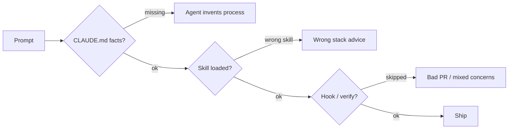

# 01 · Development Standards

**Goal:** Steer Claude Code + Cursor so agents follow iPix rules without stuffing everything into one giant `CLAUDE.md`.

**Depends on:** none  
**Unblocks:** all other process docs  
**Links:** [Anthropic steering guide](https://claude.com/blog/steering-claude-code-skills-hooks-rules-subagents-and-more) · [Karpathy skills](https://github.com/forrestchang/andrej-karpathy-skills) · existing `CLAUDE.md`, `.cursor/rules/`, `.claude/skills/`

---

## What goes where

| Primitive | Use for | iPix today | Add when |
|-----------|---------|------------|----------|
| **CLAUDE.md / AGENTS.md** | Always-on facts (stack, hard rules, ports) | ✅ Present | Keep lean; link out |
| **Cursor rules (`.cursor/rules/*.mdc`)** | Hard constraints (one concern, naming, ponytail) | ✅ Present | New hard gate only |
| **Skills (`.claude/skills/`)** | Procedural workflows loaded on demand | ✅ Many hubs | New repeatable playbook |
| **Hooks** | Deterministic gates (lint/block forbidden cmds) | Partial (pre-push) | Must-never-skip checks |
| **Commands / agents** | Slash flows, delegated research/test | Skills act as cmds | Subagents for research vs code |
| **MCP** | Live docs/APIs (Linear, Cloudflare, Sentry…) | ✅ Configured | Prefer MCP over guessing |

**Karpathy adapt (do not replace ponytail):** Think before coding · Simplicity first · Surgical changes · Goal-driven execution. Mirror as a short Cursor rule or skill note — **merge**, don't duplicate `ponytail.mdc`.

---

## Multistep prompt — audit & improve agent harness

```xml
<role>You are an iPix platform engineer auditing Claude Code + Cursor steering.</role>

<context>
Repo: lumina-studio. Canonical app: app/ (Next.js). Hard rules in CLAUDE.md + AGENTS.md.
Existing skills under .claude/skills/. Rules under .cursor/rules/.
Official guidance: CLAUDE.md = always-on facts; skills = procedures; hooks = deterministic.
</context>

<task>
1. Inventory CLAUDE.md, AGENTS.md, .cursor/rules, .claude/skills, hooks/pre-push.
2. Map each note from docs/process/ to the correct primitive (table above).
3. Flag duplication vs ponytail / lean / ipix-task-lifecycle.
4. Recommend ≤5 concrete additions (skill, rule, or hook) — no giant new docs in CLAUDE.md.
5. Propose one Stop/PostToolUse hook idea that reduces PR errors.
</task>

<constraints>
- Do not rewrite CLAUDE.md into a novel.
- One concern per recommendation.
- Prefer progressive disclosure (skill body loads on demand).
- Output short tables only.
</constraints>

<output_format>
| Finding | Evidence path | Classification | Action | Priority |
Then: Top 5 recommendations ranked by launch value.
</output_format>
```

---

## Multistep prompt — add one skill or rule

```xml
<role>You implement one steering improvement for iPix agents.</role>
<task>
1. Research: official Claude skills best practices + repo skill-creator pattern.
2. Search GitHub: forrestchang/andrej-karpathy-skills and 2 similar harness repos (last 30 days).
3. Draft SKILL.md or .mdc under 200 lines; description must state WHEN to trigger.
4. Wire discovery (skill frontmatter / Cursor alwaysApply or globs).
5. Smoke: invoke on a sample IPI task; confirm it loads and doesn't fight ponytail.
6. Docs-only or config-only PR — never mix with product code.
</task>
<constraints>YAGNI. No new dependency. No autoMode in repo settings.</constraints>
```

---

## Mermaid — failure points



---

## Done when

- [ ] Inventory table checked into this folder or Linear follow-up
- [ ] ≤5 harness changes filed as separate Linear tasks
- [ ] No process text dumped into always-on CLAUDE.md
