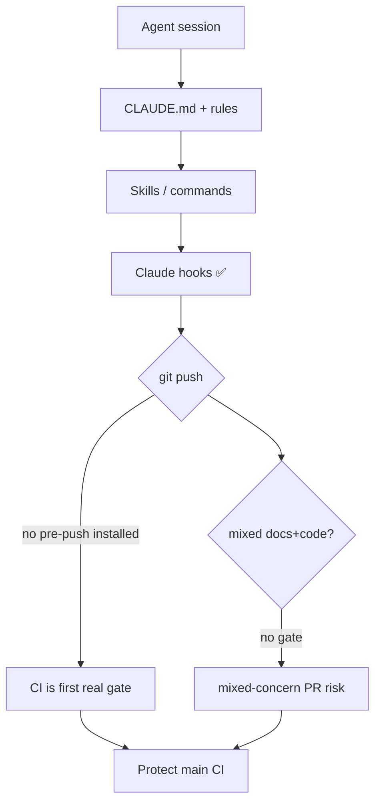

# 01 Harness Audit — Results

**Date:** 2026-08-03  
**Scope:** CLAUDE.md · AGENTS.md · `.cursor/rules` · `.claude/skills` · hooks · commands · agents  
**Method:** Inventory + evidence (no CLAUDE.md rewrite)

---

## Verdict

The harness is **already strong on Claude Code hooks and skills**, but **two documented safety nets are prose-only**: git **pre-push** (CLAUDE.md claims it runs typecheck+vitest; only `.sample` exists) and **one-concern / docs+code mix** (AGENTS.md #1 has no deterministic gate). Do **not** add Karpathy as a separate layer — `ponytail.mdc` already covers it. Wire `docs/process/` via a **skill/command**, not more always-on text.

---

## Inventory

| Primitive | Count / size | Status |
|-----------|--------------|--------|
| `CLAUDE.md` | 176 lines | ✅ Lean enough; facts + hard rules |
| `AGENTS.md` (root) | 248 lines | ✅ Project memory; overlaps CLAUDE somewhat |
| `app/AGENTS.md` | present | ✅ App-scoped |
| Cursor rules | 12 files (~1.4k lines total) | ✅; `lean.mdc` alone is 311 lines |
| Active skills | ~38 top-level | ✅ Rich; archive (~29) still under skills tree |
| Commands | ~23 under `.claude/commands/` | ✅ `/task`, `/pr`, `/verify-task`, etc. |
| Subagents | 5 under `.claude/agents/` | ✅ Focused reviewers |
| Claude hooks | 4 scripts + PreToolUse/Stop | ✅ Better than playbook assumed |
| Git pre-push | **missing** (only sample) | 🔴 Documented, not installed |
| Husky / prepare | none | 🔴 No install path for git hooks |
| Karpathy plugin | not installed | ⚪ Not needed — use ponytail |
| Linear MCP (this run) | needsAuth | ⚠️ Could not file Linear issues via MCP |

### Claude hooks (evidence: `.claude/settings.json`)

| Event | Script | Job |
|-------|--------|-----|
| PreToolUse Edit/Write | `guard-protected-writes.sh` | Block `.env` / `.infisical.json` edits |
| PreToolUse Edit/Write | `shared-fn-advisory.sh` | Advisory on shared fn edits |
| PreToolUse Bash | `block-local-supabase.sh` | Block `supabase start` / local DB |
| Stop | `verify-before-stop.sh` | typecheck + lint if `app/src` changed |

### Cursor rules

| Rule | Role | Overlap risk |
|------|------|--------------|
| `ponytail.mdc` | Smallest change / YAGNI | = Karpathy principles |
| `lean.mdc` | Full lifecycle orchestrator | Overlaps `lean` skill + `ipix-task-lifecycle` |
| `task-naming.mdc` / `pr-description.mdc` / `task-accuracy.mdc` | Hard quality gates | Keep |
| `graphify.mdc` | Query before broad reads | Keep |
| Domain MCP rules | Cloudflare, Mastra, Infisical, … | Keep |

---

## Findings

| Finding | Evidence path | Classification | Action | Priority |
|---------|---------------|----------------|--------|----------|
| Git pre-push documented but not installed | `CLAUDE.md` “Before pushing”; `.git/hooks/` only `*.sample`; no `.husky`; `docs/stack/reports/09-dev-system.md` | Confirmed gap | Install light pre-push (typecheck + changed tests) + `prepare` | P0 |
| One-concern / docs+code mix is prose-only | `AGENTS.md` #1; no hook/script gates mixed staged paths | Confirmed gap | Add deterministic check (pre-push or commit script) | P0 |
| Claude hooks already cover secrets, local Supabase, stop-verify | `.claude/settings.json`, `.claude/hooks/*` | Already fixed vs playbook “Partial” | Update playbook inventory wording | P2 |
| `lean.mdc` (always-on) duplicates lifecycle skill | `.cursor/rules/lean.mdc` 311 lines vs skills | Over-weight always-on | Slim rule → link skill; or agent-requestable | P1 |
| `docs/process/` not wired into harness | New folder; no skill/command pointer | Gap | Add thin skill or `/process` command | P1 |
| Platform-first / research-first not a hard skill step | Process docs 03; lifecycle has prompt eng but not ladder | Gap | Extend lifecycle Phase 2 or small skill snippet | P1 |
| Skills archive still discoverable | `.claude/skills/archive/` | Noise | Exclude from discovery / move out | P2 |
| Karpathy separate install | Would duplicate `ponytail.mdc` | Incorrect / unnecessary | Do not install; optional 4-line cross-ref in ponytail | P3 |
| CLAUDE ↔ AGENTS overlap (worktrees, graphify, gotchas) | Both files | Mild duplication | Leave for now; trim only if editing anyway | P3 |
| Linear follow-ups not auto-filed this run | Linear MCP `needsAuth` | Blocked | Human files 5 tasks below or re-auth MCP | — |

---

## Map `docs/process/` → primitive

| Process doc | Correct primitive | Do not put in |
|-------------|-------------------|---------------|
| 01 Development Standards | This audit artifact + skill `process` index | CLAUDE.md body |
| 02 Task Template | Extend `ipix-task-lifecycle` refs (already have spec/prompt eng) | New always-on rule |
| 03 AI Research | Skill step / Phase 2 of lifecycle | CLAUDE.md |
| 04 Testing & QA | Skill + `/verify-task` command (exists) | Duplicate rule |
| 05–08 UX/stack/agents/arch | On-demand skills or playbook runs | Always-on |
| 09 MVP Roadmap | `mvp` skill + `tasks/plan/todo.md` | CLAUDE.md |
| 10 Continuous improvement | Hooks + `pr-workflow` | Essays in CLAUDE.md |

---

## Top 5 recommendations (launch value)

| Rank | Addition | Type | Why |
|------|----------|------|-----|
| 1 | **Install git pre-push** matching CLAUDE.md (typecheck + tests; docs-only skip) | Hook (git) + `package.json` prepare | Stops “skip local test because hook will run” lie; fastest PR-error cut |
| 2 | **Mixed-concern gate** — fail if staged/pushed set spans `docs/` + `app/`/`supabase/` production paths | Hook (git pre-push or Claude PreToolUse on `git commit`) | Enforces AGENTS.md #1 deterministically |
| 3 | **Thin `/process` or `process` skill** pointing at `docs/process/README.md` + run-one-playbook rule | Skill / command | Progressive disclosure for new playbooks |
| 4 | **Research + platform-first checklist** in lifecycle Phase 2 (link playbook 03) | Skill edit | Stops custom-code-first PRs |
| 5 | **Slim `lean.mdc`** to decision ladder + links; keep full text in `lean` / `ipix-task-lifecycle` skills | Rule trim | Frees always-on context; less conflict |

### Proposed Stop/PostToolUse hook (PR errors)

**Prefer git pre-push mixed-concern check** over another Stop hook — Stop already runs typecheck/lint on `app/src`.  

**New hook idea:** on `git commit` / pre-push, scan changed paths:

```text
if (docs/** or *.md process docs) AND (app/src/** or supabase/migrations/** or services/**)
  → exit 2: "One concern: split docs PR from code PR"
```

That is the highest-ROI deterministic addition after installing pre-push itself.

---

## Mermaid — current failure points



---

## Parallel vs wait

| Can parallel | Must wait |
|--------------|-----------|
| Skill `/process` (docs/config) | — |
| Slim lean.mdc (rules-only PR) | Avoid same PR as pre-push install if you want clean review |
| Platform-first lifecycle edit | After 02/03 playbook agreement |
| Git pre-push install | Alone (CI/config concern) |
| Mixed-concern script | Can ship with pre-push or right after |

---

## Linear tasks to file (when MCP auth available)

1. **Install git pre-push gate** (CI/config) — Core MVP  
2. **Mixed docs/code concern hook** — Core MVP  
3. **Add process skill/command for `docs/process/`** — Post-MVP / process  
4. **Lifecycle Phase 2: research + platform-first** — Core for agent quality  
5. **Slim lean.mdc always-on surface** — Post-MVP efficiency  

---

## Done checklist (playbook 01)

- [x] Inventory table checked into this folder  
- [x] ≤5 harness changes identified (file as separate Linear tasks / PRs)  
- [x] No process text dumped into always-on CLAUDE.md  
