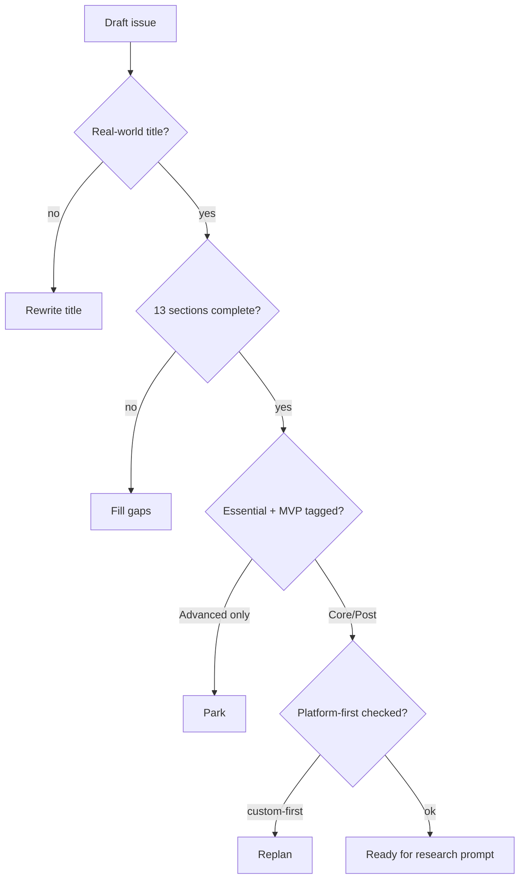

# 02 · Task Template

**Goal:** Every Linear IPI issue is clear, real-world, and executable as a multistep agent prompt.

**Depends on:** [01](./01-development-standards.md)  
**Reuse:** `.claude/skills/ipix-task-lifecycle/references/linear-spec-template.md` + `linear-prompt-engineering.md`  
**Do not:** invent a second SSOT — extend the existing template sections below.

---

## Required sections (every issue)

| # | Section | What to write |
|---|---------|---------------|
| 1 | Purpose | One sentence outcome |
| 2 | Real-world iPix example | Named screen / persona / workflow (Brand Hub, Planner, booking…) |
| 3 | User journey | Before → during → after |
| 4 | Business value | Why launch care |
| 5 | MVP stage | **Core MVP** · **Post-MVP** · **Advanced** |
| 6 | Dependencies | Blocks / blocked-by / parallel OK? |
| 7 | Platform-first plan | Dashboard → CLI → docs → examples → reuse → custom |
| 8 | AI research prompt | Paste from [03](./03-ai-research-playbook.md) |
| 9 | Implementation prompt | Multistep A→E with `proof:` commands |
| 10 | Tests | Unit / typecheck / verify matrix rows |
| 11 | Real-world validation | Local :3002 + ipix.co + Chrome/Playwright |
| 12 | Quality score | Priority · complexity · risk · user value · launch value (1–5) |
| 13 | Merge checklist | One concern · CI green · no secrets · docs/code split |

**Title format:** `IPI-NNN · SPEC — Plain English real-world title`  
Bad: `Fix embeddings` · Good: `IPI-492 · CF-AI-004c — Clear errors when brand-matching embeddings fail`

---

## Grade before coding

| Question | Fail → |
|----------|--------|
| Essential for launch? | Defer |
| Already exists in repo/dashboard? | Close / reuse |
| Over-engineering? | Cut scope |
| Duplicate Linear issue? | Merge |
| Better GitHub/template/SDK? | Platform-first |

---

## Multistep prompt — rewrite one Linear issue

```xml
<role>You rewrite Linear issues into executable iPix agent prompts.</role>

<context>
Product: iPix / Lumina Studio — fashion/DTC operators on /app.
Stack: Next.js app/, Supabase remote-only, Mastra, CopilotKit v2.
Naming: IPI-NNN · SPEC — Plain English title.
SSOT: docs/linear/issues/IPI-*.md
</context>

<task>
1. Load issue IPI-NNN (Linear MCP or docs/linear/issues).
2. Score: priority, complexity, risk, user value, launch value (1–5). Classify MVP stage.
3. Rewrite title to real-world operator language.
4. Fill all 13 template sections; keep short.
5. Add Mermaid: current vs proposed flow + failure points.
6. Mark parallel / blocked / launch-blocker.
7. Sync docs/linear/issues + Linear description (script or MCP).
</task>

<constraints>
- One concern per issue/PR.
- Custom code last on platform-first ladder.
- No bare IDs in titles without SPEC + English.
- Output length: scannable tables, not essays.
</constraints>

<output_format>
Verdict · Scores table · Rewritten issue markdown · Mermaid · Open questions
</output_format>
```

---

## Multistep prompt — batch triage backlog

```xml
<task>
1. List open IPI issues (P0/P1).
2. For each: MVP stage + parallelizable? + launch blocker?
3. Flag over-engineered or duplicate.
4. Propose next 5 ship order.
</task>
<output_format>| ID · Title | Stage | Parallel | Blocker | Action |</output_format>
```

---

## Mermaid — task quality gate



---

## Done when

- [ ] Template linked from Linear project / skill Phase 1
- [ ] Next 5 active issues rewritten to this shape
