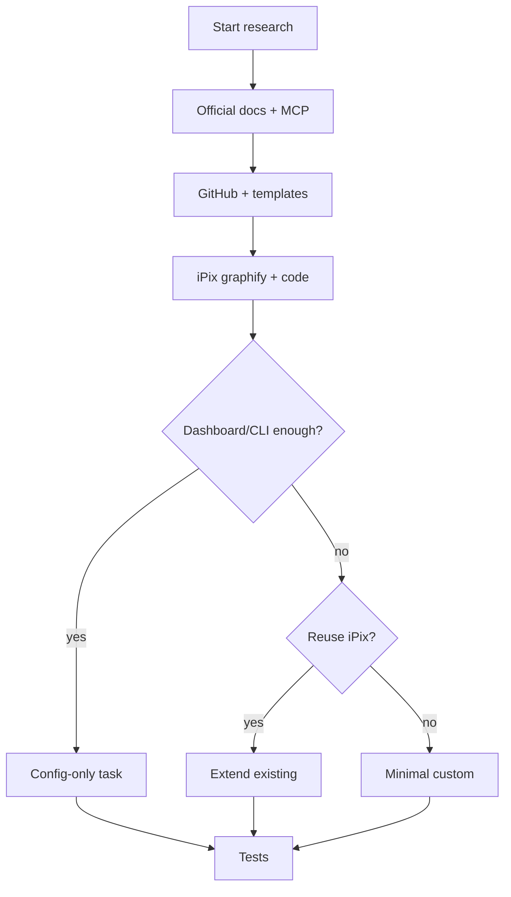

# 03 · AI Research Playbook

**Goal:** Before any code, agents find the simplest correct approach using official docs, GitHub, templates, and existing iPix code.

**Depends on:** [02](./02-task-template.md)  
**Rule:** Research → recommend → only then implement. Custom code is last.

---

## Standard research order

1. Official docs (vendor + MCP when available)
2. GitHub production examples / last-30-days repos
3. Templates, starter kits, recipes, blogs
4. Current iPix implementation (`graphify` then targeted reads)
5. Dashboard / CLI / managed feature
6. Reuse existing iPix helpers
7. Smallest custom code
8. Explain why; list rejected heavier options

---

## Multistep prompt — research any IPI task

```xml
<role>You are a staff engineer researching the best implementation for one iPix task. Do not write production code yet.</role>

<context>
Task: IPI-NNN · SPEC — {title}
Surfaces: operator /app, Mastra agents, Supabase, Cloudflare AI gateway (as applicable).
Platform-first ladder: Dashboard → CLI → docs → GitHub → templates → SDK → reuse → custom.
</context>

<task>
1. Read official docs for every vendor this task touches.
2. Web search + GitHub search (examples, templates, recipes; prefer last 30 days).
3. graphify query / explain / affected for related symbols.
4. Inspect whether Dashboard/CLI/API already solves it.
5. Compare 2–3 approaches: effort, risk, launch value.
6. Recommend ONE approach with rationale.
7. List files likely to change; non-goals; test plan hooks for playbook 04.
8. Grade: required? MVP stage? over-engineering? duplicate?
</task>

<constraints>
- No code until recommendation approved or task says implement.
- Prefer managed/platform over custom.
- Cite URLs and repo paths.
- Keep answer under ~1 page equivalent: tables + short bullets.
</constraints>

<output_format>
## Verdict
## Evidence (docs / GitHub / iPix paths)
## Options compared
## Recommended approach
## Platform-first checklist
## Risks / blockers
## Suggested implementation steps (A–E)
## Quality scores (1–5)
</output_format>
```

---

## Multistep prompt — find reusable patterns

```xml
<task>
1. Search repo for existing helpers matching the need.
2. Search vendor dashboard features and CLI.
3. Search GitHub for {topic} + Next.js 16 / Workers / Supabase / Mastra as relevant.
4. Return: reuse | configure | small custom — with evidence.
</task>
```

---

## Mermaid — research gate



---

## Done when

- [ ] Research prompt pasted into Linear section 8 by default
- [ ] Agents cite evidence before opening an implementation PR
