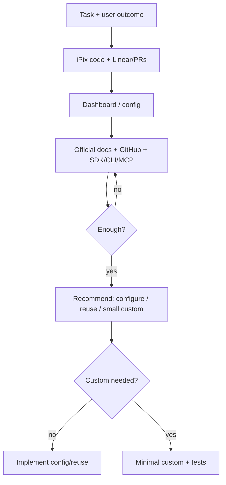

# 03 · AI Research Playbook

**Purpose:** Every agent researches before coding so iPix ships the simplest safe solution — reuse first, custom last.

**Skill:** `.claude/skills/ai-research/` · **Command:** `/research` · **Related:** `/efficient` (rank approaches) · lifecycle Phase 2 (`research.md`)

**Rule:** No production code until a research report with a recommendation exists (skip only ≤3-file trivial edits with a known pattern).

---

## Research workflow (order)

| Step | Do |
|------|-----|
| 1 | Understand task + **user outcome** (Operator/Engineer journey) |
| 2 | Inspect **current iPix codebase** (`graphify` → targeted reads) |
| 3 | Check related **Linear issues** + **GitHub PRs** |
| 4 | Review **dashboards / platform config** (CF, Supabase, Infisical, Stripe…) |
| 5 | Read **official documentation** (MCP when available) |
| 6 | Search **official GitHub** examples, templates, recipes (prefer last 30 days) |
| 7 | Review **SDK / CLI / API / MCP / prebuilt modules** |
| 8 | **Compare** 2–3 options |
| 9 | Recommend the **smallest** solution |
| 10 | Write **custom code only** if existing options are insufficient |



---

## Source priority

| Priority | Source | Trust |
|----------|--------|-------|
| 1 | iPix repo (`app/`, `supabase/`, `services/cloudflare-worker/`) | Highest for “what we do” |
| 2 | Linear specs + open/merged PRs | Intent + prior art |
| 3 | Vendor Dashboard / CLI / live config | Highest for managed features |
| 4 | Official docs + official GitHub orgs | Best practice |
| 5 | Templates / recipes / MCP tools | Patterns |
| 6 | Third-party blogs / random repos | Lowest — corroborate |
| 7 | Model memory | Unverified until cited |

---

## Search checklist (per task)

- [ ] User outcome in one sentence  
- [ ] `graphify query` / `explain` / `affected`  
- [ ] `rg` / existing helpers in `app/` · `supabase/` · worker  
- [ ] Linear IPI + sibling issues  
- [ ] `gh pr list` / related merged PRs  
- [ ] Dashboard/CLI for touched vendors  
- [ ] Official docs (URLs)  
- [ ] Official examples/templates/recipes  
- [ ] MCP tools usable for this vendor  
- [ ] 2–3 options compared  
- [ ] MVP stage: Core · Post-MVP · Advanced  
- [ ] Duplicate / low-value work flagged  

### Platforms (search only what the task touches)

| Platform | Prefer first |
|----------|----------------|
| Claude Code / Cursor | Skills, hooks, rules — not new always-on CLAUDE.md |
| GitHub | Examples + our PRs |
| Linear | Issue AC + template |
| Cloudflare Workers / hosting | Dashboard → Wrangler → Workers AI → custom Worker |
| Supabase | Dashboard → CLI → RLS recipes → migration |
| Mastra / CopilotKit | Official modules + existing `app/src/mastra` |
| Playwright | Existing e2e patterns before new harness |
| Infisical | `infisical run` — never commit secrets |
| Stripe | Dashboard + official SDK; COM track |
| Postiz / Xpoz | Research candidates — extend Firecrawl/existing before new vendors |

---

## Decision rules

| If… | Then… |
|-----|--------|
| Dashboard/CLI solves it | Config-only task — no app PR |
| Helper already in iPix | Extend — don’t rewrite |
| Official template/SDK covers 80% | Adopt — thin adapter only |
| Duplicate Linear/PR exists | Merge/close — don’t re-build |
| Launch value low + Advanced | Park |
| Custom needed | Smallest diff; one concern; tests named |

**Platform-first implement order (after research):**  
Dashboard → CLI → Existing code → Docs → SDK → GitHub → Templates → Small custom → Tests → Browser → PR

---

## Evidence requirements

Every claim in the report needs one of:

- Repo path (`app/src/...:line` or symbol)  
- Linear/PR URL or ID with full title  
- Official doc URL  
- CLI/Dashboard observation (what you ran/saw)  

No bare “best practice” without a source.

---

## Required research report (output)

```markdown
## Research report — IPI-NNN · TASK-ID — Title (YYYY-MM-DD)

**User outcome:** …
**MVP stage:** Core | Post-MVP | Advanced
**Verdict:** configure | reuse | small custom | defer | duplicate

| Section | Finding |
|---------|---------|
| What already exists | … |
| What can be reused | … |
| Official best practice | … (URL) |
| Relevant GitHub examples | … |
| Recommended implementation | … |
| Alternatives considered | … |
| Risks and blockers | … |
| Tests required | … |
| Why custom is / isn’t needed | … |

**Stop research:** yes/no — reason
**Next:** implement A→E | blocked on … | file follow-up
```

Full template: `.claude/skills/ai-research/references/report-template.md`

---

## Example (short) — iPix

**Task:** Clear errors when brand-matching embeddings fail  

| Section | Finding |
|---------|---------|
| Exists | Cloudflare worker embed path + validation helpers |
| Reuse | Existing error envelope patterns in worker |
| Official | Workers / AI Gateway error handling docs |
| GitHub | Prior iPix PRs hardening embed 400 vs 502 |
| Recommend | Validate input → 400; don’t treat as gateway down |
| Alternatives | New logging service (rejected — overkill) |
| Risks | Clients assuming 502 means outage |
| Tests | Worker vitest bad payload → 400 |
| Custom? | Minimal — only if validation gap confirmed |

**Verdict:** small custom · **Core** · Stop research → code.

---

## When to stop researching and start coding

Stop when **all** are true:

1. User outcome is clear  
2. At least one evidence-backed recommendation  
3. Top alternative rejected with reason  
4. Tests named  
5. MVP stage set  
6. No open blocker that research can resolve (else **blocked**)  

**Do not** research forever: max ~1 page report; time-box unfamiliar vendors to docs + one official example.

---

## Multistep prompt

```xml
<role>You are an iPix staff engineer. Research only — no production code yet.</role>
<task>
Follow docs/process/03-ai-research-playbook.md steps 1–10.
Cover only platforms this task touches.
Output the required research report table.
Classify Core / Post-MVP / Advanced.
Reject unnecessary custom code and duplicates.
</task>
<constraints>Cite evidence. Concise tables. Prefer official sources.</constraints>
```
