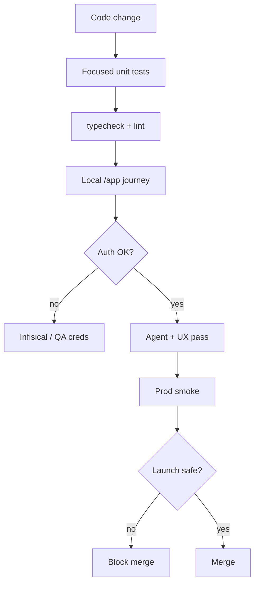

# 04 · Testing & QA Playbook

**Goal:** Prove each task works in the real iPix journey (local + production), then list UX/agent fixes — not only unit green.

**Depends on:** [02](./02-task-template.md)  
**Credentials:** QA email `qa@ipix.test` · password from Infisical / `.env.local` `QA_PASSWORD` (never commit). Dev server **:3002**.

---

## What to test (every user-facing task)

| Layer | Where | Tools |
|-------|-------|-------|
| Unit / type | `app/` | vitest, typecheck, lint |
| Local journey | localhost:3002 | Playwright, MCP Chrome, agent-browser |
| Production | https://ipix.co | Read-only probes; careful auth |
| Auth to /app | Session via QA user | Infisical secrets for local; never paste prod keys in chat |
| Agent | CopilotKit + Mastra | Chat tool calls, draft-only writes |
| UX | Desktop + mobile | Journey clarity, empty/error states |
| Failure | Bad input, 401, RLS deny | Expect clear errors |

**Secrets for agents:** Infisical (`infisical run --env=dev --`) for local. GitHub Actions / Cloudflare secrets for CI/deploy — not for interactive browser login. Prefer QA test account over personal accounts.

---

## Multistep prompt — real-world validation

```xml
<role>You are a QA engineer for iPix. Validate one task end-to-end, then recommend fixes.</role>

<context>
Task: IPI-NNN · {title}
Local: http://localhost:3002 — free port 3002, do not switch ports.
Prod: https://ipix.co (smoke only unless told otherwise).
Login: qa@ipix.test + QA_PASSWORD from Infisical/.env.local.
Skills: Playwright / MCP Chrome / testing skills as available.
</context>

<task>
1. Confirm acceptance criteria and user journey from the Linear issue.
2. Start or use local app; authenticate to /app with QA credentials.
3. Walk the happy path on desktop, then mobile viewport.
4. Probe error cases (empty, invalid, unauthorized).
5. If agent-related: send 2–3 real prompts; check tools, drafts, HITL.
6. Optional smoke on ipix.co for the same surface (no destructive actions).
7. Capture: problems, UX improvements, agent improvements.
8. Map each finding → severity → suggested fix task (do not expand scope silently).
</task>

<constraints>
- No production data mutation.
- No secrets in screenshots/logs committed to git.
- Prefer evidence (screenshot path, console error, network status).
</constraints>

<output_format>
| Step | Result | Evidence |
| Problems | Severity | Fix suggestion |
| UX / Agent recommendations |
| Merge verdict: pass / blocked |
</output_format>
```

---

## Multistep prompt — pre-merge verify

```xml
<task>
1. Run verify-matrix rows for touched paths (pr-workflow skill).
2. Confirm one concern in the PR (no docs+code mix).
3. Confirm tests cover new behavior; no weakened asserts.
4. List residual risks honestly (Unit / Build / Local Runtime / Preview / Production).
</task>
```

---

## Mermaid — test failure points



---

## Done when

- [ ] Every shippable Linear issue has section 11 filled
- [ ] Agents produce Problems / Improvements / Suggestions after real-world test
