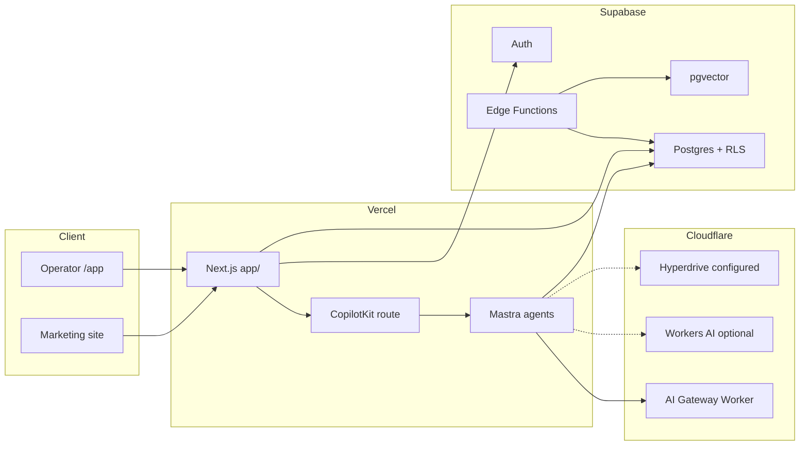
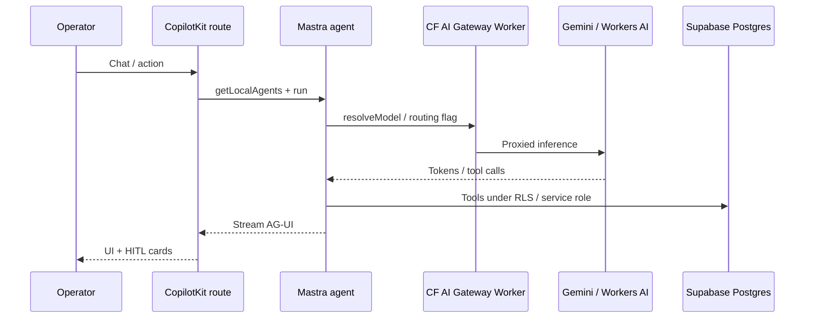
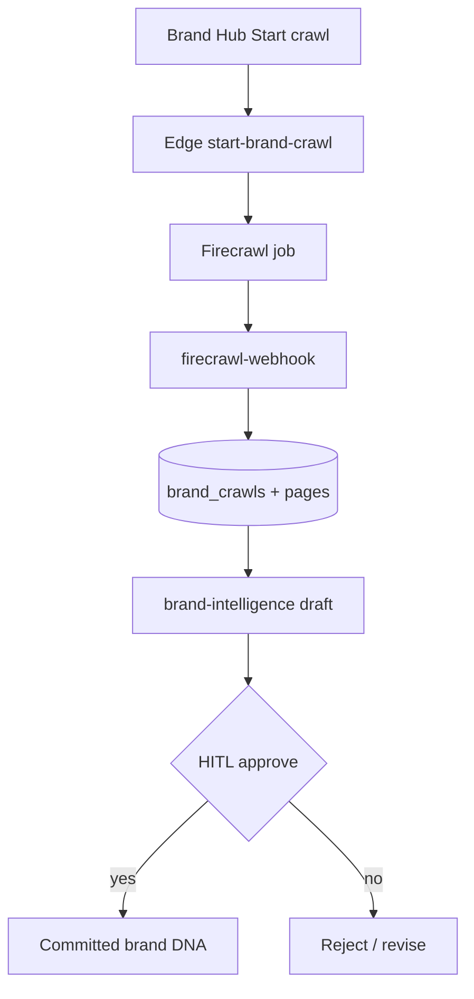
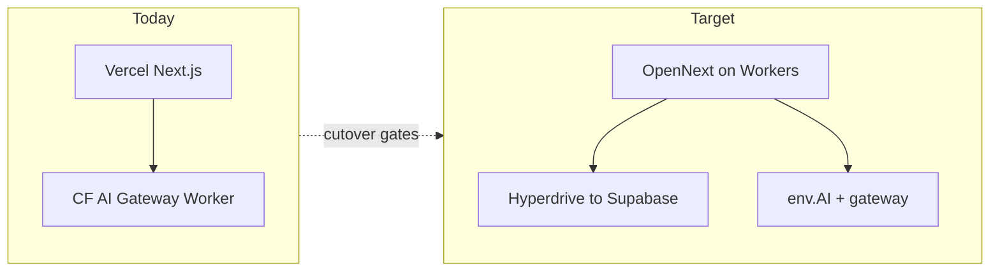

# 06 · Tech Stack Playbook

**As of:** August 2026 · **Evidence standard:** ✅ verified in repo / runtime docs · 🟡 recommendation (not yet shipped) · ⚪ research candidate (no iPix impl)

**Goal:** Keep the iPix stack launchable — prefer Dashboard, CLI, SDK, MCP, and existing modules over custom code.

**Depends on:** [03 · AI Research](./03-ai-research-playbook.md) · [04 · Testing & QA](./04-testing-qa-playbook.md)  
**Deep dives:** [`tech-stack/`](./tech-stack/) · **CF SSOT:** `tasks/cloudflare/todo.md`

**Legend for every tool:** **Keep / Improve / Replace / Remove** · **MVP / Post-MVP / Advanced**

---

## 1. Executive summary

iPix already has a working operator core: **Next.js on Vercel**, **Supabase Auth + Postgres + RLS + Edge Functions**, **Mastra agents** (9 + `default` alias), **CopilotKit v2** chat, and a **production Cloudflare AI Gateway Worker** for AI traffic. The whole-app OpenNext cutover is **not** live; Hyperdrive is **configured but not organic**; pgvector exists for brand/context similarity but **product RAG is thin**; Firecrawl powers brand crawl; Stripe lives in **Mercur/B2C**, not `/app`.

**What is working (✅):** Operator app on Vercel; AI Gateway Worker as live AI path; Gemini via Mastra `resolveModel`; CopilotKit ↔ Mastra wiring; Supabase remote-only + RLS culture; Firecrawl brand crawl; HITL gates on shoot wizard / brand-intelligence approve.

**What is missing or half-done (✅ gaps):** Hosting cutover safety (rollback, observability, smoke, branch protection); Hyperdrive organic traffic; native Workers AI agent flips behind flags; Mastra Memory/evals/RAG adoption; CopilotKit `useHumanInTheLoop` vs custom HITL cards; semantic model-match; social publish; CRM/support inbox (WhatsApp/Chatwoot); marketplace Stripe Connect depth for operator billing.

**Best improvement style:** Finish Cloudflare cutover gates and Hyperdrive before new AI vendors. Extend Firecrawl before Apify. Keep Gemini for tool-heavy agents; use Workers AI + AI Gateway only where flags/smoke allow (`public-marketing` / `fast` first). Park Postiz, OpenClaw, Xpoz, Chatwoot until Core MVP journeys are green.

| Verdict | Action |
|---------|--------|
| Do next | Cutover safety · Hyperdrive canary → organic · embedding/RAG health · one agent native flip |
| Do later | Postiz social · Chatwoot/WhatsApp · Stripe operator billing · Mastra evals |
| Don't do now | Parallel crawl stack (Apify + Firecrawl) · OpenClaw as product runtime · custom gateway features · Vite `src/` |

---

## 2. Current stack map

| Layer | Product | iPix path | Live? |
|-------|---------|-----------|-------|
| Operator UI / API | Next.js 16 on **Vercel** | `app/` | ✅ `ipix.co/app` |
| Legacy UI | Vite React | `src/` | 🔴 retiring — do not extend |
| Agents | Mastra `@mastra/core` ~1.41 | `app/src/mastra/` | ✅ |
| Chat runtime | CopilotKit v2 ~1.61 | `app/src/app/api/copilotkit/` | ✅ |
| Models | Gemini (+ Groq/gateway flags) | `app/src/lib/ai/provider` · `resolveModel` | ✅ Gemini default |
| AI proxy | Cloudflare AI Gateway Worker | `services/cloudflare-worker/` | ✅ prod path; frozen for features |
| Hosting target | OpenNext / Workers | `app/wrangler.jsonc` | 🟡 preview proven; cutover blocked |
| DB / Auth | Supabase Postgres + Auth | `supabase/` remote `nvdlhrodvevgwdsneplk` | ✅ |
| Edge jobs | Supabase Edge Functions | `supabase/functions/` | ✅ brand crawl, DNA, leads |
| Vectors | pgvector `vector(768)` | brands / context / talent migrations | 🟡 RPCs exist; RAG product thin |
| Crawl | Firecrawl | edge `firecrawl-webhook`, `start-brand-crawl` | ✅ |
| Commerce | Mercur Medusa + Stripe | `my-marketplace/`, `b2c-storefront/` | ✅ separate Postgres |
| Secrets | Infisical | `infisical run --env=dev` | ✅ |
| Agent harness | Claude Code + Cursor | `.claude/`, `.cursor/rules/` | ✅ |



---

## 3. Tool-by-tool review

For each tool: **Purpose · Current setup · Core · Advanced · Latest updates · Benefits/limits · Security/cost · Gaps · Use cases · Integrations · Links · Class · Recommendation**.

### 3.1 Cloudflare Workers / Hosting / AI Gateway / Workers AI / Hyperdrive

| Field | Content |
|-------|---------|
| **Purpose** | Edge AI routing, future app hosting, DB pooling for Mastra storage |
| **Current setup (✅)** | App on **Vercel**. Custom Worker `services/cloudflare-worker/` is **production AI path**, frozen for new features (delete last via IPI-592). Native path: `env.AI.run()` + gateway `ipix-prod`. Hyperdrive `HYPERDRIVE_FRESH` / `ipix-supabase-fresh` in Wrangler; organic traffic still mostly `MASTRA_STORAGE_MODE=noop`. Cutover ~70% arch/preview; safety gates ~0% (IPI-708/709/707/763). |
| **Core features** | Workers bindings, AI Gateway logging/caching/limits, Wrangler, OpenNext preview |
| **Advanced** | Dynamic model routes, Unified Billing, DO/Queues for agents, full DNS cutover |
| **Latest (Aug 2026, docs ✅)** | Unified AI Gateway REST; spend limits; Workers AI catalog adds Kimi K2.6/K2.7, Gemma 4, GLM flash, tool-calling models |
| **Benefits / limits** | Gateway observability without rewriting agents; OpenNext cutover still blocked on rollback/obs/smoke/protection |
| **Security / cost** | Gateway auth (IPI-595 evidence exists); Workers AI + Gemini spend via gateway; don't expose CF tokens client-side |
| **Gaps** | Cutover gates; Hyperdrive organic; per-agent native flips need `getCloudflareContext().env` (IPI-750 note) |
| **Best use cases** | Proxy all LLM calls; cache marketing `fast`; pool Mastra Postgres via Hyperdrive |
| **Integrations** | Mastra `resolveModel` + `AI_ROUTING_AGENT_*`; Infisical secret sync workflow |
| **Docs / GitHub** | [Workers](https://developers.cloudflare.com/workers/) · [AI Gateway](https://developers.cloudflare.com/ai-gateway/) · [Workers AI models](https://developers.cloudflare.com/workers-ai/models/) · [Hyperdrive](https://developers.cloudflare.com/hyperdrive/) · [OpenNext CF](https://opennext.js.org/cloudflare) |
| **Class** | Gateway = **MVP** · Cutover completion = **MVP** · Full Workers AI fleet = **Post-MVP** · Queues/DO agents = **Advanced** |
| **Rec** | **Keep** gateway path · **Improve** cutover + Hyperdrive · **Replace** custom Worker only after native parity (IPI-592 last) · **Remove** nothing until cutover |

**Best Cloudflare AI models per iPix agent (🟡 recommendation — validate with smoke before flipping flags):**

| Agent | Job | Prefer now (✅) | CF / gateway trial (🟡) |
|-------|-----|-----------------|-------------------------|
| `public-marketing` | Fast chat, low tools | Gemini `fast` | Workers AI flash / Gemma-class via gateway |
| `production-planner` | Tools + structured shot lists | Gemini `default` | Only after tool-call smoke; Kimi K2.x if native tools pass |
| `creative-director` | Briefs, creative judgment | Gemini `default` | Same as planner |
| `visual-identity` | Vision | Gemini `vision` | Multimodal CF model only after parity tests |
| `brand-intelligence` | Crawl synthesis | Gemini `default` / structured | Gateway logging; keep Gemini until eval |
| `social-discovery` | Structured social | Gemini `structured` | Flash OK if schema adherence holds |
| `model-match` | Talent matching | Gemini `default` | Later + pgvector; not CF-first |
| `crm-assistant` | CRM tools | Gemini `default` | Defer native |
| `booking` | Draft-only booking | Gemini `default` | Defer native — trust boundary |

Flags SSOT: `app/src/lib/ai/agent-routing-keys.mjs` (`AI_ROUTING_AGENT_*`).

---

### 3.2 Supabase (Auth, Postgres, Realtime, Edge, Storage)

| Field | Content |
|-------|---------|
| **Purpose** | Source of truth for brands, shoots, CRM metadata, auth, edge AI jobs |
| **Current (✅)** | Remote-only policy; Auth PKCE → `/app`; RLS required; Edge: `brand-intelligence`, `audit-asset-dna`, `start-brand-crawl`, `firecrawl-webhook`, `capture-lead`, `health` |
| **Core** | Auth, Postgres, RLS, migrations, Edge Functions, Storage for assets |
| **Advanced** | Realtime subscriptions, Queues, Cron (`pg_cron`), Advisors, Branching |
| **Latest** | Keep using Dashboard advisors + `npm run supabase:verify-rls`; avoid local Docker replay |
| **Benefits / limits** | Strong multi-tenant story; historical migrations don't replay cleanly locally |
| **Security / cost** | Service role only on server/edge; RLS bugs = cross-brand data leaks; Realtime fan-out cost |
| **Gaps** | Realtime underused in operator UI; queues/cron ad hoc; observability = verify scripts + Sentry (if wired) |
| **Use cases** | Login, brand hub crawl state, shoot drafts, DNA audit, lead capture |
| **Integrations** | Mastra `@mastra/pg`, Hyperdrive, Edge + Gemini, CopilotKit server clients |
| **Docs** | [Supabase docs](https://supabase.com/docs) · [RLS](https://supabase.com/docs/guides/auth/row-level-security) · [Edge](https://supabase.com/docs/guides/functions) |
| **Class** | Auth/RLS/Edge = **MVP** · Realtime UX = **Post-MVP** · Queues/Cron platformization = **Post-MVP** |
| **Rec** | **Keep** · **Improve** RLS verify + Realtime for crawl progress · **Replace** nothing with another BaaS |

---

### 3.3 Mastra

| Field | Content |
|-------|---------|
| **Purpose** | Server-side agent registry, tools, workflows, memory for operator AI |
| **Current (✅)** | Agents: `production-planner`, `creative-director`, `brand-intelligence`, `booking`, `crm-assistant`, `model-match`, `social-discovery`, `visual-identity`, `public-marketing` (+ `default`). Packages: `@mastra/core`, `@mastra/memory` (alpha), `@mastra/pg`, `@mastra/observability`. Never call `getMastra()` at route module top-level. |
| **Core** | Agents, tools, instructions, model resolution, org-scoped `resourceId` |
| **Advanced** | Workflows, Memory layers, RAG modules, evals, observability exporters |
| **Latest (docs ✅)** | Agent networks, workflow suspend/resume, memory processors, RAG/chunk/embed helpers, eval scorers |
| **Benefits / limits** | One registry = CopilotKit IDs; Memory alpha — treat carefully in prod |
| **Security / cost** | Tools mutate via HITL; DB URL at build time gotcha; token cost per agent |
| **Gaps** | Product RAG not fully on Mastra RAG; evals not default CI; workflows uneven vs shoot HITL pages |
| **Use cases** | Planner shot lists, creative briefs, CRM drafts, booking drafts, marketing widget |
| **Integrations** | CopilotKit `MastraAgent.getLocalAgents()`, CF gateway, Supabase |
| **Docs / GitHub** | [mastra.ai](https://mastra.ai/docs) · [github.com/mastra-ai/mastra](https://github.com/mastra-ai/mastra) |
| **Class** | Agents/tools = **MVP** · Memory/observability harden = **MVP** · Evals/RAG depth = **Post-MVP** |
| **Rec** | **Keep** · **Improve** memory resource scoping + obs · don't add parallel agent frameworks |

---

### 3.4 CopilotKit

| Field | Content |
|-------|---------|
| **Purpose** | Operator chat UI, AG-UI streaming, actions, shared state, human approval |
| **Current (✅)** | v2 imports `@copilotkit/react-core/v2`, `@copilotkit/runtime/v2`; route `api/copilotkit`; Mastra bridge `@ag-ui/mastra`. Custom HITL: shoot wizard gates, brand-intelligence approve API, approval-card components. |
| **Core** | Chat, agent switch by id, backend actions, streaming |
| **Advanced** | `useHumanInTheLoop`, shared state (`useCoAgentState` / v2 equivalents), generative UI, A2UI |
| **Latest (docs ✅)** | AG-UI/SSE focus; HITL hooks; Mastra integration recipes |
| **Benefits / limits** | Fast operator UX; v1 imports break build (lint guard) |
| **Security / cost** | Actions are server trust boundary; don't put AI keys in client |
| **Gaps** | Mix of custom HITL vs CopilotKit HITL primitives; shared brand/shoot context not always automatic |
| **Use cases** | Sidebar chat on Brand Hub, shoots, CRM, marketing widget |
| **Integrations** | Mastra agents; approval cards; page context readables |
| **Docs** | [docs.copilotkit.ai](https://docs.copilotkit.ai) · [github.com/CopilotKit/CopilotKit](https://github.com/CopilotKit/CopilotKit) |
| **Class** | Chat + actions = **MVP** · Standardize HITL on CK primitives = **Post-MVP** |
| **Rec** | **Keep** v2 · **Improve** shared state + HITL consistency · **Replace** never with v1 |

---

### 3.5 pgvector and RAG

| Field | Content |
|-------|---------|
| **Purpose** | Semantic search for brands, context snapshots, later talent/assets |
| **Current (✅)** | `vector(768)` + RPCs e.g. `search_brands`, `search_context_snapshots`; embeddings via AI gateway path; model-match still largely filter-based |
| **Core** | Embed on write, similarity RPC, RLS-safe search |
| **Advanced** | Full RAG chat, rerankers (Workers AI bge-reranker), hybrid BM25+vector, Mastra RAG pipelines |
| **Benefits / limits** | High value for “find similar brand/asset”; cost + stale embeddings risk |
| **Gaps** | No end-to-end product RAG for campaigns/talent/shoots/CRM memory |
| **RAG value by domain (🟡)** | Brand DNA ✅ high · Market research 🟡 · Campaigns 🟡 · Talent 🟡 · Shoots (refs) 🟡 · CRM timeline 🟡 |
| **Docs** | [Supabase pgvector](https://supabase.com/docs/guides/database/extensions/pgvector) · Mastra RAG docs |
| **Class** | Healthy embeddings + brand search = **MVP** · Domain RAG packs = **Post-MVP** · Rerank/hybrid = **Advanced** |
| **Rec** | **Keep** vectors · **Improve** brand/context retrieval UX · don't build custom vector DB |

---

### 3.6 Postiz

| Field | Content |
|-------|---------|
| **Purpose** | Multi-network social scheduling / publishing |
| **Current** | ⚪ Not integrated in operator app |
| **Core** | Schedule posts, calendars, multi-account |
| **Advanced** | MCP/CLI/OpenClaw skills, team workflows |
| **Latest (✅ docs/search)** | OSS scheduler with MCP/CLI hooks (2026) |
| **Gaps** | iPix social-discovery drafts ≠ publish |
| **Use cases** | After Creative Director / social-discovery approve → schedule IG/TikTok/LinkedIn |
| **Alt** | Native Meta/TikTok APIs, Buffer, Late |
| **Class** | **Post-MVP** |
| **Rec** | **Defer** · evaluate MCP/API before custom publisher · **Improve** only after draft→approve path exists |

---

### 3.7 OpenClaw

| Field | Content |
|-------|---------|
| **Purpose** | Personal/local autonomous assistant across chat channels + MCP |
| **Current** | ⚪ Not part of iPix product runtime |
| **Core** | Local gateway, messaging channels, skills |
| **Advanced** | MCP client/server, Interactive MCP Apps (Aug 2026) |
| **Fit** | Engineer automation / ops bot — **not** a replacement for Mastra in `/app` |
| **Risks** | Skill supply-chain; overlapping agent runtimes confuse ownership |
| **Class** | **Advanced** (internal tooling only) |
| **Rec** | **Do not** put in product MVP · optional eng MCP bridge later · **Keep** Mastra as product SSOT |

Docs: [openclaw.ai](https://openclaw.ai) · [github.com/openclaw/openclaw](https://github.com/openclaw/openclaw)

---

### 3.8 Apify

| Field | Content |
|-------|---------|
| **Purpose** | Actor marketplace for scraping / datasets |
| **Current** | ⚪ Not core; Firecrawl covers brand crawl |
| **When to use** | Actor that Firecrawl cannot cover (specialized social graphs, map data) |
| **Class** | **Post-MVP** / exception-only |
| **Rec** | **Defer** · extend Firecrawl first · avoid dual crawl stacks |

---

### 3.9 AI models and providers

| Field | Content |
|-------|---------|
| **Purpose** | Inference for agents, embeddings, vision |
| **Current (✅)** | Default Gemini via `@ai-sdk/google`; Groq + openai-compatible gateway paths exist; per-agent routing keys |
| **Core** | `resolveModel(tier)` · server-only keys · gateway logging |
| **Advanced** | A/B via AI Gateway dynamic routes; Workers AI catalog; Unified Billing |
| **Rec** | **Keep** Gemini for tool agents · **Improve** gateway observability · trial CF models on `public-marketing` only |

---

### 3.10 MCP (Model Context Protocol)

| Field | Content |
|-------|---------|
| **Purpose** | Standard tool bridge for Cursor/Claude/Cloudflare/Linear/etc. |
| **Current (✅)** | Cursor MCP: Linear, Cloudflare docs/bindings, Sentry, Cloudinary, AWS, cursor-cloud. Linear often `needsAuth` in Cloud agents. |
| **Core** | Read docs, Linear issues, CF bindings, Sentry debug |
| **Advanced** | Expose iPix tools as MCP server; OpenClaw MCP apps |
| **Class** | Harness = **MVP** · Product MCP server = **Advanced** |
| **Rec** | **Keep** · **Improve** auth reliability · don't invent custom tool protocols |

---

### 3.11 Claude Code & Cursor

| Field | Content |
|-------|---------|
| **Purpose** | Agent harness — rules, skills, hooks, commands |
| **Current (✅)** | `.cursor/rules/` (ponytail, lean, graphify, task-naming, PR body) · `.claude/skills/` · hooks for env/supabase · process playbooks `docs/process/` |
| **Core** | One-concern PRs, worktrees, `/research`, verify matrix |
| **Advanced** | Custom agents, Continuous Improvement scoring |
| **Gaps** | Pre-push hook documented but not always installed; Linear default template needs human install |
| **Class** | **MVP** for delivery quality |
| **Rec** | **Keep** · **Improve** hook install + Linear template · skip parallel “prompt frameworks” |

---

### 3.12 Stripe

| Field | Content |
|-------|---------|
| **Purpose** | Payments, subscriptions, Connect for marketplace |
| **Current (✅)** | Medusa/Mercur + B2C Stripe wrappers (`b2c-storefront` PaymentContainer) — **not** operator `/app` billing |
| **Core** | Checkout, webhooks, customer portal |
| **Advanced** | Connect for sellers, usage billing for AI, Billing Meters |
| **Class** | Marketplace checkout = **MVP** (commerce track) · Operator SaaS billing = **Post-MVP** |
| **Rec** | **Keep** in Mercur · **Improve** webhook verify · don't rebuild payments in Next operator |

Docs: [stripe.com/docs](https://stripe.com/docs) · Connect · Subscriptions

---

### 3.13 WhatsApp & Chatwoot

| Field | Content |
|-------|---------|
| **Purpose** | Customer + production communication (talent, clients, shoot day) |
| **Current** | ⚪ No first-class iPix inbox |
| **Chatwoot (✅ docs)** | OSS inbox; WhatsApp Cloud API embedded signup or manual; Twilio/360Dialog options |
| **WhatsApp** | Meta Cloud API — templates, webhooks; compliance heavy |
| **Class** | **Post-MVP** (after CRM timeline is solid) |
| **Rec** | Prefer **Chatwoot dashboard** over custom WhatsApp stack · wire CRM contact ids later |

---

### 3.14 Xpoz.ai

| Field | Content |
|-------|---------|
| **Purpose** | AI commerce / research patterns (competitor inspiration) |
| **Current** | ⚪ Research only (`docs/process/05-ui-user-journey.md`) |
| **Class** | **Advanced** research |
| **Rec** | Steal UX patterns · **do not** add as dependency · use Firecrawl + brand-intelligence for research |

---

### 3.15 Firecrawl (discovered / already in stack)

| Field | Content |
|-------|---------|
| **Purpose** | Brand site crawl for Brand Hub / intelligence |
| **Current (✅)** | Edge `start-brand-crawl` + `firecrawl-webhook` |
| **Class** | **MVP** |
| **Rec** | **Keep** · **Improve** progress UX / Realtime · primary crawl SSOT |

---

### 3.16 Cloudinary, Infisical, Sentry, Mercur (short)

| Tool | Role | Rec |
|------|------|-----|
| Cloudinary | Media delivery | **Keep** MVP |
| Infisical | Secrets | **Keep** MVP |
| Sentry | Errors | **Improve** MCP debug workflow |
| Mercur/Medusa | Catalog/checkout | **Keep** separate commerce track |

---

## 4. Core vs advanced feature table

| Area | Core (ship / harden) | Advanced (park) |
|------|----------------------|-----------------|
| Cloudflare | Gateway logging, cutover gates, Hyperdrive canary→organic, one native agent flag | DO agent mesh, Queues fan-out, Unified Billing complexity |
| Supabase | Auth, RLS verify, Edge crawl/DNA | Platform Queues/Cron everywhere, Realtime everywhere |
| Mastra | Registry sync, tools, org memory ids | Full eval suite, multi-agent networks |
| CopilotKit | v2 chat, actions, agent ids | Generative UI everywhere, CK HITL migration |
| RAG | Brand/context similarity healthy | Cross-domain RAG packs, rerankers |
| Social | Draft in-agent | Postiz publish |
| Comms | Email/CRM notes | Chatwoot + WhatsApp |
| Payments | Mercur Stripe checkout | Operator Connect + AI metered billing |
| Harness | Rules, skills, `/research`, QA evidence | OpenClaw product agents |

---

## 5. Architecture and Mermaid diagrams

### 5.1 Request path — operator chat



### 5.2 Brand crawl path



### 5.3 Hosting reality vs target



---

## 6. Duplication and unnecessary complexity

| Smell | Evidence | Fix |
|-------|----------|-----|
| Dual hosting narratives | “Cloudflare 0%” vs live gateway | Say: app on Vercel; gateway live; cutover incomplete |
| Custom Worker forever | Frozen Worker + native path | Native parity → delete Worker last (IPI-592) |
| Dual HITL systems | Shoot wizard custom + CK primitives | Converge Post-MVP; don't rewrite mid-launch |
| Crawl vendor sprawl | Firecrawl live; Apify proposed | One crawl SSOT |
| Agent framework sprawl | Mastra + OpenClaw ideas | Mastra product-only |
| Vite + Next | `src/` retiring | No new Vite features |
| Commerce vs operator Stripe | Two product surfaces | Keep Stripe in Mercur until operator billing epic |
| RAG ambition vs MVP | Media docs say Phase 3 | Brand search first; full RAG later |

---

## 7. Recommended improvements

Ordered by launch leverage (platform-first):

1. **Finish CF cutover safety** — rollback, observability, automated smoke, branch protection (existing Linear).
2. **Hyperdrive** — promote canary → organic Mastra storage; remeasure pool (see `docs/runbooks/connection-pool.md`).
3. **One native routing flip** — `public-marketing` with `getCloudflareContext().env` (IPI-750 discipline).
4. **Embeddings / brand search UX** — clear errors, RLS-safe `search_brands` in Brand Hub.
5. **CopilotKit shared page context** — brand/shoot/selection always present (Guide → Prevent → Confirm).
6. **Mastra observability** — keep `@mastra/observability` wired for prod debug.
7. **Defer** Postiz / Chatwoot / Apify / OpenClaw / Xpoz until Core green.

---

## 8. New tools worth considering

| Tool | Why | When |
|------|-----|------|
| Workers AI flash / Gemma / Kimi via Gateway | Cost/latency for marketing chat | After smoke on `public-marketing` |
| Supabase Realtime | Crawl + shoot progress without polling | Post-MVP UX polish |
| Chatwoot | Support + WhatsApp without custom inbox | Post-MVP CRM |
| Postiz (MCP) | Social publish from approved drafts | Post-MVP social |
| Cloudflare Queue | Async brand jobs if Edge timeouts hurt | Advanced |
| **Avoid now** | Apify (unless Firecrawl gap), OpenClaw in product, second vector DB |

---

## 9. MVP implementation order

1. Protect Vercel rollback + CF cutover gates  
2. Hyperdrive organic readiness  
3. Gateway auth/status hygiene (close Linear drift)  
4. Brand embeddings search usable in UI  
5. Agent routing: marketing native trial only  
6. CopilotKit context + existing HITL reliability  
7. Firecrawl progress reliability  
8. Mercur Stripe checkout verify (commerce track, separate PRs)  
9. **Stop** — ship operator MVP journeys before social inbox/publish

---

## 10. Parallel workstreams

| Stream | Owner focus | Can parallel with |
|--------|-------------|-------------------|
| A · CF cutover safety | Workers/OpenNext | C docs-only research |
| B · Hyperdrive + Mastra storage | DB/perf | A (after binding stable) |
| C · RAG brand search UI | App + SQL | D (separate PRs) |
| D · CopilotKit context | Frontend | C |
| E · Commerce Stripe | Mercur | A–D (different concern) |
| F · Comms/social vendors | Research only | Always docs-only until epic filed |

**Serialize:** native agent flips after Hyperdrive/env wiring; Worker deletion after native parity.

---

## 11. Linear task recommendations

Use full names. `IPI-XXX` = file new if no number yet. Prefer existing issues when they already cover the work.

### Existing (drive to Done)

| Task | Why |
|------|-----|
| **IPI-708 · Cutover — Rollback safety** | DNS cutover blocker |
| **IPI-709 · Cutover — Observability** | Can't cut over blind |
| **IPI-707 · Cutover — Automated smoke** | Prove `/` + `/app` + agents |
| **IPI-763 · Cutover — Branch protection / gates** | Prevent unsafe merge |
| **IPI-750 · W0 — Attach cfEnv; zero agents flipped** | Env wiring before native |
| **IPI-595 · AI Gateway auth** | Flip Linear if evidence already live |
| **IPI-592 · Remove legacy AI Gateway Worker** | **Last** after native parity |

### File new (recommendations)

| Task | Class | Notes |
|------|-------|-------|
| **IPI-XXX · STACK-HD-001 — Route Mastra storage through Hyperdrive organically** | MVP | After canary green |
| **IPI-XXX · STACK-AI-001 — Native Workers AI trial for public-marketing only** | MVP | Flag + smoke + rollback |
| **IPI-XXX · STACK-RAG-001 — Brand Hub similar-brands via search_brands RPC** | MVP | RLS + clear errors |
| **IPI-XXX · STACK-CK-001 — Inject brand/shoot/selection into CopilotKit shared state** | MVP | No new agent |
| **IPI-XXX · STACK-OBS-001 — Mastra observability dashboard checklist** | MVP | Config/docs + verify |
| **IPI-XXX · STACK-RT-001 — Realtime crawl progress on Brand Hub** | Post-MVP | Supabase Realtime first |
| **IPI-XXX · STACK-SOC-001 — Evaluate Postiz MCP for approved social drafts** | Post-MVP | Research spike → go/no-go |
| **IPI-XXX · STACK-INBOX-001 — Chatwoot spike for client/talent WhatsApp** | Post-MVP | Dashboard-first |
| **IPI-XXX · STACK-PAY-001 — Operator SaaS billing via Stripe (not Mercur)** | Post-MVP | Separate epic |
| **IPI-XXX · STACK-EVAL-001 — Mastra eval scorers for planner + booking** | Advanced | After MVP journeys |

---

## 12. Official reference links

| Topic | Link |
|-------|------|
| Cloudflare Workers | https://developers.cloudflare.com/workers/ |
| AI Gateway | https://developers.cloudflare.com/ai-gateway/ |
| Workers AI models | https://developers.cloudflare.com/workers-ai/models/ |
| Hyperdrive | https://developers.cloudflare.com/hyperdrive/ |
| OpenNext Cloudflare | https://opennext.js.org/cloudflare |
| Supabase | https://supabase.com/docs |
| Supabase pgvector | https://supabase.com/docs/guides/database/extensions/pgvector |
| Mastra | https://mastra.ai/docs |
| Mastra GitHub | https://github.com/mastra-ai/mastra |
| CopilotKit | https://docs.copilotkit.ai |
| CopilotKit GitHub | https://github.com/CopilotKit/CopilotKit |
| Firecrawl | https://docs.firecrawl.dev |
| Apify | https://docs.apify.com |
| Postiz | https://github.com/postiz (verify org) · product docs via web |
| OpenClaw | https://openclaw.ai · https://github.com/openclaw/openclaw |
| Chatwoot WhatsApp | https://www.chatwoot.com/hc/user-guide |
| Stripe | https://stripe.com/docs |
| Stripe Connect | https://stripe.com/docs/connect |
| MCP | https://modelcontextprotocol.io |
| Claude Code docs | https://code.claude.com/docs |
| Cursor docs | https://cursor.com/docs |
| iPix CF SSOT | `tasks/cloudflare/todo.md` |
| Connection pool | `docs/runbooks/connection-pool.md` |

---

## Multistep prompt — one tool deep-dive

```xml
<role>You audit one vendor for iPix and recommend only essential upgrades.</role>
<context>
Tool: {TOOL}
Paths: {PATHS}
Ladder: Dashboard → CLI → docs → GitHub (30d) → templates → SDK → reuse → custom.
As-of: August 2026
</context>
<task>
1. Inspect iPix implementation (code + tasks SSOT).
2. Official docs + blogs last 30–90 days.
3. GitHub examples/recipes.
4. Open-source alternatives.
5. Separate ✅ facts vs 🟡 recommendations.
6. Fill: Purpose, setup, core/advanced, updates, benefits/limits, security/cost, gaps, use cases, integrations, links, MVP class, Keep/Improve/Replace/Remove.
7. Propose Linear tasks as IPI-XXX · TASK-ID — Real-World Task Name.
</task>
```

---

## Parallelization

| Can parallel | Must serialize |
|--------------|----------------|
| Independent tool **docs** reviews | Anything sharing one PR concern |
| Commerce Stripe vs operator RAG | Native agent flip after cfEnv |
| Postiz/Chatwoot research spikes | Worker deletion after native parity |

---

## Done when

- [x] Executive summary + stack map
- [x] Tool-by-tool reviews (CF, Supabase, Mastra, CK, RAG, ecosystem, payments, harness)
- [x] Core vs advanced table
- [x] Architecture Mermaid
- [x] Duplication, improvements, new tools, MVP order, workstreams, Linear tasks, links
- [ ] Each `tech-stack/*.md` summary points here (filled stubs)
- [ ] Follow-ups filed in Linear (human / Infisical) — Cloud MCP may `needsAuth`
