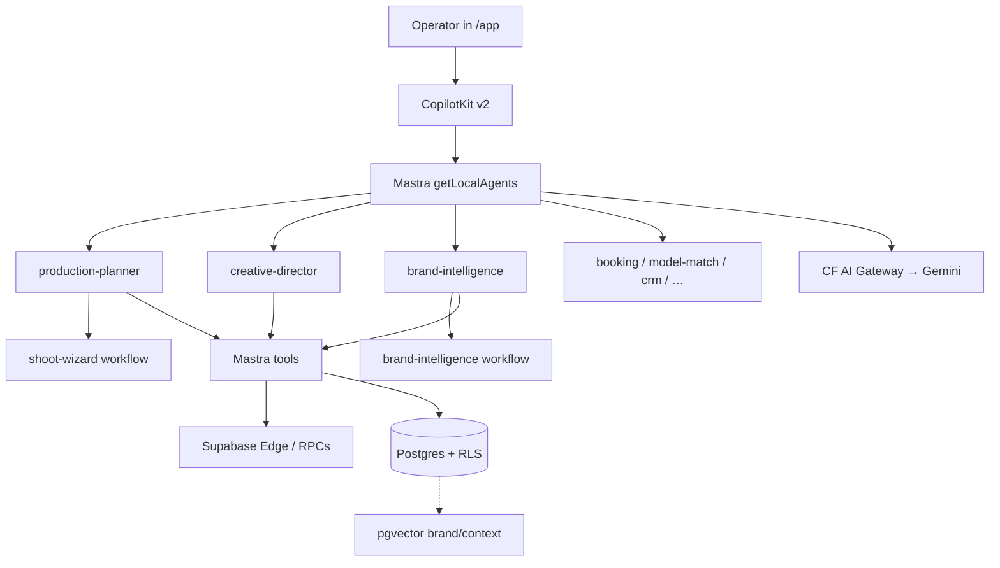
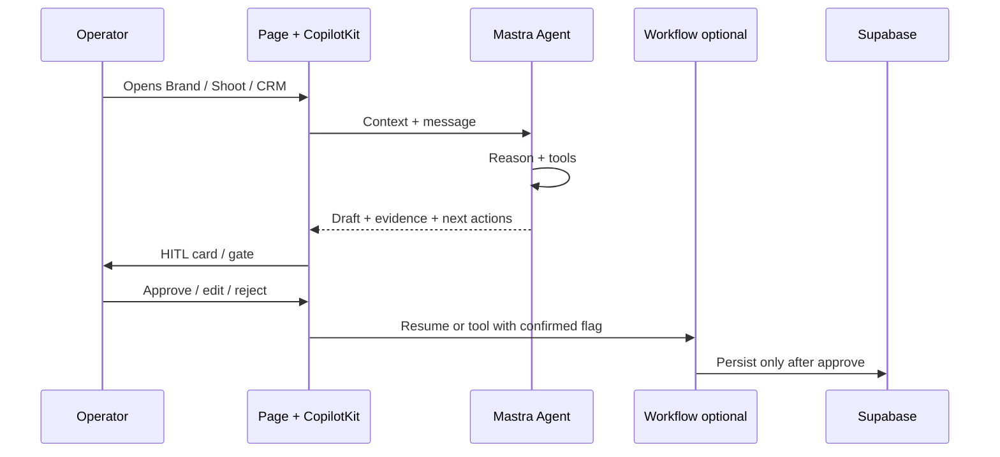
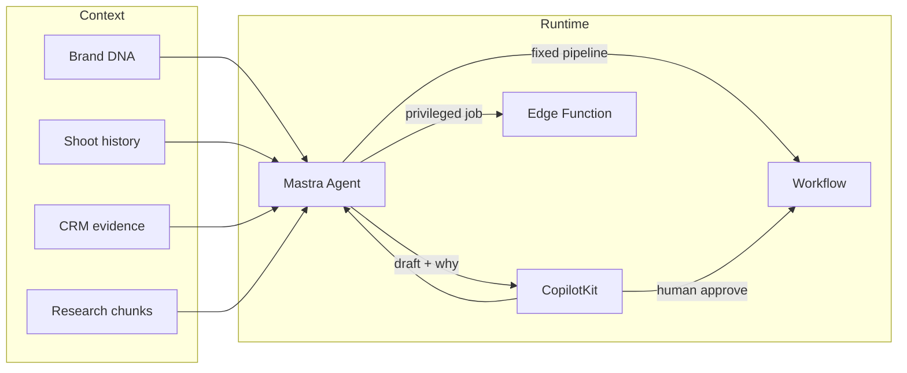

# 07 · AI Agents Strategy Playbook

**As of:** August 2026 · **Evidence:** ✅ repo · 🟡 recommendation · ⚪ research only

**Goal:** Make iPix agents feel like trusted brand, fashion, production, marketing, and industry experts — without agent sprawl or silent high-impact writes.

**Depends on:** [05 · UI journey](./05-ui-user-journey.md) · [06 · Tech stack](./06-tech-stack-playbook.md)  
**SSOT:** `app/src/mastra/index.ts` · `durable.ts` · skills `mastra`, `copilotkit`, `gemini`  
**Rule:** Personas are **hats on existing registry agents**, not new agent IDs — unless MVP value is clear and tools/HITL are ready.

**Platform-first:** Dashboard → CLI → existing agents/tools → docs → SDK → GitHub examples → templates → smallest custom code → tests → live verify.

---

## 1. Executive summary

iPix already has **8 distinct product agents** plus a **`default` alias** of `production-planner` (**9 registry keys**). CopilotKit v2 is the chat surface. Two Mastra **workflows** (`shoot-wizard`, `brand-intelligence`) — not registry agents — encode fixed HITL processes. Heavy DB/crawl work stays in **Supabase Edge Functions**. AI inference routes through **Cloudflare AI Gateway** (`AI_ROUTING_MODE` / per-agent flags where configured); the app itself is still on Vercel.

**What works:** Planner → deliverables → shot list → budget with HITL; Brand Intelligence crawl/draft approve; Booking draft-only; CRM search/move/draft with won/lost HITL; Creative Director DNA evidence on assets; Model Match filter shortlist; Visual Identity + Social Discovery specialists.

**What hurts trust:** Incomplete page context injection; Creative Director campaign tools still thin (IPI-156); model-match not semantic yet; RAG/product memory uneven; semantic recall deferred; too many “new agent” ideas that duplicate hats.

**Strategy in one line:** Deepen expertise on the **existing registry** (DNA, evidence, citations, HITL) before adding agents. Prefer **workflows** for fixed shoot/brand pipelines, **Edge** for crawl/DNA jobs, **CopilotKit** for chat + approval UI, **pgvector** for brand knowledge — not a second agent framework.

| Do next | Don't |
|---------|-------|
| Shared brand/shoot/CRM context in CopilotKit | New agent per persona label |
| Evidence + confidence on every recommendation | Silent DB writes / auto-confirm bookings |
| Brand RAG for DNA advisor hat | Apify + OpenClaw as product runtimes |
| Harden shoot + brand workflows | Cloudflare Durable Object agents “because cool” |

---

## 2. Current agent architecture

### Registry (✅)

| ID | Name | Surface | Tools / notes |
|----|------|---------|---------------|
| `default` | → Production Planner (durable) | CopilotKit fallback | Same as planner |
| `production-planner` | Production Planner | Shoots / wizard | Plan tools + `shoot-wizard` workflow; planner working memory |
| `creative-director` | Creative Director | Campaigns + Assets | Asset DNA tools only today; campaign tools TBD |
| `brand-intelligence` | Brand Intelligence | `/app/brand/*` | Profile/scores/explain/approve + BI workflow |
| `visual-identity` | Visual Identity | Brand visual | Vision model tier |
| `social-discovery` | Social Discovery | Social research | Structured social tools |
| `model-match` | Model Match | Matching · Talent | Filters + score + shortlist (no embeddings yet) |
| `booking` | Booking | Booking flows | Availability → quote → **draft only** |
| `crm-assistant` | CRM Assistant | Relationship Hub | Search, activity, stages, insights, draft follow-up |
| `public-marketing` | Public Marketing | Marketing site widget | Fast tier; gateway routing candidate |

**Durable wrap (✅):** `production-planner` + `creative-director` via `createDurableAgent` — stream reconnect, **not** long HITL state (workflows own suspend/resume).

**Workflows (✅):** `shoot-wizard` · `brand-intelligence`  
**Edge (✅):** `start-brand-crawl`, `firecrawl-webhook`, `brand-intelligence`, `audit-asset-dna`, `capture-lead`, …  
**Memory (✅):** Message history (40); planner **working memory** schema; org-scoped `resourceId` (`org:{orgId}::user:{userId}`); semantic recall deferred (IPI-136).



---

## 3. Recommended agent catalog

**Legend:** **Keep** existing ID · **Hat** = capability on an existing agent (no new ID) · **New** only if justified · Class = MVP / Post-MVP / Advanced

For every role below (where applicable): problem → iPix example → user → expertise → I/O → tools/data → RAG → memory → HITL → runtime → security → failure → tests · class.

### 3.1 Keep — existing registry (deepen, don't clone)

#### Brand Intelligence Agent — **Keep** · MVP

| Field | Definition |
|-------|------------|
| Problem | “We crawled the site — what does this brand mean, and is the draft good?” |
| Example | Brand Hub shows draft DNA; agent opens with score + “Ready to: Plan a shoot” |
| User | Brand operator / producer |
| Expertise | Brand systems, visual/audience/commerce pillars |
| In → Out | brandId + crawl/draft → explained scores, approve/reject, next actions |
| Tools | `getBrandProfile`, scores, `explainPillar`, `startBrandAnalysis`, `approveDraft`; Edge crawl |
| RAG | Brand profile + prior analyses + page snippets (pgvector context) |
| Memory | Thread on brand; org resourceId |
| HITL | Draft approve/reject (card + chat) |
| Runtime | Mastra agent + BI **workflow** + Edge crawl |
| Security | Org brand RLS; no cross-brand tools |
| Failure | Relay tool errors; don't start second crawl if running |
| Tests | Agent instructions + BI workflow + approve route |
| Class | **MVP** |

#### Creative Director Agent — **Keep** · MVP (assets) / Post-MVP (full campaign)

| Field | Definition |
|-------|------------|
| Problem | “Does this asset match DNA?” / “What should this campaign feel like?” |
| Example | `/app/assets` DNA evidence → retake suggestions → bulk approval **draft** |
| User | Creative / brand guardian |
| Expertise | Fashion creative direction, DNA consistency |
| In → Out | assetIds / campaign context → evidence, retakes, brief draft |
| Tools | Asset trio today; campaign tools = IPI-156 |
| RAG | Brand DNA + approved refs |
| Memory | Session + brand thread |
| HITL | Bulk approval draft never persists alone |
| Runtime | Mastra agent (durable) + CopilotKit |
| Class | **MVP** assets · **Post-MVP** campaign depth |

#### Production Planner Agent — **Keep** · MVP

| Field | Definition |
|-------|------------|
| Problem | “Plan this shoot end-to-end without missing channels or inventing angles.” |
| Example | Wizard: type → deliverables HITL → refs → shot list → budget → save |
| User | Producer / planner |
| Expertise | Fashion production, channel specs, budgeting |
| In → Out | Brief/channels → drafts + approved shoot rows only after HITL |
| Tools | recommend/plan/lookup/generate/estimate/save/approve + workflow |
| RAG | Shot reference library (structured first); later semantic refs |
| Memory | Planner working memory (brand, shoot type, pending decisions) |
| HITL | Deliverables, shot list, budget gates |
| Runtime | Mastra agent + **shoot-wizard workflow** |
| Class | **MVP** |

#### Talent Matching Agent (`model-match`) — **Keep** · MVP

| Field | Definition |
|-------|------------|
| Problem | “Who fits this shoot within budget and dates?” |
| Example | Matching · Talent tab shortlist with score + why |
| User | Casting / producer |
| Expertise | Talent fit vs shoot type (filters today) |
| In → Out | Filters → scored list + shortlist mutations on ask |
| Tools | search / score / shortlist |
| RAG | Later: talent embeddings (Post-MVP) |
| Memory | Optional thread; cite tool why always |
| HITL | Shortlist only on explicit ask; booking is separate agent |
| Runtime | Mastra agent |
| Class | **MVP** filters · **Post-MVP** semantic |

#### Booking Agent — **Keep** · MVP

| Field | Definition |
|-------|------------|
| Problem | “Draft outreach without accidentally confirming.” |
| Example | Availability → quote → create draft only after “Send request” |
| User | Booking coordinator |
| Expertise | Rates, conflicts, outreach tone |
| HITL | Confirm/approve = human API only |
| Runtime | Mastra agent |
| Class | **MVP** |

#### CRM and Sales Agent (`crm-assistant`) — **Keep** · MVP

| Field | Definition |
|-------|------------|
| Problem | “What's the relationship, risk, and next follow-up?” |
| Example | Deal page: health score + draft email card (does not send) |
| HITL | Won/lost on page card; drafts don't auto-send |
| Runtime | Mastra agent |
| Class | **MVP** |

#### Social Content Agent (`social-discovery`) — **Keep** · Post-MVP publish

| Field | Definition |
|-------|------------|
| Problem | “What should we say/post for this brand?” |
| Example | Draft concepts from discovery tools; publish = Postiz later |
| Class | **MVP** draft · **Post-MVP** schedule |

#### Visual Identity Agent — **Keep** · MVP

| Field | Definition |
|-------|------------|
| Problem | “Does this look on-brand?” |
| Runtime | Mastra + vision model |
| Class | **MVP** |

#### Public Marketing Agent — **Keep** · MVP (site)

| Field | Definition |
|-------|------------|
| Problem | Public site questions without operator tools |
| Runtime | Mastra `fast` · optional CF native routing |
| Class | **MVP** |

---

### 3.2 Hats on existing agents (do **not** add registry IDs)

| Proposed role | Wear on | Why hat not new agent |
|---------------|---------|------------------------|
| **Brand DNA Advisor** | `brand-intelligence` + `creative-director` | Same DNA data; advisor = explainPillar + evidence tone |
| **Industry / Market Research** | `brand-intelligence` (+ Firecrawl/research tools) | Same brand context; add tools, not agent |
| **Competitor Research** | `brand-intelligence` / `social-discovery` | Crawl + social; avoid second crawl brain |
| **Campaign Strategist** | `creative-director` | Campaigns route already CD's job (IPI-156) |
| **Shoot Coordinator** | `production-planner` | Day-of checklist = planner tools/workflow steps |
| **E-commerce Advisor** | `creative-director` + commerce tools later | PDP/channel specs via `lookupChannelSpecs` |
| **Sponsorship Agent** | `crm-assistant` | Deals/contacts already CRM |
| **Analytics / Performance** | New tools on CD/CRM later | Needs metrics tables first |
| **Quality Control** | `creative-director` asset tools + Edge `audit-asset-dna` | DNA audit already Edge |
| **Compliance / Security** | Platform + RLS + harness — **not** a chat persona | Don't fake a “security agent” |

---

### 3.3 New agents — only if clear value

| Role | Verdict | Class | Note |
|------|---------|-------|------|
| **Customer Support Agent** | 🟡 New **or** Chatwoot (prefer Chatwoot Post-MVP) | Post-MVP | Don't build inbox in Mastra first |
| **Analytics Agent** | 🟡 Hat → maybe New when metrics SSOT exists | Advanced | Tables first |
| Extra “Industry Expert” ID | ❌ Reject | — | Hat + RAG |

---

### 3.4 Expert guidance (all agents)

Every agent earns trust by:

1. Using **injected** brand / shoot / deal context (never ask for IDs you already have).  
2. Grounding in **Brand DNA**, shoot history, CRM evidence, or approved research.  
3. Showing **why** + **confidence** + **evidence ids** (EvidenceBlock pattern).  
4. Asking **one useful clarifying question** when inputs are thin.  
5. Proposing **next best action** buttons (plan shoot, approve draft, open CRM).  
6. **Never** silent high-impact writes (bookings confirm, won/lost, bulk asset save, DNA overwrite audit).

---

## 4. Runtime decision matrix

| Primitive | Use when | Do **not** use when |
|-----------|----------|---------------------|
| **Mastra Agent** | Open-ended reasoning, tool choice, multi-turn help | Fixed 5-step process with no branching novelty |
| **Mastra Workflow** | Repeatable business process + suspend/resume HITL | Free-form chat Q&A |
| **Supabase Edge Function** | Privileged DB writes, Firecrawl webhooks, Gemini batch jobs, secrets | Long conversational reasoning |
| **Cloudflare Worker / AI Gateway** | AI routing, caching, edge API, streaming proxy | Replacing Mastra agents for product chat |
| **CF Agent / Durable Object** | True long-lived coordination across many clients | Default for every chat (overkill vs DurableAgent stream + workflow) |
| **CopilotKit** | User chat, actions, shared state, approval UI | Server-only batch jobs |
| **MCP tool** | Reusable external system access for **harness** (Linear, CF docs) | Product operator path unless you expose a deliberate product MCP |
| **RAG / pgvector** | Immutable-ish knowledge: DNA docs, research chunks, similar brands | Live deal stage, crawl status, booking conflicts (use SQL) |

**iPix defaults:** Chat → CopilotKit → Mastra Agent · Shoot/BI pipelines → Workflow · Crawl/DNA → Edge · Models → Gateway · Knowledge → Postgres + pgvector · HITL UI → CopilotKit cards / page gates.

---

## 5. RAG and memory architecture

| Store | Put here | Examples |
|-------|----------|----------|
| **Relational tables** | Source of truth, mutable ops | brands, shoots, deals, bookings, crawl status |
| **pgvector** | Embeddings for similarity / RAG chunks | brand embeddings, context snapshots, later talent/assets |
| **Short-term memory** | Last N messages in thread | `lastMessages: 40` |
| **Working memory** | Structured session facts | Planner: brandName, shootType, pendingDecisions |
| **Long-term resource memory** | Preferences across threads (org+user) | Post-MVP observational / semantic recall (IPI-136) |

**Chunk / tag / filter / refresh (🟡):**

- Chunk crawl pages + DNA narratives with `brand_id`, `doc_type`, `as_of`.  
- Retrieve with RLS-safe RPCs (`search_brands`, context search) — never service-role from client.  
- Refresh embeddings on crawl complete / draft approve.  
- Stale: flag `as_of` > 90 days in UI; agent must say “based on crawl from …”.  
- Low quality: low confidence from tools → ask human, don't invent.

**Tenant isolation:** Derive `orgId` / `userId` from **authenticated server claims** (session/JWT) and enforce via RLS — never trust client-supplied `resourceId` alone. Set `resourceId` = `org:{orgId}::user:{userId}` on the server; threads `org/workspace/entity`; all SQL under RLS.

---

## 6. User journey and human-approval model



| Impact | Pattern |
|--------|---------|
| Read / explain | Auto OK |
| Draft (email, shot list, quote) | Show draft; no side effect |
| Shortlist / log note | Explicit ask or button |
| Create shoot / send booking / approve DNA / won-lost | **Page HITL or confirmed tool flag** — server validates approver, tenant, action, entity version, and one-time token; never a client boolean alone |
| Re-crawl / re-audit DNA | Explicit only; block if already running |

---

## 7. Mermaid — target expert loop



---

## 8. Current gaps and duplication

| Gap / smell | Fix |
|-------------|-----|
| New agent per persona | Hats on registry (§3.2) |
| CD campaign tools missing | IPI-156 on `creative-director` |
| Model-match filter-only | Semantic later; don't claim it now |
| Semantic memory deferred | IPI-136 when threads hurt |
| Dual HITL (page vs CK) | Keep both for MVP; converge Post-MVP |
| Research agents proposed as new IDs | Tools on BI / social-discovery |
| OpenClaw / second framework | Harness only — product = Mastra |
| QC / Compliance chat agents | Edge + RLS + human process |

---

## 9. MVP agent roadmap

1. **Context always on** — brand/shoot/deal in CopilotKit shared state.  
2. **DNA Advisor quality** — every BI/CD answer has evidence + confidence + next step.  
3. **Planner workflow reliability** — three HITL gates + reference angles (no invented shots).  
4. **Booking + CRM draft discipline** — never confirm / never won-lost in chat.  
5. **Brand RAG thin slice** — similar brands / context snippets in BI answers.  
6. **CD campaign hat** — briefs from DNA without a new agent.  
7. **Stop** — no Support/Postiz/Analytics agents until Core journeys green.

---

## 10. Parallel workstreams

| Stream | Focus | Parallel with |
|--------|-------|---------------|
| A · CopilotKit context | Shared state | B, C |
| B · BI + RAG citations | Brand expert tone | A |
| C · Planner HITL polish | Shoot wizard | A |
| D · CD campaign tools | IPI-156 | A–C (separate PR) |
| E · Model-match semantic | Post-MVP | After brand RAG |
| F · Support inbox | Chatwoot research | Docs-only |

---

## 11. Testing and evaluation strategy

| Layer | What | How |
|-------|------|-----|
| Unit | Tools, schemas, tenant resourceId | Vitest in `app/` |
| Agent contract | Instructions mention HITL; no forbidden tools | Snapshot / instruction tests (booking, CD, CRM patterns) |
| Workflow | Suspend/resume gates | Workflow tests |
| Journey | Real `/app` screen | [04 · QA playbook](./04-testing-qa-playbook.md) evidence |
| Eval (Post-MVP) | Mastra scorers: groundedness, HITL compliance | Staging fixtures — Advanced |
| Live | Preview: draft-only writes; RLS probe | Never prod destructive |

**Minimum bar before “expert” claim:** recommendation + evidence + confidence + next action + HITL for writes.

---

## 12. Recommended Linear tasks

### Drive existing

| Task | Why |
|------|-----|
| **IPI-156 · CAMP-001 — Add campaign help to the existing Creative Director** | Spec: `docs/linear/issues/IPI-156-CAMP-001-creative-director-campaigns.md` |
| **IPI-136 · Mastra semantic / observational memory** | Long threads (Post-MVP) |
| Cutover / Hyperdrive tasks from [06](./06-tech-stack-playbook.md) | Runtime health for agents |

### Priority set (copy-ready bodies)

Index: [`docs/linear/issues/agent-priority-README.md`](../linear/issues/agent-priority-README.md)  
**Create in Linear (Cursor Desktop):** [`CURSOR-DESKTOP-CREATE-LINEAR-ISSUES.md`](../linear/issues/CURSOR-DESKTOP-CREATE-LINEAR-ISSUES.md)

| Order | Task | Spec |
|-------|------|------|
| 1 | **IPI-XXX · AGENT-CTX-001 — Give AI the current brand, shoot, or deal context** | `IPI-XXX-AGENT-CTX-001.md` |
| 2 | **IPI-XXX · AGENT-DNA-001 — Explain Brand DNA with evidence and confidence** | `IPI-XXX-AGENT-DNA-001.md` |
| 3 | **IPI-XXX · AGENT-PLAN-001 — Require approval before each shoot-planning stage** | `IPI-XXX-AGENT-PLAN-001.md` |
| 4 | **IPI-156 · CAMP-001 — Add campaign help to the existing Creative Director** | `IPI-156-CAMP-001-…md` (reuse Linear) |
| 5 | **IPI-XXX · AGENT-RAG-001 — Let Brand Intelligence cite similar brands and past context** | `IPI-XXX-AGENT-RAG-001.md` |

**Do not file from this set:** Support · Postiz · Apify · OpenClaw agents · duplicate AGENT-CD-001 (use IPI-156).

| Later | Class |
|-------|-------|
| **IPI-XXX · AGENT-MATCH-001 — Semantic talent match behind flag** | Post-MVP |
| **IPI-XXX · AGENT-EVAL-001 — Mastra eval scorers for planner + booking HITL** | Advanced |

---

## Multistep prompts (reuse)

### Strategy refresh

```xml
<role>You improve iPix agents without sprawl.</role>
<context>Registry SSOT app/src/mastra/index.ts. Hats > new IDs. HITL for writes.</context>
<task>
1. Diff registry vs this playbook.
2. Classify each ask: hat / tool / workflow / Edge / new agent.
3. Platform-first; file Linear as IPI-XXX · TASK-ID — Real-World Task Name.
</task>
```

### Journey test

```xml
<task>
1. Open the screen on :3002.
2. Ask the agent the job the screen implies.
3. Verify tools, drafts-only, evidence, next action.
4. Record QA evidence per docs/process/04.
</task>
```

---

## Done when

- [x] Exec summary + current architecture  
- [x] Catalog (keep / hat / new) with per-agent fields  
- [x] Runtime matrix · RAG/memory · HITL journey · Mermaid  
- [x] Gaps · MVP roadmap · workstreams · tests · Linear tasks  
- [ ] Follow-ups filed in Linear (human if MCP `needsAuth`)
