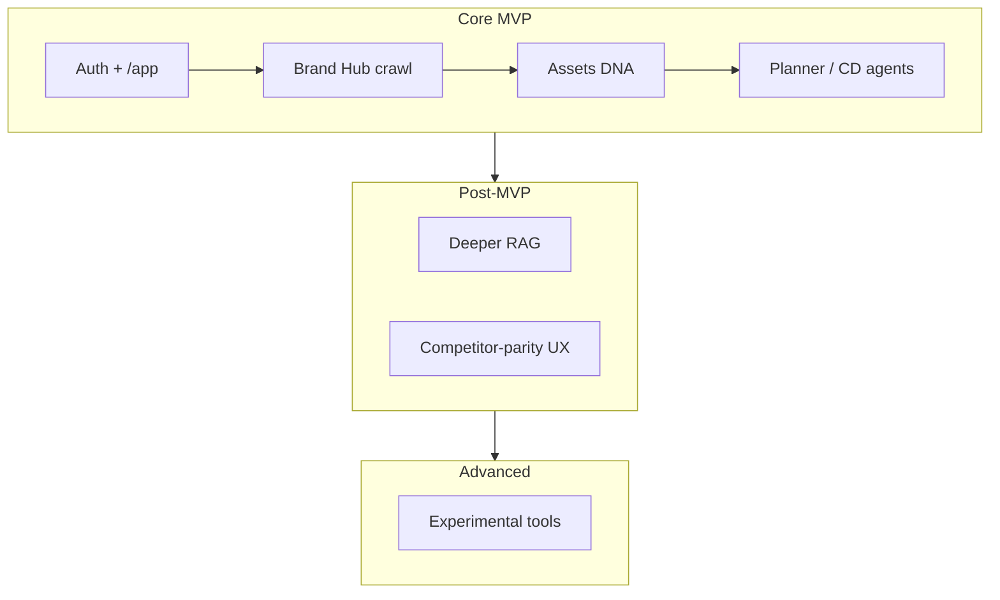

# 09 · MVP Roadmap

**Goal:** Only work that moves launch forward. Tag every task; cut the rest.

**Depends on:** findings from [05](./05-ui-user-journey.md)–[08](./08-architecture-review.md)  
**SSOT for queue:** `tasks/plan/todo.md` · `mvp.md` · Linear IPI

---

## Stages

| Stage | Meaning | Ship bar |
|-------|---------|----------|
| **Core MVP** | Required for real brand operators on ipix.co | Launch blocker if missing |
| **Post-MVP** | Improves retention/speed after first brands | Parallel after Core stable |
| **Advanced** | Differentiator / experiment | Park unless zero risk |

---

## Multistep prompt — prioritize backlog

```xml
<role>You are the iPix launch PM + tech lead.</role>

<task>
1. Read mvp.md, tasks/plan/todo.md, open P0/P1 Linear issues.
2. Tag each: Core MVP / Post-MVP / Advanced.
3. Mark: parallel OK · must wait · blocks others · launch blocker.
4. Kill or merge over-engineered / duplicate tasks.
5. Produce next 10 ship order with dependencies.
6. Mermaid roadmap: Core → Post → Advanced with parallel lanes.
</task>

<output_format>
| Task | Stage | Parallel | Blocks | Score launch value |
Next 10 ordered list · Cuts · Risks
</output_format>
```

---

## Parallel execution guide

| Parallel OK | Wait |
|-------------|------|
| Docs-only playbooks | Migration then app types |
| Independent UI screens | Shared auth/RLS changes |
| Tool research docs | Same-file refactors |
| Test playbook updates | CI workflow edits touching same jobs |

---

## Mermaid — launch focus



---

## Done when

- [ ] Active backlog tagged by stage
- [ ] Launch blockers ≤ countable short list
