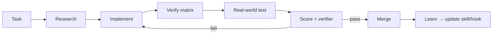

# 10 · Continuous Improvement

**Goal:** Fewer PR errors, consistent quality scores, faster correct delivery.

**Depends on:** [01](./01-development-standards.md)–[04](./04-testing-qa-playbook.md)  
**Reuse:** `pr-workflow` skill · `task-verifier` · Bugbot / CI Protect main

---

## Quality score (every task)

| Dimension | 1 | 3 | 5 |
|-----------|---|---|---|
| Priority | Nice | Important | Launch blocker |
| Complexity | Config | Multi-file | Cross-system |
| Risk | Low | Auth/data | RLS/payments/agents |
| User value | Internal only | Operator weekly | Daily path |
| Launch value | None | Helps | Unblocks launch |
| Efficiency | Custom-heavy | Mixed | Platform-first |

**Correctness grade after ship:** pass / pass-with-risks / fail — with evidence level (Unit → Production).

---

## Multistep prompt — reduce PR errors

```xml
<role>You harden the iPix PR path so agents ship clean one-concern PRs.</role>

<task>
1. Sample last 10 PR failures (gh run list / Bugbot comments).
2. Cluster causes: mixed concerns, missing verify, wrong stack, secrets, flaky tests.
3. For each cluster: fix via hook, skill step, or task template section — prefer hooks for must-pass.
4. Write a multistep "before push" prompt agents must run.
5. Propose dashboard/CLI/MCP checks (Cloudflare, Supabase) agents should run when relevant.
</task>

<output_format>
Failure clusters · Fixes · Before-push checklist · Hook candidates
</output_format>
```

---

## Before-push checklist (agents)

```xml
<task>
1. git diff — one concern only? docs vs code split?
2. Run verify-matrix rows for touched paths.
3. Confirm Linear title format + AC still true.
4. Confirm platform-first decision recorded.
5. Confirm real-world test notes or explicit N/A.
6. Push; open/update PR with plain-English body.
</task>
```

---

## Cross-reference QC

| Check | Against |
|-------|---------|
| Issue title/AC | Live product journey |
| Implementation | Research recommendation |
| Tests | AC + failure points Mermaid |
| Docs | Code (no aspirational checkboxes) |
| Naming | `IPI-NNN · SPEC — Title` |

---

## Mermaid — QC loop



---

## Additional areas to watch

- Infisical vs missing local secrets blocking QA
- Agent ID drift (registry ≠ frontend)
- RLS regressions on new tables
- Cloudflare gateway errors mistaken for outages
- Vite `src/` drift (must not extend)
- Competitor feature chase without MVP tag

---

## Done when

- [ ] Before-push prompt linked from task template
- [ ] Monthly: re-run failure cluster prompt; update hooks/skills
