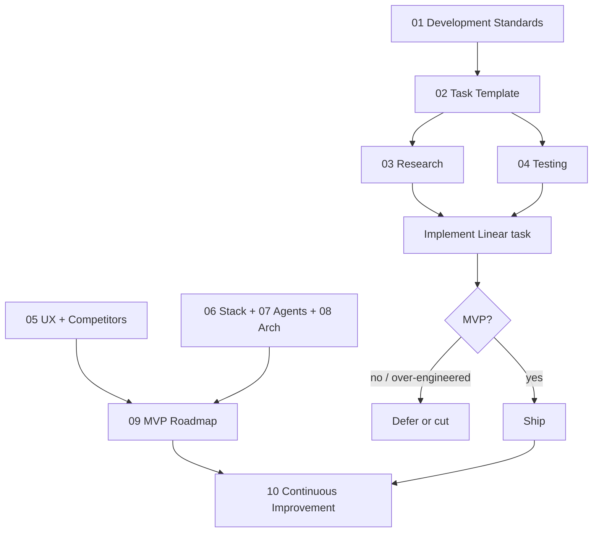

# iPix Process Improvement Project

**Purpose:** Turn scattered process notes into a maintainable set of playbooks so Claude Code / Cursor implement Linear tasks the same way every time — research first, platform-first, test in the real product, ship only what moves MVP.

**Rule:** Do not run all playbooks at once. Pick one doc → run its multistep prompt → produce artifacts → open one concern PR.

**Existing SSOT (reuse, don't replace):**
| Topic | Path |
|-------|------|
| Task lifecycle | `.claude/skills/ipix-task-lifecycle/` |
| Linear as prompt | `.claude/skills/ipix-task-lifecycle/references/linear-prompt-engineering.md` |
| Spec template | `.claude/skills/ipix-task-lifecycle/references/linear-spec-template.md` |
| Verify matrix | `.claude/skills/pr-workflow/references/verify-matrix.md` |
| Ponytail / smallest change | `.cursor/rules/ponytail.mdc` |
| Lean lifecycle | `.cursor/rules/lean.mdc` |

---

## Documents (run in this order)

| # | Doc | When to run | Parallel? |
|---|-----|-------------|-----------|
| 1 | [Development Standards](./01-development-standards.md) · [Audit results](./01-harness-audit-results.md) | First — how agents are steered | Alone (foundation) |
| 2 | [Task Template](./02-task-template.md) · [templates/](./templates/) | Before rewriting Linear issues | After #1 |
| 3 | [AI Research Playbook](./03-ai-research-playbook.md) · skill `ai-research` · `/research` | Every task, before code | With #4 templates |
| 4 | [Testing & QA Playbook](./04-testing-qa-playbook.md) · [evidence template](./templates/qa-evidence-template.md) | Every task, before/after merge | With #3 |
| 5 | [UI & User Journey](./05-ui-user-journey.md) | UX / screen work | Parallel with #7, #8 |
| 6 | [Tech Stack Playbook](./06-tech-stack-playbook.md) | Stack gaps / upgrades | One tool at a time |
| 7 | [AI Agents Strategy](./07-ai-agents-strategy.md) | Mastra / CopilotKit / RAG | Parallel with #5, #6 |
| 8 | [Architecture Review](./08-architecture-review.md) | Custom vs dashboard/CLI | After #6 research |
| 9 | [MVP Roadmap](./09-mvp-roadmap.md) | Prioritize backlog | After #5–#8 findings |
| 10 | [Continuous Improvement](./10-continuous-improvement.md) | PR quality / scoring | Ongoing |

**Competitors** live inside [#5](./05-ui-user-journey.md) (Soona, Squareshot, Xpoz, more).  
**Per-tool deep dives** live under [`tech-stack/`](./tech-stack/).

---

## Prompt style (all docs)

Follow [Claude prompting best practices](https://platform.claude.com/docs/en/build-with-claude/prompt-engineering/claude-prompting-best-practices):

1. Clear, numbered steps
2. XML tags for role / context / task / constraints / output
3. Controlled response format (tables + short verdict)
4. Multistep chain: research → grade → implement → test → score

Copy prompts from each doc into Claude Code / Cursor as-is. Keep verbosity: **short tables, no essays**.

---

## Platform-first ladder (every task)

```text
Dashboard → CLI → Official docs → GitHub examples → Templates
  → Starter repos → SDK/API → Reuse iPix code → Small custom code
  → Tests → PR
```

Custom code is last, not first.

---

## Mermaid — how this project runs



---

## Success criteria for this project

- [ ] Every new Linear issue uses the task template sections
- [ ] Agents research before coding (playbook #3)
- [ ] Real-world test steps exist before merge (playbook #4)
- [ ] Stack work prefers Dashboard/CLI over custom
- [ ] Backlog tagged Core MVP / Post-MVP / Advanced
- [ ] PR error rate drops (one concern, verify matrix green)
