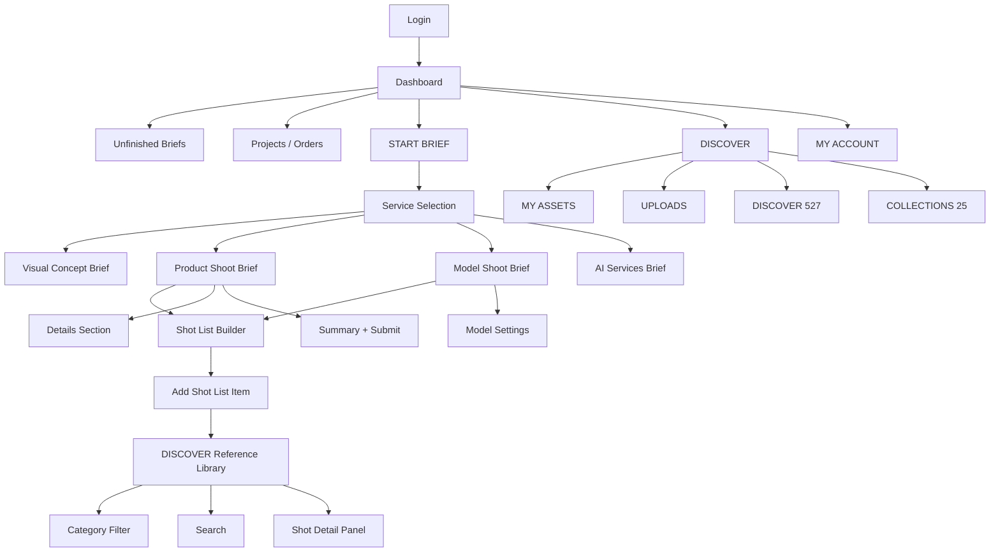
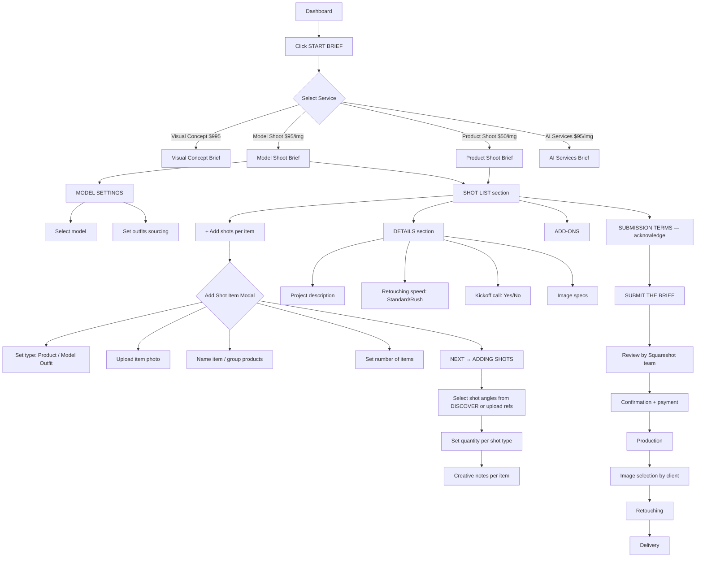
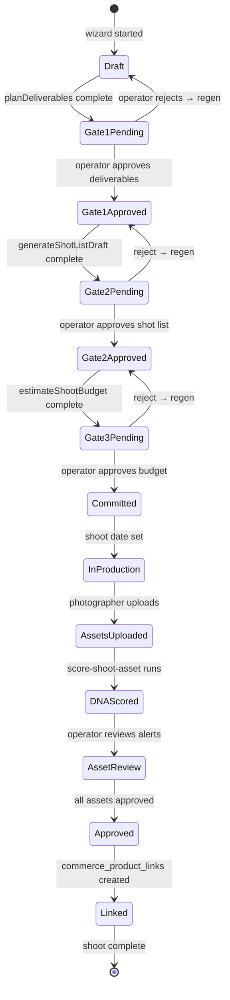

# Squareshot Complete UX Audit — June 2026

**Audited by:** Live browser session (f@socialmediaville.ca)
**Platform tech:** Bubble.io (confirmed from 404 page boilerplate)
**Account:** Sanjiv — AMO-01 + SOCI-03 brand accounts, 9 unfinished briefs, 0 active projects

---

## Executive Summary

Squareshot is a self-service ecommerce content production platform. It replaces the traditional agency model (Brand → Agency → Studio → Photographer → Retoucher → Delivery) with a structured brief-to-delivery pipeline. Customers define what they want through a brief builder, Squareshot's team executes it, and delivers retouched images.

**Core thesis:** Remove all the emails and calls by capturing all production requirements in a structured brief.

**What makes it good:**
- Clean, unambiguous service selection
- Structured brief builder with every production decision codified
- DISCOVER library (527 curated reference images) for visual communication
- Shot list builder with product grouping and model assignment
- Transparent pricing with live summary

**What it lacks that iPix should own:**
- Zero AI. Every decision is manual.
- No brand intelligence — you start from a blank brief every time
- No channel optimization — the system doesn't know TikTok needs 9:16
- No DNA scoring — delivered images have no quality verification
- No feedback loop — completed shoots don't improve future briefs
- No campaign strategy — it's transactional, not strategic

**iPix position:** The intelligence layer before and above Squareshot. While Squareshot captures what you want, iPix figures out what you need — then generates the brief for you.

---

## Platform Overview

| Attribute | Value |
|---|---|
| Primary customer | Ecommerce brands (fashion, beauty, accessories, home goods) |
| Business model | Per-image pricing or flat day-rate; membership tiers for discounts |
| Production location | Physical studios (not disclosed in UI, location field in brief) |
| Services | Visual Concept, Product Shoot, Model Shoot, AI Services |
| Reference library | 527 curated images across 8 categories |
| Collections | 25 curated collections |
| Brands served | 2,000+ (per Discover page copy) |
| Tech stack | Bubble.io (low-code) |

---

## Information Architecture

```
app.squareshot.com/
├── /dashboard                  ← Home after login
│   ├── UNFINISHED BRIEFS       ← Draft briefs list
│   └── PROJECTS                ← Submitted/active orders
├── /brief                      ← Service selection modal
│   └── /brief/:id              ← Brief builder (per service type)
├── /discover                   ← Reference library
│   ├── MY ASSETS               ← Brand's own uploaded/delivered assets
│   ├── UPLOADS                 ← Manual uploads
│   ├── DISCOVER (527)          ← Curated reference gallery
│   └── COLLECTIONS (25)        ← Curated thematic collections
└── MY ACCOUNT                  ← Profile, billing, membership
```

### Mermaid Sitemap



---

## User Journey

### Main Brief Creation Flow



---

## Dashboard — Screen Review

**URL:** `/dashboard`
**Purpose:** Home command center showing all pending drafts and active projects.

### Components

| Component | Details |
|---|---|
| Header | Logo, DISCOVER, REFER AND EARN $, MY ACCOUNT, CONTACT, START BRIEF |
| Welcome heading | "WELCOME, [NAME]" |
| UNFINISHED BRIEFS table | BRIEF ID, BRIEF STATUS, SELECTED SERVICE, LAST UPDATED, FINISH BRIEF button, delete icon |
| PROJECTS table | PROJECT NAME/ID, PROJECT STATUS, TOTAL, LAST UPDATED, filter dropdown (ACTIVE/ALL), sort (NEWEST FIRST) |

### Brief Statuses Observed
- **Draft** — incomplete, not submitted

### Project Statuses (from field labels)
- Active (filter option visible)

### Dashboard Data From Live Session

| Brief ID | Status | Service | Last Updated |
|---|---|---|---|
| AMO-01-BR-09 | Draft | Model shoot, Per-image | June 25, 2026 |
| AMO-01-BR-08 | Draft | Product shoot, Per-image | June 21, 2026 |
| AMO-01-BR-07 | Draft | Visual concept | June 21, 2026 |
| AMO-01-BR-06 | Draft | Product shoot, Per-image | May 6, 2026 |
| AMO-01-BR-05 | Draft | Product shoot, Per-image | May 6, 2026 |
| AMO-01-BR-04 | Draft | (unselected), Per-image | May 6, 2026 |
| AMO-01-BR-03 | Draft | (unselected), Per-image | May 6, 2026 |
| AMO-01-BR-02 | Draft | (unselected), Per-image | May 6, 2026 |
| AMO-01-BR-01 | Draft | (unselected), Per-image | May 6, 2026 |

### UX Score: 72/100

| Criterion | Score | Notes |
|---|---|---|
| Navigation | 85 | Clean top nav |
| Discoverability | 60 | No visual differentiation between draft types |
| Cognitive load | 70 | Simple table but no preview of brief contents |
| AI readiness | 20 | None — just a list |
| Automation readiness | 30 | No draft suggestions, no "continue where you left off" |

**Improvement:** Show brief completion % per draft. Add "continue" tooltips with the next missing field. AI could say "Your AMO-01-BR-08 is 80% complete — missing shot angles for 2 items."

**iPix mapping:** IPI-85 · SHOOT-UX-002 — Shoots Dashboard

---

## Service Selection — Screen Review

**URL:** `/brief` (modal overlay)
**Purpose:** Choose which production service to purchase.

### 4 Services (from live session)

| Service | Label | Badge | Description | Pricing |
|---|---|---|---|---|
| Visual Concept | VISUAL CONCEPT | New | "An art-directed visual idea for your next campaign — defining how your content should look, feel, and stand out." | $995/concept |
| Product Shoot | PRODUCT SHOOT | — | "Show off your products on white or colored backdrops, optionally enhanced with props for context and clarity." | From $50/image, or $750 for a 2-hour shoot |
| Model Shoot | MODEL SHOOT | — | "Bring your products to life with real people — showing fit, scale, and function in action." | From $95/image, or $2,950 for a 4-hour shoot |
| AI Services | AI SERVICES | New | "Create AI-generated visuals from your product shots or references. From single images to cohesive campaigns." | From $95/image or $975 for a 5-image campaign |

### UX Score: 88/100

Clean 4-card layout. Pricing visible upfront. Each card has description + price + CTA.

**Weakness:** No help deciding which service is right. A brand that's never done a shoot doesn't know if they need Product vs Model vs Visual Concept.

**AI opportunity:** "What are you trying to achieve?" → AI recommends the service. Or brand URL input → AI detects missing content types and recommends a service automatically.

**iPix mapping:** IPI-87 · SHOOT-UX-004 — Shoot Wizard (service selection step)

---

## Brief Builder — Complete Field Inventory

### Product Shoot Brief

**Sections:** Selected Service · Shot List · Details · Add-Ons · Submission Terms · Summary

#### SHOT LIST Section

Each Shot List Item has:

| Field | Type | Required | Notes |
|---|---|---|---|
| Item type | Toggle: PRODUCT / MODEL OUTFIT | Required | Determines downstream fields |
| Item photo | File upload | Optional | "Add a photo of the actual item you'll be sending" — not reference, actual product |
| Name | Text input | Required | Products with same shot set can be grouped: "Separate products with commas or group them under a name like 'all t-shirts'" |
| Number of items | Number | Required | How many products in this group |
| Shots | Shot selector | Required | Opens DISCOVER-style angle picker |
| Creative notes | Text area | Optional | Free text notes per item |
| Supporting refs | File/URL | Optional | Reference images for this item |
| Price/image | Display | — | Auto-calculated per shot type |

**Shot selection sub-flow:**
After clicking "NEXT → ADDING SHOTS" the user picks shot types from the reference library. Each shot type selected adds to the shot count.

#### DETAILS Section

| Field | Type | Required | Default | Notes |
|---|---|---|---|---|
| Project description | Text area | Optional | Empty | Free-form brief overview |
| Retouching speed | Selector | Required | STANDARD (8 business days) | Options: STANDARD (8 biz days, free) / RUSH (faster, add-on cost) |
| Kickoff call | Toggle: YES/NO | Required | NO | Optional strategy call before production |
| Image specs | Field | Optional | None | Platform-specific specs (e.g. Amazon A+ dimensions) |

**Note:** Product shoot says "Image delivery speed" (8 business days). Model shoot says "Retouching speed" (4 business days). Different copy for same concept.

#### ADD-ONS Section

| Add-on | Price | Notes |
|---|---|---|
| (none in draft) | — | Observed: model outfit sourcing was $195/outfit |

#### SUBMISSION TERMS

Checkboxes requiring acknowledgment:
1. Revision policy (links to help article)
2. Cancellation, Rescheduling, No-show & Late Arrival Policy
3. Refund Policy
4. Product Requirements (products must meet physical requirements for studio)
5. "I acknowledge and agree" — master checkbox

**UX issue:** 5 policy links with no inline summaries. Most users click "agree" without reading.

#### SUMMARY Panel (right sidebar, sticky)

| Field | Value |
|---|---|
| Total items | Count of shot list items |
| Total images | Count of selected shots (expandable) |
| Project type | Per-image |
| Location | (populated later) |
| Image delivery speed / Retouching speed | X business days |
| Kickoff call | Yes/No |
| Membership | Pay As You Go / Membership tier |
| Subtotal | $ |
| + Add-ons | $ |
| **Total** | $ |
| Upgrade plan to save up to 30% | UPGRADE CTA |
| Minimum order warning | "Minimum order requirement isn't met" |
| SUBMIT THE BRIEF | Primary CTA |
| Legal | "No charge until your brief is reviewed and confirmed. No credit card needed to submit." |

**Minimum order:** Not displayed numerically — just "Minimum order requirement isn't met. Learn more." The minimum appears to be ~$500–750 based on pricing.

### Model Shoot Brief (additional sections)

#### MODEL SETTINGS Section (before Shot List)

| Field | Type | Options | Notes |
|---|---|---|---|
| Model source | Selector | Squareshot model / Client's model | "Squareshot model" pre-selected |
| Model name | Display | — | Shows selected model name (e.g., "Jenia Ierokhina") |
| Model type | Display | — | "Full body" or "Half body" |
| Session length | Display | — | "Half day" |
| Measurements | Display | H(height), B(bust), W(waist), H(hips), S(shoe), E(eye color), H(hair color) | e.g., "H (5'9''), B (32), W (24.5), H (34.5), S (7.5), E (Green), H (Brown)" |
| Outfits sourcing | Toggle | SQUARESHOT ($195/outfit) / CLIENT | Who provides outfits |
| Number of outfits | Number | — | Drives add-on cost |

**Observation:** Model source shows "Squareshot model" as default — implying a model marketplace is built in. The specific model shown (Jenia Ierokhina) has detailed measurements displayed for fashion sizing.

---

## Shot List Builder — Complete Specification

### Shot List Item Creation Flow

**Step 1 — Add Item Modal**

```
SHOT LIST ITEM
──────────────
Type:    [PRODUCT]  [MODEL OUTFIT]

Item photo (optional)
"Add a photo of the actual item you'll be sending."
[+ Add file]
"Don't upload reference images or angles — you'll choose angles later."

Name
"Enter product(s) that will have the same set of shots."
[tops______]
"Separate products with commas or group them under a name like 'all t-shirts.'"

Number of items  ⓘ
[number input]

[NEXT → ADDING SHOTS]
[Good description checklist →]
```

**Step 2 — Shot Angle Selection**

After clicking NEXT, the user sees a shot angle picker. This pulls from the DISCOVER reference library, filtered by the item type and category. The user:
1. Sees a grid of reference shots for their product category
2. Clicks shots to add them to their shot list
3. Sets quantity per shot type (e.g., "2" for front view)

**Step 3 — Shot Details per Item**

| Field | Notes |
|---|---|
| Creative notes | Optional free text per item |
| Supporting refs | Upload or reference URL |
| Assigned shots | List of selected shot types with counts |

### Shot List Item Display (in brief)

```
[PRODUCT badge]  AMO
4 items · 4 shots (1 per item)
Creative notes: -
Supporting refs: -
Price/image: $225

[+ Add shots]
```

---

## DISCOVER Reference Library — Complete Specification

**URL:** `/discover`
**Tabs:** MY ASSETS · UPLOADS · DISCOVER (527) · COLLECTIONS (25)

### DISCOVER Tab

**Header copy:** "DISCOVER BEST PRODUCT SHOTS — We delivered thousands of shots to over 2,000 brands and counting. Here's a collection of selected work from Squareshot Team that is made to inspire."

**8 Category Filters (from live session):**

| # | Category | Notes |
|---|---|---|
| 1 | CLOTHING (FLAT LAY) | Garments laid flat, no model |
| 2 | CLOTHING (GHOST) | Garments on invisible/ghost mannequin |
| 3 | CLOTHING (MODEL) | Garments on live model |
| 4 | BEAUTY (PRODUCT) | Beauty products, no model |
| 5 | BEAUTY (SWATCHES) | Makeup color swatches, textures |
| 6 | ACCESSORIES | Bags, jewelry, shoes, etc. |
| 7 | HOME GOODS | Furniture, décor, kitchen, etc. |
| 8 | AI SERVICES | AI-generated visuals |

**Controls:**
- Search bar: "Search in all shots..."
- FILTERS button (opens filter panel — filter options include service type, model type, background, angle, brand)
- Sort: NEWEST FIRST (other options likely: Most Popular, etc.)
- LOAD MORE pagination

### Shot Detail Panel (from user screenshot — BEAUTY MODEL example)

When clicking a shot, a right-panel slides in:

```
BEAUTY MODEL
──────────────────────────────
[Description text — "A model is shown dispensing lotion from a bottle onto her hand, highlighting the applic..."]
[Show more]

Organization
  Service type:    Model shoot
  Brand:           Mumuk
  Angle:           Close-up
  Collections:     Mumuk Beauty

Details
  Category:        Beauty
  Model source:    Squareshoot
  Model type:      Full body
  Background:      Custom backdrop

Pricing: PAY AS YOU GO

[🔖 bookmark icon]   [SELECT A SHOT]
```

### MY ASSETS Tab

Brand's delivered and approved images from past projects. Empty for this account (no completed projects).

### UPLOADS Tab

Brand's manually uploaded reference images. Used when submitting brand's own references for shot direction.

### COLLECTIONS Tab

25 curated thematic collections. Examples likely: "Amazon Hero Shots", "TikTok Lifestyle", "White Background", "Editorial Fashion" etc. (content not loaded due to image loading issues).

---

## Complete Shot Type Taxonomy

Based on the 8 DISCOVER categories, brief builder observations, and shot detail panel metadata:

### CLOTHING — FLAT LAY

| Angle | Description | Channel Fit |
|---|---|---|
| Front flat lay | Garment laid flat, front facing, white background | Shopify PDP, Amazon |
| Back flat lay | Rear view flat lay | Shopify PDP, Amazon |
| Detail flat lay | Close-up of fabric, label, care tag | Shopify PDP |
| Styled flat lay | With props, accessories, lifestyle context | Instagram, Pinterest |
| Knolling | Top-down organization of all items | Social media |

### CLOTHING — GHOST (Invisible Mannequin)

| Angle | Description | Channel Fit |
|---|---|---|
| Ghost front | Full front view on ghost mannequin | Shopify PDP, Amazon |
| Ghost back | Full back view | Shopify PDP, Amazon |
| Ghost side | Side profile | Shopify PDP |
| Ghost detail | Close-up of details (collar, hem, zipper) | Shopify PDP |
| Ghost 3/4 | Three-quarter angle view | Shopify, Marketing |

### CLOTHING — MODEL

| Angle | Description | Model Type | Channel Fit |
|---|---|---|---|
| Full body front | Standing model, full length | Full body | Shopify, Instagram, Amazon |
| Full body back | Rear facing, full length | Full body | Shopify, Amazon |
| Full body side | Profile view | Full body | Shopify |
| Half body | Waist up | Half body | Instagram, Social |
| Close-up detail | Detail of garment on body | Close-up | Instagram, TikTok |
| Lifestyle indoor | Model in styled indoor scene | Full body | Instagram, TikTok |
| Lifestyle outdoor | Model in outdoor scene | Full body | Instagram, TikTok, Editorial |
| Movement/action | Model in motion | Full body | TikTok, Instagram Reels |
| Editorial pose | Fashion editorial style | Full body | Instagram, Marketing |

### BEAUTY — PRODUCT

| Angle | Description | Channel Fit |
|---|---|---|
| Hero overhead | Top-down flat lay, white or gradient | Amazon, Shopify |
| 45° hero | Classic 3/4 angle, white background | Amazon, Shopify |
| Side profile | Direct side view | Shopify, Amazon |
| Detail texture | Extreme close-up of product texture | Shopify, Instagram |
| Cap/lid close-up | Focus on packaging detail | Shopify |
| Group/range | Multiple products grouped | Instagram, Campaign |
| Lifestyle styled | Product with props, context | Instagram, TikTok |
| On-model in-use | Model using product (hands/face) | Instagram, TikTok |
| Splash/pour | Liquid product in motion | Instagram, Campaign |

### BEAUTY — SWATCHES

| Angle | Description | Channel Fit |
|---|---|---|
| Color range spread | All shades in gradient arrangement | Shopify, Instagram |
| Macro texture | Extreme close-up swatch on skin | Shopify, Instagram |
| Application brush | Swatch applied with brush | Shopify |
| Comparison spread | Multiple shades on skin | Shopify, Social |

### ACCESSORIES

| Angle | Description | Channel Fit |
|---|---|---|
| Hero white | Clean white background, front | Amazon, Shopify |
| 45° angle | Classic angle, white | Amazon, Shopify |
| Detail close-up | Hardware, stitching, texture | Shopify |
| On-model worn | Worn by model (jewelry, bags, sunglasses) | Instagram |
| Lifestyle styled | With context props, surfaces | Instagram, TikTok |
| Flat lay styled | Overhead, styled with complementary items | Instagram, Pinterest |

### HOME GOODS

| Angle | Description | Channel Fit |
|---|---|---|
| Hero overhead styled | Top-down product in styled scene | Shopify, Amazon |
| 45° studio | Clean angle, studio lighting | Amazon, Shopify |
| Lifestyle room scene | Product in styled room | Instagram, Pinterest |
| Detail material | Close-up of material/texture | Shopify |
| In-use context | Product being used | Instagram, TikTok |
| Scale reference | Product with human for scale | Amazon, Shopify |

### AI SERVICES (New)

| Type | Description | Channel Fit |
|---|---|---|
| Background replacement | Swap white bg for lifestyle/scene | Shopify, Instagram |
| AI lifestyle | Generate model/scene around product | Instagram, TikTok |
| AI campaign | Cohesive 5-image AI campaign | Instagram, Social |
| AI model | AI-generated model wearing product | Shopify, Social |
| Scene generation | Full AI-generated product scene | Instagram, Campaign |

---

## Model System

### What's Visible

From the Model Shoot brief (AMO-01-BR-09):

**Model metadata fields displayed:**
- Name: "Jenia Ierokhina"
- Type: Full body / Half body
- Session: Half day / Full day
- Measurements: Height, Bust, Waist, Hips, Shoe size, Eye color, Hair color
- Source: Squareshot model vs. Client's model

**Model sourcing options:**
1. **Squareshot model** — Squareshot casts from their talent pool
2. **Client's model** — Brand provides their own model

**Outfit sourcing:**
- **SQUARESHOT** ($195/outfit) — Squareshot sources/provides outfits
- **CLIENT** — Brand ships their own garments

**Number of outfits:** Determines add-on cost (N × $195 if Squareshot-sourced)

### Inferred Model System (not directly accessible)

Based on the brief UI and Squareshot's public documentation:
- Model marketplace with 10–20+ models
- Filters: gender, body type (full/half), availability, location
- Models displayed with portfolio shots
- Usage rights included in shoot price (no separate licensing)
- Location: studio-based (city not shown in brief)

---

## Ordering & Pricing

### Pricing Structure

| Service | Per-Image | Day Rate | Notes |
|---|---|---|---|
| Visual Concept | $995/concept | — | Fixed price for one creative direction package |
| Product Shoot | From $50/image | $750 / 2-hour shoot | Per-image scales with volume |
| Model Shoot | From $95/image | $2,950 / 4-hour shoot | Higher due to talent cost |
| AI Services | From $95/image | $975 / 5-image campaign | New service |

### Add-Ons Observed

| Add-on | Price |
|---|---|
| Outfit sourcing (model shoots) | $195/outfit |
| Rush retouching | (price not captured) |
| Kickoff call | Optional (possibly free or included) |

### Membership

- **Pay As You Go** — no commitment, standard pricing
- **Membership plans** — "Upgrade to save up to 30%" — tiers not captured but implies recurring subscription

### Minimum Order

Not numerically displayed but warned when not met. Inferred minimum: ~$500–$750 based on pricing.

### Payment Flow

- No credit card at brief submission
- "No charge until your brief is reviewed and confirmed"
- Payment triggered after Squareshot reviews and confirms feasibility

---

## UX Scores by Screen

| Screen | Score /100 | Top Issues | Key Improvements |
|---|---|---|---|
| Dashboard | 72 | No brief preview, no completion %, no AI suggestions | Show % complete, smart "resume" CTAs |
| Service Selection | 88 | No guided selection, no recommendations | "What are you making?" → AI recommends |
| Brief Builder (Product) | 75 | Long form, many policies, no AI | Pre-fill from brand URL |
| Brief Builder (Model) | 73 | Model discovery is opaque | Show model grid before selecting |
| Shot List Builder | 70 | Text-heavy, no preview | Show reference thumbnail per shot |
| DISCOVER | 82 | Images slow to load, no AI search | AI search: "show me beauty close-ups for TikTok" |
| Shot Detail Panel | 90 | Excellent metadata, clean | Add "similar shots" recommendation |
| Summary Panel | 85 | Live pricing is great | Show cost-per-channel breakdown |
| Mobile | 50 | Not tested but Bubble sites often poor mobile | Full responsive needed |

---

## AI Opportunities (Per Section)

| Section | Manual Decision | AI Replacement | iPix Implementation |
|---|---|---|---|
| Service selection | User reads 4 cards and guesses | Brand URL → detect content gaps → recommend service | `analyzeBrandDna` + `detectContentGaps` |
| Shot list creation | User thinks of product groups | Product URL/SKU → auto-detect product type → pre-populate items | `detectProductType` tool |
| Angle selection | User browses 527 images manually | AI recommends angles based on category + channels | `lookupShotReferences` |
| Channel specs | User doesn't know TikTok needs 9:16 | AI detects channels from brand → adds correct specs | Channel guidance in wizard right panel |
| Model selection | User browses model grid | AI matches model type to garment category | `matchShootCrew` tool |
| Brief description | User writes freeform | AI drafts based on brand DNA + product type | Gemini Flash structured output |
| Budget estimate | User doesn't know | AI estimates from shot list + crew | `estimateShootBudget` |
| Retouching specs | User guesses Amazon requirements | AI detects platform from channels, injects specs | Channel-aware spec injection |
| Quality gate | No verification | DNA score every delivered image | `score-shoot-asset` edge fn |

---

## iPix Adaptation Strategy

### The Core Difference

Squareshot: You tell us what to shoot → we shoot it.
iPix: We analyze your brand → we tell you what to shoot → you approve → we (or partners) shoot it.

### Feature-by-Feature Replacement

| Squareshot Feature | iPix AI-Native Replacement |
|---|---|
| Blank brief form | Brand URL → `analyzeBrandDna` → pre-filled brief |
| Manual service selection | AI recommends service based on content gap analysis |
| Manual shot list creation | `generateShotListDraft` from approved deliverables |
| DISCOVER manual browsing | `lookupShotReferences` — AI selects matching references |
| Visual Concept ($995) | Free — built into brand intelligence (iPix moat) |
| Model grid browsing | `matchShootCrew` — AI matches model to product type |
| Budget estimate hidden | `estimateShootBudget` — transparent, line-item |
| Submit and hope | 3 HITL approval gates before anything locks in |
| No quality verification | DNA scoring on every delivered asset |
| No feedback loop | Approved assets → `shot_type_references` flywheel |
| Static 527-image library | Living library that grows with every iPix shoot |

---

## Production Planner Agent Design

**Agent ID:** `production-planner` (locked — do not change)

### System Prompt Design

```
You are the Production Planner for [Brand Name] on iPix.

Your job is to create channel-complete, brand-aligned shoot plans that
eliminate content gaps before production starts.

You have access to:
- This brand's DNA scores (style, channels, gaps)
- A shot type reference library (80+ vetted shot types)
- Channel requirements (TikTok 9:16, Amazon whitebg, IG 4:5, etc.)

Your planning philosophy:
1. Start with WHAT the brand needs (channels + gaps) — not WHAT to photograph
2. Derive deliverables from channel needs — not from guessing
3. Derive shot list from approved deliverables — never before
4. Every shot maps to at least one deliverable
5. Never lock anything without human approval

Tools available:
- analyzeBrandDna: Get brand style profile, channel presence, content gaps
- detectContentGaps: Find what's missing vs. competitive benchmark
- planDeliverables: Generate channel-complete deliverable set
- lookupShotReferences: Get reference images for approved deliverables
- generateShotListDraft: Create shot list ONLY after deliverables approved
- estimateShootBudget: Price the plan before committing
- explainShootDnaAlerts: Explain why an asset failed DNA check
- explainProductLinkingGaps: Surface unlinked commerce assets
```

### Conversation Flow (Wizard Steps)

```
Step 1 — Context
Agent: "What are you launching? Drop a product URL or describe it."
Agent: "Which channels will this run on?"
Agent: "New launch, seasonal refresh, or performance campaign?"

Step 2 — Creative Direction  
Agent: "Minimal or editorial tone?"
Agent: "Any brand restrictions?"
Agent: [pre-fills from brand_scores.style_profile]

Step 3 — Deliverables (HITL Gate 1)
Agent: "Based on your brand DNA: [X hero + Y lifestyle + Z detail].
        Adjust before I build your shot list?"
→ DeliverableApprovalCard

Step 4 — Shot List (HITL Gate 2)
Agent: "Here's your shot list. Flagged [N] gaps. Approve or edit."
→ ShotListApprovalCard (with reference thumbnails)

Step 5 — Budget (HITL Gate 3)
Agent: "Estimated $[X]–$[Y]. Approve to lock the plan."
→ BudgetApprovalCard
```

**Maps to:** IPI-148 · SHOOT-AI-001 — Production Planner Agent

---

## HITL Approval Gates Design

```mermaid
flowchart TD
    A[Wizard Start] --> B[Brand URL + Context]
    B --> C[planDeliverables]
    C --> D{Gate 1: DeliverableApprovalCard}
    D -->|Reject| C
    D -->|Edit + Approve| E[shoot_intake_drafts: draft_deliverables saved]
    E --> F[lookupShotReferences]
    F --> G[generateShotListDraft WITH approved_deliverables]
    G --> H{Gate 2: ShotListApprovalCard}
    H -->|Reject| G
    H -->|Edit + Approve| I[shoot_intake_drafts: draft_shot_list saved]
    I --> J[estimateShootBudget]
    J --> K{Gate 3: BudgetApprovalCard}
    K -->|Reject| J
    K -->|Edit + Approve| L[commit-approved-shoot edge fn]
    L --> M[shoots + shot_list + shoot_deliverables tables]
    M --> N[/app/shoots/:id detail workspace]

    style D fill:#f3b93c,color:#000
    style H fill:#f3b93c,color:#000
    style K fill:#f3b93c,color:#000
    style L fill:#e87c4d,color:#fff
```

**Maps to:** IPI-150 · SHOOT-AI-003 — Human Approval Workflow

---

## Data Model Recommendations

### Tables Required (maps to IPI-183 SHOOT-DATA-001)

```sql
-- Core shoot record
shoots (
  id uuid,
  brand_id uuid FK,
  title text,
  product_type text,          -- 'clothing', 'beauty', 'accessories', 'home_goods'
  campaign_type text,         -- 'launch', 'refresh', 'seasonal', 'performance'
  channels jsonb,             -- ["instagram_feed", "shopify_pdp", "amazon", "tiktok"]
  style_profile text,         -- 'minimal', 'editorial', 'luxury'
  brand_url text,             -- source of DNA pre-fill
  status text,                -- 'draft', 'approved', 'in_production', 'delivered', 'complete'
  agent_run_id text,          -- Mastra workflow run
  created_at timestamptz,
  updated_at timestamptz
)

-- Draft state for wizard (shoot_intake_drafts)
shoot_intake_drafts (
  id uuid,
  shoot_id uuid FK → shoots,
  brand_id uuid FK,
  wizard_step int,            -- 1-6
  draft_deliverables jsonb,   -- Gate 1 output
  draft_shot_list jsonb,      -- Gate 2 output
  draft_budget jsonb,         -- Gate 3 output
  agent_run_id text,
  status text,                -- 'in_progress', 'gate1_approved', 'gate2_approved', 'gate3_approved', 'committed'
  created_at timestamptz
)

-- Approved deliverables per shoot
shoot_deliverables (
  id uuid,
  shoot_id uuid FK,
  channel text,               -- 'instagram_feed', 'shopify_pdp', 'amazon', 'tiktok'
  format text,                -- '4:5', '1:1', '9:16', '16:9'
  quantity int,
  aspect_ratio text,
  created_at timestamptz
)

-- Shot list per shoot
shot_list (
  id uuid,
  shoot_id uuid FK,
  description text,
  channel text,
  angle text,                 -- from shot_type_references
  reference_id uuid FK → shot_type_references,
  reference_url text,         -- Cloudinary URL
  deliverable_ids uuid[],     -- which deliverables this shot covers
  status text,                -- 'planned', 'captured', 'approved', 'flagged'
  created_at timestamptz
)

-- Shot type reference library (IPI-184 SHOOT-DATA-002)
shot_type_references (
  id uuid,
  category text,              -- 'clothing', 'beauty', 'accessories', 'home_goods'
  subcategory text,           -- 'ghost', 'model', 'flat_lay', 'product', 'swatch'
  angle text,
  description text,
  reference_url text,         -- Cloudinary URL
  model_type text,            -- 'full-body', 'half-body', 'hands-only', null
  background text,            -- 'white', 'custom-backdrop', 'lifestyle', 'studio-gradient'
  channel_fit jsonb,          -- ["instagram_feed", "shopify_pdp", "amazon"]
  tags text[],
  created_at timestamptz
)

-- Assets from shoot (DNA-scored)
shoot_assets (
  id uuid,
  shoot_id uuid FK,
  shot_list_id uuid FK,
  cloudinary_url text,
  dna_score int,              -- 0-100
  pillar_scores jsonb,        -- per-pillar breakdown
  status text,                -- 'pending', 'approved', 'flagged', 'override'
  override_justification text,
  created_at timestamptz
)

-- Coverage links (shot → deliverable)
shot_deliverable_links (
  id uuid,
  shot_id uuid FK → shot_list,
  deliverable_id uuid FK → shoot_deliverables
)

-- Crew
shoot_crew (
  id uuid,
  shoot_id uuid FK,
  role text,                  -- 'model', 'stylist', 'photographer', 'producer'
  source text,                -- 'squareshot', 'client', 'ipix'
  name text,
  measurements jsonb,         -- model measurements
  sourcing_cost decimal
)
```

---

## Required Information Inventory — Master Table

| Field | Required? | Optional? | Purpose | Source | AI Generated? | Human Editable? | Table | Stage |
|---|---|---|---|---|---|---|---|---|
| Campaign name | ✓ | | Identify shoot | User | No | Yes | shoots | Step 1 |
| Brand URL | | ✓ | DNA pre-fill | User | No | Yes | shoots | Step 1 |
| Product type | ✓ | | Drive shot taxonomy | User/AI | Yes | Yes | shoots | Step 1 |
| Target channels | ✓ | | Drive deliverables | User/AI | Yes | Yes | shoots | Step 1 |
| Campaign type | ✓ | | Context for AI | User | Yes | Yes | shoots | Step 1 |
| Visual tone | | ✓ | Creative direction | User/AI | Yes | Yes | shoots | Step 2 |
| Reference images | | ✓ | Style direction | User | No | Yes | shoot_intake_drafts | Step 2 |
| Brand restrictions | | ✓ | Negative prompts | User | No | Yes | shoots | Step 2 |
| Deliverables (channel × qty) | ✓ | | Drive shot list | AI → Human approved | Yes | Yes (Gate 1) | shoot_deliverables | Step 3 |
| Crew type | | ✓ | Model vs no model | AI | Yes | Yes | shoot_crew | Step 4 |
| Shot list | ✓ | | Production plan | AI → Human approved | Yes | Yes (Gate 2) | shot_list | Step 5 |
| Budget | ✓ | | Commit approval | AI → Human approved | Yes | Yes (Gate 3) | shoot_intake_drafts | Step 6 |
| Project description | | ✓ | Context notes | User/AI | Yes | Yes | shoots | Step 1 |
| Image specs | | ✓ | Platform requirements | AI (channel-based) | Yes | Yes | shoots | Step 1 |
| Retouching speed | ✓ | | Delivery SLA | User | No | Yes | shoots | Step 6 |
| Number of items | ✓ | | Volume → pricing | User | No | Yes | shoot_deliverables | Step 3 |
| Item photo | | ✓ | Reference for crew | User | No | Yes | shoot_assets | Step 1–3 |

---

## Mermaid Diagrams

### Data Flow


### State Machine



---

## Implementation Roadmap — iPix Issue Mapping

| Squareshot Pattern | iPix Enhancement | Linear Issue |
|---|---|---|
| Dashboard: brief list | Kanban (Draft/Review/Approved) + AI suggestion banner | IPI-85 · SHOOT-UX-002 |
| Brief builder: service selection | Wizard Step 1 + brand URL pre-fill | IPI-87 · SHOOT-UX-004 |
| Brief builder: shot list text | Visual shot list with reference thumbnails | IPI-87 + IPI-184 |
| Brief builder: model settings | matchShootCrew tool | IPI-148 · SHOOT-AI-001 |
| Brief builder: details section | HITL Gates 1–3 (deliverables, shots, budget) | IPI-150 · SHOOT-AI-003 |
| DISCOVER browsing | lookupShotReferences auto-selection + browse modal | IPI-184 · SHOOT-DATA-002 |
| Shot detail panel (metadata) | shot_type_references table | IPI-183 · SHOOT-DATA-001 |
| Manual shot grouping | generateShotListDraft from approved deliverables | IPI-149 · SHOOT-AI-002 |
| No AI brief generation | Brand URL → analyzeBrandDna → auto-brief | IPI-148 · SHOOT-AI-001 |
| Static 527-image library | Living library — grows with completed shoots | IPI-184 · SHOOT-DATA-002 |
| No quality verification | score-shoot-asset DNA scoring on delivery | IPI-151 · SHOOT-AI-004 |
| No feedback loop | promote-to-reference flywheel (dna ≥80) | IPI-184 Phase B |
| Visual Concept $995 | Free — AI brand intelligence (iPix moat) | IPI-148 + brand hub |
| Project detail page | AI-native shoot workspace (8 tabs, realtime DNA) | IPI-86 · SHOOT-UX-003 |
| Schema design | AI-native shoot schema + draft tables | IPI-183 · SHOOT-DATA-001 |

---

## Key Intelligence Gaps in Squareshot

1. **No brand context** — every brief starts blank. iPix starts from `brand_scores`.
2. **No channel intelligence** — user picks shots without knowing TikTok needs 9:16. iPix injects this automatically.
3. **No coverage validation** — you can submit a brief missing Amazon required angles. iPix blocks this at Gate 2.
4. **No quality scoring** — delivered images have no DNA verification. iPix scores every asset on delivery.
5. **No learning** — Squareshot's 527-image library never grows. iPix's grows with every approved shoot.
6. **$995 for creative direction** — Squareshot charges for what iPix gives away free through brand intelligence.
7. **No agent** — every decision is manual. iPix's production-planner makes recommendations, user approves.
8. **No campaign strategy** — Squareshot plans shoots, not campaigns. iPix connects brand gaps → campaign → brief → assets → product links.

---

*Audit complete — June 25, 2026. Live session data from app.squareshot.com (f@socialmediaville.ca). Platform tech: Bubble.io. Covers: Dashboard, Service Selection, Product Shoot Brief, Model Shoot Brief, DISCOVER library, Shot List Builder, Shot Taxonomy, Data Model, AI Opportunity Analysis, iPix Adaptation Strategy.*
