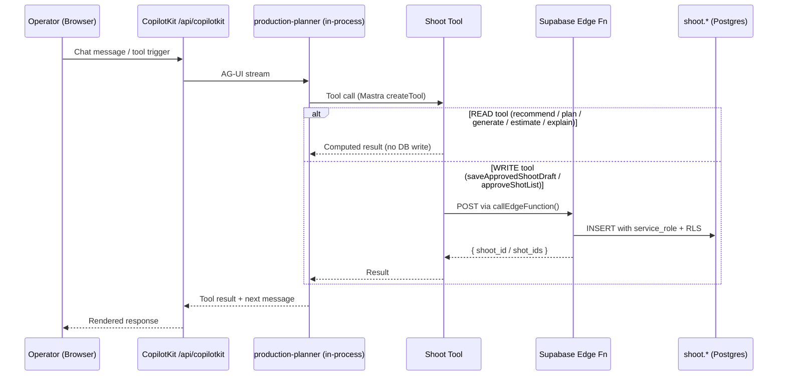
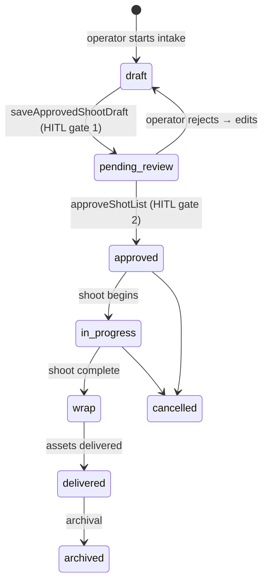
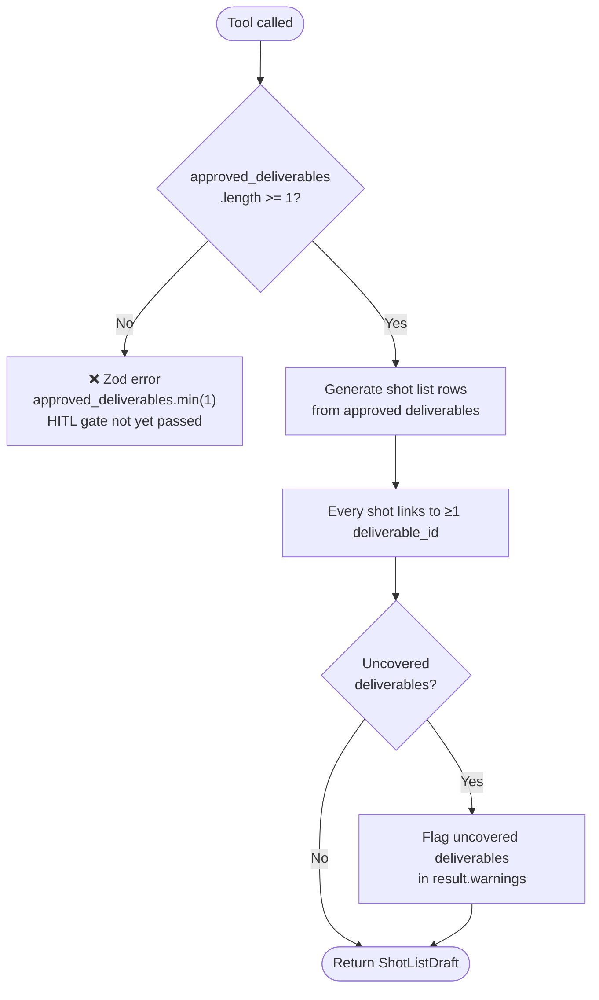
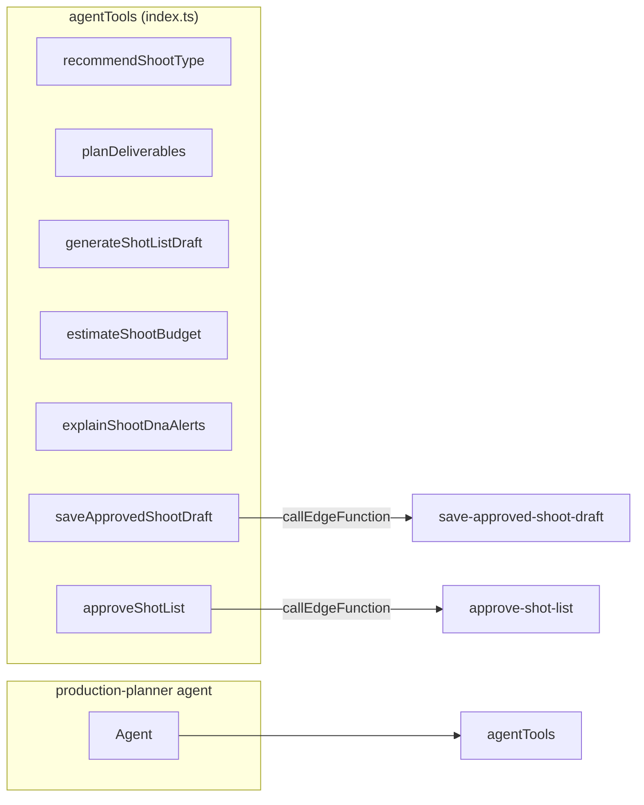

# IPI-148 — SHOOT-AI-001: Shoot Planner Agent

`production-planner` wired with 7 shoot-specific tools. Route `/app/shoots/*` → agent via IPI-51 route map.

## Tool execution chain

## Shoot status lifecycle

## generateShotListDraft — deliverables-first invariant

## Tool registry

