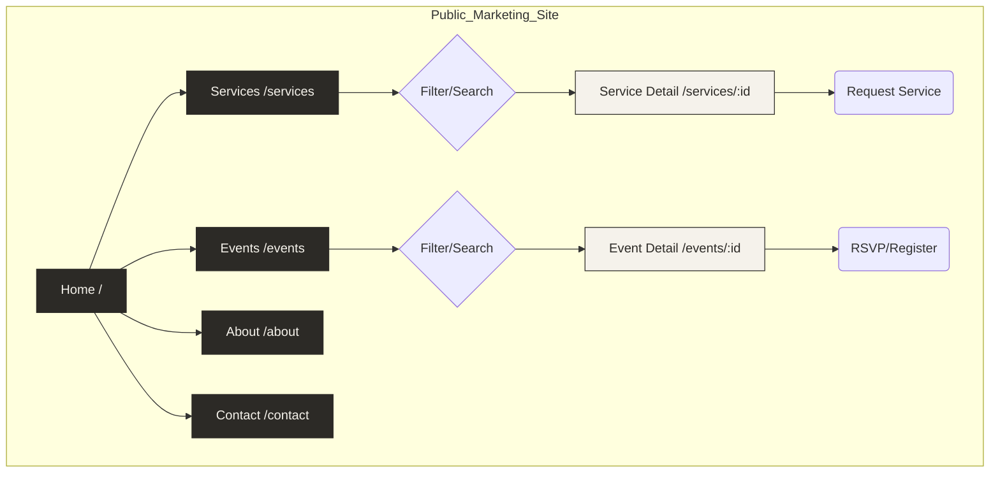

# FashionOS Marketing Website Plan

## 0. Project Status & Visualization

### Site Architecture Diagram


### Implementation Progress Tracker
- [ ] **Phase 1: Foundation (Global Systems)**
    - [ ] Update Navbar (Dropdowns for Services/Events)
    - [ ] Update Footer (Expanded Site Links)
    - [ ] Define reusable `Section` and `Container` components
    - [ ] Create `ServiceCard` and `EventCard` components

- [ ] **Phase 2: Core Landing Pages**
    - [ ] **Home**: Hero Redesign, Value Prop, Service Preview
    - [ ] **About**: Mission, Team Grid, "Manual-First" copy
    - [ ] **Contact**: Inquiry Form Layout

- [ ] **Phase 3: Directory Data & Views**
    - [ ] Create `SERVICES_DATA` constant (9 items)
    - [ ] Create `EVENTS_DATA` constant (Mock schedule)
    - [ ] Build `/services` (Grid + Filter)
    - [ ] Build `/events` (Grid + Filter)

- [ ] **Phase 4: Detail Templates**
    - [ ] Build Generic Service Detail View
    - [ ] Build Generic Event Detail View
    - [ ] Wire up internal navigation/routing

---

## 1. Site Goals
*   **Establish Authority**: Position FashionOS as the definitive "Operating System" for the fashion industry (Runway to Retail).
*   **Lead Generation**: Drive signups for Brand Profiles and inquiries for specific services.
*   **Service Clarity**: Clearly articulate the high-touch, manual-first services (Photography, Design, Event orchestration) available immediately.
*   **Event Discovery**: Act as a central hub for fashion week schedules and private showings to attract industry stakeholders.

## 2. Sitemap
*   `/` (Home)
*   `/services` (Services Hub)
    *   `/services/fashion-photography`
    *   `/services/product-photography`
    *   `/services/jewellery-photography`
    *   `/services/ecommerce-photography`
    *   `/services/clothing-photography`
    *   `/services/retouching`
    *   `/services/website-design`
    *   `/services/social-media`
    *   `/services/video-services`
*   `/events` (Events Hub)
    *   `/events/{event-slug}` (Event Detail)
*   `/about` (Mission & Vision)
*   `/contact` (Booking & Inquiry)

## 3. Directory Structure (Frontend)
Recommended structure to organize marketing views within the existing React setup:

```text
src/
├── components/
│   ├── layout/          # Global marketing layout wrappers
│   ├── sections/        # Large page sections (Hero, Features, Trust)
│   └── cards/           # Reusable cards (ServiceCard, EventCard)
├── pages/               # Page-level components (mapped to App.tsx views)
│   ├── home/
│   ├── services/
│   │   ├── index.tsx    # Services Hub
│   │   └── Detail.tsx   # Service Detail Template
│   ├── events/
│   │   ├── index.tsx    # Events Hub
│   │   └── Detail.tsx   # Event Detail Template
│   ├── about/
│   └── contact/
└── data/                # Static content strings/config
```

## 4. Global Layout System
*   **Header**:
    *   Sticky, transparent-to-white on scroll.
    *   Logo: Left aligned (FashionOS).
    *   Nav: Center aligned (Desktop).
    *   Actions: Right aligned (Log In / Sign Up).
*   **Footer**:
    *   5-Column Grid: Brand info, Shop/Services, Events, Company, Newsletter.
    *   Clean, generous padding (py-24).
*   **Container Widths**:
    *   `max-w-[1800px]` for full-width aesthetic (matching current design).
    *   `max-w-6xl` for text-heavy content (About, Service Details).
*   **Spacing Rhythm**:
    *   Sections: `py-24` or `py-32`.
    *   Gap: `gap-8` (grid), `gap-12` (sections).
*   **Card System**:
    *   **Service Card**: Aspect ratio 4:5 image, title overlay or bottom caption, minimal border.
    *   **Event Card**: Landscape image, date badge, bold typography for City/Title.

## 5. Navigation Requirements
### Top Menu
*   **Home**
*   **Services** (Dropdown):
    *   *Main Link*: All Services
    *   *Quick Links*: Photography, Design, Video, Social.
*   **Events** (Dropdown):
    *   *Main Link*: Calendar
    *   *Highlight*: "Fashion Week 2025"
*   **About**
*   **Contact**

### Footer
*   **Services**: List all 9 core services.
*   **Events**: Latest Events, Host an Event.
*   **Company**: About, Contact, Careers (placeholder).
*   **Legal**: Privacy Policy, Terms of Service.

## 6. Page-by-Page UX Plan

### Home (`/`)
1.  **Hero Section**:
    *   Split screen or Collage (Current `Hero.tsx` style).
    *   H1: "The Operating System for Fashion Intelligence."
    *   CTA: "Create Brand Profile".
2.  **Value Proposition**:
    *   3-4 Icon/Text blocks: "Orchestrate," "Create," "Connect."
3.  **Services Preview**:
    *   Horizontal scroll or Grid of top 3 services (e.g., Photography, Web Design).
    *   Link: "View All Services".
4.  **Events Preview**:
    *   "Upcoming on the Runway" section.
    *   2-3 Event Cards.
5.  **Trust/Social Proof**:
    *   "Trusted by" logos (grayscale).
6.  **Final CTA**:
    *   "Join the network."

### Services Parent (`/services`)
1.  **Intro**:
    *   H1: "Creative Services."
    *   Sub: "From concept to commerce."
2.  **Filter Bar**:
    *   Categories: Photography, Digital, Production.
3.  **Service Grid**:
    *   Grid of cards for all 9 services.
    *   Image-heavy, hover states for "Quick Inquiry".
4.  **CTA Block**:
    *   "Need a custom package? Contact us."

### Service Detail Template (`/services/{slug}`)
1.  **Hero**:
    *   Full-width background image relevant to service.
    *   H1: Service Name (e.g., "Jewellery Photography").
2.  **Overview**:
    *   "What we deliver" (Bullet points).
3.  **Portfolio/Gallery**:
    *   Masonry grid of examples.
4.  **Process**:
    *   Step 1: Briefing.
    *   Step 2: Production.
    *   Step 3: Delivery.
5.  **Use Cases**:
    *   Example: "Campaign for Brand X."
6.  **Sticky CTA**:
    *   "Book this Service" button (leads to Contact/Booking form).

### Events Parent (`/events`)
1.  **Intro**:
    *   H1: "Global Directory."
2.  **Filters**:
    *   City (Paris, Milan, NYC, London).
    *   Type (Runway, Showroom, Party).
    *   Time (Upcoming, Past).
3.  **Events Grid**:
    *   Cards displaying: Date, Title, Location, RSVP status.
4.  **Host CTA**:
    *   "List your event on FashionOS."

### Event Detail Template (`/events/{slug}`)
1.  **Hero**:
    *   Event Banner Image.
    *   Date/Time Badge.
    *   H1: Event Title.
2.  **Key Info Sidebar**:
    *   Venue Map placeholder.
    *   Organizer Name.
    *   Access Level (Public/Private/Invite Only).
3.  **Description**:
    *   Agenda/Run of Show.
4.  **Stakeholders**:
    *   "Who is attending" (Brands, Media - placeholders).
5.  **RSVP/Register CTA**:
    *   Form or External Link.

### About (`/about`)
1.  **Mission Statement**:
    *   Focus on "Slow Fashion meets Fast Tech."
2.  **Approach**:
    *   "Manual-first, AI-enhanced."
3.  **Team**:
    *   Editorial style portraits of key leadership.

### Contact (`/contact`)
1.  **Inquiry Form**:
    *   Fields: Name, Brand, Inquiry Type (Service/Event/General).
2.  **Direct Contact**:
    *   Email addresses for press, support.

## 7. Style Guide (Simple)
*   **Typography**:
    *   **Headings**: `Playfair Display` (Serif). Weights: 400, 500.
    *   **Body**: `Inter` (Sans). Weights: 300 (Light), 400 (Regular).
*   **Colors**:
    *   **Backgrounds**: `#F5F2EB` (Bone), `#FFFFFF` (White).
    *   **Text**: `#2C2A26` (Charcoal), `#5D5A53` (Taupe).
    *   **Accent**: `#CF5ae0` (FashionOS Pink - sparse usage), `#A8A29E` (Stone).
*   **Buttons**:
    *   **Primary**: Black background (`#000`), White text, uppercase, tracking-widest, sharp corners (no rounded).
    *   **Secondary**: Transparent, Border bottom, hover underline.
*   **Cards**:
    *   Zero border radius (Sharp edges).
    *   Subtle hover lift or image zoom.
    *   Minimalist borders (`border-gray-100`).

## 8. Image Strategy
*   **Editorial**: All photography should look like high-end magazine spreads (Vogue/Kinfolk style).
*   **Desaturated/Moody**: Prefer lower saturation or high contrast B&W.
*   **Textures**: Use close-ups of fabric, stone, and skin to break up whitespace.
*   **Collage**: Overlapping images for Hero sections to create depth.

## 9. Conversion Plan
*   **Primary Goal**: "Create Brand Profile" (Sign Up).
    *   Placement: Sticky Header, Hero Center, Footer.
*   **Service Goal**: "Request Service".
    *   Placement: Bottom of every Service Detail page.
*   **Event Goal**: "RSVP".
    *   Placement: Event Detail page.
*   **Fallback**: "Join Newsletter".
    *   Placement: Footer (already implemented), Modal on exit intent.

---

## 10. Success Criteria
*   **Visual Fidelity**: Application matches the "FashionOS" aesthetic (premium, minimal, sharp edges).
*   **Navigation**: Smooth scrolling and state transitions work without page reloads.
*   **Responsiveness**: Layout adapts gracefully to Mobile (hamburger menu), Tablet (grid changes), and Desktop (max-width constraints).
*   **Data Integrity**: All service and event data is loaded from `constants.ts` and renders correctly in detail views.

## 11. Production Ready Checklist
- [ ] **SEO**: Meta titles and descriptions dynamic based on View State.
- [ ] **Performance**: Images lazily loaded or optimized (WebP).
- [ ] **Accessibility**: ARIA labels on all interactive elements (especially the custom cart/nav).
- [ ] **404 Handling**: Graceful fallback if an ID isn't found in the constant data.
- [ ] **Cross-Browser**: Tested on Chrome, Safari, Firefox.
