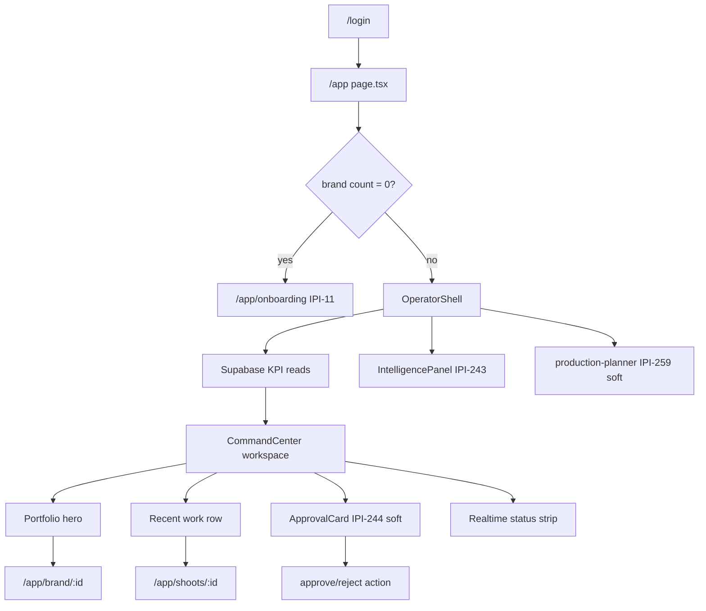
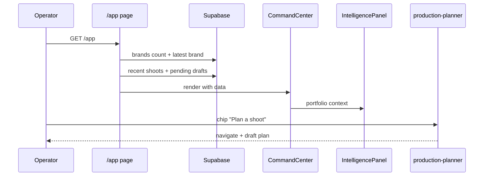
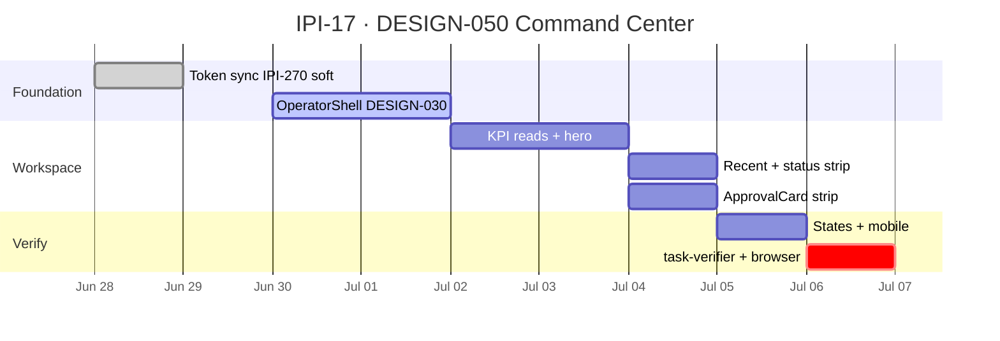

# IPI-17 · DESIGN-050 — Command Center React Parity Workspace

**Linear:** https://linear.app/amo100/issue/IPI-17  
**Parent:** [IPI-254](https://linear.app/amo100/issue/IPI-254) · DESIGN V2  
**Priority:** Urgent · P0 #1 in [`tasks/plan/todo.md`](../../tasks/plan/todo.md)  
**Wireframe:** [`tasks/wireframes-ipix/IPI-17-DESIGN-050-command-center.wire`](../../tasks/wireframes-ipix/IPI-17-DESIGN-050-command-center.wire)  
**Status:** Done · merged [#168](https://github.com/amo-tech-ai/lumina-studio/pull/168) `9eba76f` · 2026-07-01

---

## Plain English

After this ships, operators land on `/app` and see a **portfolio-first dashboard** — live system status, brand hero, recent work, pending approvals, and one-click next actions — inside the **3-panel OperatorShell**, not a link grid.

**Blocked by:** nothing hard · **Unblocks:** operator first impression · KPI routing · AI context on every session

---

## The problem this solves

- Today `/app` is a **card router** (~15% DC) with placeholder status strings — not the main dashboard from [`Command Center.v2.image-first.dc.html`](../../Universal%20design%20prompt/Command%20Center.v2.image-first.dc.html).
- No **OperatorShell** — page is standalone; IntelligencePanel / NavSidebar not wired on home.
- No **Supabase KPI reads** — counts are fake; approvals strip missing.
- Operators don't see **highest-priority action** on login (approvals, deliverables, shoot plan).

**Fix:** DC parity upgrade on existing route — preserve IPI-11 zero-brand → onboarding redirect.

---

## User story

> As an **operator**, when I open FashionOS after login,  
> I see my portfolio hero, recent work, and pending approvals with clear next actions,  
> so I can decide what to do in one glance without hunting workspace cards.

---

## Design reference

| Source | Path |
|--------|------|
| **DC prototype (SSOT visual)** | [`Universal design prompt/Command Center.v2.image-first.dc.html`](../../Universal%20design%20prompt/Command%20Center.v2.image-first.dc.html) |
| Handoff screen map | [`tasks/design-docs/handoff/02-screen-map.md`](../../tasks/design-docs/handoff/02-screen-map.md) §1 |
| Checklist | [`tasks/design-docs/handoff/11-screen-checklists.md`](../../tasks/design-docs/handoff/11-screen-checklists.md) · Command Center |
| State map | [`tasks/design-docs/handoff/08-state-map.md`](../../tasks/design-docs/handoff/08-state-map.md) |
| Agent map | [`tasks/design-docs/handoff/06-ai-workflows.md`](../../tasks/design-docs/handoff/06-ai-workflows.md) · `production-planner` |
| Implementation map | [`tasks/design-docs/handoff/09-react-implementation-map.md`](../../tasks/design-docs/handoff/09-react-implementation-map.md) |

---

## Current production state

| Area | Today | Gap |
|------|-------|-----|
| Route `/app` | ✅ `CommandCenter` component | Not SectionPlaceholder |
| Layout | 🔴 standalone page | No OperatorShell 3-panel |
| KPI data | 🔴 placeholder strings | No Supabase reads |
| DC hero / portfolio | 🔴 | Card grid only |
| Recent work row | 🔴 | Missing |
| Realtime status strip | 🔴 | Missing |
| Approvals strip | 🔴 | Stub count/card OK · **soft dependency:** [IPI-244](https://linear.app/amo100/issue/IPI-244) for full queue |
| Agent | 🟡 | production-planner via route map ✅ |
| Zero-brand redirect | ✅ IPI-11 | Preserve |

**Code today:** `app/src/components/command-center/command-center.tsx` · `app/src/app/(operator)/app/page.tsx`

---

## Wireframe

### Desktop (OperatorShell)

```text
┌ Nav ─┬──────── Command Center workspace ──────────────────┬─ Intel ─┐
│Brand │ [● Live] Realtime status strip          [Refresh]   │ Portfolio│
│rail  │ ┌ hero MediaCard ─────────────────────────────┐    │ summary  │
│Work- │ │ cover · "You're working with {brand}"      │    │ chips    │
│spaces│ │ quick: [Deliverables][Approvals][Shoot]    │    │          │
│      │ └────────────────────────────────────────────┘    │ Copilot  │
│      │ Recent work ─────────────────────── [View all]    │ sidebar  │
│      │ ┌tile┐ ┌tile┐ ┌tile┐ ┌tile┐ → scroll            │          │
│      │ [ApprovalCard compact/large if pending]           │          │
│      │ PersistentChatDock                                │          │
└──────┴───────────────────────────────────────────────────┴──────────┘
```

### Mobile

Bottom tabs · Intel as sheet · chat dock above tabs · status strip full width.

**Wire DSL:** [`IPI-17-DESIGN-050-command-center.wire`](../../tasks/wireframes-ipix/IPI-17-DESIGN-050-command-center.wire)

---

## States

| State | What to show |
|-------|----------------|
| **populated** | Hero + recent row + quick chips + optional compact approval |
| **loading** | Skeleton hero + skeleton recent row (no spinner) |
| **empty** | Welcome hero + "Set up brand" → onboarding |
| **error** | Inline error + Retry · Report |
| **approval** | Prominent ApprovalCard (HITL) + thinking indicator |
| **realtime strip** | live · reconnecting · stale · blocked (+ Refresh / Request access) |

Brand row in nav → `/app/brand/:id`

---

## Flow diagram





---

## Scope

- Wrap `/app` in **OperatorShell** (DESIGN-030)
- Replace card grid with DC workspace sections per prototype
- **Supabase reads:** brand count · latest brand hero · recent shoots · `pending_approval` draft count
- **Realtime status strip** (UI states; live wiring soft)
- **ApprovalCard** on dashboard when pending (compact → large)
- **production-planner** context + contextual chips (not generic greeting)
- **5 states** + mobile shell pattern
- Preserve **IPI-11** redirect

## Out of scope

- Campaigns / Matching / Assets full screens
- EvidenceBlock modal wiring → IPI-172
- Playwright bootstrap → IPI-258 (manual smoke OK for MVP)
- New migrations (read existing tables only)

---

## Dependencies

| Type | Issue | Status |
|------|-------|--------|
| **Recommended first** | [IPI-270](https://linear.app/amo100/issue/IPI-270) DESIGN-010 tokens | ⚪ do before CC to avoid restyle twice |
| **Done** | [IPI-243](https://linear.app/amo100/issue/IPI-243) IntelligencePanel | ✅ |
| **Done** | [IPI-110](https://linear.app/amo100/issue/IPI-110) route-agent map | ✅ |
| **Done** | [IPI-197](https://linear.app/amo100/issue/IPI-197) contextual sidebar | ✅ |
| **Done** | [IPI-255](https://linear.app/amo100/issue/IPI-255) live intel data | ✅ |
| **Soft dependency** | [IPI-244](https://linear.app/amo100/issue/IPI-244) approval queue + HITL in IntelligencePanel | ⚪ stub count/card OK for MVP — not a ship blocker |
| **Soft** | DESIGN-030 OperatorShell | ⚪ largely shipped via IPI-110 |
| **Soft** | DESIGN-040 ApprovalCard | 🟡 partial — reuse brand-hub card |
| **Soft** | [IPI-275](https://linear.app/amo100/issue/IPI-275) PersistentChatDock | ⚪ |
| **Soft** | [IPI-259](https://linear.app/amo100/issue/IPI-259) planner agent tools | ⚪ |

**Can start IPI-17 after IPI-270** (or in parallel if accepting a token pass later). **Not blocked by IPI-244** — use approvals count or one stub card first; full queue ships in IPI-244.

---

## Implementation steps

| Step | Work | Test / proof |
|------|------|--------------|
| **0** | Audit `command-center.tsx` — keep vs replace table | PR diff note |
| **A** | OperatorShell + DC layout per prototype | visual 1440 |
| **B** | Supabase KPI queries | populated state |
| **C** | 5 states + realtime strip variants | state matrix |
| **D** | Preserve zero-brand → onboarding | redirect test |
| **E** | Browser smoke `/app` | manual + `@task-verifier` |

**Branch:** `ipi/17-command-center` · worktree `../wt-ipi-17-command-center`

---

## Skills & audit workflow (`.claude/skills`)

Load skills **in order** per phase. SSOT inventory: [`tasks/intelligence/ai/skill-map.md`](../../tasks/intelligence/ai/skill-map.md).

### Phase 1 — Plan (before first line of UI code)

| Skill | Path | Run when |
|-------|------|----------|
| **ipix-task-lifecycle** | `.claude/skills/ipix-task-lifecycle/SKILL.md` | Orchestrator — phases 1→5, Linear A–E, per-step Test blocks |
| **claude-design-handoff** | `.claude/skills/claude-design-handoff/SKILL.md` | DC intake — `Command Center.v2.image-first.dc.html` → gap table vs `command-center.tsx` (Step 0) |
| **ipix-wireframe** | `.claude/skills/ipix-wireframe/SKILL.md` | Confirm wire DSL matches DC sections before coding |
| **mermaid-diagrams** | `.claude/skills/mermaid-diagrams/SKILL.md` | Flow / sequence diagrams in issue + PR (already in spec) |

**Read first:** [`tasks/design-docs/handoff/11-screen-checklists.md`](../../tasks/design-docs/handoff/11-screen-checklists.md) § Command Center · [`design.md`](../../design.md) tokens (post IPI-270).

### Phase 2 — Research (orientation)

| Skill | Path | Run when |
|-------|------|----------|
| **graphify** | `.claude/skills/graphify/SKILL.md` | Multi-file — `graphify query "Command Center OperatorShell"` before editing shell + CC |
| **ipix-supabase** | `.claude/skills/ipix-supabase/SKILL.md` | KPI read paths only — brands · shoots · pending approvals (no new migration) |
| **worktrees** | `.claude/skills/worktrees/SKILL.md` | Branch `ipi/17-command-center` in `../wt-ipi-17-command-center` |

**MCP (read-only):** Supabase MCP — confirm RLS on `brands`, `shoots`, approval/draft tables before wiring server reads.

### Phase 3 — Implement (by step)

| Step | Primary skills | Path |
|------|----------------|------|
| **0** Audit keep vs replace | **lean** | `.claude/skills/lean/SKILL.md` |
| **A** DC layout in shell | **claude-design-handoff** · **frontend-design** · **shadcn** | handoff Step 7 · `frontend-design/` · `shadcn/` |
| **B** Supabase KPI reads | **ipix-supabase** | `.claude/skills/ipix-supabase/SKILL.md` |
| **C** 5 states + strip | **frontend-design** · **shadcn** | CSS modules + tokens — no hardcoded hex |
| **D** Zero-brand redirect | **gen-test** | `.claude/skills/gen-test/SKILL.md` — extend `page.tsx` / redirect test |
| **E** Agent context (soft) | **copilotkit** | `.claude/skills/copilotkit/SKILL.md` — preserve IPI-197 chips; `production-planner` via route map only |

**Do not load for MVP:** `mastra` (IPI-259 soft) · `cloudinary` · `create-migration` (reads only).

**Next.js 16:** If `nextjs-16` skill is on branch — proxy-only entry, no dual `middleware.ts` (see CLAUDE.md).

### Phase 4 — Test & audit (mandatory before Done)

| Skill | Path | Run when |
|-------|------|----------|
| **task-verifier** | `.claude/skills/task-verifier/SKILL.md` | **Done gate** — run § Verification probes below + [references/mcp-cadence-ipix.md](../../.claude/skills/task-verifier/references/mcp-cadence-ipix.md) |
| **gen-test** | `.claude/skills/gen-test/SKILL.md` | Vitest for KPI fetch · greeting · redirect |
| **lean** | `.claude/skills/lean/SKILL.md` | Pre-PR scope trim — DESIGN-050 workspace only, no agent wiring bundle |

**Browser smoke:** `agent-browser` (`.claude/skills/archive/agent-browser/SKILL.md`) or Cursor browser MCP — `/app` populated + empty states → `docs/ecommerce/evidence/YYYY-MM-DD/ipi-17-command-center/`.

**Optional review:** `@qa-reviewer` subagent after implementation — acceptance criteria + mobile 375px.

### Phase 5 — Ship

| Skill | Path | Run when |
|-------|------|----------|
| **ipix-task-lifecycle** | `.claude/skills/ipix-task-lifecycle/SKILL.md` | Phase 5 shipping — PR template, tracker row, Linear Done |
| **linear** | `.claude/skills/linear/SKILL.md` | Sync issue checkboxes · `node scripts/linear-update-issue.mjs IPI-17` |

### Audit checklist (task-verifier)

Run **`@task-verifier`** against this issue before flipping Linear → Done:

```text
[ ] Source-of-truth: todo.md P0 row · handoff checklist § Command Center · no conflict with IPI-270 tokens
[ ] Readiness probes (§ Verification — Before execution) — all exit 0
[ ] Ship probes (§ Verification — After execution) — lint · test · build green
[ ] No GEMINI_API_KEY / SERVICE_ROLE in app/src/components/command-center
[ ] No new hardcoded hex in command-center/* (use tokens.css)
[ ] IPI-11 redirect preserved (test or manual)
[ ] Browser evidence path populated
[ ] One concern per PR — no IPI-259 / IPI-244 / intel-panel bundle
```

---

## Acceptance criteria

- [x] Matches [`11-screen-checklists.md`](../../tasks/design-docs/handoff/11-screen-checklists.md) Command Center section (workspace column; shell pre-shipped IPI-243)
- [x] Uses OperatorShell + IntelligencePanel ([IPI-243](https://linear.app/amo100/issue/IPI-243) ✅)
- [x] Supabase KPI reads: brands · shoots · pending approvals
- [x] `production-planner` agent context via route map ([IPI-247](https://linear.app/amo100/issue/IPI-247) ✅)
- [x] 5 states: populated · loading · empty · error · approval
- [x] Realtime strip: live / reconnecting / stale / blocked (UI states; live subscription deferred)
- [x] IPI-11 zero-brand redirect preserved
- [x] Zeely tokens — no hardcoded hex in `command-center/`
- [x] Evidence: `docs/ecommerce/evidence/2026-07-01/ipi-17-command-center/`

---

## Verification (`@task-verifier`)

### Before execution (readiness)

| Probe | Command | Pass |
|-------|---------|------|
| DC prototype exists | `test -f "Universal design prompt/Command Center.v2.image-first.dc.html"` | exit 0 |
| Wireframe exists | `test -f tasks/wireframes-ipix/IPI-17-DESIGN-050-command-center.wire` | exit 0 |
| Route exists | `test -f app/src/app/(operator)/app/page.tsx` | exit 0 |
| Component exists | `test -f app/src/components/command-center/command-center.tsx` | exit 0 |
| IntelligencePanel shipped | `rg IntelligencePanel app/src/components/operator-panel` | matches |
| Agent map `/app` | `npm test src/lib/route-agent-map.test.ts` | production-planner |
| Dependencies done | IPI-243 · IPI-110 · IPI-197 Linear **Done** | manual |

### After execution (ship gate)

| Probe | Command | Pass |
|-------|---------|------|
| Lint | `cd app && npm run lint` | exit 0 |
| Tests | `cd app && npm test` | exit 0 |
| Build | `cd app && npm run build` | exit 0 |
| No client secrets | `rg 'GEMINI_API_KEY|SERVICE_ROLE' app/src/components/command-center` | 0 |
| Hardcoded hex | `rg '#E87C4D|#FBF8F5' app/src/components/command-center` | 0 in new code |
| Redirect | zero brands → `/app/onboarding` | manual or test |
| Browser | `/app` populated + empty states | screenshot evidence |

**Playwright:** defer until IPI-258 — not a blocker for this PR.

**Evidence path:** `docs/ecommerce/evidence/YYYY-MM-DD/ipi-17-command-center/`

---

## Gantt (execution)



---

## Partial ship note (2026-06-30)

PR queue (#157 brand-agent, #160 graphify) does **not** block this task — different surface. Merge IPI-17 as **DESIGN-050 workspace only**; do not bundle agent wiring PRs.
