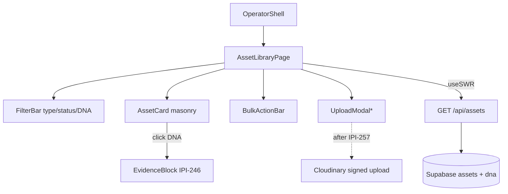
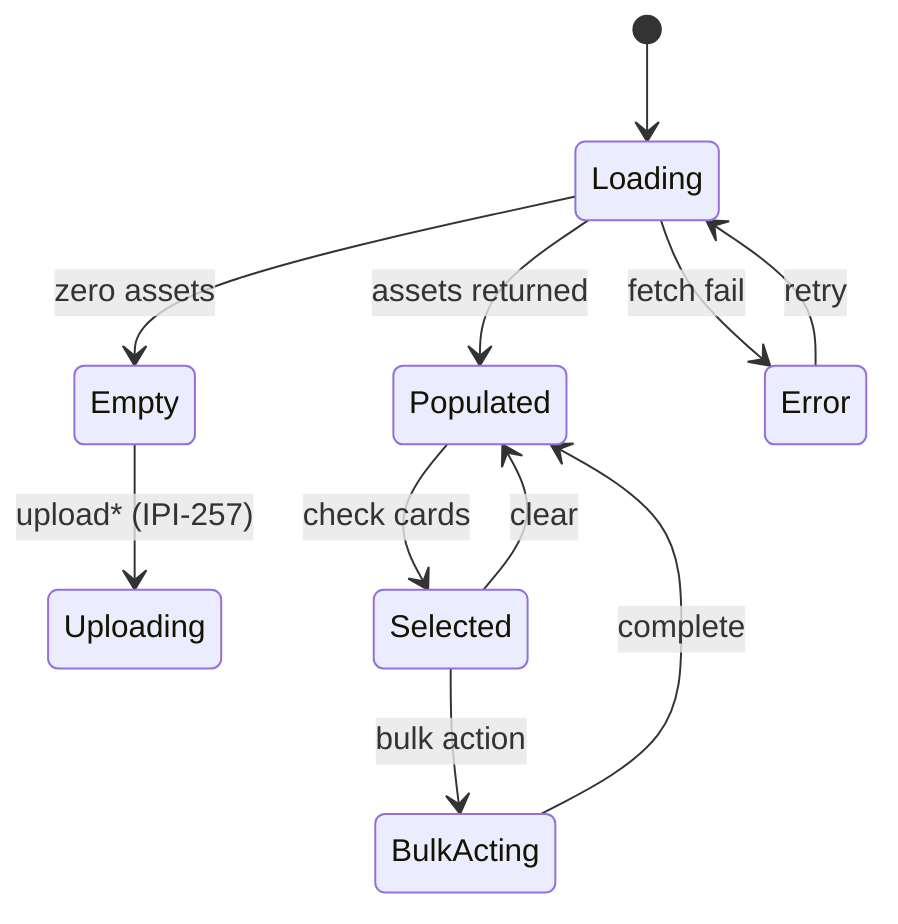

# IPI-248 · DESIGN-057 — Asset Library React Parity Workspace

**Linear:** https://linear.app/amo100/issue/IPI-248
**Wireframe:** `tasks/wireframes-ipix/IPI-248-DESIGN-057-asset-library.wire`  
**Status:** Todo · Synced 2026-07-03

> Mirrors the Linear issue — one implementation contract in both places.

---

## Overview

Replace `/app/assets` SectionPlaceholder with Claude Design **Asset Library** — masonry grid, DNA match, upload modal, bulk selection, EvidenceBlock explain flow.

**Tracker:** DESIGN-057 · Route: `/app/assets` · Agent: **creative-director**

**Soft gate on IPI-257:** Read-only masonry + DNA display can ship before Cloudinary upload (074a). Full upload UX requires IPI-257.

## Design reference

| Source | Path |
|--------|------|
| DC prototype | `Universal design prompt/Assets.v2.image-first.dc.html` |
| DC component | `Universal design prompt/components/AssetCard.dc.html` |
| DC components | `FilterBar.dc.html` · `EvidenceBlock.dc.html` · `EmptyState.dc.html` · `SkeletonLoader.dc.html` |
| Checklist | `tasks/design-docs/handoff/11-screen-checklists.md` · Assets |

## Acceptance criteria

- [ ] Matches handoff/11 Assets checklist
- [ ] Uses shared AssetCard, FilterBar, EvidenceBlock (IPI-246)
- [ ] Loading · empty · error · selected states
- [ ] Upload after IPI-257 074a
- [ ] Browser + Playwright verified

**Blocked by:** IPI-246 · IPI-247 · IPI-257 (upload only — read-only scaffold can waive)

---

# Implementation Prompt Pack (2026-06-30)

**Worktree:** `ipi/248-asset-library` · `../wt-ipi-248-asset-library`
**Skills to run:** frontend-design · shadcn · cloudinary · copilotkit (v2) · mastra · ipix-wireframe · mermaid-diagrams · task-verifier
**Design file (READ FIRST):** `Universal design prompt/Assets.v2.image-first.dc.html` · components `AssetCard.dc.html` · `FilterBar.dc.html` · `EvidenceBlock.dc.html` · `EmptyState.dc.html` · `SkeletonLoader.dc.html` · `tasks/design-docs/handoff/11-screen-checklists.md` (Assets)
**MCP:** Cloudinary MCP (delivery URLs — upload only after IPI-257) · CopilotKit MCP

## User stories

* As a **creative director**, I browse all brand assets in an image-first masonry grid, so I can curate at a glance.
* As a **creative director**, I click an asset's DNA score and an EvidenceBlock explains *why* (pillars + confidence) so I trust the rating.
* As a **producer**, I filter by type/status/DNA and multi-select for bulk actions.
* As a **producer**, I upload new assets (after IPI-257) with progress, never a blank spinner.
* As a **developer**, the grid reuses shared `AssetCard` + `FilterBar` + `EvidenceBlock` — no forks; read-only masonry ships before upload.

## Desktop wireframe

```
+----------+--------------------------------------+-----------+
| Sidebar  | Assets        [Filter] [Upload*] [..]|  Intel    |
| nav      | [ ] select-all   3 selected [Bulk v] |  panel    |
|          | +----+ +------+ +----+ +--------+    | (IPI-243) |
|          | |img | | img  | |img | | img    |    |           |
|          | |92  | | 78   | |DNA | | 85     |    | Evidence  |
|          | +----+ +------+ +----+ +--------+    | on score  |
|          |  (masonry, varied heights)           |           |
+----------+--------------------------------------+-----------+
| PersistentChatDock (IPI-275) - creative-director           |
+------------------------------------------------------------+
   * Upload enabled only after IPI-257 074a
```

## Mobile wireframe (<=1024px)

```
+----------------------+
| Assets   [Filter][+] |
| 3 selected  [Bulk v] |
| +------+ +------+    |  <- 2-col masonry
| | img  | | img  |    |
| | 92   | | 78   |    |
| +------+ +------+    |
+----------------------+
| DNA why -> BottomSheet (IPI-251)
| chat . Assets   [up] |
| [o][o][o][o]         |
+----------------------+
```

## Component / data map



## Library + selection states



## Frontend <-> backend wiring

| Route | Status | Auth | Returns |
| -- | -- | -- | -- |
| `GET /api/assets` | check / create | withOperatorAuth | `{ assets: AssetCardData[] }` (incl. dna score) |
| `POST /api/assets/upload-sign` | after IPI-257 | withOperatorAuth | Cloudinary signed params |

Fetch: `useSWR('/api/assets')` gated on brand · Agent: creative-director via route-agent-map (IPI-247).

## Implementation steps (Test block each)

| Step | Prompt | Test / proof |
| -- | -- | -- |
| **A** | OperatorShell + `/app/assets` page; FilterBar (type/status/DNA) | shell + filter render |
| **B** | `AssetCard` masonry per `Assets.v2.image-first.dc.html` (image-first + DNA chip) | matches DC at 1440 |
| **C** | DNA click -> EvidenceBlock (IPI-246) inline/sheet | evidence shows pillars + confidence |
| **D** | Bulk selection + BulkActionBar; states loading/empty/error/selected | all 4 states render |
| **E** | Upload modal **gated** on IPI-257 (signed upload + progress); read-only ships first | scaffold works; upload behind flag |

## Out of scope

Cloudinary pipeline internals (IPI-257) · EvidenceBlock component (IPI-246) · DNA scoring agent (IPI-152/261). Library UI only; upload behind IPI-257.

## Verification

```bash
cd app && npm run lint && npx tsc --noEmit && npm run build && npm run test:e2e
rg -n '#[0-9a-fA-F]{3,6}' app/src/app/\(operator\)/app/assets   # expect 0
```

Route to test: `/app/assets` — populated + empty + error + multi-select + DNA explain + mobile 390px.

## Evidence required (Done gate)

- [ ] Desktop + mobile screenshots (loading/empty/error/selected + DNA explain)
- [ ] Playwright report · task-verifier
- [ ] PR link · Linear → Done

## task-verifier checklist

- [ ] Shared AssetCard/FilterBar/EvidenceBlock reused (no forks)
- [ ] All states render (loading/empty/error/selected)
- [ ] Upload strictly gated behind IPI-257 flag (read-only ships first)
- [ ] No hardcoded hex; one-concern PR
