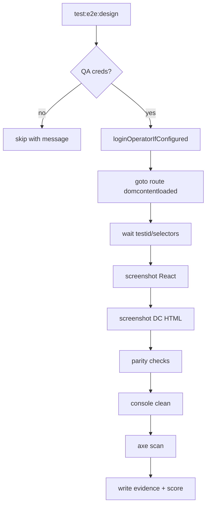
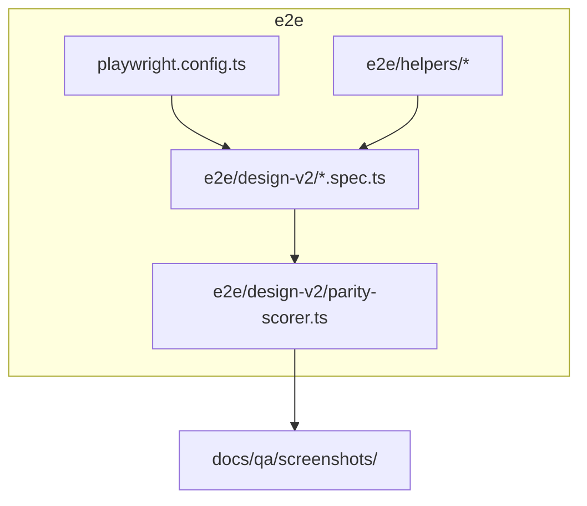
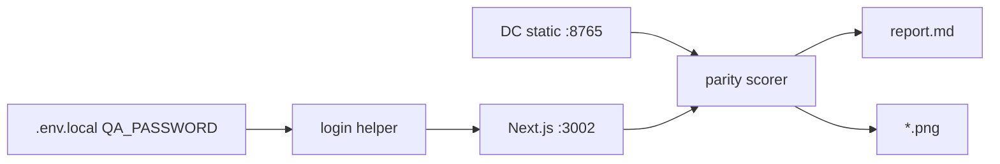

# IPI-258 · DESIGN-080 — Playwright Design Verification Framework

**Linear:** https://linear.app/amo100/issue/IPI-258  
**Parent:** IPI-254 · **Project:** DESIGN V2 — Operator React Parity  
**Status:** Backlog · Spec synced 2026-07-02

---

## 1. Purpose

Automated design verification for every Design V2 operator screen: login → navigate → load data → screenshot → compare against DC HTML reference → score pass/fail with evidence bundle.

## 2. User story

> As a **QA lead**, I run one command and get per-screen screenshots, HTML parity reports, console/network cleanliness, a11y scores, and a Markdown QA summary — so no screen ships without measurable DC parity.

## 3. Business value

- Catches visual regressions before merge (Brand List PR #181 class of issues)
- Standardizes evidence for `tasks/design-docs/design/SCREEN-DOD.md`
- Unblocks ⭐ sign-off on DV2-M4 · Production Verified

## 4. Scope

**In scope:** Playwright harness · DC side-by-side server · per-screen spec matrix · screenshot diff · typography/spacing/color heuristics · console/network filters · a11y axe gate · evidence output · CI optional gate

**Out of scope:** Pixel-perfect sub-pixel diff (use tolerance bands) · Mercur/B2C storefront · Vite legacy `src/`

## 5. Features

- [ ] **081 Bootstrap** — `@playwright/test` at repo root *(exists)* · extend `playwright.config.ts` · `npm run test:e2e` *(exists)* · QA auth helper *(exists: `e2e/helpers/mobile-audit`)*
- [ ] **082 DC reference server** — document `localhost:8765` static serve of `Universal design prompt/`
- [ ] **083 Per-screen spec** — one file per screen under `e2e/design-v2/`
- [ ] **084 Screenshot capture** — desktop 1280 · tablet 768 · mobile 390
- [ ] **085 Parity scorer** — layout hierarchy · key text · component roles · color token sampling
- [ ] **086 Console/network gate** — benign noise allowlist (404 favicon · CopilotKit SSR fallback)
- [ ] **087 Accessibility** — axe-core per route · ≥85 target (IPI-253)
- [ ] **088 Evidence bundle** — `docs/qa/screenshots/YYYY-MM-DD/<screen>/` + `report.md` + pass/fail score

## 6. Frontend

| Item | Detail |
|------|--------|
| **Components** | Reuse `loginOperatorIfConfigured`, `getQaCredentials` |
| **Routes** | All 13 screens + onboarding |
| **State** | Populated path required; empty/loading optional phase 2 |
| **Loading** | `domcontentloaded` + `data-testid` / role waits — never `networkidle` |
| **Errors** | Fail test on uncaught pageerror / app console error |
| **A11y** | axe on workspace + panel |
| **Responsive** | Projects: chromium-desktop, mobile-390, tablet-768 *(config exists)* |

## 7. Backend

No schema. Requires QA account + seeded brand data for populated paths.

## 8. CopilotKit

Verify no `useCopilotKit must be used within CopilotKitProvider` console errors on brand/command routes (benign filter documented).

## 9. Wireframe (harness layout)

```
┌─────────────────────────────────────────────────────────┐
│  Playwright runner                                       │
│  ┌──────────────┐    ┌──────────────┐    ┌─────────────┐ │
│  │ Login QA     │ →  │ React :3002  │ →  │ Screenshot  │ │
│  └──────────────┘    └──────────────┘    └─────────────┘ │
│         │                    │                  │         │
│         └────────────────────┼──────────────────┘         │
│                              ▼                            │
│                    ┌──────────────────┐                   │
│                    │ DC HTML :8765    │                   │
│                    │ (reference shot) │                   │
│                    └──────────────────┘                   │
│                              ▼                            │
│                    report.md + score                      │
└─────────────────────────────────────────────────────────┘
```

## 10. Mermaid

### User flow



### Component hierarchy



### Data flow



## 11. Testing

| Layer | Command |
|-------|---------|
| Unit | parity-scorer pure functions · vitest |
| Integration | panel API smoke in existing e2e |
| Playwright | `npm run test:e2e e2e/design-v2/` |
| DevTools | optional LCP budget per screen |
| A11y | axe in spec · fail &lt;85 |
| Regression | CI job `design-v2-parity` (optional until stable) |

## 12. Acceptance criteria

- [ ] Spec exists for all 13 screens (can skip unimplemented routes with explicit `test.skip`)
- [ ] Each spec: login · navigate · selector wait · screenshot · console clean
- [ ] DC comparison report generated with pass/fail score
- [ ] Evidence path documented in PR template
- [ ] `npm run test:e2e` green on implemented screens (Command Center · Brand List · Brand Detail minimum)
- [ ] No `networkidle` in new specs

## 13. Production readiness checklist

| Area | Gate |
|------|------|
| Security | QA creds never committed |
| Performance | Screenshot suite &lt;15 min full matrix |
| Accessibility | axe wired per screen |
| Error handling | Fail loud on missing selectors |
| Monitoring | CI artifact upload screenshots |
| Logging | report.md per run |
| Documentation | `e2e/design-v2/README.md` |
| Tests | scorer unit tests |
| Deployment | optional CI gate after 3 screens stable |
| Rollback | disable CI job only — no prod impact |

## Screen matrix

| Screen | Spec file | DC HTML | React route | Status |
|--------|-----------|---------|-------------|--------|
| Command Center | `command-center.spec.ts` | Command Center.v2… | `/app` | partial |
| Brand List | `brand-list.spec.ts` | Brand List.v2… | `/app/brand` | PR #181 |
| Brand Detail | `brand-detail.spec.ts` | Brand Detail.v2… | `/app/brand/[id]` | PR #181 |
| Onboarding | `onboarding.spec.ts` | Onboarding.v2.zeely… | `/app/onboarding` | todo |
| Shoots List | `shoots-list.spec.ts` | Shoots List.v2… | `/app/shoots` | todo |
| Shoot Wizard | `shoot-wizard.spec.ts` | Shoot Wizard.v2… | `/app/shoots/new` | todo |
| Shoot Detail | `shoot-detail.spec.ts` | Shoot Detail.v2… | `/app/shoots/[id]` | partial |
| Assets | `assets.spec.ts` | Assets.v2… | `/app/assets` | placeholder |
| Campaigns | `campaigns.spec.ts` | Campaigns.v2… | `/app/campaigns` | blocked IPI-268 |
| Matching | `matching.spec.ts` | Matching.v2… | `/app/matching` | blocked IPI-268 |
| Channel Preview | `channel-preview.spec.ts` | Channel Preview.v2… | `/app/preview` | partial |
| Analytics | `analytics.spec.ts` | Analytics.v2… | `/app/analytics` | blocked IPI-296 |
| Campaign Performance | `campaign-performance.spec.ts` | Campaign Performance.v2… | `/app/analytics/campaigns` | blocked IPI-297 |

## Dependencies

**Blocked by (soft):** screen routes existing · IPI-272/271 merge for brand specs  
**Blocks:** DV2-M4 milestone · IPI-253 axe gate  
**Related:** existing `e2e/brand-dc-parity-screenshots.spec.ts` · `intelligence-panel-dc-verify.spec.ts`

## Effort · Risk

| | |
|---|---|
| **Estimate** | L (8–13 pts) — bootstrap mostly done; matrix + scorer net-new |
| **Risk** | Medium — DC server dependency · flaky waits if networkidle used |
| **Ready** | **Partial** — bootstrap ✅ · per-screen specs 🟡 · scorer ❌ |
