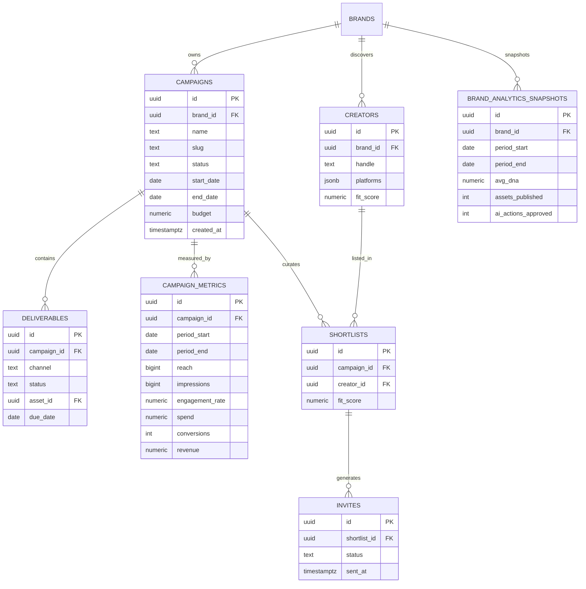
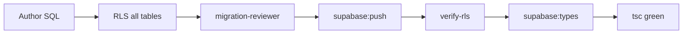
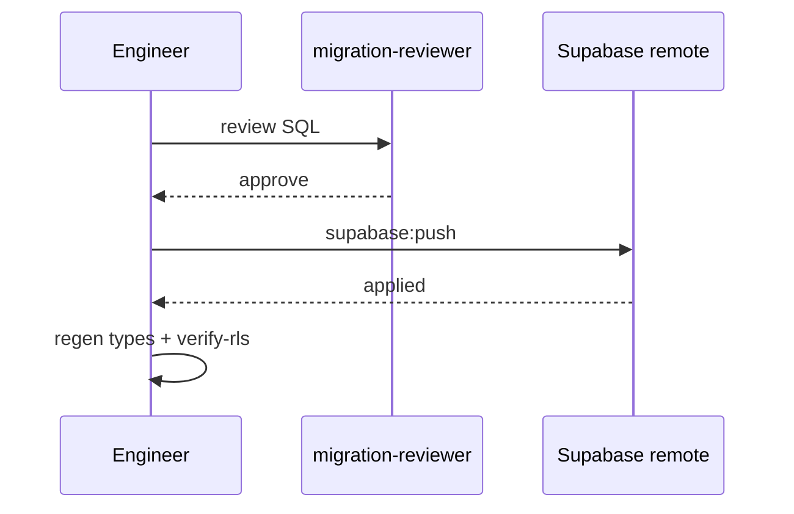

# IPI-268 · SUPA-DV2-001 — Campaigns + Matching + Analytics Schema

**Linear:** https://linear.app/amo100/issue/IPI-268  
**Status:** Todo · **Migration-only PR(s)** · Spec synced 2026-07-02  
**Repo SSOT:** this file · `tasks/intelligence/ai/MASTER-DEPENDENCIES.md`

> **One concern per PR:** schema + RLS only — no React. Split: (A) campaigns/matching (B) analytics metrics if &gt;400 LOC.

---

## 1. Purpose

Production Supabase schema powering **Campaigns** (IPI-249), **Matching** (IPI-250), and **Analytics** (IPI-296/297) — with brand-scoped RLS, indexes, API contracts, and rollback strategy.

**Verified on disk (2026-07-02):** No `campaigns` / `creators` / `campaign_metrics` tables on `origin/main` — greenfield.

## 2. User story

> As a **marketing lead**, campaigns, deliverables, creator shortlists, and performance metrics persist per brand so operator workspaces load real data, not placeholders.

## 3. Business value

- Unblocks P2 growth screens (Campaigns · Matching · Analytics)
- Single schema spine avoids duplicate migrations
- RLS-first — no React until policies proven

## 4. Scope

**In scope:** Tables · FKs · indexes · RLS · types regen · API contract doc · rollback SQL · verify-rls

**Out of scope:** React (IPI-249/250/296/297) · seed data (optional separate PR) · Postiz/publish (IPI-338) · edge ingest (phase 2)

## 5. Features

### Campaigns domain
- [ ] `campaigns` — brand-scoped lifecycle (draft|live|paused|archived)
- [ ] `deliverables` — channel · status · due_date · asset link
- [ ] `campaign_timeline_events` — optional audit trail

### Matching domain
- [ ] `creators` — handle · platforms jsonb · brand_id
- [ ] `shortlists` — campaign_id + creator_id + fit_score
- [ ] `invites` — shortlist_id · status · sent_at

### Analytics domain
- [ ] `campaign_metrics` — daily/period grain: reach · impressions · engagement_rate · spend · conversions · revenue
- [ ] `brand_analytics_snapshots` — optional rollup for overview KPIs

### Platform
- [ ] RLS every table via `is_org_member` / brand owner
- [ ] Indexes on FK + status + period_start
- [ ] `npm run supabase:types` + tsc green

## 6. Frontend

**None in this PR.** Document column contracts for:

| Consumer | Tables |
|----------|--------|
| IPI-249 | campaigns · deliverables |
| IPI-250 | creators · shortlists · invites |
| IPI-296 | brand_analytics_snapshots · brand_scores · campaign_metrics aggregate |
| IPI-297 | campaign_metrics detail |

## 7. Backend

### ER diagram



### RLS pattern

```sql
-- Example: campaigns
create policy campaigns_select on campaigns for select to authenticated
  using (exists (
    select 1 from brands b
    where b.id = campaigns.brand_id
      and is_org_member(b.org_id)
  ));
```

Apply select/insert/update/delete per table · deny anon.

### Indexes

- `campaigns(brand_id, status)`
- `deliverables(campaign_id, status)`
- `campaign_metrics(campaign_id, period_start desc)`
- `shortlists(campaign_id)` · `invites(shortlist_id, status)`
- `creators(brand_id, handle)`

### Storage

No Supabase Storage buckets — assets via Cloudinary (IPI-257).

### Edge functions (phase 2 — separate issues)

- `ingest-campaign-metrics` — webhook from ad platforms
- Not in migration PR

### API contracts (for frontend PRs)

| Endpoint | Tables |
|----------|--------|
| `GET /api/campaigns` | campaigns + deliverables count |
| `GET /api/matching/shortlist` | shortlists + creators |
| `GET /api/analytics/overview` | snapshots + aggregates |
| `GET /api/analytics/campaigns` | campaign_metrics |

## 8. CopilotKit

No runtime in migration PR. Schema supports `agent_logs` correlation via `campaign_id` metadata on writes (future).

## 9. Wireframe

N/A — backend-only.

## 10. Mermaid — migration flow





## 11. Testing

```bash
infisical run -- npm run supabase:verify
infisical run -- npm run supabase:verify-rls
npm run supabase:types
cd app && npx tsc --noEmit
```

- Docker RLS tests if policy complex
- migration-reviewer mandatory

## 12. Acceptance criteria

- [ ] All tables created with FKs + indexes
- [ ] RLS enabled on every table · cross-brand blocked
- [ ] `supabase:verify-rls` green
- [ ] Types committed · app tsc clean
- [ ] API contract table in PR description
- [ ] Rollback SQL documented
- [ ] **Zero React files** in PR

## 13. Production readiness

| Security | RLS on all tables · migration-reviewer |
| Performance | Indexes on hot paths |
| Rollback | Down migration additive-only |
| Monitoring | N/A |
| Documentation | this file + PR contract |

### Rollback strategy

Additive columns only · down migration drops new tables in reverse FK order · no data on greenfield.

## Dependencies

| Type | Issue |
|------|-------|
| **Blocked by** | IPI-257 074b ✅ (recommended first — brand RLS alignment) |
| **Blocks** | IPI-249 · IPI-250 · IPI-296 · IPI-297 · IPI-156 · IPI-160 |
| **Related** | IPI-276 org RLS · talent_shortlists exists in separate schema |

## Implementation order

1. `campaigns` + `deliverables`
2. `creators` + `shortlists` + `invites`
3. `campaign_metrics` + `brand_analytics_snapshots`
4. RLS pass + verify

## Effort · Risk · Ready

| Estimate | 5–8 pts (L if split) |
| Risk | Medium — RLS + org layer · avoid talent schema collision |
| Ready for implementation | **Yes** — greenfield · 074b merged |

## Follow-up issues

- IPI-338 publish_jobs (separate migration)
- Metrics ingest edge fn (after schema)
