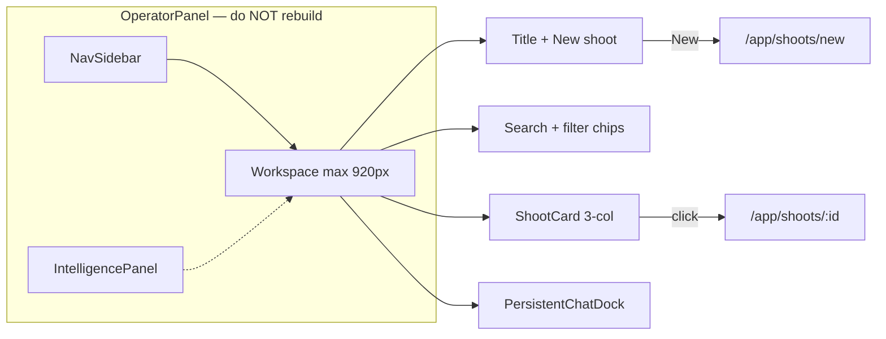
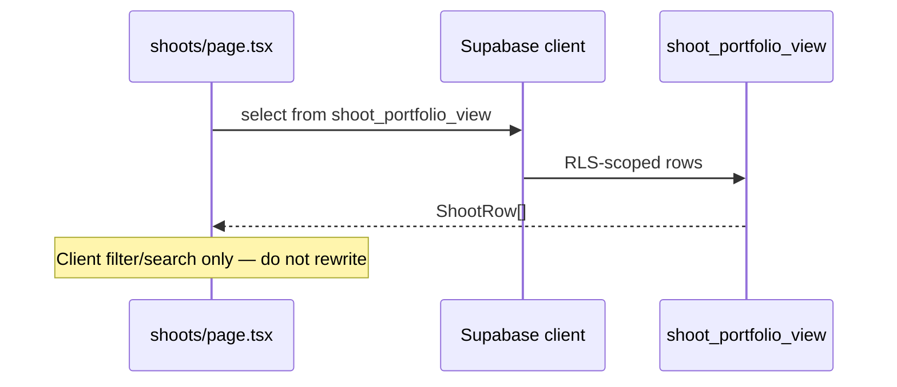
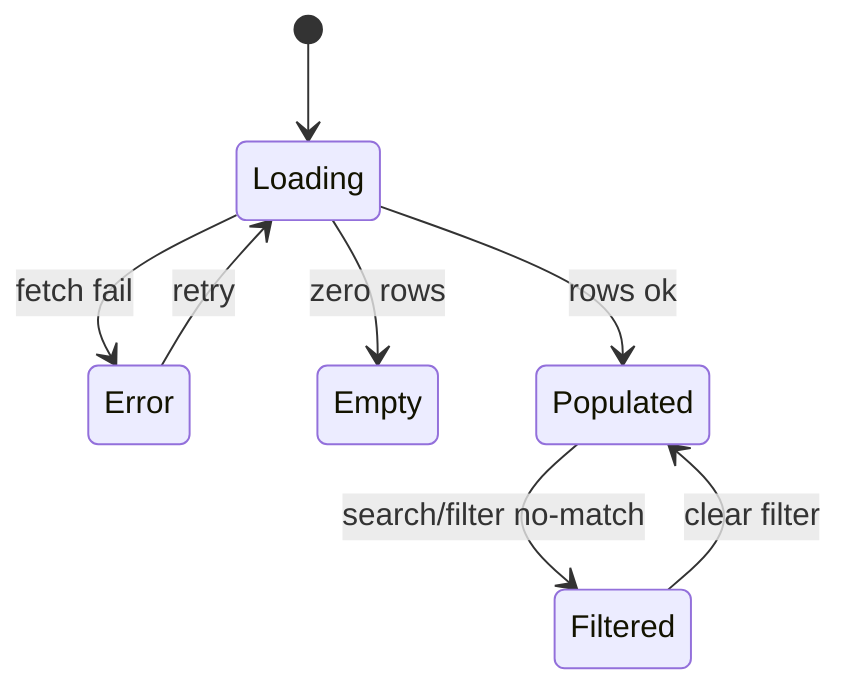
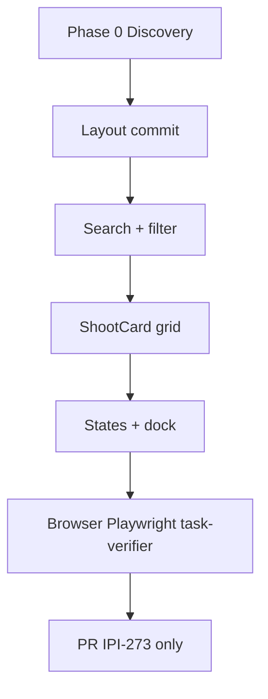

# IPI-273 · DESIGN-055 — Shoots List React Parity Workspace

**Linear:** https://linear.app/amo100/issue/IPI-273  
**Parent:** IPI-254 · DESIGNV2 React Production Parity  
**Wireframe:** `tasks/wireframes-ipix/IPI-273-DESIGN-055-shoots-list.wire`  
**Status:** Todo · Verified 2026-07-02  
**Guardrails:** [`tasks/design-docs/shoot/lessons-from-brand-parity.md`](../../tasks/design-docs/shoot/lessons-from-brand-parity.md)

## Core rule

**Don't code from Linear text alone.** Prove disk + Supabase + browser first. **HTML design wins for layout.** Extends IPI-85 data layer — **layout/shell parity only**, no fetch rewrite.

---

## Design sources (exact match required)

| Screen | DC HTML | React route | Issue |
|--------|---------|-------------|-------|
| **This task** | `Universal design prompt/Shoots List.v2.image-first.dc.html` | `/app/shoots` | IPI-273 |
| Card component | `Universal design prompt/components/ShootCard.dc.html` | `ShootCard.tsx` | extend |
| Detail mate | `Shoot Detail.v2.image-first.dc.html` | `/app/shoots/[id]` | IPI-337 |
| Wizard mate | `Shoot Wizard.v2.image-first.dc.html` | `/app/shoots/new` | IPI-274 |

---

## Skills — load before first edit (mandatory order)

| # | Skill | When |
|---|-------|------|
| 1 | `ipix-task-lifecycle` | Phase 1 plan + TASK-CONTRACT |
| 2 | `design-to-production` | HTML → React parity rules |
| 3 | `design-md` | tokens · typography · spacing |
| 4 | `frontend-design` | Zeely workspace aesthetic |
| 5 | `ipix-wireframe` | Mate wire ↔ HTML (`IPI-273-*.wire`) |
| 6 | `mermaid-diagrams` | Flow/state diagrams in this issue |
| 7 | `fashion-production` | Shoot portfolio vocabulary |
| 8 | `task-verifier` | **Readiness before code** · full gate before PR |
| 9 | `worktrees` | Branch `ipi/273-shoots-list` |
| 10 | `copilotkit` | `production-planner` dock context |
| 11 | `mastra` | Agent id = registry key |
| 12 | `shadcn` | UI primitives if needed |
| 13 | `gen-test` | State + navigation tests before PR |

**Before PR:** `task-verifier` full gate · browser MCP · Playwright

---

## Production state (probed 2026-07-02 — @task-verifier)

| Area | Exists today? | This PR changes? | Probe |
|------|---------------|------------------|-------|
| Route | ✅ `app/.../shoots/page.tsx` | Yes — workspace only | `ls` |
| Shell | ✅ `OperatorPanel` in `(operator)/layout.tsx` | **No rebuild** | `rg OperatorPanel app/src/app/\(operator\)/layout.tsx` |
| Intelligence panel | ✅ IPI-243 shipped | **No rebuild** | `rg intelligence-panel app/src/components` |
| Data fetch | ✅ `shoot_portfolio_view` + RLS (IPI-85) | **No rewrite** | `rg shoot_portfolio_view app/src` |
| ShootCard | 🟡 `ShootCard.tsx` — emoji thumb, hex | Yes — DC image-first | read component |
| Search/filter | 🟡 status tabs + DNA sort | Yes — DC chip row + search chrome | read page.tsx |
| Agent map | ✅ `/app/shoots` → `production-planner` | No | `route-agent-map.test.ts` |
| Layout smell | 🟡 `min-h-screen` + `#FBF8F5` | Yes — commit 1 | `rg '#FBF8F5' shoots/page.tsx` |
| E2E spec | ❌ `e2e/shoots-list.spec.ts` missing | Add in Phase 5 | `ls app/e2e` |
| Mobile shell | 🟡 IPI-251 soft gate | Optional v1 | — |

**Stale spec corrected:** Shell and IntelligencePanel are **not** missing. Gap = **center workspace column** reskin (same class of error as pre-#181 brand list).

---

## Data-source table

| UI block | Query / source | Empty state | Error state |
|----------|----------------|-------------|-------------|
| Shoot grid | `shoot_portfolio_view` (existing IPI-85 fetch) | "No shoots yet" + Plan shoot CTA (HTML L147-159) | "Couldn't load shoots" + Try again (L163-169) |
| Filter no-match | Client filter on fetched rows | "No matches for …" (L173-178) | — |
| Count label | `shoots.length` from fetch | Hide or "0 shoots" | — |
| Card DNA | `dna_score` column — null ok | Omit badge, not fake score | — |
| Card cover | TBD — view may lack cover URL | Subtle placeholder, not emoji | — |

**Negative AC:** No fabricated shoot rows, DNA scores, or status when API null/failed.

---

## Architecture







---

## Steps to exact HTML match

Compare to `Shoots List.v2.image-first.dc.html` @1440 + @375.

### Phase 0 — Discovery (no code)

- [ ] **A0.1** Read wireframe + HTML + `ShootCard.dc.html`
- [ ] **A0.2** `@task-verifier` readiness — probes in [`verifier-probes-ipix.md`](../../.claude/skills/task-verifier/references/verifier-probes-ipix.md) § IPI-273
- [ ] **A0.3** Side-by-side HTML populated vs `/app/shoots`
- [ ] **A0.4** Confirm: do NOT wrap/rebuild OperatorPanel

### Phase 1 — Layout (commit 1)

- [ ] **B1.1** Remove `min-h-screen`, `#FBF8F5`, hardcoded hex from `shoots/page.tsx`
- [ ] **B1.2** Add `shoots-list.module.css` — workspace `max-width: 920px` (HTML L103, L135)
- [ ] **B1.3** Header: title `fs-2xl` + count subtitle + **New shoot** CTA 40px (L104-111)
- [ ] **B1.4** Padding: header `28px 40px 0`, body `20px 40px 24px` (L102, L134)
- [ ] **B1.5** Single scroll in center column inside OperatorPanel

### Phase 2 — Search + filter (commit 2)

- [ ] **C2.1** Search input 40px, border, icon (L116-118) — **preserve IPI-85 filter logic**
- [ ] **C2.2** Filter chips: 32px pills, `border-radius: 999px` (L124-127)
- [ ] **C2.3** Map DB status enum → chip labels (do not use DC demo labels without mapping)
- [ ] **C2.4** No-match state (L173-178)

### Phase 3 — ShootCard grid (commit 3)

- [ ] **D3.1** Grid `repeat(3, 1fr)` gap `20px` (L181)
- [ ] **D3.2** Extend `ShootCard.tsx` per `ShootCard.dc.html` — image-first cover, status dot, DNA mono
- [ ] **D3.3** Card → `/app/shoots/[id]` (existing Link)
- [ ] **D3.4** Loading skeleton grid 4:3 cards (L138-143)

### Phase 4 — States + dock (commit 4)

- [ ] **E4.1** Empty state — tilted cover placeholders + Plan shoot (L147-159)
- [ ] **E4.2** Error state — Try again (L163-169)
- [ ] **E4.3** PersistentChatDock / production-planner greeting (L192+) — IPI-275 soft
- [ ] **E4.4** Approval-pending chip on card when applicable

### Phase 5 — Verify & ship

- [ ] **F5.1** `cd app && npm run lint && npm test && npm run build`
- [ ] **F5.2** `rg '#FBF8F5|#E87C4D' app/src/app/\(operator\)/app/shoots` → 0 in changed files
- [ ] **F5.3** Browser MCP @1440 + @375 vs HTML
- [ ] **F5.4** Add/run `e2e/shoots-list.spec.ts`
- [ ] **F5.5** `@task-verifier` full gate + evidence folder
- [ ] **F5.6** Bugbot · 0 High/Critical



---

## Wireframe (mates HTML)

`tasks/wireframes-ipix/IPI-273-DESIGN-055-shoots-list.wire`

```text
┌ Nav ─┬──────── Workspace max 920px ────────────┬─ Intel ─┐
│      │ Shoots · count          [+ New shoot]   │ IPI-243 │
│      │ [Search…]  [All][Planning][Active]…     │         │
│      │ ┌ ShootCard ┐ ┌ ShootCard ┐ ┌ … ┐      │         │
│      │ └───────────┘ └───────────┘           │         │
│      │ PersistentChatDock · production-planner │         │
└──────┴─────────────────────────────────────────┴─────────┘
```

---

## Acceptance criteria

- [ ] Matches `Shoots List.v2.image-first.dc.html` layout (920px column, 3-col grid, chips)
- [ ] tokens.css + `*.module.css` — no hardcoded hex in changed files
- [ ] **Preserves** IPI-85 `shoot_portfolio_view` fetch — no data layer rewrite
- [ ] **Does not rebuild** OperatorPanel / intelligence panel
- [ ] 5 states: loading · empty · error · populated · filter no-match
- [ ] ShootCard → `/app/shoots/[id]` · New shoot → `/app/shoots/new`
- [ ] `production-planner` via `route-agent-map.ts`
- [ ] Browser evidence + `@task-verifier` report attached
- [ ] Playwright `e2e/shoots-list.spec.ts` green

---

## Out of scope

- Supabase fetch rewrite (IPI-85 ✅) · Shoot Detail tabs (IPI-337) · Wizard (IPI-274)
- New AI workflow (IPI-87 / IPI-149) · Full mobile shell (IPI-251 soft)

---

## Dependencies

| Issue | Role | Status |
|-------|------|--------|
| IPI-85 | Functional list + fetch | ✅ partial ship — refactor owner |
| IPI-243 | IntelligencePanel | ✅ |
| IPI-247 | Route-agent map | ✅ |
| IPI-255 | Live intel data | ✅ |
| IPI-275 | PersistentChatDock | soft |
| IPI-251 | Mobile shell | soft |
| IPI-270 | tokens.css sync | soft |

---

## @task-verifier — execution readiness (2026-07-02)

| Check | Result |
|-------|--------|
| Spec score | 🟢 92/100 — production state corrected |
| Execution readiness | 🟢 85/100 — safe after Phase 0 side-by-side |
| Route on disk | ✅ `app/src/app/(operator)/app/shoots/page.tsx` |
| OperatorPanel | ✅ layout wraps route |
| Data view | ✅ `shoot_portfolio_view` in types + page |
| Agent id | ✅ `production-planner` in route-agent-map |
| Blockers | 🟡 E2E spec missing (create in Phase 5) |
| Safe to execute? | **Yes** — layout-first, preserve fetch |

### Commands before code

```bash
rg OperatorPanel app/src/app/\(operator\)/layout.tsx
rg shoot_portfolio_view app/src
rg '#FBF8F5' app/src/app/\(operator\)/app/shoots/page.tsx
open "Universal design prompt/Shoots List.v2.image-first.dc.html"
```

### Commands after ship

```bash
cd app && npm run lint && npm test && npm run build
rg '#[0-9a-fA-F]{3,6}' app/src/app/\(operator\)/app/shoots app/src/components/shoot/ShootCard.tsx
npx playwright test e2e/shoots-list.spec.ts
```

---

## TASK-CONTRACT

```yaml
id: DESIGN-055
linear: IPI-273
type: ui-screen
skills:
  - ipix-task-lifecycle
  - design-to-production
  - design-md
  - frontend-design
  - ipix-wireframe
  - mermaid-diagrams
  - fashion-production
  - task-verifier
  - worktrees
  - copilotkit
  - mastra
  - shadcn
  - gen-test
design:
  source: Universal design prompt/Shoots List.v2.image-first.dc.html
  handoff: tasks/design-docs/docs/handoff/11-screen-checklists.md
  tokens: required
  three_panel: required
wireframe: tasks/wireframes-ipix/IPI-273-DESIGN-055-shoots-list.wire
verify:
  build: cd app && npm run lint && npm test && npm run build
  browser: MCP @1440 @375 vs HTML
  playwright: e2e/shoots-list.spec.ts
  done_gate: task-verifier
evidence:
  - docs/ecommerce/evidence/YYYY-MM-DD/ipi-273-shoots-list/
```

---

## Evidence required (before Done)

| Artifact | Path |
|----------|------|
| Desktop screenshot | `docs/ecommerce/evidence/YYYY-MM-DD/ipi-273-shoots-list/desktop.png` |
| Mobile screenshot | `.../mobile-390.png` |
| task-verifier report | PR body excerpt |
| Playwright | CI or local green |
