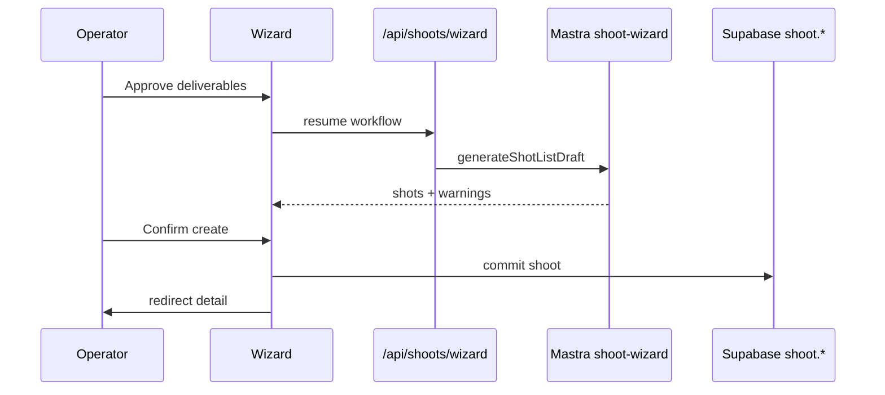
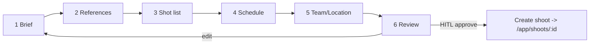
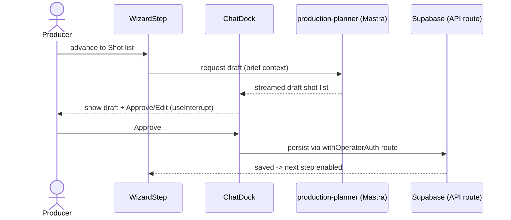

# IPI-274 · DESIGN-056 — Shoot Wizard React Parity Workspace

**Linear:** https://linear.app/amo100/issue/IPI-274  
**Parent:** IPI-254  
**Wireframe:** `tasks/wireframes-ipix/IPI-274-DESIGN-056-shoot-wizard.wire`  
**Status:** Todo · Synced 2026-07-03  
**Guardrails:** [`tasks/design-docs/shoot/lessons-from-brand-parity.md`](../../tasks/design-docs/shoot/lessons-from-brand-parity.md)  
**Step decision:** [`tasks/design-docs/shoot/IPI-252-wizard-step-decision.md`](../../tasks/design-docs/shoot/IPI-252-wizard-step-decision.md) — **6 steps in IPI-274 scope**

## Core rule

**Don't code from Linear text alone.** Prove disk + Supabase + browser first. **HTML design wins for layout.**  
**Shell:** `OperatorPanel` already wraps route — **center workspace column only**, not a shell rebuild.

---

## Design sources (exact match required)

| Screen | DC HTML | React route | Issue |
|--------|---------|-------------|-------|
| **This task** | `Universal design prompt/Shoot Wizard.v2.image-first.dc.html` | `/app/shoots/new` | IPI-274 |
| List mate | `Shoots List.v2.image-first.dc.html` | `/app/shoots` | IPI-273 |
| Detail mate | `Shoot Detail.v2.image-first.dc.html` | `/app/shoots/[id]` | IPI-337 |

---

## Skills — load before first edit (mandatory order)

| # | Skill | When |
|---|-------|------|
| 1 | `ipix-task-lifecycle` | Phase 1 plan + TASK-CONTRACT |
| 2 | `design-to-production` | HTML → React parity rules |
| 3 | `design-md` | tokens · typography · spacing |
| 4 | `frontend-design` | Zeely workspace aesthetic |
| 5 | `ipix-wireframe` | `IPI-274-DESIGN-056-shoot-wizard.wire` |
| 6 | `mermaid-diagrams` | Flow/HITL diagrams |
| 7 | `fashion-production` | Deliverables-first invariant |
| 8 | `task-verifier` | **Readiness before code** |
| 9 | `worktrees` | Branch `ipi/274-shoot-wizard` |
| 10 | `copilotkit` | v2 only · `useShootWizardContext` |
| 11 | `mastra` | **Do not rewrite** `shoot-wizard` workflow |
| 12 | `gemini` | HITL copy / structured output |
| 13 | `gen-test` | State tests before PR |

**Before PR:** `@task-verifier` · browser MCP · `e2e/shoot-wizard.spec.ts`

---

## Overview

The **Shoot Wizard** guides an operator from blank page to a channel-complete production plan. It collects brand context, drafts deliverables and shot list, and gates every AI write behind human approval before saving.

## Why it matters

Reshoot loops happen when channel gaps surface after the shoot. This wizard enforces: *deliverables first → shot list derived → budget last* — the core iPix production invariant.

## Route

`/app/shoots/new` (query: `?brand=&campaign=&season=`)

## Design reference

| Source | Path |
|--------|------|
| DC prototype | `Universal design prompt/Shoot Wizard.v2.image-first.dc.html` |
| Handoff | `tasks/design-docs/handoff/02-screen-map.md` §6 |
| Checklist | `tasks/design-docs/handoff/11-screen-checklists.md` · Shoot Wizard |
| Step parity | **IPI-252** · DESIGN-056b (10 vs 6 steps) |

## Current production state

| Area | Today | Gap |
|------|-------|-----|
| Route | ✅ `shoots/new/page.tsx` ~825 LOC | — |
| Steps | 🟡 **6 steps** + HITL cards | DC has **10 steps** + Review dashboard |
| AI workflow | ✅ Mastra `shoot-wizard` (IPI-149 Done) | — |
| WizardStep UI | 🔴 inline stepper | No **WizardStep** DC component |
| Shell | 🟡 `OperatorPanel` wraps route | Gap = **center column** chrome · strip `#FBF8F5` |
| PersistentChatDock | 🟡 partial | `OperatorChatDock` + `useShootWizardContext` |
| Save draft / exit guard | 🟡 partial | DC unsaved-exit + step-jump menu |
| Tokens | 🔴 mixed hardcoded | Zeely v3 |

## Scope

- Port wizard chrome to **WizardStep** + polish **OperatorChatDock** (IPI-275 soft)
- Match DC layout: progress rail · step content · footer nav · context dock
- Hydrate Step 2 from URL params (`brand`, `campaign`, `season`) with lock + "Change"
- Implement 5 UI states per step: idle · loading · error · approval · success
- Wire existing **6-step** AI/HITL logic — do not rewrite Mastra workflow
- **6 steps only** — 10-step DC expansion → **IPI-252** ([decision doc](../../tasks/design-docs/shoot/IPI-252-wizard-step-decision.md))

## Out of scope

- Adding 4 missing wizard steps → **IPI-252**
- Mastra workflow changes → **IPI-149** ✅
- Rebuilding OperatorPanel / IntelligencePanel → already shipped
- Shot type library → **IPI-184**
- Shoot Detail after create → **IPI-209** ✅ · tabs → **IPI-337**

## Dependencies

- **IPI-275** · DESIGN-033 — PersistentChatDock (required for dock parity)
- **IPI-247** · DESIGN-070 — Route-Agent Map ✅
- **IPI-243** · DESIGN-032 — IntelligencePanel (wizard omits right panel — N/A)
- **IPI-252** · DESIGN-056b — Step count decision
- Related: **IPI-87** · Canceled → superseded by this issue
- Related: **IPI-149** · SHOOT-AI-002 — shoot-wizard workflow ✅

## Components

| Component | Use |
|-----------|-----|
| WizardStep | step shell + progress |
| PersistentChatDock | inline at workspace base |
| ApprovalCard | HITL deliverables/shots/budget |
| StatusChip | step status |
| SkeletonLoader | AI generating |
| EmptyState | missing brand |
| AgentStatusIndicator | streaming in dock |

## Mermaid diagram

```mermaid
flowchart TD
  S1[Step 1 Brand context] --> S2[Step 2 Channels]
  S2 --> S3[Step 3 Deliverables AI]
  S3 --> H1{HITL approve}
  H1 --> S4[Step 4 Shot list AI]
  S4 --> H2{HITL approve}
  H2 --> S5[Step 5 Budget AI]
  S5 --> H3{HITL approve}
  H3 --> S6[Step 6 Review + Create]
  S6 --> DET[/app/shoots/:id]
```



## Wireframe

### Desktop — Step 3 (Deliverables)

```text
┌ Nav ─┬──────────── Wizard (no right panel) ──────────────────┐
│      │ Step 3 of 6 · Deliverables          [Save draft]      │
│      │ ●●●○○○                                                │
│      │ ┌─ ApprovalCard grid ─────────────────────────────┐   │
│      │ │ IG Feed ×4  TikTok ×2  … [Approve] [Edit]      │   │
│      │ └───────────────────────────────────────────────┘   │
│      │ ┌─ PersistentChatDock ────────────────────────────┐   │
│      │ │ Drafting deliverables for SS26…                  │   │
│      │ └────────────────────────────────────────────────┘   │
│      │              [Back]              [Continue →]         │
└──────┴──────────────────────────────────────────────────────┘
```

### Mobile

```text
┌ Step 3/6 Deliverables ────┐
│ [content scroll]          │
│ [Chat dock]               │
│ [Back] [Continue]         │
└───────────────────────────┘
```

## Acceptance criteria

- [ ] Matches DC wizard chrome (Zeely v3) for shipped step count
- [ ] WizardStep component — no ad-hoc stepper divs
- [ ] PersistentChatDock at workspace base with production-planner context
- [ ] URL param hydration for brand/campaign/season
- [ ] HITL gates preserved (deliverables → shots → budget)
- [ ] Create redirects to `/app/shoots/[id]`
- [ ] loading · empty · error · approval · success per step
- [ ] No hardcoded colors in new code
- [ ] Browser + Playwright wizard flow
- [ ] task-verifier passed

## Verification

```bash
cd app && npm run lint && npm test && npm run build
npm run test:e2e -- e2e/shoot-wizard.spec.ts
```

**Routes:** `/app/shoots/new` · `/app/shoots/new?brand=…`

**Skills:** `frontend-design` · `shadcn` · `mastra` · `copilotkit` · `fashion-production`

## Evidence required

`docs/ecommerce/evidence/YYYY-MM-DD/ipi-274-shoot-wizard/` · PR · Playwright · task-verifier

---

# Implementation Prompt Pack (2026-06-30)

**Worktree:** `ipi/274-shoot-wizard` · `../wt-ipi-274-shoot-wizard`
**Skills to run:** frontend-design · shadcn · mastra · copilotkit (v2) · fashion-production · mermaid-diagrams · ipix-wireframe
**Design file (READ FIRST):** `Universal design prompt/Shoot Wizard.v2.image-first.dc.html` · `Universal design prompt/components/WizardStep.dc.html` · handoff §6
**Note:** keep prod **6-step** logic; **10-step** DC expansion is IPI-252 (do not bundle).

## User stories

* As a **producer**, I move through clear wizard steps with the AI drafting shot lists/schedules, so I create a shoot in minutes.
* As a **producer**, every AI draft is a reversible HITL gate — I approve before it persists.
* As an **operator**, the PersistentChatDock travels with me through the wizard, context-aware of the current step.
* As a **developer**, steps render through one reusable `WizardStep` component — no per-step forks.

## Wizard step flow



## AI draft + HITL sequence



## Implementation steps (Test block each)

| Step | Prompt | Test / proof |
| -- | -- | -- |
| **A** | Extract reusable `WizardStep` (header, body slot, Back/Next, validation) from current page | step renders, nav works |
| **B** | Apply DC layout: steps rail + content; Zeely v3 tokens (IPI-270) | matches DC at 1440 · **no shell rebuild** |
| **C** | Polish OperatorChatDock with step-aware `useShootWizardContext` | dock greeting names step |
| **D** | Preserve 6-step HITL gates via `useInterrupt`; persist via existing API route | approve/edit/reject all work |
| **E** | Mobile single-column + pinned dock + progress header | Playwright mobile pass |

## task-verifier checklist

- [ ] One reusable WizardStep (no per-step forks)
- [ ] 6-step HITL gates preserved (approve/edit/reject)
- [ ] 10-step expansion NOT bundled (that is IPI-252)
- [ ] Playwright `e2e/shoot-wizard.spec.ts` green; one-concern PR
