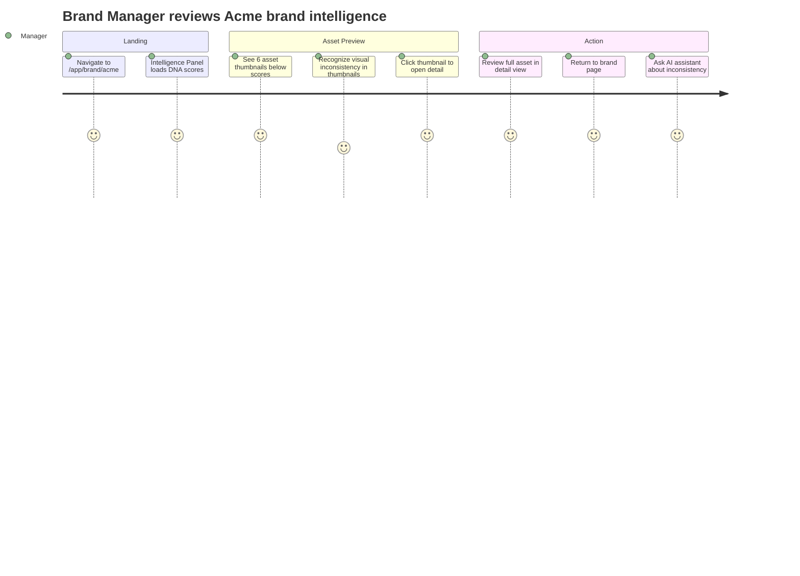
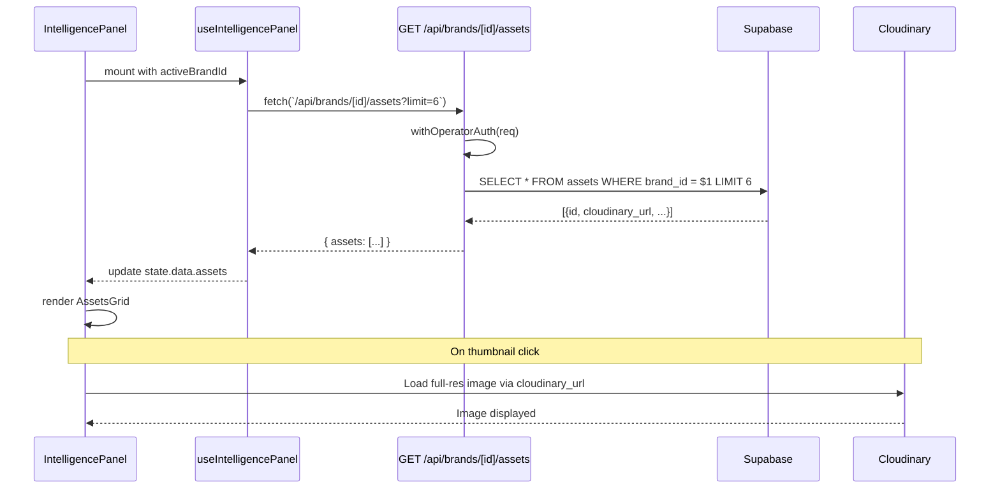
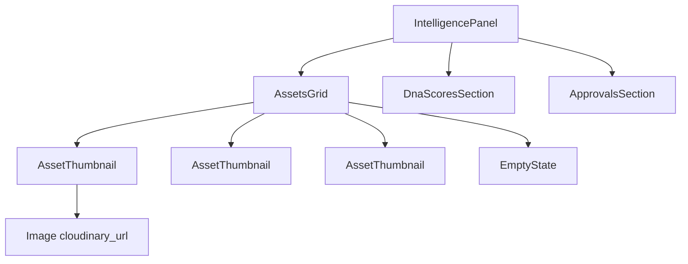
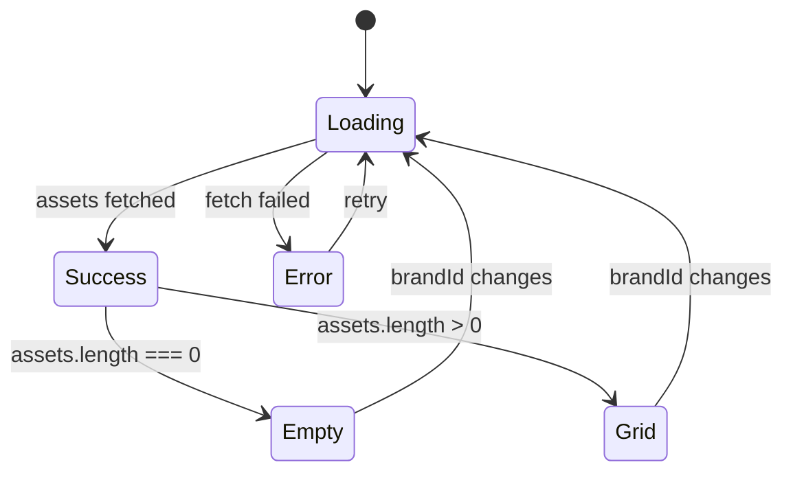

# IPI-284: Intelligence Panel — Asset Thumbnail Grid

**Linear:** [IPI-284](https://linear.app/amo100/issue/IPI-284)  
**Design Ref:** `Universal design prompt/Brand Detail.v2.image-first.dc.html` § Intelligence Panel  
**Parent:** IPI-255 (DESIGN-071 deferred items)  
**Priority:** Medium (P3)

---

## Context

IPI-255 shipped DNA scores and pending approvals in the Intelligence Panel. Asset thumbnails were deferred as part of the original DESIGN-071 scope.

**Design reference:** Brand Detail design shows a 4-column asset grid below DNA scores with "Assets (12)" header and expand arrow.

---

## Problem

Users cannot preview brand assets directly in the Intelligence Panel. They must navigate to `/app/assets` to see visual content, breaking flow during brand analysis or shoot planning.

---

## User Stories

### Story 1: Brand Manager reviewing DNA scores
**As a** Brand Manager  
**I want** to see brand asset thumbnails in the Intelligence Panel  
**So that** I can visually assess brand consistency without leaving my current workflow

**Acceptance:** Asset grid shows 6 recent assets below DNA scores

### Story 2: Creative Director planning shoot
**As a** Creative Director  
**I want** to preview brand assets while planning a shoot  
**So that** I can reference existing visual style without context switching

**Acceptance:** Clicking thumbnail opens asset detail view

### Story 3: Operator auditing new brand
**As an** Operator  
**I want** to see "No assets yet" when a brand has no assets  
**So that** I know asset upload is the next step

**Acceptance:** Empty state shows helpful message

---

## User Journey



---

## Proposal

Add a 6-item thumbnail grid to the Intelligence Panel showing recent brand assets. Implement `GET /api/brands/[id]/assets?limit=6` endpoint that returns asset URLs from Supabase + Cloudinary.

---

## API Wiring

| Route | Status | Auth | Returns | RLS |
|---|---|---|---|---|
| `GET /api/brands/[id]/assets` | 🔴 create | `withOperatorAuth` + `createSupabaseServerClient` | `{ assets: Asset[] }` | RLS enforced |

### Request
```typescript
GET /api/brands/[id]/assets?limit=6
```

### Response
```typescript
{
  assets: [
    {
      id: string;
      shoot_id: string | null;  // ⚠️ assets table has shoot_id, not brand_id
      url: string;  // ✅ actual column name
      asset_type: 'image' | 'video';  // ✅ enum type
      thumbnail_url: string | null;
      cloudinary_public_id: string | null;
      mime_type: string | null;
      width: number | null;
      height: number | null;
      created_at: string;
    }
  ]
}
```

### ⚠️ Schema Note
The `assets` table currently has `shoot_id`, not `brand_id`. Two options:

**Option A:** Query via shoot → brand join
```sql
SELECT a.* FROM assets a
JOIN shoots s ON a.shoot_id = s.id
WHERE s.brand_id = $1
ORDER BY a.created_at DESC
LIMIT 6
```

**Option B (Recommended):** Add `brand_id` column in migration
```sql
ALTER TABLE assets ADD COLUMN brand_id uuid REFERENCES brands(id);
CREATE INDEX idx_assets_brand_id ON assets(brand_id);
```

### Auth Pattern
```typescript
await withOperatorAuth(request);
const svc = await createSupabaseServerClient();
const { data, error } = await svc
  .from('assets')
  .select('id,brand_id,cloudinary_url,cloudinary_public_id,media_type,created_at')
  .eq('brand_id', brandId)
  .order('created_at', { ascending: false })
  .limit(limit);
```

---

## Sequence Diagram



---

## Component Tree



---

## State Diagram



---

## Wireframe

```
┌─────────────────────────────────────────────────┐
│ Intelligence Panel                              │
├─────────────────────────────────────────────────┤
│ DNA Scores                                      │
│ ┌─────┬─────┬─────┬─────┐                      │
│ │ 75  │ V:80│ A:70│ C:90│                      │
│ └─────┴─────┴─────┴─────┘                      │
├─────────────────────────────────────────────────┤
│ Assets (6)                              [→]     │
│ ┌───┬───┬───┬───┬───┬───┐                      │
│ │img│img│img│img│img│img│ ← 6 thumbnails       │
│ └───┴───┴───┴───┴───┴───┘   100×100px grid    │
├─────────────────────────────────────────────────┤
│ Pending Approvals                               │
│ ...                                             │
└─────────────────────────────────────────────────┘
```

---

## Files to Create/Modify

### New Files
- `app/src/app/api/brands/[id]/assets/route.ts` — API route handler
- `app/src/app/api/brands/[id]/assets/route.test.ts` — API route tests
- `app/src/components/intelligence-panel/assets-grid.tsx` — Grid component
- `app/src/components/intelligence-panel/assets-grid.test.tsx` — Component tests
- `app/src/components/intelligence-panel/asset-thumbnail.tsx` — Single thumbnail

### Modified Files
- `app/src/lib/intelligence/panel-contract.ts` — Add `assets?: Asset[]` to `IntelligencePanelData`
- `app/src/components/intelligence-panel/intelligence-panel.tsx` — Render `AssetsGrid` when `data.assets` present

---

## Acceptance Criteria

### A. API Route — `GET /api/brands/[id]/assets`
- [ ] Returns 401 when unauthenticated
- [ ] Returns 400 for invalid brand ID (non-UUID)
- [ ] Returns 403 when user lacks access to brand (RLS enforced)
- [ ] Returns assets with Cloudinary URLs (limit=6 default)
- [ ] Respects `limit` query param (max 50)
- [ ] Orders by `created_at DESC`
- [ ] Test: `npm test -- api/brands/[id]/assets` → 5 tests passing

### B. Component — AssetsGrid
- [ ] Renders 6 thumbnails in 6-column grid on desktop
- [ ] Shows empty state when `assets.length === 0`
- [ ] Shows loading state while fetching
- [ ] Clicking thumbnail opens asset detail (placeholder link for now)
- [ ] Responsive: 3 columns on tablet, 2 on mobile
- [ ] Test: `npm test -- assets-grid` → 4 tests passing

### C. Integration — IntelligencePanel
- [ ] `useIntelligencePanel` fetches assets when brandId present
- [ ] AssetsGrid renders below DNA scores, above Approvals
- [ ] Grid does not render when `data.assets` is null/undefined
- [ ] No performance regression (polling still 30s)
- [ ] Test: `npm test -- intelligence-panel` → existing + new tests passing

### D. Manual Verification
- [ ] Visit `/app/brand/[id]` with assets → see 6 thumbnails in panel
- [ ] Click thumbnail → placeholder behavior (console log or no-op for now)
- [ ] Visit brand with no assets → see "No assets yet" empty state
- [ ] Intelligence Panel layout not broken by asset grid

### E. Test Coverage
- [ ] API route: 5 tests (auth, validation, RLS, success, limit param)
- [ ] AssetsGrid component: 4 tests (render, empty, loading, click)
- [ ] Integration: Intelligence Panel renders assets correctly
- [ ] Full suite: `npm test` → no new failures

---

## Verification

```bash
cd app

# API route tests
npm test -- api/brands

# Component tests
npm test -- assets-grid

# Intelligence Panel integration
npm test -- intelligence-panel

# Full suite
npm test

# Typecheck
npx tsc --noEmit

# Manual test
npm run dev
# Visit http://localhost:3002/app/brand/[id]
# Check Intelligence Panel for asset grid
```

---

## Out of Scope

- Full asset gallery view (separate issue)
- Asset upload from Intelligence Panel
- Asset filtering/search in grid
- Asset metadata display beyond thumbnail
- Asset selection/multi-select
- Drag-and-drop asset reordering

---

## Dependencies

- IPI-255 ✅ (base Intelligence Panel)
- Supabase `assets` table ✅ (already exists)
- Cloudinary URLs ✅ (already in `assets.cloudinary_url`)

---

## Skills Required

| Skill | Purpose |
|-------|---------|
| `/ipix-supabase` | Schema verification, migration creation, RLS policies |
| `/ipix-wireframe` | ASCII wireframes for component layout |
| `/mermaid-diagrams` | Sequence, state, component tree diagrams |
| `/shadcn` | UI components (if using Card, Button, etc.) |
| `/frontend-design` | Component structure following iPix patterns |
| `/gen-test` | Vitest test generation for API route + component |

**Load order:** `ipix-supabase` → verify schema → `ipix-wireframe` → `mermaid-diagrams` → implement

---

## Design Reference

**File:** `Universal design prompt/Brand Detail.v2.image-first.dc.html`

**Section:** Intelligence Panel → Assets moodboard

```html
<div style="display:grid;grid-template-columns:repeat(4,1fr);gap:7px;">
  <!-- 4-column asset grid -->
</div>
```

**Visual:** 4 columns, 7px gap, below DNA scores, "Assets (12)" header with expand arrow.

**Related components:**
- `Universal design prompt/Component Library.dc.html` → AssetThumbnail pattern
- `Universal design prompt/Assets.v2.image-first.dc.html` → Full assets page reference
