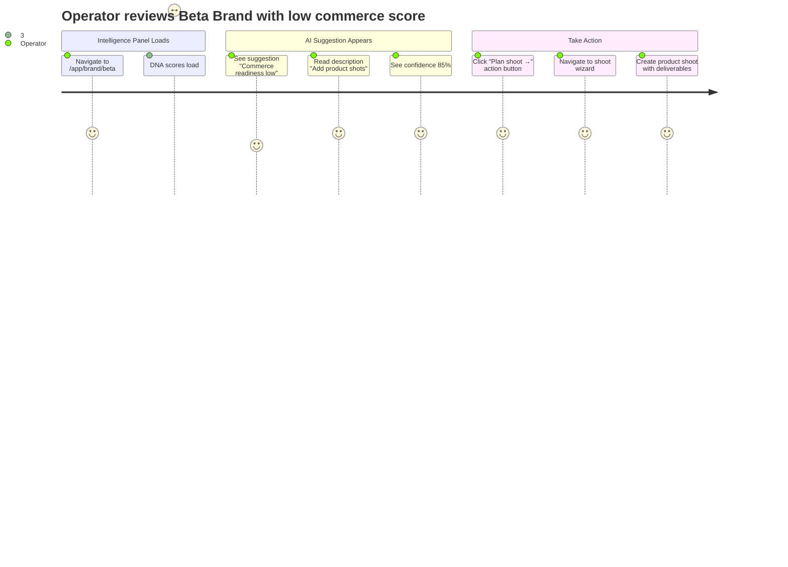
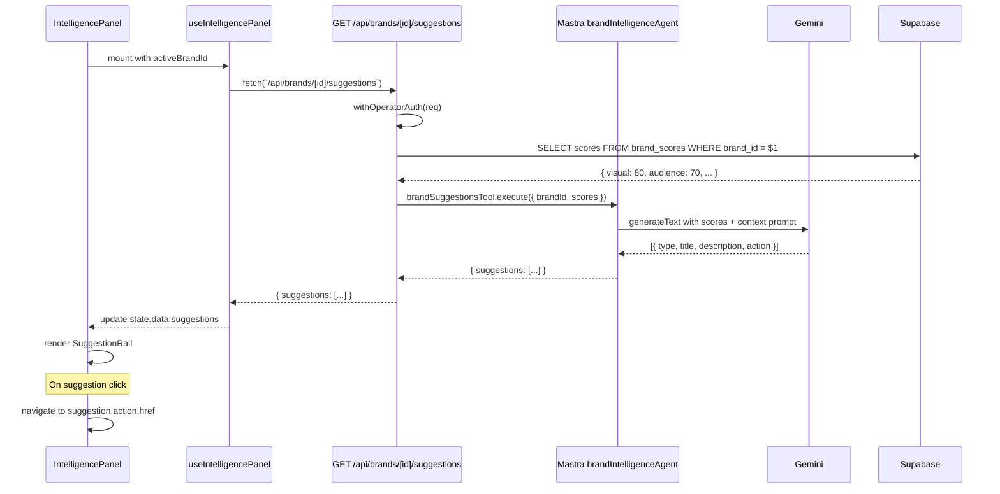
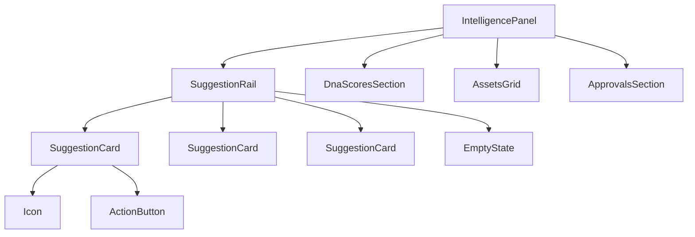
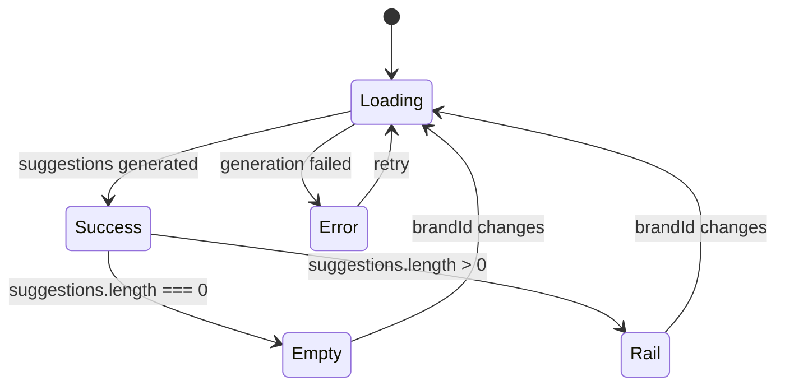

# IPI-285: Intelligence Panel — AI Suggestion Rail

**Linear:** [IPI-285](https://linear.app/amo100/issue/IPI-285)  
**Design Ref:** `Universal design prompt/Brand Detail.v2.image-first.dc.html` § Intelligence Panel  
**Parent:** IPI-255 (DESIGN-071 deferred items)  
**Priority:** High (P2)

---

## Context

IPI-255 shipped DNA scores and pending approvals in the Intelligence Panel. AI-powered suggestions were deferred as part of the original DESIGN-071 scope.

---

## Problem

Users must ask the AI assistant for recommendations explicitly. The Intelligence Panel could proactively surface AI-generated suggestions based on brand context, reducing cognitive load and surfacing non-obvious actions.

---

## User Stories

### Story 1: Brand Manager seeing low commerce score
**As a** Brand Manager  
**I want** to see AI suggestions when DNA scores reveal gaps  
**So that** I know the next action to improve the score without asking

**Acceptance:** Suggestion "Add product shots to improve commerce readiness" appears when score < 70

### Story 2: Operator onboarding new brand
**As an** Operator  
**I want** proactive AI recommendations during brand analysis  
**So that** I can guide the brand owner on priority improvements

**Acceptance:** 3-5 suggestions render below DNA scores with action buttons

### Story 3: Creative Director with high consistency
**As a** Creative Director  
**I want** positive reinforcement when brand scores are strong  
**So that** I know to reference this brand for others

**Acceptance:** Suggestion "High consistency score — use as reference" appears when consistency > 85

---

## User Journey



---

## Proposal

Add a SuggestionRail component to the Intelligence Panel that shows 3-5 AI-generated suggestions based on:
- Brand DNA scores (e.g., "Visual inconsistency detected → audit logo usage")
- Pending approvals status
- Current route context (brand detail vs shoot planning)
- Historical patterns

Implement `GET /api/brands/[id]/suggestions` endpoint backed by Mastra `brand-suggestions` tool.

---

## API Wiring

| Route | Status | Auth | Returns | Agent |
|---|---|---|---|---|
| `GET /api/brands/[id]/suggestions` | 🔴 create | `withOperatorAuth` + `createSupabaseServerClient` | `{ suggestions: Suggestion[] }` | `brand-intelligence` |

### Request
```typescript
GET /api/brands/[id]/suggestions
```

### Response
```typescript
{
  suggestions: [
    {
      id: string;
      type: 'action' | 'insight' | 'warning';
      title: string;
      description: string;
      action?: {
        label: string;
        href: string;
      };
      confidence: number; // 0-1
    }
  ]
}
```

### Mastra Tool Integration
```typescript
// app/src/mastra/tools/brand-suggestions.ts
import { createTool } from "@mastra/core/tools";  // ✅ CORRECT import path
import { z } from "zod";

export const brandSuggestionsTool = createTool({
  id: "generate-brand-suggestions",
  description: "Generate AI suggestions for brand based on DNA scores and context",
  inputSchema: z.object({
    brandId: z.string().uuid(),
    scores: z.object({
      visual: z.number(),
      audience: z.number(),
      consistency: z.number(),
      commerce_readiness: z.number(),
    }),
    context: z.enum(["brand-detail", "shoot-planning", "campaign"]).optional(),
  }),
  execute: async ({ context, brandId, scores }) => {
    // Generate 3-5 suggestions via Gemini
    // Return structured suggestion objects
  },
});
```

---

## Sequence Diagram



---

## Component Tree



---

## State Diagram



---

## Wireframe

```
┌─────────────────────────────────────────────────┐
│ Intelligence Panel                              │
├─────────────────────────────────────────────────┤
│ DNA Scores                                      │
│ ┌─────┬─────┬─────┬─────┐                      │
│ │ 75  │ V:80│ A:70│ C:90│                      │
│ └─────┴─────┴─────┴─────┘                      │
├─────────────────────────────────────────────────┤
│ Suggestions (3)                                 │
│ ┌─────────────────────────────────────────────┐│
│ │💡 Visual inconsistency detected             ││
│ │   Audit logo usage across assets            ││
│ │   [Review assets →]                 85%     ││
│ └─────────────────────────────────────────────┘│
│ ┌─────────────────────────────────────────────┐│
│ │⚠️  Commerce readiness low                   ││
│ │   Add product shots to improve score        ││
│ │   [Plan shoot →]                    60%     ││
│ └─────────────────────────────────────────────┘│
│ ┌─────────────────────────────────────────────┐│
│ │✨ High consistency score                    ││
│ │   Use as reference for new brands           ││
│ │                                     90%     ││
│ └─────────────────────────────────────────────┘│
├─────────────────────────────────────────────────┤
│ Assets (6)                                      │
│ ...                                             │
└─────────────────────────────────────────────────┘
```

---

## Files to Create/Modify

### New Files
- `app/src/app/api/brands/[id]/suggestions/route.ts` — API route handler
- `app/src/app/api/brands/[id]/suggestions/route.test.ts` — API route tests
- `app/src/mastra/tools/brand-suggestions.ts` — Mastra suggestion tool
- `app/src/mastra/tools/brand-suggestions.test.ts` — Tool tests
- `app/src/components/intelligence-panel/suggestion-rail.tsx` — Rail component
- `app/src/components/intelligence-panel/suggestion-rail.test.tsx` — Component tests
- `app/src/components/intelligence-panel/suggestion-card.tsx` — Single suggestion

### Modified Files
- `app/src/lib/intelligence/panel-contract.ts` — Add `suggestions?: Suggestion[]` to `IntelligencePanelData`
- `app/src/components/intelligence-panel/intelligence-panel.tsx` — Render `SuggestionRail` when `data.suggestions` present
- `app/src/mastra/index.ts` — Register `brandSuggestionsTool` with `brandIntelligenceAgent`

---

## Acceptance Criteria

### A. Mastra Tool — `brand-suggestions`
- [ ] Tool accepts `brandId`, `scores`, optional `context`
- [ ] Generates 3-5 structured suggestions via Gemini
- [ ] Suggestions match schema (type, title, description, action, confidence)
- [ ] Confidence score 0-1 based on DNA score severity
- [ ] Test: `npm test -- brand-suggestions` → 4 tests passing

### B. API Route — `GET /api/brands/[id]/suggestions`
- [ ] Returns 401 when unauthenticated
- [ ] Returns 400 for invalid brand ID (non-UUID)
- [ ] Returns 403 when user lacks access to brand (RLS enforced)
- [ ] Fetches brand scores from Supabase
- [ ] Calls `brandSuggestionsTool.execute()` with scores
- [ ] Returns suggestions array
- [ ] Test: `npm test -- api/brands/[id]/suggestions` → 5 tests passing

### C. Component — SuggestionRail
- [ ] Renders 3-5 suggestion cards in vertical stack
- [ ] Shows empty state when `suggestions.length === 0`
- [ ] Shows loading state while generating
- [ ] Clicking action button navigates to `action.href`
- [ ] Confidence badge shows percentage (rounded)
- [ ] Icon matches suggestion type (💡 action, ✨ insight, ⚠️ warning)
- [ ] Test: `npm test -- suggestion-rail` → 6 tests passing

### D. Integration — IntelligencePanel
- [ ] `useIntelligencePanel` fetches suggestions when brandId present
- [ ] SuggestionRail renders below DNA scores, above Assets
- [ ] Rail does not render when `data.suggestions` is null/undefined
- [ ] No performance regression (polling still 30s)
- [ ] Test: `npm test -- intelligence-panel` → existing + new tests passing

### E. Test Coverage
- [ ] Mastra tool: 4 tests (input validation, generation, confidence, error handling)
- [ ] API route: 5 tests (auth, validation, RLS, success, error)
- [ ] SuggestionRail component: 6 tests (render, empty, loading, click, confidence, icons)
- [ ] Integration: Intelligence Panel renders suggestions correctly
- [ ] Full suite: `npm test` → no new failures

---

## Verification

```bash
cd app

# Mastra tool tests
npm test -- brand-suggestions

# API route tests
npm test -- api/brands

# Component tests
npm test -- suggestion-rail

# Intelligence Panel integration
npm test -- intelligence-panel

# Full suite
npm test

# Typecheck
npx tsc --noEmit

# Manual test
npm run dev
# Visit http://localhost:3002/app/brand/[id]
# Check Intelligence Panel for suggestion rail
# Click action buttons → verify navigation
```

---

## Out of Scope

- Suggestion dismissal/feedback mechanism
- Personalized suggestions based on user role
- Suggestion priority ranking beyond basic relevance
- Suggestion history/tracking
- User-submitted suggestions
- Suggestion voting/rating

---

## Dependencies

- IPI-255 ✅ (base Intelligence Panel)
- IPI-247 ✅ (route-agent map for context)
- Supabase `brand_scores` table ✅ (already exists)
- Mastra `brandIntelligenceAgent` ✅ (already exists)

---

## Skills Required

| Skill | Purpose |
|-------|---------|
| `/mastra` | Mastra tool creation, agent integration, Gemini prompts |
| `/ipix-supabase` | Query brand_scores for suggestion input |
| `/mermaid-diagrams` | Sequence diagrams for AI flow |
| `/ipix-wireframe` | SuggestionRail layout |
| `/copilotkit` | Ensure no conflicts with CopilotKit sidebar |
| `/shadcn` | Badge, Card components for suggestion UI |
| `/gen-test` | Mastra tool tests + component tests |

**Load order:** `mastra` → tool creation → `ipix-supabase` → data fetch → `mermaid-diagrams` → implement

---

## Design Reference

**File:** `Universal design prompt/Brand Detail.v2.image-first.dc.html`

**Context:** Intelligence Panel should proactively surface AI insights rather than waiting for user prompts. Suggestions provide actionable next steps based on brand DNA analysis.

**UX Principle:** "AI drafts, humans decide" — suggestions are recommendations, not automatic actions.

**Pattern:** Proactive intelligence > reactive chat. The panel guides users to high-value actions without explicit prompts.
