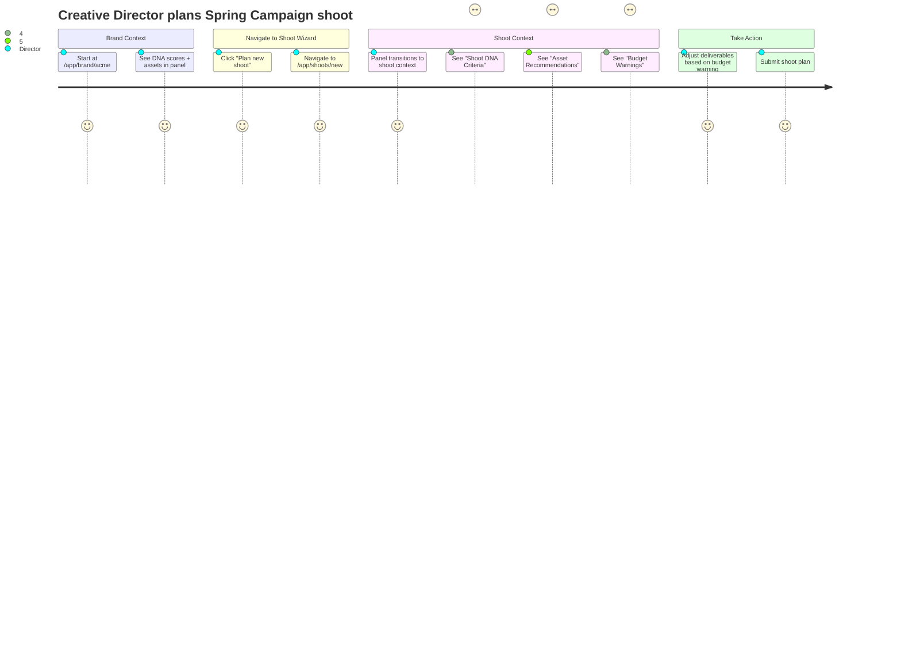
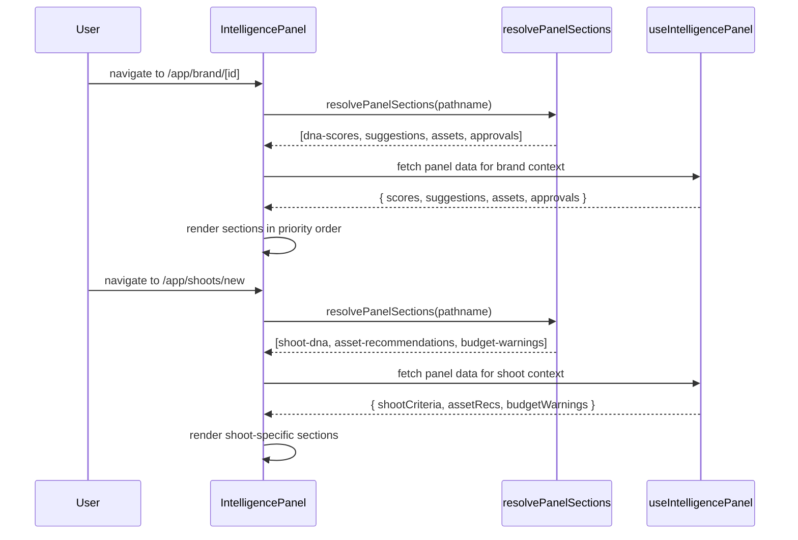
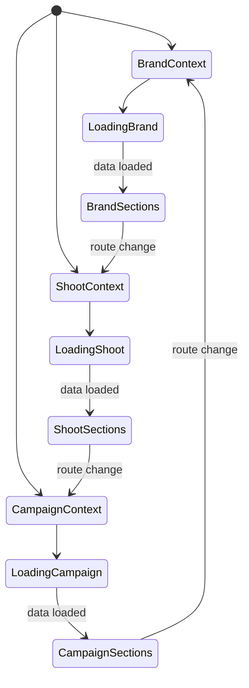
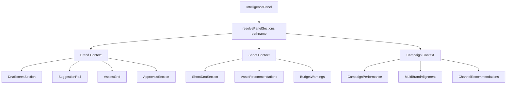

# IPI-286: Intelligence Panel — Route-Aware Context Sections

**Linear:** [IPI-286](https://linear.app/amo100/issue/IPI-286)  
**Design Ref:** Route-aware intelligence (adaptive panel content)  
**Parent:** IPI-255 (DESIGN-071 deferred items)  
**Priority:** Medium (P3)

---

## Context

IPI-255 shipped DNA scores and pending approvals in the Intelligence Panel. Route-aware sections were deferred as part of the original DESIGN-071 scope.

---

## Problem

The Intelligence Panel shows the same content regardless of the user's current context. When a user is planning a shoot or viewing a campaign, the panel could surface context-specific intelligence instead of generic brand data.

---

## User Stories

### Story 1: Creative Director planning shoot
**As a** Creative Director  
**I want** shoot-specific intelligence when in shoot wizard  
**So that** I see DNA criteria and asset recommendations relevant to the current shoot

**Acceptance:** Panel shows "Shoot DNA Criteria" section on `/app/shoots/new`

### Story 2: Brand Manager on brand detail page
**As a** Brand Manager  
**I want** brand-level intelligence on brand detail page  
**So that** I see DNA scores and assets specific to this brand

**Acceptance:** Panel shows "DNA Scores" + "Assets" sections on `/app/brand/[id]`

### Story 3: Campaign Manager viewing campaign
**As a** Campaign Manager  
**I want** campaign-level intelligence on campaign page  
**So that** I see multi-brand alignment and channel recommendations

**Acceptance:** Panel shows "Campaign Performance" section on `/app/campaigns/[id]`

---

## User Journey



---

## Proposal

Make Intelligence Panel content adaptive based on the current route:

**Brand Detail (`/app/brand/[id]`):**
- DNA scores (current)
- Pending approvals (current)
- AI suggestions (IPI-285)
- Recent assets (IPI-284)

**Shoot Planning (`/app/shoots/new`, `/app/shoots/[id]`):**
- Shoot-specific DNA criteria
- Asset recommendations for deliverables
- Budget vs. brand standards warnings
- Similar shoot references

**Campaign View (`/app/campaigns/[id]`):**
- Campaign performance insights
- Multi-brand alignment scores
- Channel-specific recommendations
- Asset reuse opportunities

---

## Route Detection Logic

### ⚠️ Merge with Existing `resolveRouteBriefing`

**Existing file:** `app/src/components/intelligence-panel/route-briefing.ts`
```typescript
export function resolveRouteBriefing(pathname: string): RouteBriefing {
  // Already maps pathname → { section, headline, nextActions }
}
```

**Conflict:** Creating a separate `resolvePanelSections` will duplicate route detection logic.

**Resolution:** Extend `resolveRouteBriefing` to return section config:

```typescript
// app/src/components/intelligence-panel/route-briefing.ts (MODIFIED)
export type RouteBriefing = {
  section: string;
  headline: string;
  nextActions: string[];
  panelSections?: SectionConfig[];  // ← ADD THIS
};

export function resolveRouteBriefing(pathname: string): RouteBriefing {
  if (pathname.startsWith('/app/brand/')) {
    return {
      section: 'brand-detail',
      headline: 'Brand Intelligence',
      nextActions: ['View assets', 'Plan shoot'],
      panelSections: [  // ← ADD THIS
        { type: 'dna-scores', priority: 1 },
        { type: 'suggestions', priority: 2 },
        { type: 'assets', priority: 3 },
        { type: 'approvals', priority: 4 },
      ],
    };
  }
  // ... other routes
}
  if (pathname.startsWith('/app/brand/')) {
    return [
      { type: 'dna-scores', priority: 1 },
      { type: 'suggestions', priority: 2 },
      { type: 'assets', priority: 3 },
      { type: 'approvals', priority: 4 },
    ];
  }
  
  if (pathname.match(/\/app\/shoots\/(new|\d+)/)) {
    return [
      { type: 'shoot-dna', priority: 1 },
      { type: 'asset-recommendations', priority: 2 },
      { type: 'budget-warnings', priority: 3 },
    ];
  }
  
  if (pathname.startsWith('/app/campaigns/')) {
    return [
      { type: 'campaign-performance', priority: 1 },
      { type: 'multi-brand-alignment', priority: 2 },
      { type: 'channel-recommendations', priority: 3 },
    ];
  }
  
  return []; // Default: no sections
}
```

---

## Sequence Diagram



---

## State Diagram



---

## Component Tree



---

## Wireframe — Brand Context

```
┌─────────────────────────────────────────────────┐
│ Intelligence Panel  (Brand: Acme)               │
├─────────────────────────────────────────────────┤
│ DNA Scores                    ← priority 1      │
│ ┌─────┬─────┬─────┬─────┐                      │
│ │ 75  │ V:80│ A:70│ C:90│                      │
│ └─────┴─────┴─────┴─────┘                      │
├─────────────────────────────────────────────────┤
│ Suggestions (3)               ← priority 2      │
│ 💡 Visual inconsistency detected               │
│ ⚠️  Commerce readiness low                     │
│ ✨ High consistency score                      │
├─────────────────────────────────────────────────┤
│ Assets (6)                    ← priority 3      │
│ ┌───┬───┬───┬───┬───┬───┐                      │
│ │img│img│img│img│img│img│                      │
│ └───┴───┴───┴───┴───┴───┘                      │
├─────────────────────────────────────────────────┤
│ Pending Approvals (2)         ← priority 4      │
│ • Beta Brand (draft_ready)                      │
│ • Gamma Inc (draft_ready)                       │
└─────────────────────────────────────────────────┘
```

---

## Wireframe — Shoot Context

```
┌─────────────────────────────────────────────────┐
│ Intelligence Panel  (Shoot: Spring Campaign)    │
├─────────────────────────────────────────────────┤
│ Shoot DNA Criteria            ← priority 1      │
│ ✅ Visual: 80+ required (brand standard)       │
│ ⚠️  Commerce: 70+ required (deliverables)      │
│ ✅ Consistency: maintain 90+                   │
├─────────────────────────────────────────────────┤
│ Asset Recommendations         ← priority 2      │
│ 📸 Product shots: 12 missing                   │
│ 📸 Lifestyle: 6 recommended                    │
│ 📸 Close-ups: 8 for detail pages               │
├─────────────────────────────────────────────────┤
│ Budget Warnings               ← priority 3      │
│ ⚠️  $8,500 budget vs $12,000 avg for similar   │
│ 💡 Consider: reduce deliverables or extend     │
└─────────────────────────────────────────────────┘
```

---

## Files to Create/Modify

### New Files
- `app/src/lib/intelligence/resolve-panel-sections.ts` — Section resolver by route
- `app/src/lib/intelligence/resolve-panel-sections.test.ts` — Resolver tests
- `app/src/components/intelligence-panel/shoot-dna-section.tsx` — Shoot DNA
- `app/src/components/intelligence-panel/asset-recommendations.tsx` — Asset recs
- `app/src/components/intelligence-panel/budget-warnings.tsx` — Budget warnings
- `app/src/components/intelligence-panel/campaign-performance.tsx` — Campaign perf

### Modified Files
- `app/src/components/intelligence-panel/intelligence-panel.tsx` — Route detection + conditional rendering
- `app/src/lib/intelligence/panel-contract.ts` — Add shoot/campaign context types

---

## Acceptance Criteria

### A. Section Resolver Logic
- [ ] `resolvePanelSections(pathname)` returns correct sections per route
- [ ] Brand routes return `[dna-scores, suggestions, assets, approvals]`
- [ ] Shoot routes return `[shoot-dna, asset-recommendations, budget-warnings]`
- [ ] Campaign routes return `[campaign-performance, multi-brand-alignment, channel-recommendations]`
- [ ] Unknown routes return empty array (no sections)
- [ ] Test: `npm test -- resolve-panel-sections` → 5 tests passing

### B. Component — IntelligencePanel
- [ ] Panel calls `resolvePanelSections(pathname)` on mount
- [ ] Panel re-resolves sections when pathname changes
- [ ] Sections render in priority order (1, 2, 3, 4)
- [ ] Smooth transition when navigating between routes
- [ ] No flash of wrong content during route change
- [ ] Test: `npm test -- intelligence-panel` → existing + new tests passing

### C. Shoot Context Sections
- [ ] ShootDnaSection shows DNA criteria for current shoot
- [ ] AssetRecommendations shows missing/recommended assets
- [ ] BudgetWarnings compares budget to brand standards
- [ ] Test: `npm test -- shoot-context` → 3 tests passing

### D. Campaign Context Sections (placeholder)
- [ ] CampaignPerformance shows placeholder "Coming soon"
- [ ] MultiBrandAlignment shows placeholder "Coming soon"
- [ ] ChannelRecommendations shows placeholder "Coming soon"
- [ ] Test: `npm test -- campaign-context` → 3 tests passing

### E. Manual Verification
- [ ] Navigate `/app/brand/[id]` → see DNA scores + suggestions + assets + approvals
- [ ] Navigate `/app/shoots/new` → see shoot DNA + asset recs + budget warnings
- [ ] Navigate `/app/campaigns/[id]` → see campaign placeholders
- [ ] Route transitions smooth, no layout shift

---

## Verification

```bash
cd app

# Section resolver tests
npm test -- resolve-panel-sections

# Component tests
npm test -- intelligence-panel

# Context-specific section tests
npm test -- shoot-context
npm test -- campaign-context

# Full suite
npm test

# Typecheck
npx tsc --noEmit

# Manual test
npm run dev
# Navigate between /app/brand/[id], /app/shoots/new, /app/campaigns/[id]
# Verify panel sections change per route
```

---

## Out of Scope

- Real-time data updates during route changes (handled by existing polling)
- Custom sections for marketing/assets routes
- User preferences for section visibility
- Section drag-and-drop reordering
- Full implementation of campaign context sections (placeholders only)

---

## Dependencies

- IPI-255 ✅ (base Intelligence Panel)
- IPI-247 ✅ (route-agent map for context detection)
- IPI-284 (asset thumbnails) — optional, enhances brand context
- IPI-285 (suggestions) — optional, enhances brand context

---

## Skills Required

| Skill | Purpose |
|-------|---------|
| `/ipix-wireframe` | Context-aware wireframes for each route type |
| `/mermaid-diagrams` | State transitions between route contexts |
| `/frontend-design` | Extend existing resolveRouteBriefing pattern |
| `/shadcn` | Conditional section rendering |
| `/gen-test` | Route resolver tests + integration tests |

**Load order:** Read `route-briefing.ts` → extend (don't duplicate) → `mermaid-diagrams` → implement

---

## Design Principle

**Route-aware intelligence** — panel adapts to user's current task without explicit configuration. Brand routes show brand intelligence, shoot routes show shoot intelligence, campaign routes show campaign intelligence.

**UX Principle:** "Keep users in context" — no need to navigate away to see relevant data.

**Design files:**
- `Universal design prompt/Brand Detail.v2.image-first.dc.html` → Brand context
- `Universal design prompt/Shoot Wizard.v2.image-first.dc.html` → Shoot context reference
- `Universal design prompt/Campaigns.v2.image-first.dc.html` → Campaign context reference
