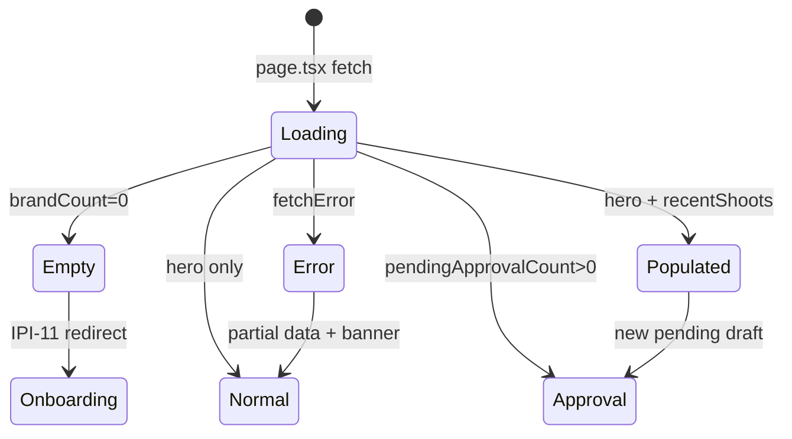
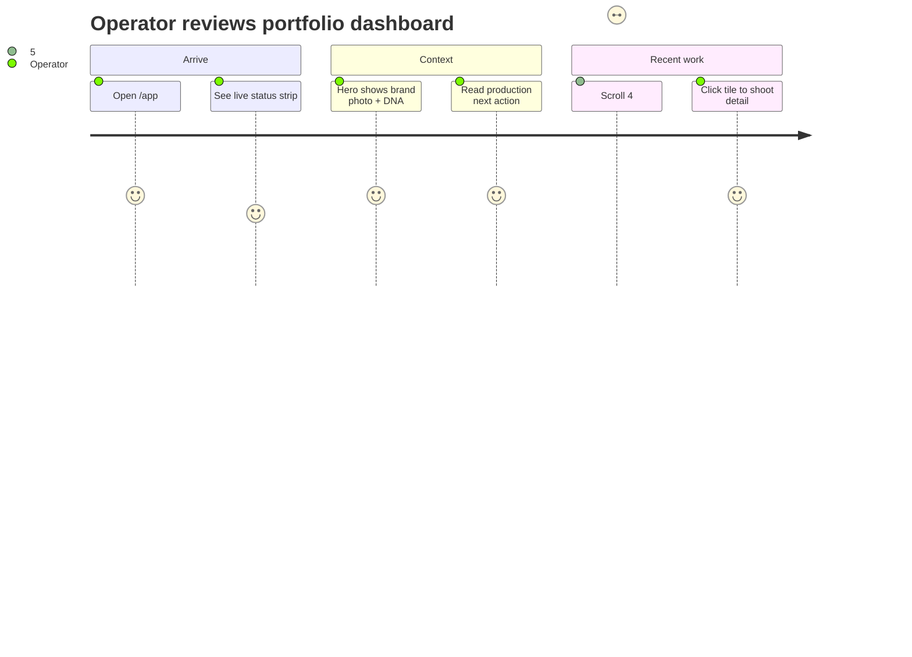
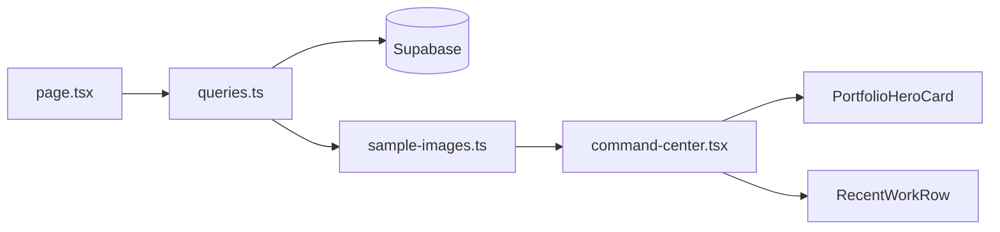

# IPI-290 · DESIGN-050b — Command Center DC Visual Polish (Epic)

**Linear:** https://linear.app/amo100/issue/IPI-290  
**Parent:** [IPI-254](https://linear.app/amo100/issue/IPI-254) · DESIGN V2  
**Follow-on:** [IPI-17](https://linear.app/amo100/issue/IPI-17) ✅ merged PR #168  
**Plan:** `tasks/design-docs/implementation/command-center.md`  
**Visual target:** `tasks/design-docs/implementation/command.png`  
**Verifier:** `docs/ecommerce/evidence/2026-07-01/ipi-17-command-center/task-verifier-report.md`  
**Status:** Todo · Spec ready 2026-07-01

---

## Skills to run

| Phase | Skill | When |
|-------|-------|------|
| Plan / orchestrate | `ipix-task-lifecycle` | Branch, Linear states, PR queue |
| Before epic Done | `task-verifier` | All child issues complete + probes green |
| Design compare | `claude-design-handoff` | Side-by-side vs command.png |
| Diagrams | `mermaid-diagrams` | Already in spec — keep updated |
| Ship | `linear` · `lean` | Done states · scope guard |

**Child execution skills:** see `tasks/intelligence/ai/skill-map.md` § IPI-290–295.

---

## The problem this solves

- Today, `/app` Command Center has correct **structure** (status strip → hero → chips → recent work) but **zero fashion imagery** — grey placeholder boxes only.
- Operators see an empty-feeling dashboard (~42% DC visual parity) despite functional KPI reads shipping in IPI-17.
- QA cannot sign off image-first Zeely Editorial v3 without side-by-side match to Claude Design prototypes.

**Fix:** Minimal-diff polish pass — wire Cloudinary/local images, match DC card anatomy from Component Library, ship evidence + new PR (not reopen #168).

---

## User story

> As an **operator** on Command Center, when I land on `/app`, I see my active brand and recent shoots with **real fashion photos**, dense card rhythm, and production next actions — matching the DC prototype — so I trust the workspace as a fashion ops cockpit, not an empty scaffold.

---

## Design reference (SSOT)

| Source | Path |
|--------|------|
| **Visual target (screenshot)** | `tasks/design-docs/implementation/command.png` · Populated · Nike |
| **Screen authority** | `Universal design prompt/Command Center.v2.image-first.dc.html` |
| **Component gallery** | `Universal design prompt/Component Library.dc.html` |
| **Component specs** | `Universal design prompt/components/COMPONENTS.md` |
| **Card anatomy** | `components/BrandCard.dc.html` · `AssetCard.dc.html` · `ApprovalCard.dc.html` · `EmptyState.dc.html` |
| **Density reference** | `Universal design prompt/Campaigns.v2.image-first.dc.html` |
| **Audit score** | `Universal design prompt/checklist.md` §01 (92/100) |
| **Gap map** | `tasks/design-react/ipi-17-command-center-dc-react-map.md` |

**Workflow:** Open [`command.png`](../../../tasks/design-docs/implementation/command.png) then DC HTML before each sub-issue (IPI-291–294).

---

## Wireframe — populated state (desktop)

```text
┌ Nav ─┬──────── Command Center (820px) ────────────────┬─ Intel ─┐
│      │ [● Live] All portfolio data synced…           │ Brief   │
│      │ ┌────┬─────────────────────────────────────┐  │ DNA     │
│      │ │104 │ Production Planner                  │  │         │
│      │ │img │ You're working with Maaji           │  │         │
│      │ └────┴ [Generate deliverables] [Plan shoot]│  │         │
│      │ Recent work                    View all →   │         │
│      │ ┌138┐ ┌138┐ ┌138┐ ┌138┐ ┌138┐  (4:5 photos) │         │
│      └──────┴───────────────────────────────────────┴─────────┘
```

---

## State diagram



---

## User journey



---

## Child issues (execution order)

| ID | Title | Depends |
|----|-------|---------|
| [IPI-291](https://linear.app/amo100/issue/IPI-291) | CC-IMG-001 · Cloudinary sample-images module | — |
| [IPI-292](https://linear.app/amo100/issue/IPI-292) | CC-HERO-001 · Hero MediaCard image-first | IPI-291 |
| [IPI-293](https://linear.app/amo100/issue/IPI-293) | CC-RECENT-001 · Recent work moodboard photos | IPI-291 |
| [IPI-294](https://linear.app/amo100/issue/IPI-294) | CC-HITL-001 · Approval preview + empty polish | IPI-291 |
| [IPI-295](https://linear.app/amo100/issue/IPI-295) | CC-SHIP-001 · Verify + evidence + PR | IPI-292, IPI-293, IPI-294 |

**Plan:** `tasks/design-docs/implementation/command-center.md` · **Evidence index:** `docs/ecommerce/evidence/2026-07-01/ipi-17-command-center/command-center-dc-visual-fix-plan.md`

**Branch (umbrella):** `ipi/17-command-center-dc-polish` · worktree `../wt-ipi-17-command-center-dc-polish`

---

## Component ownership

| Section | Component | Linear |
|---------|-----------|--------|
| Status strip | `RealtimeStatusStrip` | keep |
| Hero | `PortfolioHeroCard` | IPI-292 |
| Recent work | `RecentWorkRow` | IPI-293 |
| Empty | `CommandCenterEmpty` | IPI-294 |
| Approval | `CommandCenterApprovals` | IPI-294 |
| Images | `sample-images.ts` | IPI-291 |

---

## Data flow



Full diagram: plan § Data flow.

---

## Scope guard

**In scope:** `app/src/components/command-center/*` · `app/src/lib/command-center/*` · evidence doc

**Out of scope:** OperatorShell · NavSidebar · IntelligencePanel architecture · mobile (IPI-251) · full approval queue (IPI-244) · new schema

---

## Acceptance criteria (epic)

- [ ] Weighted DC visual score ≥ **85%** on hero · recent · image-first sections (plan grading)
- [ ] Side-by-side screenshot vs `Command Center.v2.image-first.dc.html` passes review
- [ ] Component Library card anatomy spot-checked (BrandCard, AssetCard, ApprovalCard)
- [ ] All child issues Done · one code-only PR merged
- [ ] Evidence: `docs/ecommerce/evidence/2026-07-01/ipi-17-command-center/report.md`

---

## Verification

```bash
cd app && npm run lint && npm test && npx tsc --noEmit && CI=true npm run build
# Browser: /app · /app?skip=1 · qa@ipix.test
```

---

## Dependencies

**Required:** IPI-17 ✅ · IPI-270 tokens ✅  
**Deferred:** IPI-244 (full HITL) · IPI-251 (mobile) · IPI-275 (chat dock) · IPI-271 (live brand covers from DB)

---

## Completion steps (epic)

#### A. Child execution
- [ ] **A1** IPI-291 Done — sample-images + types
- [ ] **A2** IPI-292 ∥ IPI-293 ∥ IPI-294 Done
- [ ] **A3** IPI-295 Done — PR merged

#### B. Verify + close
- [ ] **B1** `@task-verifier` report updated — no open blockers
- [ ] **B2** Side-by-side vs `command.png` passes (center column)
- [ ] **B3** Weighted score ≥85% on hero · recent · image-first
- [ ] **B4** Linear IPI-290 → Done
