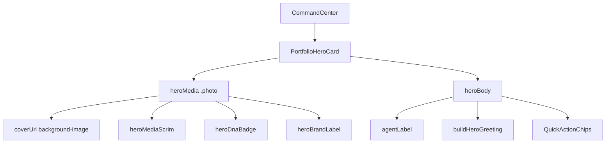

# IPI-292 · CC-HERO-001 — Hero MediaCard image-first

**Linear:** https://linear.app/amo100/issue/IPI-292  
**Parent:** [IPI-290](https://linear.app/amo100/issue/IPI-290)  
**Blocked by:** [IPI-291](https://linear.app/amo100/issue/IPI-291)  
**Plan:** `tasks/design-docs/implementation/command-center.md` § Image loading · Accessibility  
**Visual target:** `tasks/design-docs/implementation/command.png` (hero region)  
**Estimate:** 3 points

---

## Skills to run

| Order | Skill | Purpose |
|-------|-------|---------|
| 1 | `design-md` | Read `design.md` — tokens · a11y · 3-panel contract (5 min) |
| 2 | `claude-design-handoff` | BrandCard.dc.html vs React |
| 3 | `frontend-design` | 104×104 density · scrim · on-image badges |
| 4 | `vercel-react-best-practices` | `next/image` · `remotePatterns` · LCP `priority` · lazy tiles |
| 5 | `react-patterns` | **If** Client Image wrapper + `onError` — minimal `'use client'` leaf |
| 6 | `shadcn` | Token-aligned focus rings if needed |
| 7 | `accessibility` | Alt text · focus order |
| 8 | `gen-test` | Extend derive-view-state / component tests |
| 9 | `graphify` | Optional — blast radius before multi-file edit |
| 10 | `lean` | Wire image only — no hero layout redesign |

**MCP:** browser `/app?skip=1` for visual compare vs `command.png`.

---

## The problem this solves

Portfolio hero renders a 104×104 grey box + scrim with no photo. DC L210–224 and Component Library **BrandCard** show fashion cover, DNA badge, brand label on image.

**Fix:** Wire `coverUrl` on hero; prefer `next/image` with fixed 104×104 box · `object-cover` · `priority`; keep compact MediaCard (not full-width Campaigns hero).

---

## Scope guard

**In scope:** `PortfolioHeroCard` · hero CSS · optional `queries.ts` cover resolve  
**Out of scope:** OperatorShell · NavSidebar · IntelligencePanel · full-width hero redesign · schema

---

## Image loading

- `next/image` preferred · fixed 104×104 container · `priority` on hero
- Broken image → fallback chain via IPI-291
- Alt: `"{brandName} cover"`

---

## User story

> As an **operator**, when I see the hero card, I recognize my brand from its cover photo and DNA badge on the image — matching [`command.png`](../../../tasks/design-docs/implementation/command.png).

---

## Accessibility

- Hero link keyboard-focusable · visible focus ring
- DNA badge not sole carrier of score info (also in copy)

---

## Design reference

| Screen | `Command Center.v2.image-first.dc.html` L210–224 |
| Component | `Universal design prompt/components/BrandCard.dc.html` |
| Library | `Component Library.dc.html` → Image-first Cards → BrandCard |
| Spec | `components/COMPONENTS.md` · BrandCard |

**DC measurements:** 104×104 · `--image-radius-sm` · scrim · DNA badge top-right · brand label bottom-left

---

## Wireframe — hero card

```text
┌──────────────────────────────────────────────────┐
│ ┌────────┐  ● Production Planner                 │
│ │ 104×104│  You're working with Maaji            │
│ │ photo  │  3 approvals… Next: generate IG…     │
│ │ 91%DNA │  [Generate deliverables] [Plan shoot]  │
│ └────────┘                                       │
└──────────────────────────────────────────────────┘
```

---

## Component tree



---

## Files

- `app/src/components/command-center/portfolio-hero-card.tsx`
- `app/src/components/command-center/command-center.module.css` — `.photo`, `.heroMedia`
- `app/src/lib/command-center/types.ts` — `coverUrl`
- `app/src/lib/command-center/queries.ts` — optional asset read; fallback via IPI-291
- `app/next.config.ts` — add `images.remotePatterns` for `res.cloudinary.com` if using `next/image`

**Do NOT:** Refactor OperatorShell · enlarge hero to Campaigns full-width · add schema.

---

## Out of scope

- IntelligencePanel · NavSidebar · mobile shell
- Live DB brand cover join (IPI-271)

---

## Completion steps

#### A. Implement
- [ ] **A1** Render `coverUrl` in `PortfolioHeroCard` — proof: `/app?skip=1` shows Nike photo
- [ ] **A2** CSS `.photo` + scrim + on-image badges unchanged in layout
- [ ] **A3** `onError` fallback via IPI-291 helper

#### B. Verify
- [ ] **B1** Side-by-side hero vs `command.png` at 1440
- [ ] **B2** `cd app && npm test` — derive-view-state green
- [ ] **B3** `cd app && npx tsc --noEmit`
- [ ] **B4** Linear → Done

---

## Acceptance criteria

- [ ] **A** Hero shows fashion JPG at 104×104 with scrim + DNA badge + brand label on image
- [ ] **B** Link to `/app/brand/:id` preserved
- [ ] **C** Fallback when no DB cover uses `heroFallbackForBrand`
- [ ] **D** `/app?skip=1` Nike fixture shows photo
- [ ] **E** No enlargement to full-width hero (DC uses compact MediaCard)

---

## Test

```bash
cd app && npm test -- derive-view-state
# Manual: /app?skip=1 — hero matches command.png hero region
```
